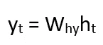

# 使用递归神经网络(人工智能)的股票价格预测

> 原文：<https://medium.datadriveninvestor.com/stock-price-prediction-using-recurrent-neural-network-artificial-intelligence-ffe6ac1bd344?source=collection_archive---------4----------------------->

# 递归神经网络导论

> R ***当前神经网络(RNN)*** *是一种* [*神经网络*](https://www.geeksforgeeks.org/tag/neural-network/) *，其中来自前一步骤的* ***输出被作为输入馈送到当前步骤*** *。在传统的神经网络中，所有的输入和输出都是相互独立的，但在需要预测句子的下一个单词时，需要前面的单词，因此需要记住前面的单词。于是 RNN 出现了，它借助一个隐藏层解决了这个问题。RNN 最主要也是最重要的特点是* ***隐藏状态*** *，它记住了一个序列的一些信息。*


***→计算当前状态的公式:***


其中:

```
ht -> current state
ht-1 -> previous state
xt -> input state
```

**→应用激活功能的公式(tanh):**


其中:

```
whh -> weight at recurrent neuron
wxh -> weight at input neuron
```

**→产量计算公式:**



其中:

```
Yt -> output
Why -> weight at output layer
```

## 递归神经网络的基本工作流程如下


> *h0 是网络的初始隐藏状态。通常，它是一个零向量，但也可以有其他值。一种方法是将关于数据的假设编码到网络的初始隐藏状态中。例如，对于确定名人讲话的音调的问题，该人过去讲话的音调可以被编码到初始隐藏状态中。另一种技术是将初始隐藏状态作为可训练参数。尽管这些技术给网络增加了很少的细微差别，但是将隐藏状态向量初始化为零通常是有效的选择。*

**各循环单元的工作:**

1.  取输入前一个隐藏状态向量和当前输入向量。注意，因为隐藏状态和当前输入被视为向量，所以向量中的每个元素被放置在与其他维度正交的不同维度中。因此，当每个元素与另一个元素相乘时，仅当所涉及的元素非零并且这些元素处于相同维度时，才给出非零值。
2.  将隐藏状态向量按元素乘以隐藏状态权重，并类似地执行当前输入向量和当前输入权重的按元素乘法。这产生了参数化的隐藏状态向量和当前输入向量。
3.  注意，不同向量的权重存储在可训练权重矩阵中。执行两个参数化向量的向量加法，然后计算元素双曲正切以生成新的隐藏状态向量。


在递归网络的训练期间，网络还在每个时间步长生成输出。该输出用于使用梯度下降来训练网络。

因此，通过时间的反向传播与典型的反向传播的唯一不同之处在于，每个时间步长的误差被求和以计算总误差。


尽管基本的递归神经网络相当有效，但它也有一个严重的问题。对于深层网络，反向传播过程会导致以下问题

*   **消失梯度:**当梯度变得非常小并趋于零时，就会出现这种情况。
*   **爆炸梯度:**当梯度由于反向传播而变得过大时，就会出现这种情况。

# 通过 RNN 进行培训

1.  输入的单个时间步长被提供给网络。
2.  然后使用一组当前输入和先前状态计算其当前状态。
3.  当前 ht 变为下一时间步的 ht-1。
4.  可以根据问题进行尽可能多的时间步骤，并加入来自所有先前状态的信息。
5.  一旦所有时间步骤完成，最终的当前状态用于计算输出。
6.  然后将输出与实际输出(即目标输出)进行比较，产生误差。
7.  然后将误差反向传播到网络以更新权重，从而训练网络(RNN)。

# 递归神经网络的优势

1.  一个 RNN 人能记住所有的信息。它之所以在时间序列预测中有用，只是因为它还具有记住以前输入的功能。这叫做长短期记忆。
2.  递归神经网络甚至与卷积层一起使用，以扩展有效像素邻域。

**递归神经网络的缺点**

1.  梯度消失和爆炸问题。
2.  训练 RNN 是一项非常艰巨的任务。
3.  如果使用 tanh 或 relu 作为激活函数，它不能处理很长的序列。

# 亚马逊公司的股票价格预测


Photo by [Bryan Angelo](https://unsplash.com/@bryanangelo?utm_source=medium&utm_medium=referral) on [Unsplash](https://unsplash.com?utm_source=medium&utm_medium=referral)

> 基于递归神经网络
> 
> 编码部分…

# 数据要求

我们使用亚马逊股票价格数据集**、**，我们的任务是根据提供的数据，使用递归神经网络预测特定时间段的股票价格

## →导入库

## →加载数据集

## →使用 matplotlib 可视化数据


## →了解我们用于训练数据的行数

```
1736
```

## →缩放数据

```
array([[1.01670545e-03],
       [5.18191392e-04],
       [5.50990279e-04],
       ...,
       [9.79016559e-01],
       [9.74752964e-01],
       [9.86031778e-01]])
```

## →创建训练数据

## →建立长期短期模型

## →编译模型

## →训练模型

```
"1616/1616 [==============================] - 68s 42ms/step - loss: 5.2229e-04"
<tensorflow.python.keras.callbacks.History at 0x7f0177fde208>
```

## →创建测试数据

## →获得预测价格值

## →评估

```
40.22249227075533
```

## →可视化亚马逊股票价格的预测值


# 结论

因此，我们建立了一个(RNN)使用长短期模型来预测股票，我们在测试数据上获得了很高的准确率，我希望这篇文章对你有用。


Stock Prices

> 通过长短期记忆模型使用递归神经网络预测股票价格是使用 python 和机器学习来完成的。