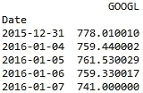
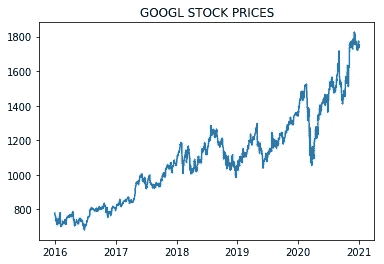
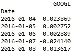
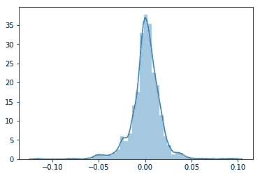
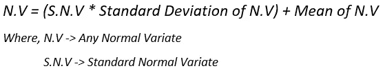
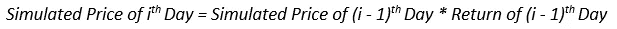
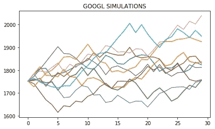
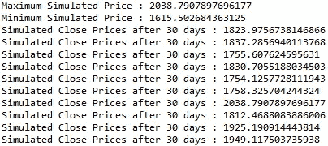

# 股票价格模拟

> 原文：<https://medium.datadriveninvestor.com/stock-price-simulations-fa2ce492dd93?source=collection_archive---------3----------------------->

*免责声明:不根据本文内容做任何交易决定。这是对股票价格预测的纯理论尝试*

众所周知，预测股票价格是不可能的，即使试图预测也是徒劳的。股票的走势总是不确定的。也就是说，尽可能减少这种不确定性并制定应急计划是可能的。

当考虑投资股票时，让投资者害怕的是投资的风险和不确定性。不知道股票会如何表现的感觉让他们感到害怕，然而，有一种方法可以缓解这些保留意见。这种改变游戏规则的方法就是蒙特卡洛法。

蒙特卡罗方法本质上是基于不同事件的概率对数据集进行多次模拟，并考虑随机特征。通过这种方式，它产生了一系列不同的情景，利用这些情景，人们可以为各种不同的未来做好准备，不确定性可以有所减少。在这篇文章中，我将带您了解我的项目，在这个项目中，我使用 Python 实现了对 GOOGLE 股票价格的蒙特卡罗方法。所以，让我们开始吧！

首先，我导入了所有需要的包。

```
import numpy as np
import pandas as pd
import seaborn as sns
import matplotlib.pyplot as plt
from scipy.stats import norm
from pandas_datareader import data as dr
```

下一步，获取数据。对于任何类型的预测或模拟，都需要相关目标的历史数据。在这个项目中，我使用了谷歌从 2016 年 1 月 1 日到 2020 年 12 月 31 日五年间调整后的收盘价。我从雅虎导入了数据！使用 pandas_datareader 库融资。

```
ticker = 'GOOGL'  #GOOGLE stock ticker
data = pd.DataFrame(columns = [ticker])
data[ticker] = dr.DataReader(ticker, data_source = 'yahoo', start = '2016-1-1', end = '2020-12-31')['Adj Close']
print(data.head())
```



First 5 stock prices



GOOGLE 5 year Adjusted Close prices

起初，我打算直接随机排列股票价格并预测它们，但后来我发现这样做，股票价格会在整个价格范围内波动。因此，我决定随机化每日回报，而不是随机化股票价格。通过这种方式，我能够得到更可靠的模拟。这样做的第一步是计算每日回报，这很容易实现。

```
returns = data.pct_change()
returns.dropna(inplace = True)
print(returns.head())
```



First 5 daily return rates

现在，蒙特卡罗方法已被发现是金融奇才武库中如此可靠的工具，因为它不是直接随机取值，而是利用各种事件的概率来预测目标变量。为了正确地做到这一点，需要数据的概率分布，这是我做的下一件事。

```
sns.distplot(returns, hist = True)
plt.show()
```



Density plot of returns, closely resembling normal distribution

正如你从密度图中看到的，日收益率服从正态分布，左边的尾部更粗。这种异常的细节可以很容易地处理，它将在模拟部分提前处理。

我的目标是建立一个概率模拟模型。传统上，在正态分布中，平均值的 68%的概率范围，即任一侧的 34%，足以覆盖任一侧的 1 个标准差的范围。为了安全起见，我决定使用 75%的概率范围，左边和右边的分配分别为 40-35。由于更加强调左侧，模拟将能够更好地使用历史性能进行投影。极限可以这样设置

```
l = norm.ppf(0.10)
u = norm.ppf(0.85)
```

在上面这段代码中，我使用了 scipy.stats 中的 norm 模块来设置限制。在正态分布中，0.5 的累积分布给出平均值。因此，要向左移动平均值的 40%，我将下限设置为(0.5–0.4)= 0.1，向右移动 35%，我将上限设置为(0.5+0.35) = 0.85。

然后，为了生成一组 30×10 的随机日回报率(30 天，10 次模拟)，我使用标准正态分布(均值= 1，标准差= 1)生成了一个随机的 30×10 矩阵，同时牢记我们的限制。然而，我们的日收益率并不遵循正态分布，因为它们的均值不是 0，标准差也不是 1。通过一点统计操作，我改变了这些标准费率，以符合我们的要求。下面给出了公式。



Formula for conversion of S.N.V to N.V

使用此公式，可以将标准正态变量改变为与任何正态变量的标度相匹配。有了这个，我攻克了算法最难的部分。我现在所需要的就是用这些比率来得到模拟价格。

为此，我创建了一个充满 1 的 30x10 矩阵。我将矩阵的第一行乘以最近已知的收盘价，以此作为所有模拟的起点。然后我简单地用这个逻辑一行接一行地乘以价格



Formula for simulation

瞧，我成功地生成了 10 个谷歌股票的模拟。然后，我继续绘制模拟图以及最高和最低模拟价格，如下所示

```
mean = returns.mean()
stdev = returns.std()
np.random.seed(42)
n = np.random.normal(size = (30,10))
rows = n.shape[0]
cols = n.shape[1]
for i in range(0,rows) :
    for j in range(0,cols) :
        if n[i][j] > u :
           n[i][j] = u       #sets upper limit
        elif n[i][j] < l :
             n[i][j] = l     #sets lower limit
        else :
             n[i][j] = n[i][j]
        n[i][j] = (stdev * n[i][j]) + mean
s = data.iloc[-1]
pred = np.zeros_like(n) + 1
pred[0] = s         #sets beginning point of simulations
for i in range(1,30) :
    pred[i] = pred[(i-1)] * (1 + n[(i-1)])plt.figure(figsize = (7,4))
plt.title('{} SIMULATIONS'.format(ticker))    
for i in range(0,10) :
    plt.plot(pred[:, i])
plt.show()
```



GOOGLE stock price simulations

```
print('\n')
print('Maximum Simulated Price : {}'.format(np.max(pred)))
print('Minimum Simulated Price : {}'.format(np.min(pred)))
for j in range(0,cols) :
    print('Simulated Close Prices after 30 days : {}'.format(pred[-1][j]))
```



The important simulated values

从这个输出中，您可以看到，模拟的最高价格为 2038.79 美元，最低价格为 1615.5 美元，给出了 400 美元的范围。所以，我至少成功地将 30 天的股票价格控制在 400 美元的范围内。厉害！

我希望你喜欢这篇文章，并保持关注，因为下一个项目会更好。