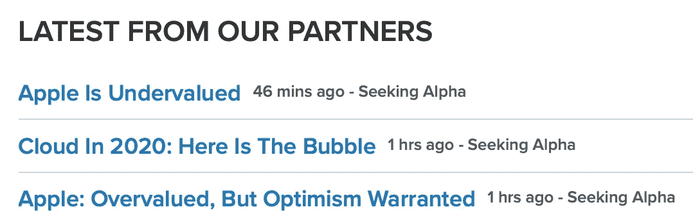

# 股票交易者:你能相信谁？

> 原文：<https://medium.datadriveninvestor.com/stock-traders-who-can-you-trust-946289053ee2?source=collection_archive---------3----------------------->

提示:不是互联网

Photo by [Bernard Hermant](https://unsplash.com/@bernardhermant?utm_source=unsplash&utm_medium=referral&utm_content=creditCopyText) on [Unsplash](https://unsplash.com/s/photos/trust?utm_source=unsplash&utm_medium=referral&utm_content=creditCopyText)

互联网已经今非昔比了。早在 90 年代末，你能在互联网上找到的大量信息很可能是真的。今天，你可以把这句话翻过来，自信地说，你在互联网上找到的大部分东西根本没用。金融信息也不例外。作为一个交易者或投资者，你如何区分可靠的信息或好的建议，以及纯粹的猜测，彻头彻尾的谎言，或“WAGs”(疯狂的猜测)？你真的想基于不准确的信息拿你的血汗钱冒险吗？大概不会。

关于你正在考虑使用的信息来源，你应该设法找到什么？在这篇文章中，我们尝试回答这些问题。

# 专业还是业余？

有两种类型的财务信息:数据和人。对于这两种类型，信息的质量取决于你是专业交易者还是业余交易者，所以我们需要区分两者。

专业交易者不用自己的钱交易；他们用客户的资金。专业人士通过工资或佣金赚钱，其中可能包括他们为客户赚取的利润。如果你是一名在经纪公司或金融公司工作的职业交易员，你可能会通过你的雇主获得大量信息和(可能很昂贵)高质量的研究工具。这些资源通常来自已经被你的雇主和业内其他人审查过的成熟的数据供应商。

如果你用自己的钱交易，你的收入来自你交易的利润，那么你就是一个业余交易者。这是真的，即使交易是你所做的一切，你通过交易获得所有的收入。作为一个业余交易者本身并不是一件坏事，但是业余交易者与专业交易者相比处于严重的劣势，因为你通常没有专业交易者拥有的资源。

Photo by [Emily Morter](https://unsplash.com/@emilymorter?utm_source=unsplash&utm_medium=referral&utm_content=creditCopyText) on [Unsplash](https://unsplash.com/s/photos/question-mark?utm_source=unsplash&utm_medium=referral&utm_content=creditCopyText)

# 它从哪里来的？

这些年来，互联网的信噪比下降了很多。每个人都有自己的观点，有很多论坛可以与世界分享这些观点。这在很多方面都很棒，但在其他方面，它让交易研究变得更加复杂。

假设你在一个网站上读到一篇文章，文章中有你认为会对股票价格产生重大影响的信息，你正在考虑根据这些信息进行交易。你应该问自己的第一个问题是这些信息是从哪里来的？该网站的声誉如何？读一篇关于 cnbc.com 的文章可能比读一篇关于 hotdaytradestoday.com 的文章更可靠。

在你的钱岌岌可危的情况下，你的目标应该是建立一个你觉得可以信任的网站库。在依赖任何给定的网站之前，问自己以下问题:

*   这个网站有政治倾向吗？这可能会影响文章的倾向性。
*   该网站是否有你正在研究的公司或行业的历史？他们的文章在历史上是看涨还是看跌？随着时间的推移，它是否发生了变化？如果是，为什么会这样？他们过去对公司的看法是对还是错？
*   这个网站存在多久了？这一个可以走任何一条路。一方面，一个已经存在了很长时间的网站很可能有其成功的正当理由。另一方面，这个原因可能是由于肮脏的伎俩或不正当的营销和点击诱饵标题推动了广告收入，而不是为你提供任何有价值的东西。
*   这个网站是一个可靠的新闻渠道的延伸还是一个独立的网站？如果是独立站点，背后是谁？他们的背景和训练是什么？试图找出他们的资金来源，因为这可能表明一个议程。
*   说到点击诱饵——一个使用点击诱饵标题和煽动性文案的网站几乎肯定不是你应该信任的网站。他们有一个议程，并试图炒作这个议程。这些作者或网站通常在让人们追随他们的炒作方面有既得利益，因为他们做多(或做空)他们正在炒作的股票。这类网站接近市场操纵，你应该避免它们。

# 你在看什么样的信息？

您是否在查看来自人类的数据或信息，比如新闻文章、博客文章、视频等等？你通常可以从前者中得出自己的结论，但你必须评估人类来源的信息，以决定给予它多大的权重。

## 数据

基于事实的金融数据有很多来源。有些数据显然是可靠和可验证的，如历史每日股票价格。其他数据可能看起来可靠，但不一定能被业余交易者证实。例如，在美国，法律要求上市公司在季度收益报告和其他法定文件(如 IPO 文件)中披露有关其财务状况的某些信息。他们还必须报告任何可能严重影响其财务表现的因素或事件。

你可能会合理地假设，你可以信任一家公司的法律文件中的数据。然而，财务数据可能被公司操纵，试图掩盖或尽量减少负面业绩或消息。有些公司为了让业绩看起来更好，甚至会编造怪异、不标准的指标。例如，2018 年，WeWork 制定了一个被广泛嘲笑的金融指标，名为“社区调整后的 EBITDA”，他们在垃圾债券发行中使用了该指标。

我无法找到最初的债券发行备忘录，其中他们定义了这一术语，但有一些同期的新闻文章写的。根据 Allison Griswold 在 Quartz 的说法，WeWork 表示，该指标定义了扣除所有常规费用(利息、税收、折旧和摊销)之前的收入，还包括“建筑和社区层面的运营支出”Griswold 表示，WeWork 制定的指标不包括租金、水电费、互联网连接成本、所有在 WeWork 共同工作空间工作的员工的工资，以及所有建筑的美化成本。你知道，几乎所有 WeWork 的运营费用都是他们“最大的支出类别”(第 70 页)，他们后来在提议的 [IPO 的 S-1 文件](https://www.sec.gov/Archives/edgar/data/1533523/000119312519220499/d781982ds1.htm)中承认了这一点。

这里的要点是坚持公认会计原则(GAAP)指标，并确保您理解任何旨在为您提供更多信息的陌生和非标准指标。还有一些非 GAAP 数字也很常见，也很容易理解。确保你知道它们的意思，并深入挖掘，以确保你知道你正在研究的公司是如何使用它们的。例如，许多公司报告的非 GAAP EBITDA 扣除了各种一次性或非经常性的特殊费用，如合并或收购成本。这是非常有用的信息，因为一次性成本会让原本不错的数字看起来很糟糕。一定要弄清楚他们到底退出了什么，以确保他们没有试图掩盖表明更深层次问题的费用。

## 人类智力

人类情报，在间谍界被称为 *humint* ，意味着直接从人类来源收集信息。对于那些不能直接接触首席财务官或内部人士的业余交易者来说，这些人可能是金融作家、股票经纪人、华尔街分析师，或者你的堂兄鲍比。由于我们大多数人没有朋友或家人有丰富的股票交易专业知识，你的大部分基于人类的信息将来自你不认识的人，以新闻文章、博客帖子、观点文章等形式。

这是你应该以最大的怀疑态度对待的信息类型。这有许多原因，但它们都围绕着作者、他们的专业知识和他们的动机。即使在同一个网站上，两个不同的作者也会得出相反的结论。下面是最近 Seeking Alpha 关于苹果(AAPL)的两个头条新闻的例子:

Screenshot from cnbc.com AAPL news page

这两篇文章相隔 14 分钟发表。榜单的第一篇文章称，AAPL 被低估了，因为它是“价值型公司和成长型公司的独特组合”文章继续阐述这一主题，用股票回购的信息和数据以及 AAPL 的净支付收益率来支持作者的观点。

与此同时，第二篇文章说的恰恰相反:AAPL 被高估了 300 美元/股。作者给出的主要原因之一似乎是 AAPL 的市值过高:

> 按每股 300 美元计算，苹果的估值为 1.3 万亿美元。然而，硬件增长是负增长。
> 
> …
> 
> 从市值来看，苹果的估值处于历史最高水平。然而，看涨者通过将苹果称为具有更高增长的“消费品”公司(想想 P&G 或百事可乐)来合理化这一估值。

这位作者还根据苹果公司的“现状”对 AAPL 目前的价格提出了质疑:

> 我很难解释苹果股票目前的交易价格。从本质上说，我的问题是:苹果公司是否处于有史以来的最佳状态？

“形”是什么意思？这一陈述是否给了你任何可操作的信息？参见上面我们关于度量的讨论；“外形”并不是一个确定公司业绩的标准，文章中围绕苹果“外形”的讨论试图证明一个本质上无效的假设。另一方面，这第二位作者确实继续提出了 AAPL 的牛市和熊市，所以他们试图保持客观，这是一个积极的迹象。

我在这里的意图不是判断这两篇具体文章中哪一篇是“正确的”。很可能这两篇文章都有真实的成分。因为我在这篇文章中没有研究 AAPL，所以我没有核实所用的数字，但是如果你愿意，你可以这样做。你也应该评估作者如何解释和使用数字以及从数字中得出的结论。尤其是后者，常常可以有不同的解释和看法。

## 红旗

还有其他一些危险信号可能会让你对这些作者的*和*持怀疑态度，我们可以将这些文章作为你应该在基于人类的信息来源中寻找的一些项目的例子。

*   两位作者都没有署名，用的是假名:“欧洲观点”和“芒果分析”。除了在他们发表的网站上查看他们以前的文章，你没有办法研究他们的专业知识或动机，因为你不知道他们实际上是谁。
*   他们的作者简介是模糊的，我们也没有办法核实其中的信息。据我们所知，这两个人都不在金融界工作。作为交易者或投资者，他们可能都非常博学和成功，但我们没有办法证实这一点。这里有两个 bios:

> 欧洲人的观点:我是一个年近三十的长期投资者。我拥有法学学位和法学博士学位，喜欢投资和谈论我和他人的投资。因为我的工作，我对有趣的商业领域有了深入的了解，并了解了许多市场和公司。
> 
> " **MangoTree Analysis** ":对科技股、估值和企业融资感兴趣。我对多只知名和不太知名的科技股撰写看跌和看涨文章。

*   两位作者都没有透露自己投资组合的头寸。寻求 Alpha 要求披露文章中提到的任何股票的持有情况，但不披露相关公司的持有情况，这些公司的股票可能与所讨论的股票密切相关。例如，移动芯片制造商 Skyworks 近一半的收入来自苹果。作者是长还是短？我们不知道，但相关的职位可能会激发写一篇看涨或看跌 AAPL 的文章。
*   最后，检查网站成为贡献者的要求。在求α的情况下，绝对不需要什么资格。你所要做的就是注册。正如他们在贡献者页面上所说的(粗体强调是我的):

> 多年来，超过 15，000 人发表了文章。这些人包括个人和机构投资者、基金经理、大学生、退休人员、分析师和**基本上任何想与我们的社区分享投资见解和想法的人**。

这是一个很好的例子，一个不知名的作者在一个没有最低资格的网站上发表他们的想法。作者是匿名的，所以你无法在 LinkedIn 上找到他们，你无法核实任何利益冲突，也无法确定他们的专业水平。你应该在这样的匿名来源上冒险吗，即使它出现在一个知名的金融新闻网站上？就我个人而言，我不会。

交易和投资很难；成功需要时间和努力。在互联网上有许多著名的、透明的、以人为基础的交易信息来源。如果你做了尽职调查，你应该很快就会有一个可以用来支持你的研究的网站和作者库。

# 想了解更多有关选项的信息吗？

蒂姆·加尔利克投资和交易股票和期权已经超过 25 年了。访问 Tim 的网站 [The Options Hive](http://www.theoptionshive.com) ，在那里你可以找到免费的教育、工具和资源来学习更多关于股票期权交易的知识。

[*苹果被低估*](https://seekingalpha.com/article/4315782-apple-is-undervalued) 由“欧洲观”上求阿尔法

[*苹果:被高估，但乐观保证了*](https://seekingalpha.com/article/4315755-apple-overvalued-optimism-warranted) 通过“芒果分析”寻求阿尔法