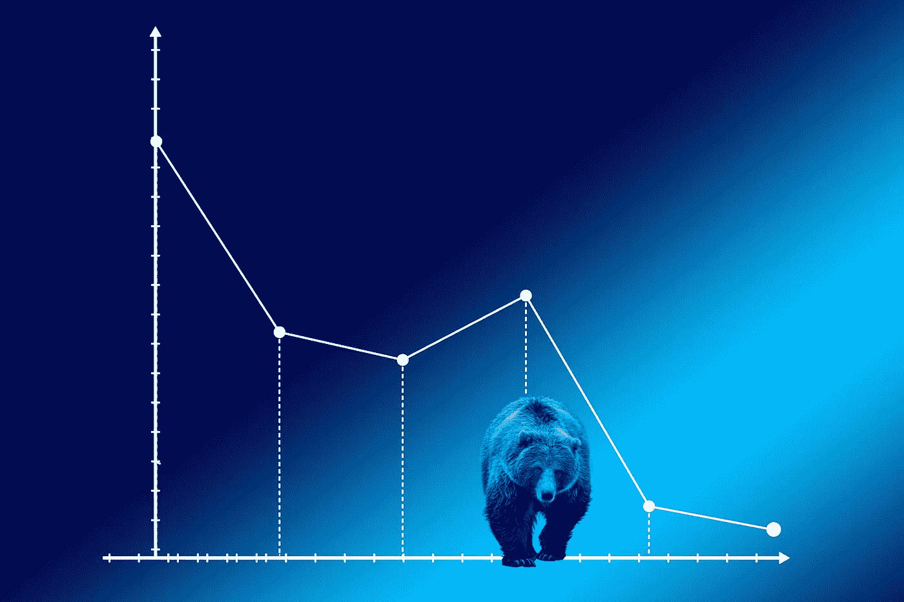
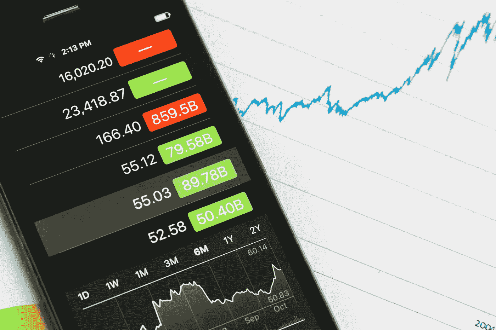

# 美国大选前，股市和金属价格暂停上涨

> 原文：<https://medium.datadriveninvestor.com/stocks-and-metals-pause-the-rally-ahead-of-us-election-2e507f9a6290?source=collection_archive---------26----------------------->

距离 2020 年 11 月 3 日举行的美国总统大选投票日还有不到两个月的时间，唐纳德·特朗普(Donald Trump)和民主党领导人乔·拜登(Joe Biden)之间的竞争日益激烈，金融市场开始紧张不安。

在最后一周，美联储结束了 9 月份的会议——选举日之前的最后一次会议。正如预期的那样，美国央行维持利率不变。美联储宣布，它将在几年内保持利率接近零，直到经济复苏稳固。自 1971 年美联储引入联邦基金利率以来，除了 2012 年，该行在每个选举年都会改变政策利率。

**美国大选前几个值得注意的金融市场动向:**

# 股票市场

在经历了 8 月份又一个月的大幅上涨后，由于对估值过高的担忧，美国科技股遭到抛售，华尔街本月大幅下挫。对潜在新冠肺炎疫苗的乐观情绪支撑了美国股市的强劲复苏。美国市场领涨，标准普尔 500 上涨 7%，是 1984 年以来表现最好的 8 月份。自 3 月份在疫情最高点触底以来，道琼斯指数也向 2020 年的正值区域靠拢，但尚未收复 2 月份的高点。

# 货币

**美元指数:**周四，美元指数飙升至两个月高点，此前几周，该指数一直在努力寻找大选前的买家。美国大选应该标志着对美元看法的一个转折点。

**欧元/美元:**2020 年，该货币对兑美元汇率飙升逾 10%。在欧洲央行政策制定者的负面评论后，货币对欧元兑美元本周触及 2 个月高点。在上次欧洲央行会议期间，央行官员表达了对强势欧元的担忧，欧元最近触及 1.20 美元的两年高点。回到 2016 年，欧元/美元在大选前夕上涨，但这是由希拉里·克林顿获胜的预期推动的。随着特朗普出人意料地获胜，美元上涨，欧元下跌。

**美元兑日元:**随着大选的临近，最值得关注的外汇对很可能是美元兑日元。在大选前，受近期股市下跌和美元普遍疲软的支撑，该货币对仍面临压力。

# 商品

黄金:受低利率和冠状病毒病例上升的推动，黄金价格今年飙升逾 35%。黄金达到了一个新的里程碑，在 8 月 7 日达到了 2075 美元的盘中高点。在动荡时期和充满不确定性的 2020 年，黄金作为那些寻求避风港的交易者的首选回归。美元走软和中美紧张关系升级也支撑了股市的上涨。在 2016 年总统选举中，在特朗普出人意料地击败民主党人希拉里·克林顿后，投资者转向黄金这一避险资产。这推动金价上涨了近 5%。

**原油:**油价连续两周下跌后交投平稳。积极的每周 API 和 EIA 库存数据提振了价格。市场参与者认为，如果民主党领导人乔·拜登当选，将对石油行业产生负面影响，因为他可能会停止发放联邦土地和水域的钻井许可证，这将使美国石油产量到 2025 年减少多达 200 万桶/日。