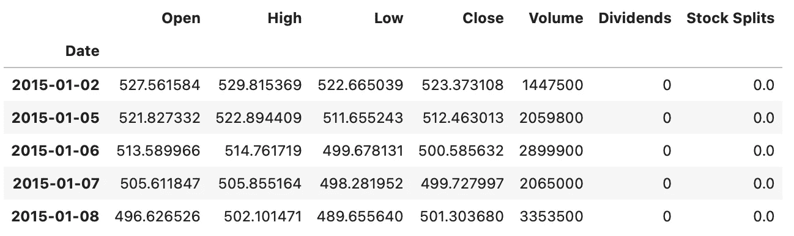
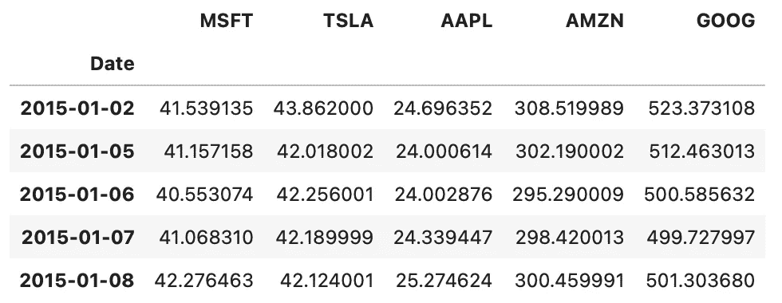
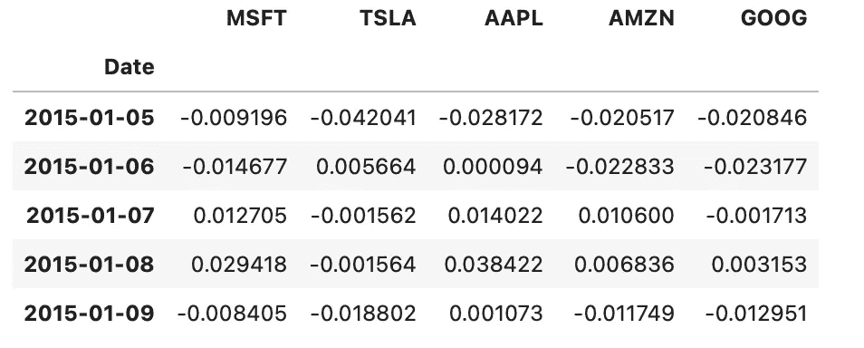
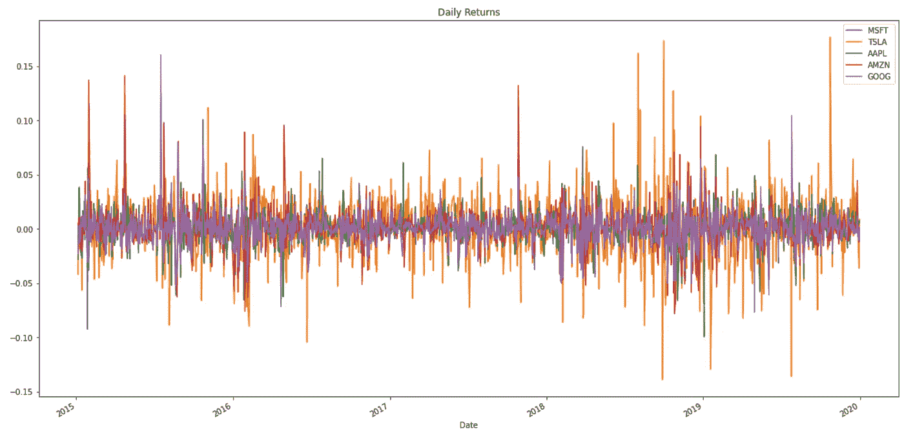
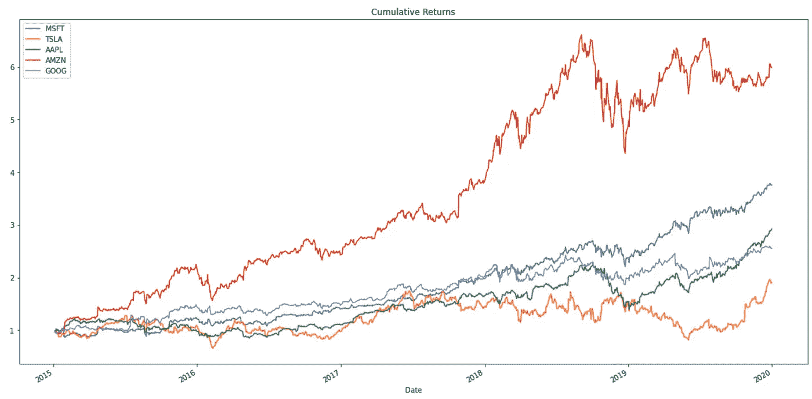
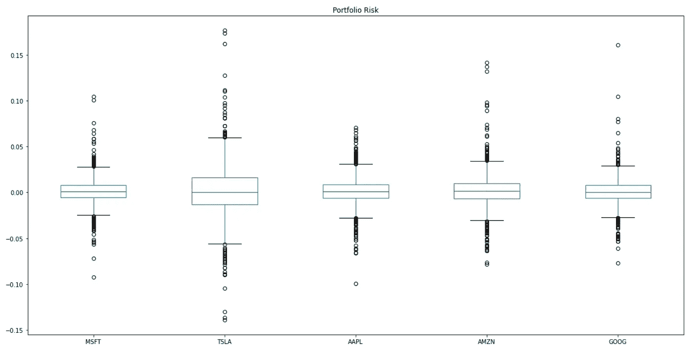
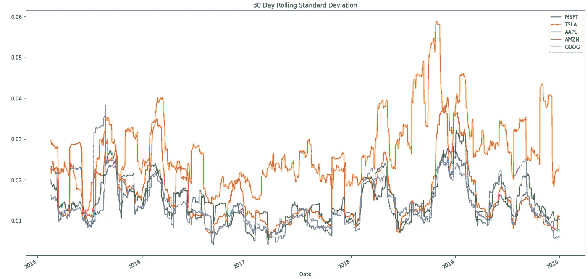
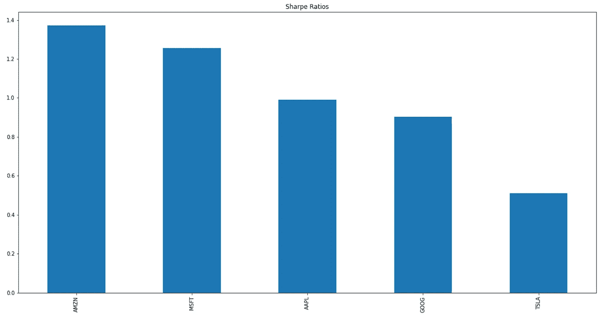

# 用 Python 进行股票风险分析

> 原文：<https://medium.datadriveninvestor.com/stocks-risks-analysis-with-python-d584bc08f938?source=collection_archive---------5----------------------->

## 用于金融分析的 Python

## 了解股票波动性

Image by [Nicholas Capello](https://unsplash.com/@bash__profile) available at [Unsplash](https://unsplash.com/photos/Wb63zqJ5gnE)

# 股票市场和投资

从股市投资中获利有一个主要的基本原则:以高于买入价的价格卖出股票。换句话说:**低买**，**高卖**。听起来很简单，但实际上并不简单。

然而，在收购时的股票价格和出售时的价格之间总会有一段时间间隔；它的价格要么上涨，要么下跌。对某些股票来说，价格上涨(或下跌)所需的时间比其他股票要短或长。这是由于公司最近的活动以及基于其业绩、增长、目标、管理或战略计划变化的市场意见/情绪。

# 风险、波动性和回报

一只股票的风险是通过它的**波动**来衡量的(和其他指标一起)；换句话说:通过它成长的**稳定度**。

股票风险越高(即高波动性)，获得更高回报(或损失)的概率就越大。另一方面，股票风险越低(即波动性低)，回报(或亏损)越小的概率越大。这就是通常所说的**风险回报权衡**，每个投资者在考虑投资决策时都会遇到。

在这些决定中，当决定购买哪些股票时，有两个因素:投资者愿意持有的时间和期望的回报/利润。

考虑以下场景:

*   如果一个投资者想在短时间内获得巨额利润，他/她将不得不投资高波动性的股票，并希望抓住有利的机会。尽管这是最好的情况，但也是投资风险最高的情况。*例子*:你的投资组合价值在一天内增加了 20%。
*   如果一个投资者想在**短时间内**获得**适度的利润**，他/她将不得不寻找低波动性的股票，并希望获得积极的走势。这是一个短期投资方案，投资风险适中。例:你的投资组合价值在一天内增加了 3%。
*   如果一个投资者想在一个较长的时期内赚取适度的利润，他/她将不得不寻找波动性低、趋势积极的股票。这是投资风险最低的最保守方案。例:你的投资组合价值在一年内增加了 3%。
*   如果一个投资者想在一个**的长时间**内获得**巨额利润**，他/她将不得不寻找具有积极趋势的低波动股票，并持有更长时间。这是一个低投资风险的长期投资方案。*例子*:你的投资组合价值在 5 年内增加了 20%。

如今，投资者被鼓励利用多种编程语言和软件的应用和优势来分析股票的风险、趋势和波动性，以建立有效的决策支持系统，做出最佳和可信的决策。

对于下面的研究案例，让我们使用 Python 分析五只非常受欢迎的股票(微软、特斯拉、苹果、亚马逊和谷歌)的风险，考虑它们在 2015 年至 2020 年的每日收盘价，以做出购买哪只股票的投资决策。让我们来看看 Python 代码:

雅虎财经功能提供股票开盘价、最高价、最低价、收盘价、成交量、股息和股票分割信息。然而，出于分析的目的，我们只对它们的“接近”值感兴趣。让我们将股票收盘价连接成一个数据框。

接下来，让我们计算股票的每日百分比变化，并绘制它们，以直观地分析它们在过去五年中的变化行为。

根据上面的图，TSLA 似乎是五只分析股票中波动最大的，而 MSFT 似乎是波动最小的。为了理解这种解释，人们应该关注图中峰值的数量(向上或向下):峰值的数量越高，股票的波动性越高，因此，与之相关的投资风险也就越大。

现在，让我们计算累积回报，并绘制它们来比较这些年来的股票行为。此外，让我们绘制盒状图(也称为盒状和须状图)。

现在，让我们计算累积回报，并绘制它们来比较这些年来的股票行为。

根据上面的累积回报图，到 2020 年初，AMZN 股票的累积回报最高，其次是 MSFT、AAPL、GOOG，最后是 TSLA。

上面的方框图显示了股票在五年期间的每日收益分布。盒子越宽，胡须越长，股票越不稳定。根据上图，可以确定 TSLA 是五只分析股票中波动最大的股票。另一方面，可以确定的是，MSFT 和 AAPL 股票是波动性最小的股票。

现在，让我们计算每只股票的标准差，并用 30 天移动平均线来绘制它们。另外，我们也来计算一下年化标准差。

有意思。根据上面的图，2015 年、2018 年和 2019 年 TSLA 和 AMZN 股票波动很大。相比之下，2017 年是大多数股票波动性最低的一年。在过去五年的分析中，MSFT、AAPL 和 GOOG 股票的滚动标准差在某种程度上非常相似。

最后，让我们计算五只股票的年夏普比率。

根据为每只分析股票计算的夏普比率，AMZN 以 1.37 的夏普比率获得了最好的分数。夏普比率大于 1.0(即阿姆锌和 MSFT)被认为是最优的，而小于 1.0(即 AAPL、谷歌和 TSLA)被认为是次优的。

## 做出投资决策

对于这个例子，如果一个投资者必须只根据股票的累积收益来作出投资决定，他/她会选择 AMZN 股票，因为它的表现远远超过所有其他股票。

另一方面，如果投资者不得不仅仅根据股票的标准差来做出投资决策，他/她会选择 MSFT 股票，以尽量减少波动性。

最后，如果投资者必须仅根据股票的夏普比率做出投资决策，他/她会选择 AMZN 股票，因为它得到了最好的分数。

# 总结想法

在这个例子中，获得了三个指标来分析股票风险:累积收益、标准差和夏普比率。虽然研究案例提出了考虑单一指标的三个不同的投资决策，但在现实生活中，投资决策是考虑多个指标而不是一个指标做出的。

在研究案例中，用于确定购买哪些股票的指标仅考虑股票的过去表现；他们没有考虑公司的财务报表，也没有试图预测未来任何时候的股票价格。为了进行未来预测，需要使用不同的方法和算法，例如回归分析、时间序列分析或机器学习模型(例如神经网络)，等等。

任何投资者所能做出的最糟糕的决定就是仅凭直觉、胆量或对某家公司的个人感觉投资某只股票，而不考虑当前的市场状况和股票过去(和最近)的表现。股票市场是高度不稳定的，这就是为什么必须使用风险度量和分析工具来定义和投资策略，并做出最佳和可信的决策。

*— —*

*如果你觉得这篇文章有用，欢迎在* [*GitHub*](https://github.com/rsalaza4/Stocks-Risk-Analysis) *上下载我的个人代码。你也可以直接在 rsalaza4@binghamton.edu 给我发邮件，在*[*LinkedIn*](https://www.linkedin.com/in/roberto-salazar-reyna/)*上找到我。有兴趣了解工程领域的数据分析、数据科学和机器学习应用的更多信息吗？通过访问我的媒体* [*个人资料*](https://robertosalazarr.medium.com/) *来探索我以前的文章。感谢阅读。*

罗伯特