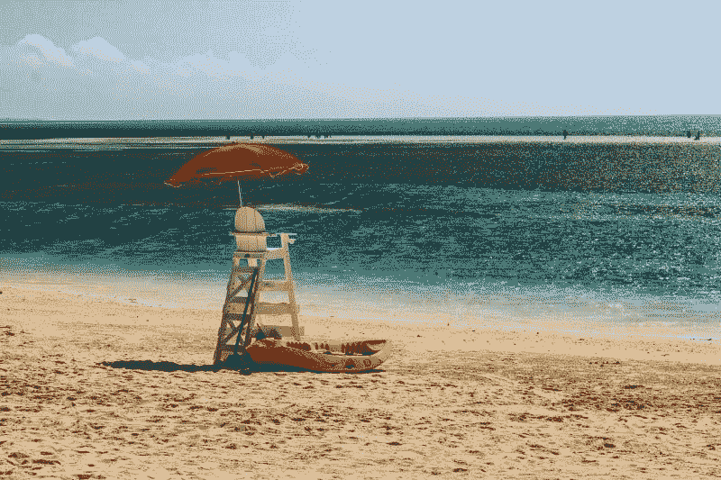
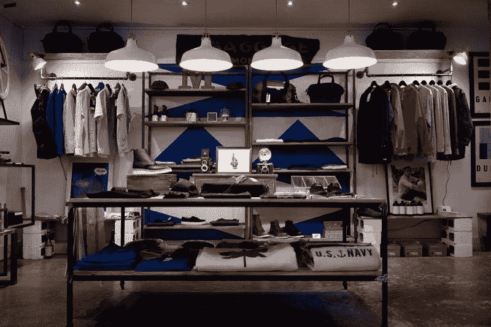
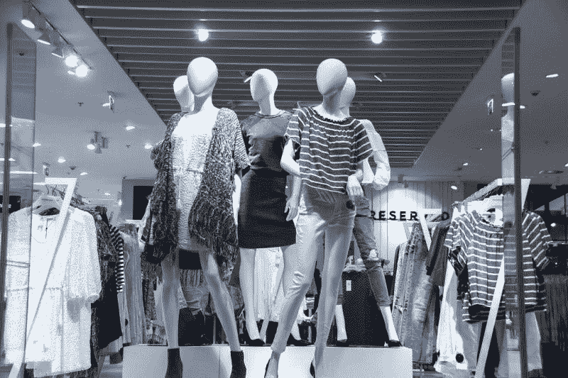
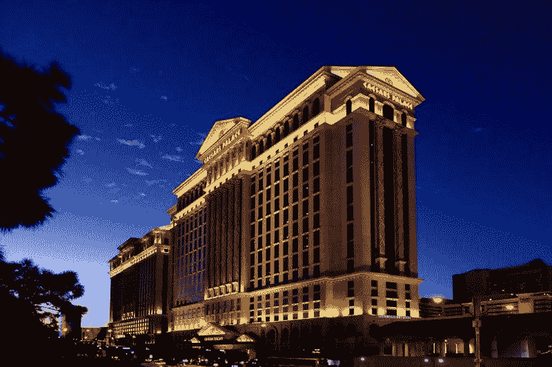
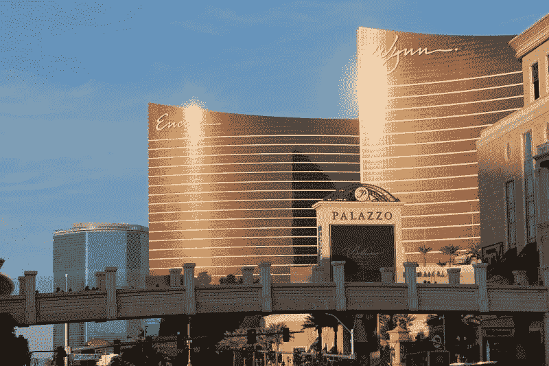
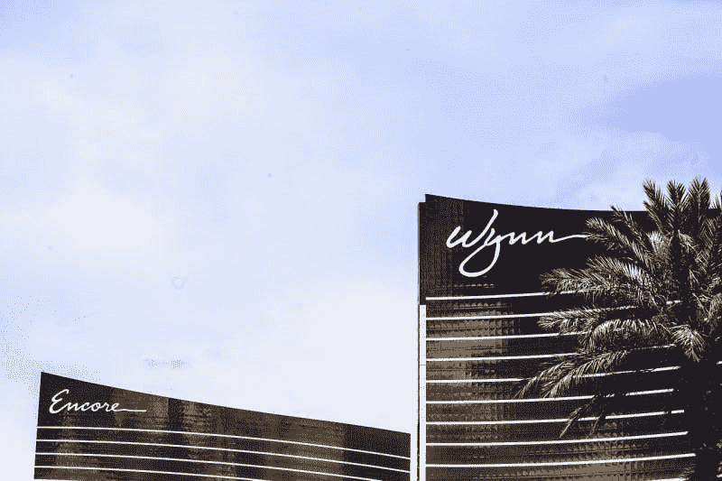
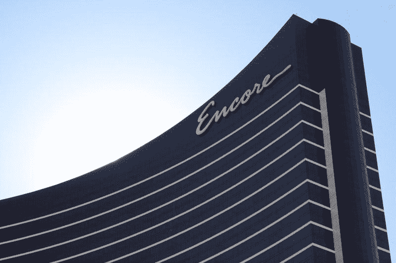

# 冠状病毒将摧毁的股票——市场疯人院

> 原文：<https://medium.datadriveninvestor.com/stocks-the-coronavirus-will-destroy-market-mad-house-670f80e9ec96?source=collection_archive---------19----------------------->

冠状病毒正在对股票市场造成严重破坏。然而，我认为大多数股票会反弹，因为许多公司没有新冠肺炎风险敞口。

有趣的是，我认为新冠肺炎对房地产的威胁比股票更大。解释一下，我认为市场先生高估了许多市场的房地产价格。此外，许多美国最热门的房地产市场；如纽约和丹佛，有大量的旅行和旅游。

另一方面，我相信市场先生需要几个月或更长时间才能注意到冠状病毒对房地产的影响。我认为股市到那时会复苏。因此，我认为冠状病毒对整体经济的影响可能很小。

因此，现在是购买股票的好时机，如果你能确定那些股票冠状病毒将摧毁。因此，我整理了一份新冠肺炎可以销毁的股票清单。请注意，这个列表仅仅是我的观点，所以不能保证这些预测会有帮助。

 [## 算法交易的机器学习|数据驱动的投资者

### 当你的一个朋友在脸书上传你的新海滩照，平台建议给你的脸加上标签，这是…

www.datadriveninvestor.com](https://www.datadriveninvestor.com/2019/01/30/machine-learning-for-stock-market-investing/) 

# 冠状病毒可能摧毁的股票包括:

# 1.皇家加勒比游轮有限公司(纽约证券交易所代码:RCL)

疾病控制和预防中心(CDC)于 2020 年 3 月 14 日发布了针对游轮的[禁航令](https://www.cdc.gov/quarantine/cruise/index.html)。此外，CDC " [建议](https://emergency.cdc.gov/han/2020/han00430.asp)所有人推迟世界范围内的任何游轮旅行，包括内河游轮，因为新型冠状病毒(冠状病毒)在船上传播的风险增加了

疾病预防控制中心希望你不要乘坐一月份在日本的*钻石公主*号游轮，这导致了 686 例冠状病毒病例和 8 例死亡。因此，我认为在可预见的未来，由于新冠肺炎的原因，游轮业已经死亡。

值得注意的是，医生认为老年人；邮轮的主要市场最容易受到冠状病毒的攻击。事实上，加州当局建议所有老年人在可预见的未来呆在家里以避免新冠肺炎。

因此，你需要避开皇家加勒比(纽约证券交易所代码:RCL) 。相反，游轮运营商上个季度表现不错。事实上，皇家加勒比报告截至 2019 年 12 月 31 日的季度收入增长率为 7.94%，毛利为 10.36 亿美元。

尽管如此，我认为市场先生在 2020 年 3 月 19 日将皇家加勒比的价格定在了 22.41 美元。我预计皇家加勒比会因为冠状病毒而在某个时候陷入垃圾股领域。因此，你需要远离皇家加勒比和游轮，除非你正在寻找一只股票来做空。

# 2.JC Penney(纽约证券交易所代码:JCP)

2020 年 3 月 19 日，市场先生向 50₵支付了这家濒临倒闭的百货公司的股份。

我认为冠状病毒可以通过保留其主要的购物者群体来杀死 JC Penney 家里的年长者和老年人。此外，冠状病毒的自我隔离可能会迫使许多人从亚马逊(NASDAQ: AMZN) 购买，从而侵蚀彭尼公司仅存的一点客户群。

我认为彭尼可能会在未来几个月引领一波零售破产潮。彭尼的情况已经很糟糕了，JC Penney 报告称，截至 2020 年 1 月 31 日，现金和短期投资为 386 美元，总债务为 48.96 亿美元。然而，Penney 在同一天报告的季度收入为 34.93 亿美元，毛利为 12.36 亿美元。

# 3.级数增长特性(纽约证券交易所:SRG)

这家境况不佳的房地产投资信托基金(REIT)拥有许多濒临破产的零售传奇西尔斯(Sears)和凯马特(Kmart)的地产。Seritage 已经很糟糕了。Stockrow 估计，在截至 2019 年 12 月 31 日的季度，Seritage 的收入萎缩了-33.53%。

值得注意的是， [Seritage](https://marketmadhouse.com/seritage-growth-properties-worst-reit-america/) 在 2019 年 12 月 31 日报告的季度收入为 3663 万美元。这一数字低于去年同期的 5511 万美元。此外，Seritage 在同一天报告了 1643 万美元的季度毛利和 2587 万美元的季度净亏损。

我认为 [Seritage](https://www.seritage.com/) 会死，因为它拥有的房地产；老西尔斯和凯马特商店的价值正在下降。我预测，如果零售房地产崩溃，Seritage 可能会失去全部或大部分价值。此外，我预计零售房地产将在未来 12 个月内崩溃。

因此，我得出结论，市场先生在 2020 年 3 月 19 日高估了 Seritage 的价值，为每股 8.51 美元。因此，我建议除了寻求做空股票的投机者之外，所有人都远离增长型房地产。如果西尔斯倒闭，我预计 Seritage 会倒闭。

# 4.凯撒娱乐公司(纳斯达克代码:CZR)

在游轮之后，我认为赌场对冠状病毒的暴露程度最大。解释一下，赌场靠的是旅游和爱赌博的老年人。

据《拉斯维加斯评论报》报道，凯撒已经暂停了所有现场娱乐节目，并开始在 T2 裁员。凯撒已经病入膏肓；2020 年 3 月 19 日，其股票交易价格为每股 5.02 美元。

然而，凯撒公司报告称，截至 2019 年 12 月 31 日的季度收入为 21.69 亿美元，毛利润为 10.9 亿美元。相反，凯撒在 2019 年 12 月 31 日报告了 11.98 亿美元的季度净亏损。因此，我认为凯撒可能会成为首批冠状病毒破产企业之一。

# 5.世界摔跤娱乐公司

奇怪的是，我认为 WWE 对疫情冠状病毒做出了最好的反应。解释一下，WWE 并没有取消其电视节目 *Raw* 和 *Smackdown* 。

取而代之的是，WWE 在空旷的竞技场举行比赛并进行转播。奇怪的是，我在 2020 年 3 月 13 日星期五看到的*对决*部分比通常的 WWE 精彩。澄清一下，摔跤手的独白很有趣，很有娱乐性，因为它们是即兴创作的。

然而，WWE 有一个严重的问题，因为它严重依赖现场活动的商品和门票销售。包括丹佛在内的许多城市取消了未来 30 天在城市所有场馆举行的所有活动。这伤害了 WWE，因为它在城市拥有的竞技场举行大部分摔跤表演。

此外，WWE 的许多人才面临冠状病毒的威胁。文森特·麦克曼；例如，是 74。此外，埃奇，冷石·史蒂夫·奥斯汀，殡仪员，丹尼尔·布莱恩和其他明星已经严重受伤，使他们在新冠肺炎的风险。

另外，一些 WWE 明星有严重的疾病。例如，在 2009 年，布洛克·莱斯纳因为憩室炎需要手术；结肠感染。因此，Lesnar 面临冠状病毒的风险，需要远离人群。因此，Lesnar，目前的 WWE 冠军，不能出现在拥挤的竞技场。

不仅仅是莱斯纳，罗曼·雷恩斯也是癌症幸存者。他们在 11 年前诊断出君临白血病，*漂白剂报告* [揭示](https://bleacherreport.com/articles/2822404-roman-reigns-announces-his-cancer-is-in-remission-in-wwe-raw-return)。因此，雷金斯面临着来自新冠肺炎的风险，无法出现在公众面前。

冠状病毒威胁 **WWE(纽约证券交易所代码:WWE)** 因为该公司赚小钱。例如，WWE 报告截至 2019 年 12 月 31 日的季度净收入为 6925 万美元，运营现金流为 1.1942 亿美元，期末现金流为 1397 万美元。

因此，几个月的活动取消可能会导致 WWE 破产。另一种可能性是冠状病毒可能迫使文斯将 WWE 出售给娱乐集团，如**迪士尼(纽约证券交易所代码:DIS)** 或 **AT & T(纽约证券交易所代码:T)** 。例如，迪士尼可以为其 ESPN+流媒体服务提供节目。

在这种情况下，我认为市场先生在 2020 年 3 月 19 日对 WWE 的定价过高，为 36.03 美元。投资者需要远离 WWE，但投机者可能会发现世界摔跤娱乐很有趣。

# 6.永利度假村(纳斯达克代码:WNN)

我认为没有哪家公司比永利度假村面临更大的冠状病毒风险。解释一下，永利的大部分收入来自中国澳门的赌场。中国是冠状病毒的发源地。

据拉斯维加斯福克斯 5 台[报道](https://www.fox5vegas.com/coronavirus/wynn-resorts-ceo-tells-full-time-staff-they-ll-keep/article_bcf859e6-630b-11ea-9e8b-634ff0e29f4a.html)，永利已经关闭了其在拉斯维加斯的资产，但将继续支付员工工资。因此，永利在花钱，但没有带来收入。

**永利(NASDAQ: WNN)，**像凯撒娱乐)在冠状病毒之前就有问题。例如，永利在 2019 年 12 月 31 日报告了 17.47 美元的季度净亏损。

然而，永利报告称，上一季度的期末现金流为 6.76 亿美元，投资现金流为 7.3058 亿美元，运营现金流为 1.2119 亿美元。此外，永利在 2019 年 12 月 31 日拥有 23.51 亿美元的现金和短期投资。

因此，我认为永利有足够的现金来度过冠状病毒的几个月。然而，我怀疑超过六个月的冠状病毒关闭可能会迫使永利破产。

为了解释这一点，他们设计了赌场的商业模式来应对低收入和淡季。然而，传统的赌场商业模式不适合长期关闭。

高端赌场，如永利的酒店，容易受到冠状病毒的影响，因为豪华酒店需要大量的维护。因此，永利在不赚钱的时候需要保留大量的员工。

在这种情况下，我认为市场先生在 2020 年 3 月 19 日高估了永利的价值，为 46.58 美元。我认为永利度假村是投资者未来几个月要回避的股票。

# 不要慌！

幸运的是，我认为有许多股票会在冠状病毒疫情期间繁荣。

例如，我认为标准普尔 500 指数可以在危机中保持其价值。值得注意的是，伯克希尔哈撒韦公司(纽约证券交易所代码:BRK。b)2019 年第四季度投资 2500 万美元于**Vanguard S&P 500 ETF(NYSEMKT:VOO)**和**SPDR S&P 500 ETF(NYSEMKT:SPY)**指数， *The Motley Fool* [揭晓](https://www.fool.com/investing/2020/02/20/warren-buffett-just-took-some-of-his-own-advice-an.aspx)。

澄清一下，我认为标准普尔 500 对冠状病毒是安全的，因为它有许多基础工业、能源和技术公司。我无法想象冠状病毒会如何伤害制造商、能源生产商或科技公司。

除了指数之外，我认为标准普尔 500 的大多数个股都不会受到冠状病毒的影响。具体来说，我相信如果远离与旅游、实体零售和现场活动相关的股票，你会很安全。

因此，我现在能想到的给投资者的最好建议是:什么都不做，静观其变。我预测冠状病毒将摧毁许多公司，但市场先生将在疫情期间生存并茁壮成长。

*原载于 2020 年 3 月 19 日 https://marketmadhouse.com***。**