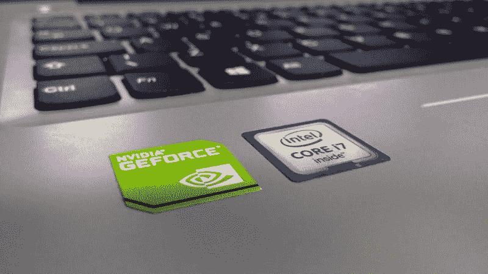
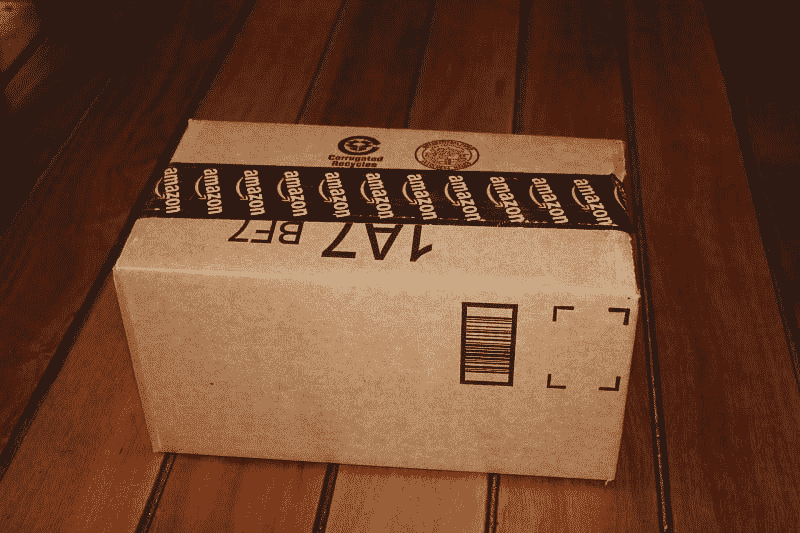

# 2020 年值得关注的股票——市场疯人院

> 原文：<https://medium.datadriveninvestor.com/stocks-to-watch-in-2020-market-mad-house-9a7b78fe8b96?source=collection_archive---------7----------------------->

股票市场是普通人监控市场和经济状况的最佳工具。

因此，监测 2020 年经济状况的最佳方式之一是观察一些股票。你不必买股票，只需观察它们的表现，就能了解经济的走向。

幸运的是，监控股票表现从未如此容易。像 Stockrow 和 Ycharts 这样的工具可以让你获得大量关于单个股票的数据。与此同时，谷歌可以随时向你展示几乎任何股票的价格。

因此，任何人都可以汇编一份股票清单，并对其进行监控。事实上，在搜索引擎的帮助下，你可能可以监控世界上任何交易所的任何股票。

# 2020 年值得关注的股票包括:

# 1.沙特阿拉伯石油公司(TADAWUL: 2222)或 Saudi Aramco。

公司 NPR [标签](https://www.npr.org/2019/11/03/775878235/saudi-aramco-worlds-most-profitable-company-will-make-first-public-offering)“世界上最赚钱的公司”于 2019 年 12 月上市。Saudi Aramco 是一家有趣的公司，因为它代表了一个国家沙特。

据报道，Saudi Aramco 2018 年的收入为 3549 亿美元，净收入为 1111 亿美元。然而，市场先生在 12 月 31 日以 35.10 美元的价格购买了阿美股票。因此，Saudi Aramco 可能是有史以来最有价值的投资。

我建议不要投资阿美石油公司，因为沙特阿拉伯的人权记录糟糕透顶。例如，这个国家的秘密警察有谋杀无辜记者的习惯。

 [## 算法交易的机器学习|数据驱动的投资者

### 当你的一个朋友在脸书上传你的新海滩照，平台建议给你的脸加上标签，这是…

www.datadriveninvestor.com](https://www.datadriveninvestor.com/2019/01/30/machine-learning-for-stock-market-investing/) 

由于沙特阿拉伯靠近也门、伊拉克和叙利亚的战区，阿美石油公司是一项高风险投资。事实上，据报道，也门胡塞叛军在 9 月 14 日[无人机袭击](https://marketmadhouse.com/lessons-we-can-learn-from-pearl-harbor/)时[摧毁了沙特一半的石油生产能力。](https://marketmadhouse.com/is-america-defenseless-against-drone-attacks/)

因此，阿美的大部分资产可能会付之一炬。此外，他们还可能推翻沙特阿拉伯的现任统治者穆罕默德·本·萨勒曼王子(MBS)。MBS 让我想起了另一位中东君主，伊朗国王穆罕默德·礼萨·巴列维。伊朗国王在 20 世纪 70 年代是美国的亲密盟友，就像 MBS 现在是美国的亲密盟友一样。

1979 年，一场革命迫使伊朗国王流亡并摧毁了他的政权。我怀疑 MBS 会步伊朗国王或英格兰国王查尔斯一世的后尘。1649 年英国内战后，奥利弗·克伦威尔的圆头叛军处决了独裁的查理一世。我认为沙特人大量抛售阿美股票可能是沙特即将发生革命的一个信号。

然而，监测 Saudi Aramco 是决定世界石油业走向的一个好方法。路透社[报道](https://www.reuters.com/article/us-saudi-aramco-ipo-factbox/saudi-aramco-the-oil-colossus-idUSKBN1XD03T)，阿美石油公司是石油、能源和全球经济的晴雨表，因为据说它提供了世界 10%的石油。

# 2.伯克希尔哈撒韦公司(纽约证券交易所代码:BRK。b)

你需要关注沃伦·巴菲特的公司，因为沃伦叔叔是最能判断经济状况的人之一。从历史上看，巴菲特预测了 2000 年的科技泡沫和 2007-2008 年的大崩盘。

目前，**伯克希尔哈撒韦公司(纽约证券交易所代码:BRK。A)** 在 2019 年 9 月 30 日手头有 1282 亿美元现金，*市场内幕人士* [声称](https://markets.businessinsider.com/news/stocks/four-analysts-on-berkshire-hathaways-128-billion-cash-pile-2019-11-1028659828)。我认为巴菲特正在积累现金，因为他认为一场重大的经济危机即将来临。沃伦叔叔不知道到底会发生什么，但他怀疑会有不好的事情发生。

巴菲特想要这些现金有两个原因。首先，这些现金将使伯克希尔·哈撒韦公司能够在不借钱的情况下度过经济动荡。其次，这些现金让伯克希尔有能力利用下一次崩盘带来的机会。

比如巴菲特可以低价收购破产或者资金告罄的公司。值得注意的是，伯克希尔·哈撒韦公司在 2002 年以 8 . 35 亿美元现金收购了破产的“织机之果”。另外，伯克希尔公司在 2010 年以 264 亿美元收购了伯灵顿北圣达菲(BNSF)铁路公司。

观察伯克希尔·哈撒韦公司的现金和短期投资是判断巴菲特对经济看法的一个好方法。巴菲特以前曾正确预测过经济危机。

最后，伯克希尔·哈撒韦是一家在经济危机中能够保持价值或增长的公司。因此，观察伯克希尔哈撒韦公司是监测经济状况的最佳方式之一。

# 3.英伟达(纳斯达克代码:NVDA)

跟踪 NVIDIA(纳斯达克股票代码:NVDA) 是检查技术和娱乐行业健康状况的一个好方法。解释一下，NVIDIA 制造芯片和图形处理器单元(GPUs 视频游戏、超级计算机、加密货币和人工智能在运行。

NVIDIA 在 T2 的高销售额和高收入表明了对技术基础设施的高需求。然而，英伟达收入下降可能表明人们购买视频游戏和电脑的数量减少。

值得注意的是，英伟达在 2019 年经历了四个季度的收入增长下降。详细来看，英伟达 2019 年报告的营收负增长率分别为-24.25%、-30.78%、-17.42%和-5.25%。然而，英伟达的收入从 2019 年 1 月 31 日的 22.05 亿美元增长到 2019 年 10 月 31 日的 30.14 亿美元。

因此，英伟达的收入显示对视频游戏技术的需求下降。这可能是消费者可用于视频游戏的可支配收入减少的一个迹象。

同样，英伟达销售额下降可能表明对人工智能(AI)和类似技术的需求下降。此外，英伟达收入的下降可能是企业对信息技术投资减少的一个迹象。最后，英伟达收入的下降可能表明对新技术没有需求。

# 4.亚马逊(纳斯达克代码:AMZN)

如果你想衡量美国经济的健康程度，**亚马逊(NASDAQ: AMZN)** 是一家值得考察的好公司。

亚马逊可以告诉你美国消费者是否消费，因为亚马逊现在是美国的百货商店。数千万美国人在亚马逊上进行大部分购物。因此，亚马逊收入的增加可能意味着美国及其他地区的消费者支出增加。

如果亚马逊在增长，经济也在增长。然而，反过来也是对的。如果衰退开始，亚马逊可能是最先受到影响的公司之一。

亚马逊也是一家很好的研究技术反弹的公司。解释一下，亚马逊股价下跌可能表明了公众对大型科技公司的愤怒。然而，美国对大型科技公司日益增长的愤怒并没有反映在科技公司的收入上。

最后，亚马逊的股价和市值可以表明普通投资者如何看待美国经济。解释一下，如果亚马逊的股价很高，投资者就会对美国消费者及其消费意愿有信心。如果亚马逊股价下跌，市场先生；和普通投资者可能会对经济和消费者支出失去信心。

因此，亚马逊 2019 年 12 月 31 日 1847.84 美元的股价证明了假日购物季的良好表现。投资者看到消费者在消费，所以他们购买亚马逊。

# 5.苹果公司(纳斯达克代码:AAPL)

**苹果(纳斯达克股票代码:AAPL)** 是世界上最受欢迎的股票，2019 年 12 月 31 日的市值为 1.3 万亿美元。

因此，追踪苹果的市值是确定投资者情绪的一个很好的方法。如果苹果的市值很高，资金就会流入股市。相反，如果苹果市值下跌，投资者就会失去信心并抛售。

苹果(Apple)等孤儿寡母股票的高市值表明，储蓄账户和 CDs 等工具的回报率较低。解释一下，人们正试图通过购买苹果等股息和收益股票来弥补损失的利息收入。

因此，苹果公司市值的下降可能意味着利率的上升。此外，苹果是外国投资者的热门股票。

苹果也是消费者情绪的晴雨表，因为它销售奢侈品，如 iPhones、iTunes、iMacs、Apple TV 等。、应用程序等。苹果公司不断增长的收入表明消费者有了收入，也增加了支出。苹果公司收入的下降可能是消费者害怕消费的一个迹象。

我认为上面的五只股票是市场情绪的良好指标。监控这些公司和他们的财务表现可以告诉你经济可能会走向何方。

*原载于 2020 年 1 月 1 日***。**