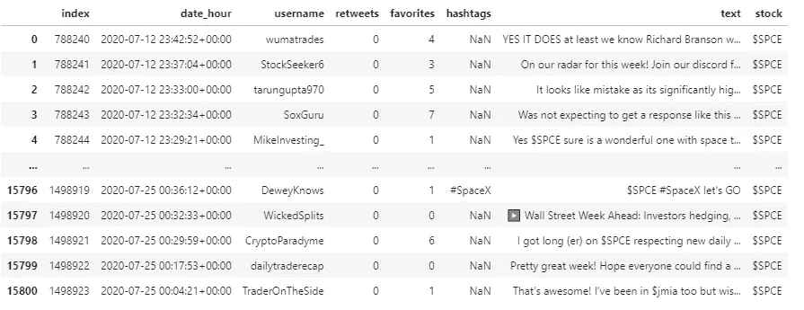
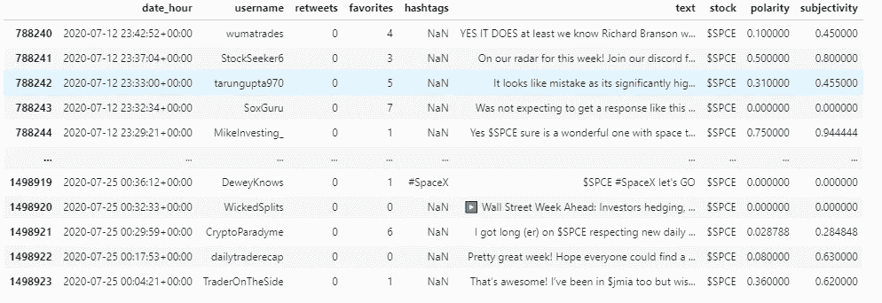
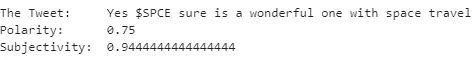
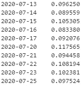
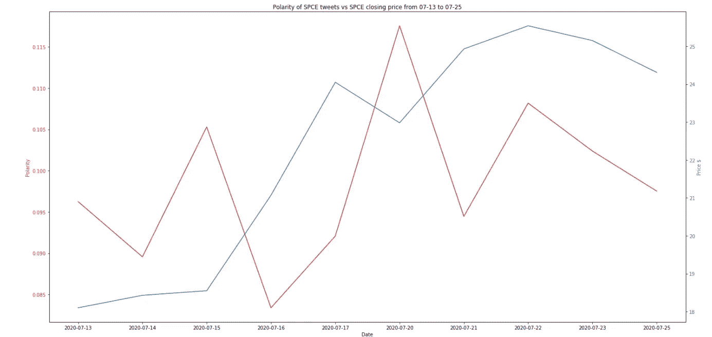

# 股票、微博和波动性:用 Textblob 分析股票微博

> 原文：<https://medium.datadriveninvestor.com/stocks-tweets-and-volatility-analyzing-stock-tweets-with-textblob-6fc169e2ea10?source=collection_archive---------4----------------------->

## GetOldTweets3 和 Textblob 如何帮助对股票相关的推文进行基本的情绪分析。


Photo by [NICHOLAS CAPPELLO](https://unsplash.com/@bash__profile?utm_source=medium&utm_medium=referral) on [Unsplash](https://unsplash.com?utm_source=medium&utm_medium=referral)

与财务独立和独立投资的巨大趋势相一致，2020 年的疫情撼动了经济世界，将许多新的和缺乏经验的交易员带到了桌子上，以及动荡的疫情市场。

> **【在澳大利亚市场】**从 2 月底到 5 月初，零售经纪人的日均营业额从正常时期的 16 亿美元增加到 33 亿美元。在新冠肺炎时期，每天都有惊人的 4675 个新账户注册——增长了 3.4 倍。与此同时，休眠账户数量激增。
> -奈特，[《悉尼先驱晨报》](https://www.smh.com.au/business/markets/don-t-try-this-at-home-asic-s-warning-for-amateur-sharemarket-punters-20200506-p54qdo.html)

带着致富的梦想，乘着特斯拉(TSLA)等市场巨头股票的上涨趋势，或者随着风险期权在华尔街的流行，这些交易者中的许多人带着比开始时更少的钱离开了。

这不应该让人感到意外。虽然一些投资者可能很幸运或发挥优势，但大多数交易者正在输给数十亿美元的机构，这些机构利用最先进的技术在竞争中取得平均水平。鉴于典型的消费者无法访问相同的资源，他们通常处于劣势。

门外汉投资者可以尝试的一个方法是提高投资的技术含量。

## 推特


Photo by [Sara Kurfeß](https://unsplash.com/@stereophototyp?utm_source=medium&utm_medium=referral) on [Unsplash](https://unsplash.com?utm_source=medium&utm_medium=referral)

听起来可能令人惊讶，但 Twitter 实际上有一个蓬勃发展的投资社区。在许多情况下，Twitter 是研究和了解潜在投资的有效工具，尤其是那些在传统投资记者雷达下飞行的投资。由于所有这些用户都在推特上谈论股票，也许我们可以利用这些信息来帮助通知我们自己的投资。

那么我们如何访问这些推文呢？

您实际上可以使用 GetOldTweets3 搜索和存储特定查询的 tweets:

****注意:由于一个 bug，GetOldTweets3 目前无法运行；开发人员正在修复这个包。***

```
!pip install GetOldTweets3
import GetOldTweets3 as got
import pandas as pd tweetCriteria = got.manager.TweetCriteria().setUsername("$APPL").setMaxTweets(2000)appl_tweet = got.manager.TweetManager.getTweets(tweetCriteria)[0]tweet_list = []
[tweet_list.append([tweet.date, tweet.username, tweet.retweets,tweet.favorites, tweet.hashtags, tweet.text])
for tweet in tweets]

tweets_df = pd.DataFrame(tweet_list, columns = ["date_hour","username","retweets","favorites","hashtags", "text"])
```

在这种情况下，appl_tweet 是自 GetOldTweets3 查询网站以来最新的$APPL 推文，tweets_df 是 pandas 数据帧，包含以下各列中所有 2000 条最新的苹果推文:

```
["date_hour","username","retweets","favorites","hashtags", "text"]
```

现在我们已经收集了这些推文，我们可以用它们做什么呢？

## 多头还是空头？

情感分析是自然语言处理的一个领域，专门关注从一串文本中提取情感/观点。你可以把这想象成阅读一篇电影评论，并决定作者是在传达一个积极的还是消极的关于这部电影的信息。

在投资领域，我们不是评估评论的正面或负面，而是阅读与股票相关的推文，并确定推文的情绪是看涨还是看跌。在足够大的范围内，确定股票的看涨或看跌情绪有助于预测价格走势或投资的波动性。

现在，通常如果你想教一台机器进行情感分析，你需要为这项任务训练一个模型。这需要大量的时间和精力。幸运的是，开源社区可以提供帮助。

## 文本处理包 Textblob

Textblob 是 python 2 和 3 上提供的一个简单的文本处理包。它可以执行从名词提取到拼写纠正的各种任务。对我们来说最重要的是，Textblob 还包括一个易于使用的情感分析功能。

以下代码是如何使用该功能的示例:

```
!pip install textblob
from textblob import TextBlob # Call the textblob object on the string
blob = TextBlob("Please, don't forget to clap this great article") #Call the sentiment function from textblob
blob.sentiment
[4]: Sentiment(polarity=0.8, subjectivity=0.75)
```

在我们的字符串上调用情感函数输出两个结果，一个极性得分和一个主观性得分。极性得分介于-1 和 1 之间，其中-1 的得分意味着该字符串传达了负面情绪，1 表示正面情绪。主观性得分强调字符串的主观或客观程度，0 分表示非常客观，1 分表示非常主观。

在上面的示例字符串中，Textblob 的分析表明，该句子总体上是积极的，但也相当主观——这是一个公平的评估。

[](https://www.datadriveninvestor.com/2020/07/23/learn-data-science-in-a-flash/) [## 一瞬间学会数据科学！？数据驱动的投资者

### 在我之前的职业生涯中，我是一名训练有素的古典钢琴家。还记得那些声称你可以…

www.datadriveninvestor.com](https://www.datadriveninvestor.com/2020/07/23/learn-data-science-in-a-flash/) 

## $SPCE 完美的测试


Photo by [Bill Jelen](https://unsplash.com/@billjelen?utm_source=medium&utm_medium=referral) on [Unsplash](https://unsplash.com?utm_source=medium&utm_medium=referral)

理查德·布兰森的公司*维珍银河控股有限公司*从事先进太空飞行器的制造和部署。维珍银河的交易代码为$SPCE，是业余投资者中很受欢迎的股票，旨在从未来的旅行中获利。我使用 GetOldTweets3 收集了 7 月 13 日至 7 月 25 日之间所有提到“$SPCE”的推文，这两个完整的交易周不包括破坏性的市场波动。



A dataframe containing all 15800 tweets between 07–12 and 07–25\. Some redundant tweets were trimmed to get a nice round number. Image by author.

然后，我使用 Textblob 对每条推文的文本进行了情感分析，生成了极性和主观性得分。



Note the two new columns, polarity and subjectivity. Image by Author



An example of analysis performed on one tweet. Image by Author.

现在，数据存储在数据框架中，我们可以对一天中的极性得分进行平均，以获得每个市场交易日的平均极性评级。周末被排除在分析之外。

通过平均极性，我们得到每天的以下结果:



The integer value represents the mean polarity score for each date. Image by Author.

显然，将股票的情绪变化形象化为一系列数字是多余的。然而，如果我们将以下情绪得分与股价变化相对照，我们会得到以下结果:



Market closing prices are captured on the right y-axis, polarity score is captured on the left y-axis. Dates for each value are captured on the x-axis. Note the similar patterns of movement. Image by author.

如上图所示，关于$SPCE 的平均每日推特人气和该股每日收盘价之间有一些类似的变化。显然，由于一些原因，这是非常初级的，但它是如何将 Textblob 用于 tweet 情感分析的一个很好的例子。

使用这个例子，你可以建立自己的工具来跟踪和通知投资决策。虽然它并不完美，但对于技术投资爱好者来说，Textblob 可能是一个值得尝试的有趣工具。

在附录中，我列出了为什么上面的例子需要调整才能有效工作的原因。

## 最后的想法


Photo by [Markus Spiske](https://unsplash.com/@markusspiske?utm_source=medium&utm_medium=referral) on [Unsplash](https://unsplash.com?utm_source=medium&utm_medium=referral)

总之，Textblob 的情感分析是一个很好的切入点，可以帮助人们使用一个简单有效的包来探索文本背后的意义。虽然不是为股票分析而设计的，但对于那些想尝试一些更先进的交易技术的人来说，它是一个有效的切入点。或者，网站 [Stocktwits](https://stocktwits.com/) 可以提供一个类似的功能，没有编码的麻烦，尽管没有这个软件包允许的那么多定制或实用。通过更好地告知他们的投资，许多新投资者可能会在这个动荡的市场中获得一些运气。试一试。

***如果你学到了新的东西，请考虑为这篇文章鼓掌。***

## 附录

**$ SPCE 的一些问题示例:**

*   该示例仅捕获日平均值。小时或分钟的更改不会被捕获。
*   推文是从每天 24 小时收集的，而不是在交易时间。这可能会发挥作用。
*   Textblob 可能是根据与股票无关的数据进行训练的。它是有用的，但并不完美。

## 来源

GetOldTweets3。(未注明)。检索于 2020 年 10 月 11 日，来自[https://pypi.org/project/GetOldTweets3/](https://pypi.org/project/GetOldTweets3/)

骑士，E. (2020 年 05 月 06 日)。不要在家里尝试这种做法:ASIC 对业余股市投资者的警告。检索于 2020 年 10 月 11 日，来自[https://www . smh . com . au/business/markets/don-t-try-this-at-home-ASIC-s-warning-for-emulator-share market-punts-2020 05 06-p54qdo . htm](https://www.smh.com.au/business/markets/don-t-try-this-at-home-asic-s-warning-for-amateur-sharemarket-punters-20200506-p54qdo.htm)

m . lyck(2020 年 6 月 18 日)。为什么 80%的日内交易者亏损。检索于 2020 年 10 月 11 日，来自[https://medium . com/@ marklyck/why-80-of-day-traders-lose-money-78d 51 b 10 Fe 25](https://medium.com/@marklyck/why-80-of-day-traders-lose-money-78d51b10fe25)

简化的文本处理。(未注明)。检索于 2020 年 10 月 11 日，发自 https://textblob.readthedocs.io/en/dev/

谢尔曼，S. (2020 年 7 月 26 日)。新手投资者:‘没想到会亏这么快’。检索于 2020 年 10 月 11 日，发自 https://www.bbc.com/news/business-53201204

SPCE 股票价格:维珍银河控股公司股票报价(美国:纽约证券交易所)。(未注明)。检索于 2020 年 10 月 11 日，来自[https://www.marketwatch.com/investing/stock/spce](https://www.marketwatch.com/investing/stock/spce)

*请注意，我* ***没有*** *资格提供投资建议，我现在也不会提供任何投资建议。本文将重点介绍一个 python 包，爱好投资者可能会对此感兴趣。*

*所有使用的图片要么是我自己创作的，要么是经作者明确许可使用的。每个图片下都有作者资料的链接。*

## 访问专家视图— [订阅 DDI 英特尔](https://datadriveninvestor.com/ddi-intel)