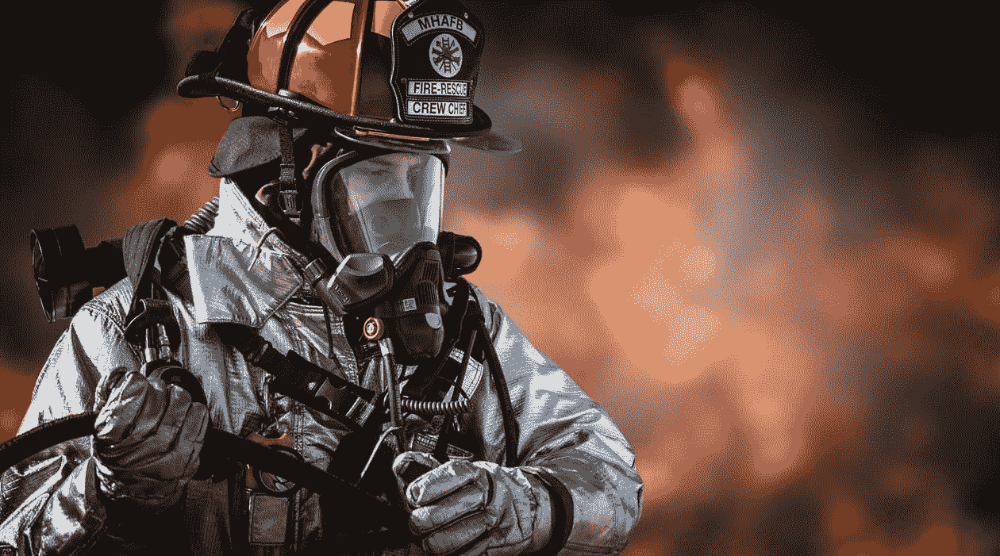

# 不要再叫警察“第一反应者”

> 原文：<https://medium.datadriveninvestor.com/stop-calling-cops-first-responders-42a2e63eee98?source=collection_archive---------12----------------------->

(Pixabay)

“第一反应者”这个短语有一定的声望。它总是伴随着“英雄”这个词当你需要他们的时候，第一反应者总是在那里[拯救生命](https://nuvisionfederal.com/blog/memberresources/2019/09/22/what-makes-a-hero-first-responders)[保护我们的安全](https://www.ibm.com/industries/telecom-media-entertainment/resources/next-generation-network/scenes/emergency-response-center/select/details/command-center/)这些关于第一反应者的情绪根植于 9 月 11 日的集体记忆。在 2001 年之前，“第一响应者”主要用于指 EMT，但它成为一个泛指所有公共安全服务的总称。

在一篇文章中，前消防队长罗伯特·里拉格指出“第一反应者”是在关于 9·11 事件的新闻报道中节省篇幅的一种方式。记者需要所有相关机构和辖区的速记。

里拉格批评这个短语是如何被滥用和误用的。他举的一个例子是一个招募广告，称国民警卫队为“第一反应者”。其中包括一名身穿消防装备的女警卫，她正走向一场森林大火。

 [## 我们是在为一个警察国家进行彩排吗？数据驱动的投资者

### 丹尼斯普雷格在他的联合专栏中声称，我们正处于一个警察国家的彩排之中。他声称…

www.datadriveninvestor.com](https://www.datadriveninvestor.com/2020/05/18/are-we-having-a-dress-rehearsal-for-a-police-state/) 

同样，警察部门也利用对第一反应者残留的热情来改善他们的形象。智能手机和社交媒体的出现使得记录和传播警察暴力案件变得更加容易，因此，公众对警察的看法明显下降。

“第一反应者”的普及对陷入困境的警察部队来说是一个福音。在这个短语的使用达到顶峰的时候，与之联系最紧密的部门——NYPD——因为其种族主义的“拦截搜身”计划而受到抨击。在接下来的十年里，它继续在警察公关工作中发挥作用，因为对高调杀害手无寸铁的黑人的抗议引发了黑人的命也是命运动。

政客、警察基金会和其他警务倡导者经常这样称呼警察，将他们归入更高尚、更受欢迎的职业，如[消防员](https://www.firehouse.com/home/news/10504915/poll-firefighters-tie-for-most-prestigious-profession)，医生和急救人员。

这个短语在最近几天被证明特别有用，在新冠肺炎疫情爆发的同时，全国范围内爆发了反警察起义。称警察为“第一反应者”给了他们和医务人员一样的光环，他们在过度拥挤的医院里工作 12 小时，冒着生命危险拯救他人免受高传染性病毒的感染。

除了[执行口罩条例](https://www.brennancenter.org/our-work/research-reports/police-responses-covid-19)，官员们在新冠肺炎的反应中很少或没有发挥作用。可以说，他们让危机变得更糟了。许多人拒绝戴口罩，因为他们逮捕抗议者并把他们塞进拥挤的监狱。然而，他们不仅被奉为“第一反应者”，而且被奉为“重要的一线工作者”

佐治亚州一名议员最近耍的花招显示了这个短语的宣传价值。上周，州长签署了一项法案，禁止对“第一反应者”进行“带有偏见的恐吓”

虽然它也包括消防队员和医务人员，但它本质上是一部旨在保护警察免受“骚扰”的“[蓝色生命问题](https://www.nyclu.org/en/legislation/legislative-memo-opposition-blue-lives-matter-bill)”法律它有效地使“第一反应者”成为受仇恨犯罪法保护的一类人。公民自由活动家[指出](https://www.aclu.org/press-releases/aclu-georgia-opposes-hb-838-which-adds-law-enforcement-protected-class)该法案给了警察一个新的法律武器来对付抗议者，让受宪法保护的言论寒心。

说该法旨在保护“第一反应者”而不是警察，这是一个特别奥威尔式的举动，使这种对第一修正案的专制攻击更容易为公众接受。

政客们还将警察和紧急反应混为一谈，以抵制要求解除警察经费的呼声。在西雅图，反腐败运动势头强劲，前检察官珍妮·德坎市长经常[使用这种策略](https://www.thestranger.com/slog/2020/08/04/44222028/seattles-mayor-and-police-chief-keep-gaslighting-the-city-about-defunding-spd)。

在每次讨论该提案的新闻发布会上，杜尔坎都被警察和消防队长包围，以此强调警察作为“第一反应者”的作用。在她的公开声明中，她危言耸听地说将警察预算削减一半会削弱紧急反应能力并危及生命。

然而，只有在相对罕见的情况下，如主动开枪者，警方才需要成为现场的第一反应者。不到 10%的警察电话实际上涉及医疗紧急情况，这在全国各部门之间非常一致。

由于新冠肺炎危机，公众对第一反应者的支持不断涌现，警察从中受益。虽然对警察的看法急剧下降，但人们对第一反应者有着近乎普遍的喜爱。一项调查发现，90%的美国人认为第一反应者“没有得到应有的重视”

对于一些急救人员来说，这无疑是正确的。几乎总是第一个到达现场的急救人员只能勉强维持生活。大多数警察拿着舒适的中产阶级薪水，在像西雅图、纽约和三藩市这样的大城市，他们的收入是六位数。

在许多情况下，警察在他们不应该在的地方充当第一反应者。defund 运动的核心目标之一是将某些警察职能移交给受过非暴力处理这些问题培训的新一批民间应急人员。手无寸铁的顾问和社会工作者更适合[警察目前执行的许多任务](https://www.businessinsider.com/defunding-the-police-what-others-may-do-better-2020-6#police-officers-are-often-the-first-to-respond-to-domestic-abuse-calls-some-experts-say-specialized-organizations-like-survivor-support-systems-could-be-better-equipped-to-handle-domestic-violence-disputes-instead-4)，例如应对大多数精神健康危机和家庭纠纷。

西雅图警察局 2011 年的一项联邦调查发现，70%的使用武力案件涉及醉酒或精神病患者。警察[在进行所谓的健康检查时杀死或严重伤害了人](https://www.texastribune.org/2019/10/13/fort-worth-police-officer-shoots-and-kills-black-woman-home/)。

归根结底，称警察为“第一反应者”从根本上模糊了他们的基本职能:代表国家实施暴力。徽章和枪是警察身份的图腾，分别象征着法律权威和致命力量。上交它们标志着一个人不再是军官。

“第一反应者”是拯救生命的人，但对于警察来说，夺取生命也是工作描述的一部分。

**访问专家视图—** [**订阅 DDI 英特尔**](https://datadriveninvestor.com/ddi-intel)