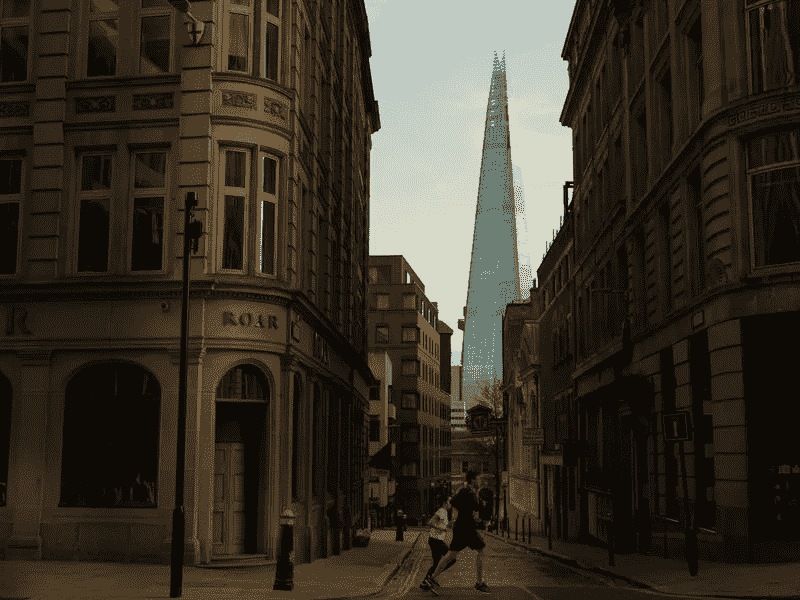

# 不要再称之为衰退——这是“大封锁”萧条

> 原文：<https://medium.datadriveninvestor.com/stop-calling-it-a-recession-this-is-the-great-lockdown-depression-2877616977ed?source=collection_archive---------11----------------------->

## 你不只是从 15%以上的收缩中“反弹”

UK in Lockdown. (Image: Bloomberg)

随着我们进入纪念大萧条以来一个世纪的最后十年，我们似乎已经跌跌撞撞地进入了我们自己的时代。这发生在大衰退(或 GFC)十年之后，是双重打击。2009 年，世界经济收缩了 0.1%。*0.1%。这是一场衰退。世界各地的央行在这个问题上投入了大量资金——这是一种他们在 2018/19 年才开始让世界经济戒除的药物。那不会再发生了。预计今年世界经济将收缩 3%。*

*虽然在 2Q 全球经济下滑 20%之后，3%似乎是完全可以接受的——但这只是一个预测。尽管来自国际货币基金组织，该组织在 2 月 19 日预测增长放缓仅为 0.1%。换句话说，今明两年全球经济下滑 9 万亿美元，相当于日本和德国 GDP 的总和。就像政府会继续砸钱解决这个问题一样；我们不会看到 V 型复苏。鉴于我们在这一时刻是如何相互关联的，痛苦将比以往的危机更加公平地分担。*

*这绝不是对银行业的信任危机，而是对人性的信任危机。这是健康(医疗)冲击、需求冲击、资本外流、领导无方和大宗商品价格暴跌的组合。鉴于航空公司停飞，火车停运，汽车滞留在停车场，后者甚至不能起到刺激作用。这也是欧佩克+公开的敌人、低油价的爱好者唐纳德·川普(Donald Trump)最终达成协议拯救美国石油经济(或许还能保住总统职位)的原因。*

*领导人很难在一夜之间变成国家的牧羊人和管理者。鉴于我们面临的多方面危机，可悲的是，只关注政府的支持和支出是不够的。不仅仅是私营企业，私人也必须转变为公民。不是在爱国热情中挥舞旗帜，而是日复一日，也许是数年，做体面而正确的事情。*

# *2008 年不会重演*

*既然中国能够将全球经济从 GFC 的深渊中拉出来(美国和欧盟也不惜一切代价将‘’)现在，我们已经走投无路了。任何借款，而且已经有超过 4 万亿美元(这是一个印度，包括“夜间增长”的印度)的借款，将会给未来几代人带来负担。对于职业和个人抱负已经被 2008 年和 2020 年的双重危机扼杀的一代人来说，这应该是令人不快的。*

* [## 危机？风投适应的 3 种方式|数据驱动的投资者

### 当我写这篇文章的时候，一场全球性的危机正在发生。这不是第一次，也不会是最后一次。很多事情已经…

www.datadriveninvestor.com](https://www.datadriveninvestor.com/2020/03/22/crisis-3-ways-vcs-adapt/) 

自 2008 年危机以来，世界各地公布的一个又一个计划助长了资产泡沫——显然，这让富人受益。对于任何人来说，婴儿潮一代的退休金也受到了打击——世界各地的指数和房屋价值在过去十年里轻松地翻了两倍或三倍。这是由对后代的借款所推动的。2013 年 10 月，作为一名 20 多岁的对冲基金分析师，我有话对[说](https://medium.com/@der_Wille/can-the-bluff-be-called-7e3f9f0b3082):

> “不惜一切代价”意味着购买更多的债券，然后再购买更多的债券，以帮助受高债务困扰的国家降低借贷成本。当然，他们(欧洲央行)会坚持紧缩措施，但当你给某人一种药物并要求他们守规矩时，你就养了一只丑陋/不守规矩的动物。你不能在一个晴朗的日子停止用药——一旦你开始用药，你就会一直用药。希腊、西班牙和意大利用枪指着德国的脑袋，德国只能继续付钱。“— [虚张声势可以叫牌吗，2013 年 10 月](https://medium.com/@der_Wille/can-the-bluff-be-called-7e3f9f0b3082)

当然，德国和她的“北方”伙伴将继续承担欧盟的成本——但如果他们现在收紧钱袋，这将近乎谋杀。他们不敢。如果他们说出来，这将威胁到全球的金融稳定。这同样适用于世界各国。谈论财政赤字和回避政府救助将是最糟糕的方式。

> 这是政府和央行最终将与本国人民和企业达成的浮士德式交易。这正是这件事不会有好结果的原因。当然，我们知道最终是什么让世界走出了大萧条。

— — — — — — — — — — — — — — — — — — — — — — — — — — — — -

)(我)(们)(都)(不)(知)(道)(,)(我)(们)(还)(不)(知)(道)(,)(我)(们)(还)(不)(知)(道)(,)(我)(们)(还)(不)(知)(道)(,)(我)(们)(还)(不)(知)(道)(,)(我)(们)(还)(不)(知)(道)(,)(我)(们)(还)(不)(知)(道)(。 )(我)(们)(都)(不)(知)(道)(,)(我)(们)(还)(不)(知)(道)(,)(我)(们)(还)(不)(知)(道)(,)(我)(们)(还)(不)(知)(道)(,)(我)(们)(还)(不)(知)(道)(,)(我)(们)(还)(不)(知)(道)(,)(我)(们)(还)(不)(知)(道)(,)(我)(们)(还)(不)(知)(道)(,)(我)(们)(还)(不)(知)(道)(。 )(我)(们)(都)(不)(知)(道)(,)(我)(们)(还)(不)(知)(道)(,)(我)(们)(还)(不)(知)(道)(,)(我)(们)(还)(不)(知)(道)(,)(我)(们)(还)(不)(知)(道)(,)(我)(们)(还)(不)(知)(道)(,)(我)(们)(还)(不)(知)(道)(,)(我)(们)(还)(不)(知)(道)(。 )(我)(们)(都)(不)(知)(道)(,)(我)(们)(还)(不)(知)(道)(,)(我)(们)(还)(不)(知)(道)(,)(我)(们)(还)(不)(知)(道)(,)(我)(们)(还)(不)(知)(道)(,)(我)(们)(还)(不)(知)(道)(,)(我)(们)(还)(不)(知)(道)(,)(我)(们)(还)(不)(知)(道)(。

[*第十二:运动会将领出场……*](/@der_Wille/the-national-identity-xii-the-games-generals-play-and-they-need-to-stop-d4626e3da18a)

[*XIV:特种部队内部身份危机*](/@der_Wille/the-national-identity-xiv-inside-the-special-forces-identity-crisis-3b31c721bedf)

[*十九:克什米尔的印度士兵*](/@der_Wille/the-national-identity-xix-the-indian-soldier-in-kashmir-2f55fce00ea4)

[*XXV:多瓦尔·杜巴*](/dialogue-and-discourse/the-national-identity-xxv-doval-durbar-40406945808)

[*二十八:少数民族军队*](/the-national-identity/the-national-identity-xxviii-the-minority-army-5fa264b15835)

[*XXX:卡吉尔，巴基斯坦谎言的保镖*](/@der_Wille/the-national-identity-xxx-kargil-the-bodyguard-of-pakistans-lies-6c905fe417ff)

[*XXXV:印度三军*](https://medium.com/the-national-identity/the-national-identity-xxxv-the-three-indian-armies-f1dc8a2cc96b)*