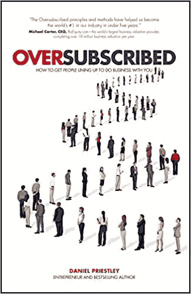
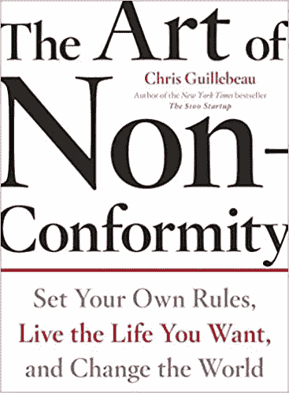
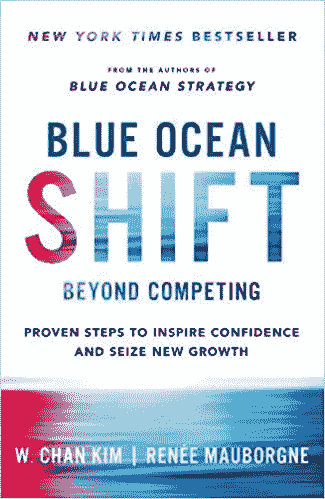
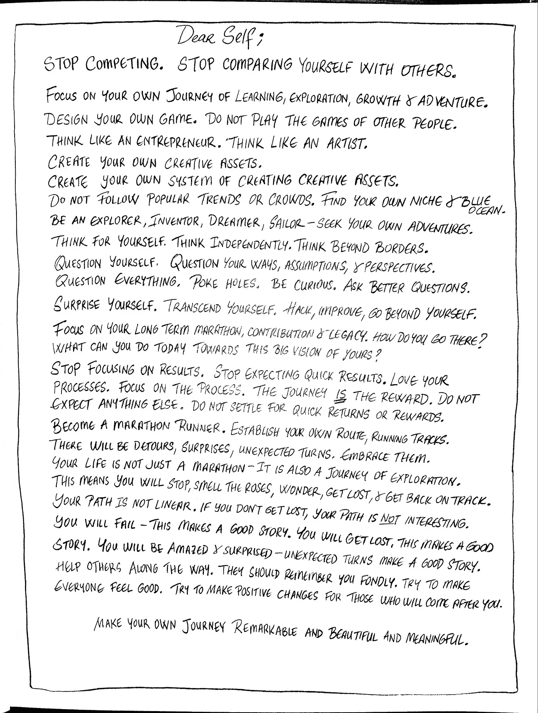

# 停止竞争，开始创造你自己的游戏

> 原文：<https://medium.datadriveninvestor.com/stop-competing-and-start-creating-your-own-game-3164382b3035?source=collection_archive---------14----------------------->

## 为什么追随趋势和人群是致命的

Photo by [Luca Upper](https://unsplash.com/@lucistan?utm_source=medium&utm_medium=referral) on [Unsplash](https://unsplash.com?utm_source=medium&utm_medium=referral)

意大利科莫湖有许多高级餐厅。这些餐馆中的绝大多数都靠近湖边，而且提供美味的食物。他们在各个方面互相竞争，包括装饰、最佳视角和招牌菜。

还有一家名叫 Tremesso 的餐馆，是一对夫妻开的。它不靠近湖，但离湖有一英里远。它没有风景和豪华的装饰。取而代之的是塑料椅子、旧家具和廉价的层压菜单。菜单上只有一项:史上最美味的披萨。这家餐馆总是客满。丈夫在厨房，妻子在收拾桌子。他们自己种植西红柿、洋葱、香草和香料。他们自己做面团，自己种植新鲜食材，自己碾碎大蒜。他们的比萨饼非常美味。他们向客人开放他们的家和花园。在你吃了他们美味的披萨后，你觉得有必要告诉别人你的经历。这对夫妇建立了他们自己的游戏。他们玩一种与众不同的游戏。

Image [Source](https://www.amazon.co.uk/Oversubscribed-How-People-Lining-Business/dp/0857086197)

Daniel Priestley 在一本名为*“超额认购:如何让人们排队与你做生意”*的书中讲述了这个例子。

总的教训是:你需要在生活中建立自己的游戏。这意味着你需要在你所做的事情上出类拔萃。你会抵制模仿他人或随大流的诱惑。你会继续做你自己独特的事情。拥抱让你疯狂和怪异的东西。

如果你的竞争对手都在努力变得现代，你就会固执地守旧。如果其他组织都在基于价格竞争，你需要收取额外费用，并为你的客户提供卓越的体验，以取悦他们。永远不要合群，相信自己的游戏。提高你自己的水平，而不是关注你的竞争对手。

## 练习:问自己:

*   其他人都在做什么？
*   只有你相信的是什么？
*   你如何利用并放大这一点，使之成为你引以为豪的东西？

记者罗布·奥查德是创造独特游戏的一个很好的例子。在一个即时和超高速数字新闻的时代，罗布呼吁一场缓慢的新闻革命。他的杂志《延迟的满足》自豪地宣称，它代表了最后也是最慢的新闻业。这给他带来了优势、深度和质量:

马云也在经营类似的哲学，他称之为太极。他说:

*“太极就像‘你在那边打，我在这边打。你在上面，我要下去。这是一种平衡。你很重，我很小。当我小的时候，我会跳。你很重。你不能跳。太极是一种哲学。我在工作中运用太极哲学。冷静点。总会有出路的，保持自己的平衡。”*

看看 Lady Gaga。她在另一个宇宙中工作。她是她自己世界的英雄，她制定那个世界的规则。

埃隆·马斯克是另一个迷人的例子。他是唯一一个痴迷于殖民火星和创造多星球人类文明的疯子:

 [## 以下是我对火星着迷的原因

### 一篇视频文章

medium.com](https://medium.com/predict/here-are-the-reasons-why-i-am-obsessed-about-mars-1717e34ca954) 

## 练习:问问你自己

*   你痴迷于什么？
*   为什么？你为什么在乎？
*   你的职业是什么？
*   你在哪里看到你独特的使命和贡献？
*   你将如何实现它？

# 从长计议，做不同的事情

我们知道，最优秀的企业家、艺术家和专业人士做事情的方式非常不同。有大量关于比尔·盖茨或杰夫·贝索斯的习惯和思维模式的文章。这些都是天才和先驱，他们着眼长远，取得了巨大的成功。他们各自沿着人迹罕至的道路前行。他们各自一步一步地开拓出自己的道路。他们解决了重大问题，从而为数百万其他人创造了价值。他们像马拉松运动员一样追逐自己的梦想。

## 练习:问问你自己

*   你认为自己五年后会怎样？10 年？15 年？
*   用高清分辨率将你的梦想可视化并写下来。
*   你理想中的日子和生活是什么样子的？
*   你在哪里？
*   你兴奋什么？
*   是什么让你滴答作响？
*   想出 3 种情景(5 年、10 年和 15 年)。
*   让每个场景都非常详细和具体。

 [## 安全:很好(尤其是对企业家而言)，只要安全完成|数据驱动的投资者

### 未来股权的简单协议，或 SAFE，是越来越受欢迎的融资工具，特别是在…

www.datadriveninvestor.com](https://www.datadriveninvestor.com/2020/10/11/safe-great-esp-for-entrepreneurs-as-long-as-done-safely/) 

# 跟随你内心的渴望，找到你自己的声音

杰出的顶级演员有着不同的心态:他们都在生活中建立了自己的游戏。他们不仅在成就上是异类，在个人系统和日常事务上也是异类。他们愿意与众不同，敢于冒险。他们完全遵从自己的内心、欲望和声音。

取悦他人或跟风保证你会平庸。正如奥斯卡·王尔德所说:“所有流行的东西都是错的”。如果你随波逐流，你将永远无法充分发挥最好的自己。你不会最大限度地发挥你与生俱来的天赋和优势。

你需要立志成为 100%的自己，成为最好的自己。这意味着升级和改造你自己，直到你完全达到最好的自己。

## 练习:问问你自己

*   你最好的样子是什么样的？
*   详细描述一下你理想中的样子。
*   这个人会如何度过他或她的一天？
*   谁是理想的朋友和合作者？
*   他/她将如何对世界做出卓越的贡献？

Image [Source](https://www.amazon.co.uk/Art-Non-Conformity-Rules-Change-Perigee/dp/0399536108/ref=sr_1_1?dchild=1&keywords=The+Art+of+Non-Conformity.&qid=1596636257&s=books&sr=1-1)

克里斯·吉列博(Chris Guillebeau)是《不随大流的艺术:设定自己的规则，过自己想要的生活，改变世界》一书的作者。他在 35 岁之前去过世界上 193 个国家。在他的宣言中，题为“统治世界的简要指南”，Guillebeau 说我们生活在平庸的海洋中，但我们需要不惜一切代价避免平庸:

> “如果平庸的正常化有什么好消息的话，那就是当你做了一件优秀的事情，它会变得如此不寻常，以至于你会立即脱颖而出。人们会感到惊讶，因为他们习惯了足够好的东西，以至于优秀的东西真的很少。当你决定更上一层楼，超越周围的低期望值时，这可能会对你有利。”

## 练习:问问你自己

*   今天能做的三个小动作是什么，避免平庸，找到自己的事情？
*   把它们写在你的日记里，采取 3 个最小的可能的行动，让你在市场中脱颖而出。

# 停止竞争:找到你的蓝海

Image [Source](https://www.amazon.co.uk/Blue-Ocean-Shift-Competing-Confidence/dp/1509832165/ref=sr_1_1?crid=3H2FY1Z04HJ88&dchild=1&keywords=blue+ocean+shift&qid=1596637780&s=books&sprefix=blue+ocea%2Cstripbooks%2C180&sr=1-1)

Kim 和 Mauborgne 写了一本名为*“蓝海转移:超越竞争——激发信心和抓住新增长的有效步骤”的出色的书。*

在这本书中，他们认为你需要超越竞争，激发员工的信心，将你的组织从充满竞争的红海带到没有竞争的蓝海。

Kim 和 Mauborgne 把重点放在了*非*颠覆性创造上，以此作为前进的方向。与优步和出租车行业相比，非破坏性创新专注于在现有竞争的二元体系之外创造新领域和建立新游戏。以生活指导、小额贷款或网上约会等非破坏性举措为例。这些并没有取代另一个行业或公司。没有失业。他们创造了新的产业和大量新的工作岗位。他们发现并解决了全新的问题。他们创造了全新的机会和超越现有的新市场。

以下是受这本书启发的一些职业经验:

*   如果你想让你的事业和贡献引人注目，你需要在未知的领域航行，找到你自己的“蓝海”。
*   红色的海洋是红色的，因为有太多的竞争和流血——每个人都在那里相互竞争。红色的海洋几乎没有生长的空间。在红海中，供大于求，竞争激烈。每家公司都在争夺现有、饱和或萎缩行业的份额。这是一场血腥的战争，不值得为之而战。许多组织正在这些红海中溺水和破产。
*   蓝海是关于创造以前不存在的新的创新和机会。
*   你需要停止和你的同龄人竞争。竞争心态会伤害你的心理，并产生不必要的负面情绪和压力。
*   不要再假设这是一个零和游戏。你可以找到并创造自己的价值创造之路。如果你这样做了，你就能创造更大的价值。这样你就有潜力创造创新、新工作、新领域、新希望和更美好的未来。
*   你需要走出自己的舒适区和传统界限，去探索和寻找属于自己的蓝海。这包括发现你最大的优势，发挥你的才能，发展你的创造信心，找到你自己的声音。
*   请记住，你需要有一个长远的眼光来实现这些目标。这是一场长期的游戏——不要期待短期的结果。
*   你还需要逆流而上，捍卫自己的观点和立场。
*   你们都比自己想象的更有创造力和能力。你需要挖掘你无限的想象力。
*   你可以创造比你想象的大得多的机会。培养你的自信，去探索别人看不到的新的可能性。
*   为少走的路制定路线图。你将如何创造新的想法来解决重要的问题？你将如何创造一个新的市场？
*   你如何从无限的潜力和丰富的观点来思考？怎样才能更好的认清身边的机会？
*   你如何更好地与机器和算法合作？你能使用人工智能释放的新工具、技能和知识来升级你现有的技能吗？人工智能革命将如何改变你的行业和工作？如何更好地为即将到来的技术变革和颠覆做好准备？
*   你如何学习和发展一套罕见的技能，来应对世界上、你所在的行业和你的职业中亟待解决但却被忽视的问题？为什么这些问题会被忽视？你能对他们做些什么？你如何能有所贡献？
*   你如何才能开发出一种你真正关心的技能组合，而人们或组织正在为之奋斗呢？
*   你如何寻找新的技术、平台或方法来解决问题或抓住机遇？你如何在没有人关注的领域创造卓越的价值？
*   你如何发现并挑战阻碍我们前进的公认惯例？你如何运用你的想象力去创造另一个更好的未来？怎样才能培养希望？如何将痛点转化为新的机会？
*   不要害怕与众不同。敢于让主流观点失望。拥抱让你与众不同的事物。采用不同的套路。
*   如果你周围的人都起得很早，试着在 22:00 到凌晨 2:00 之间工作。做一些疯狂的事情，但是却对你有用。洗冷水澡或跳宝莱坞/韩国流行舞蹈。拥抱让你变得怪异的东西。

 [## 为什么你需要庆祝让你变得奇怪的东西

### 拥抱你的怪异是你真实的关键

medium.com](https://medium.com/journal-of-curiosity-imagination-and-inspiration/why-you-need-to-celebrate-what-makes-you-weird-b45499fcd308) 

# 你寻找自己道路的宣言

这是一份关于做你自己的事和跟随你自己的旅程的宣言。请阅读以下内容:

Image created by Author

## 练习:现在就写下你自己的宣言

*   你自己的指导原则是什么？
*   你将如何把它们付诸行动？
*   现在就列一个不要做的清单:哪些事情是你不会做的？你会对哪些事情说不？

> “如果你很出色，很可能有些人不会喜欢你。这是非凡的部分定义。没有人会得到一致的赞扬——从来没有。胆小的人最大的希望就是不被人注意。突出的人会受到批评。”
> 
> *“在你的职业生涯中，安全比品牌更有风险。通往终身工作保障的道路是非凡的。”*
> 
> ― **塞斯·戈丁，** [**紫牛:通过卓越**](https://www.goodreads.com/work/quotes/155235) 改变你的业务

> “如果你的工作没有什么特别之处，无论你多么努力，你都不会受到关注，这也越来越意味着你的工资也不会多。”
> 
> **迈克尔戈德哈伯，连线**

# 外卖:

*   停止竞争，跟随你自己的蓝海，在那里你可以建立自己的游戏。建立一个游戏，在那里你可以成为世界上最好的。
*   想出切实可行的方法来发展你独特的激情和优势。思考使你独特的价值主张与众不同的策略。
*   不要随大流，相信你的直觉会与众不同。敢于与众不同，做好让别人失望的准备。
*   花 100 个小时，获得一项你所在行业中罕见的技能。重复，直到你有一个罕见的技能组合。
*   不断学习、成长和尝试新策略。
*   逃离人群和流行趋势——找到你自己独特的东西。开发你自己的有效秘方。
*   厚着脸皮接受批评。
*   在你所做的事情中表现出色。
*   投资你的个人品牌，建立基于信任的高质量联系。
*   拥抱让你变得怪异和真实的东西。
*   跟随内心的欲望，找到自己的声音。
*   对所有人说不。如果不是“绝对是”，那就是“绝对不是”。

## 法赫里·卡拉卡斯是《自制工作室》的作者。你可以在这里探索更多[。](https://selfmakingstudio.com/)

## 访问专家视图— [订阅 DDI 英特尔](https://datadriveninvestor.com/ddi-intel)