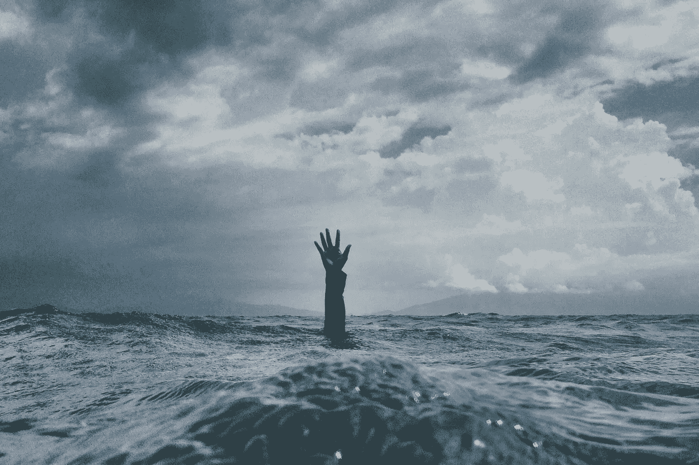
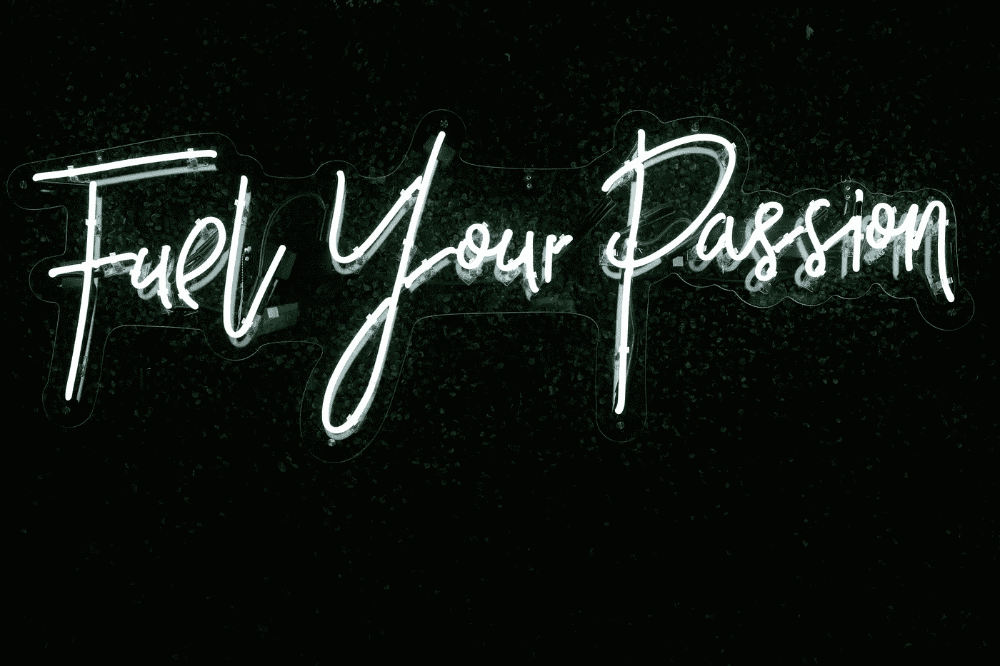
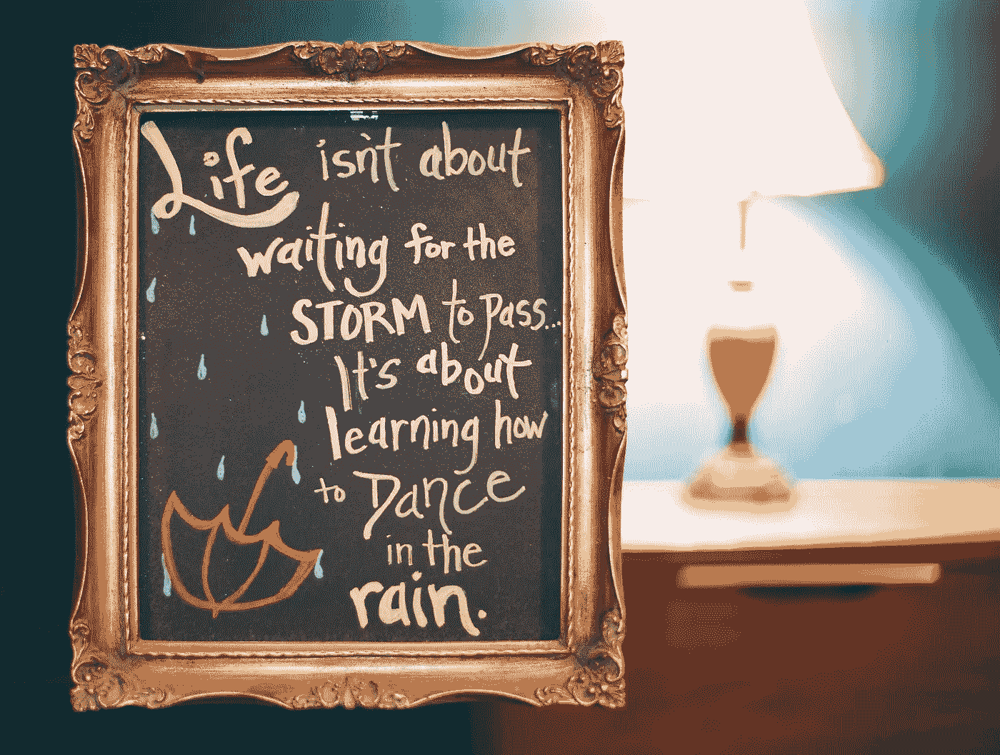

# 停止助长混乱

> 原文：<https://medium.datadriveninvestor.com/stop-feeding-the-chaos-a0c0ea207593?source=collection_archive---------16----------------------->

抓住你的激情，安然度过(二手灵感项目)。

Photo by [nikko macaspac](https://unsplash.com/@nikkotations?utm_source=unsplash&utm_medium=referral&utm_content=creditCopyText) on [Unsplash](https://unsplash.com/s/photos/chaos?utm_source=unsplash&utm_medium=referral&utm_content=creditCopyText)

**二手灵感项目以一句激励性的话开始，并在任何地方冒险**

> “只有在我们最黑暗的时候，我们才可能发现自己内心那道永远不会变暗的光辉的真正力量。”― Doe Zantamata

该死的。过去几周太疯狂了。

曾几何时，我会对疫情感到恐慌。但是现在，我的重点是消除兴奋和焦虑之间的距离。为了那些依赖我的人——家人、朋友和同事，我努力在灾难面前保持平静，即使我很害怕。

人们对我没有对新冠肺炎的这种喧嚣更加不安而大惊小怪。然而，我不是一个容易被打扰的人。另外，对我来说，承受压力只会招致更多的恐惧。纠结于可能发生的事情只会加剧混乱。

 [## 精疲力竭耗尽了简单的答案|数据驱动的投资者

### “大多数卫生专业人员知道如何照顾病人，但不知道如何照顾自己。”医疗保健…

www.datadriveninvestor.com](https://www.datadriveninvestor.com/2019/01/15/burnout-exhausts-easy-answers/) 

相反，我专注于我能做的积极的事情。希望我散发出的平静能给其他人注入平静。

当然，我查阅文章和听新闻。保持消息灵通是我的职责。但我尽最大努力不去理会那些喋喋不休的话题、政治宣传和社交媒体上自以为是的噪音。我不参与基于“也许”和“如果”的扯淡对话。略读之后，我删除了所有关于病毒的虚假见解邮件，尤其是那些来自首席执行官和无所不知的有影响力的人告诉我如何应对的邮件。无论如何，他们对我的了解还不足以给我合理的建议。

我们有两个选择。我们要么投入到狂热中，要么专注于积极主动地对待我们的激情。

Photo by [Randalyn Hill](https://unsplash.com/@randalynhill?utm_source=unsplash&utm_medium=referral&utm_content=creditCopyText) on [Unsplash](https://unsplash.com/s/photos/passions?utm_source=unsplash&utm_medium=referral&utm_content=creditCopyText)

无论是在灾难中还是在正常时期，一个冷静的头脑和冷静的方法会比惊慌失措更有意义。没有人希望陷入无法控制的境地。但是，我们不应该惊慌失措，而是应该停下来，承认我们的担忧，收紧我们的精神缰绳，引导我们的思想朝着有利的方向发展。

我们可以通过专注于帮助我们生存的努力来实现这一点。在不确定的时期，抓住我们最热爱的东西是必要的。

新冠肺炎不在我们的控制之下。但是我们可以控制自己的反应。如果事情变得疯狂，我们可以用我们的激情来控制恐慌。

我喜欢健身。它让我保持专注，并提供了一条应对压力的途径。无论是篮球、网球、跑步、遛狗还是举重，保持身材都是我的大本营。

但是在这个疫情的早期，我的健康养生法被夺走了。我的三对三篮球联赛突然被取消了。然后我的健身房在可预见的未来被关闭了。把病毒妄想症和没有身体活动混在一起，做了一杯我不想咽下去的苦涩鸡尾酒。

但是我适应了。我用车库里的一些旧哑铃精心设计了一套改良的锻炼方法。虽然平淡无奇，但我还是拍掉了地下室跑步机上的灰尘，开始追逐它。像俯卧撑和仰卧起坐这样的经典运动在离合器中出现了。见鬼，我甚至抛弃了我的舒适区，和我的妻子和女儿一起尝试了一些初级瑜伽。

掌控我日常生活的这一方面让我感觉更有控制力，即使我没有。我再也不想为了厕纸和来苏湿巾去骗购物者了。我不再梦想僵尸世界末日和反乌托邦社会。

Photo by [Anthony Garand](https://unsplash.com/@garand?utm_source=unsplash&utm_medium=referral&utm_content=creditCopyText) on [Unsplash](https://unsplash.com/s/photos/writing?utm_source=unsplash&utm_medium=referral&utm_content=creditCopyText)

我的另一个爱好是写作。我每天都有写作练习，让我脚踏实地，集中注意力。上周，当我试图带着一个失学的女儿在陌生的地方工作时，我迷路了。当你把它和我工作的高压期限联系在一起时，我完全忘记了去做自然而然的事情——写作。我是创造性便秘和失调。

但是这个周末，我抛开杂念，开始写作。结果呢？嗯，回到我的创造性日常工作中完成了以下令人敬畏的事情:

减缓了我疯狂的思维过程和行动

安抚我的神经——不完全，但足以产生影响

帮助我们对当前面临的令人困惑的复杂情况有了一点了解

促使我更加关注被忽视的内在自我

让我接受新思想

给了我一丝希望

我不是卖蛇油的。我们的激情并不是所有伤害我们破碎社会的东西的解药。它们不是治愈我们溃烂伤口的灵丹妙药。它们也不会完全让我们忘记发生在我们家外面的剧变。

但是，如果拥抱我们的激情可以提供一些正常的表象，难道不值得一试吗？

有些人告诉我，我没有意识到事情有多重要，因为我没有被激怒。但这不是真的——我完全理解。只是我选择保持稳定。我仍然会尝试写作，进行一些锻炼，不会让焦虑的人把我从游戏中赶走。

我不会允许其他人把他们的焦虑强行灌输给我，也不会让他们夺走我的平静。

如果这意味着我冒犯了一些人，那就这样吧。我很抱歉伤害了他们的感情，但事情就是这样。我希望每个人都保持稳定，无论生病还是健康，这样我们才能为自己、我们所爱的人和更大的利益做出好的选择。

病毒会传染，但是希望也会传染。

坚持住。保持安全和健康。让自己暂时沉浸在激情中，即使只是暂时的。我怎么强调都不为过。你的生存和理智取决于此。

阿德里安·s·波特是一名作家、工程师、顾问和演说家。他写诗歌、短篇小说和各种主题的文章，包括创造力和个人成长。他是诗集[和散文集](https://www.amazon.com/Everything-Wrong-Feels-Adrian-Potter/dp/109519061X/ref=sr_1_4?qid=1560264651&refinements=p_27%3AAdrian+S.+Potter&s=books&sr=1-4&text=Adrian+S.+Potter)[的作者。在](https://e2857002-6118-41be-9746-64261e36cacb.filesusr.com/ugd/21d2c2_03522f10c7c84340a05a8d03a97e1642.pdf)[http://adrianspotter.com/](http://adrianspotter.com/)在线拜访他。

# 附加文字

[你不必惊慌](https://medium.com/datadriveninvestor/you-dont-have-to-panic-f9d3706d4c29?source=friends_link&sk=006cdcc74517a8818ac7d168906f12da)

[沉默永恒的怀疑机器](https://medium.com/datadriveninvestor/silence-the-perpetual-doubt-machine-9e8e75eb1976?source=friends_link&sk=935bd4432b18790366ffded149ba4f34)

[坚持到底](https://medium.com/@adrianpotter/stay-the-course-60889eea5137?source=friends_link&sk=7f3a768abe698889416707ef18569da0)