# 人工智能促进收入增长:使用机器学习减少客户流失

> 原文：<https://medium.datadriveninvestor.com/stop-leaving-money-on-the-table-using-ml-for-revenue-growth-78bfeba4180a?source=collection_archive---------1----------------------->

Photo by [Micheile Henderson](https://unsplash.com/@micheile?utm_source=unsplash&utm_medium=referral&utm_content=creditCopyText) on [Unsplash](https://unsplash.com/images/things/money?utm_source=unsplash&utm_medium=referral&utm_content=creditCopyText)

根据最近的一份报告，85%的公司在他们的业务中采用了某种形式的机器学习。

然而，在同一项调查中，只有 13%的公司报告在创收功能中使用了 ML。

事实上，不到七分之一担任创收角色的高管(如首席收入官(CRO)或销售主管)正在使用 ML，这表明这些高管中有太多的人认为它要么不相关，要么在技术上超出了他们的能力范围。

然而，这两件事都不是真的。

在这个匿名示例中，我们将看到一家没有 ML 专业知识的中端市场工业服务公司如何利用 ML 重启收入增长，并最终将其企业价值增加 30%。

这个例子有助于说明 ML 作为一项重要的技术是如何被创收主管用来加速收入增长和增加企业价值的。

## 公司背景: *ServCo*

*ServCo* 是一家收入 5000 万美元的工业服务公司，总部位于俄亥俄州，为美国中西部的客户提供工业设备维护和维修服务。

ServCo provides industrial equipment services

在被私募股权收购后， *ServCo* 实施了业务合理化流程，以提高效率并转向利润更高的增值服务。

虽然这在改善 EBITDA 方面取得了成功，但顶线增长仍然停滞不前。

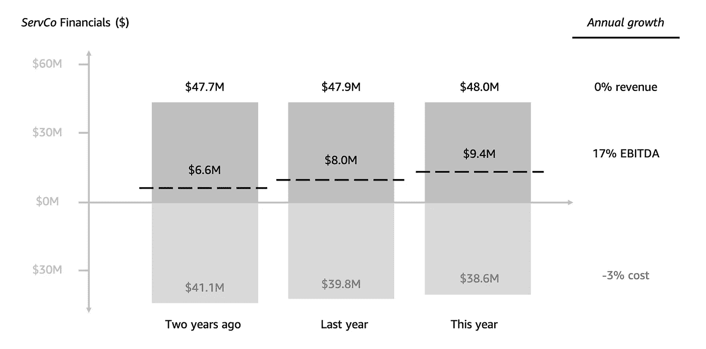

*ServCo revenue remained flat*

由 *ServCo 的* CRO 进行的分析将合同续签或流失确定为增长的主要抑制因素，ServCo 的*1200 个客户账户中约有 15%未能在给定年份续签。*

按照这种速度，仅在第二年，客户流失就导致 ServCo 的客户减少和收入损失约 720 万美元。

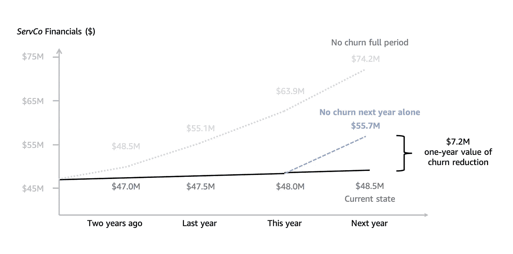

Customer churn costing $7.2M in lower revenue in next year alone

*ServCo* 传统上依靠广泛的策略来减少客户流失，如特别折扣，以及其他参与方法，如定期网络研讨会和自动发送电子邮件。

然而，随着提高性能的压力越来越大，ServCo 转向 ML 来帮助启动收入增长。

## 使用 ML 预测客户流失

预测流失是一个分类问题，ML 非常适合。它通过分析历史数据来学习最能预测客户流失的模式。

ServCo 很快发现他们不需要太多就能开始。他们组建了一个小型的“老虎队”，由初级开发人员芙蕾雅负责，由首席技术官和 CRO 分别作为技术和业务负责人监管。

芙蕾雅的首要任务是找到合适的客户数据来描述过去的客户流失情况。芙蕾雅能够在一个包含这些客户的十个特征(特征)的数据集中汇编大约三年的客户数据，包括他们是否有过搅动(目标变量)。该数据集总共包含~3K 行(“实例”)。不是一个巨大的数据集，但足以开始。

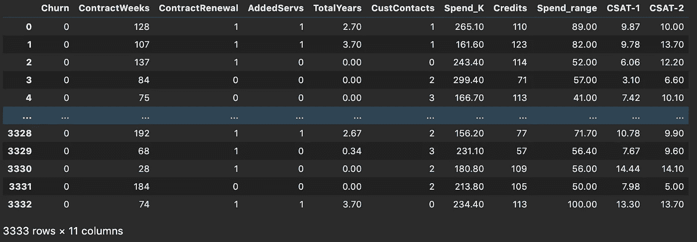

她的下一个任务是使用这些数据来训练一个可以帮助预测客户流失的模型。

像他们行业中的大多数公司一样， *ServCo* 没有内部的 ML 专业知识，所以他们转向了 [*亚马逊 SageMaker*](https://aws.amazon.com/sagemaker/) :一个托管的 ML 平台，使任何开发人员都可以轻松地构建、培训和部署他们自己的 ML 模型，不需要任何数据科学专业知识。

通过一点研究(也就是她谷歌了一下)，芙蕾雅发现 XGBoost 是一个很好的通用算法，可以用于这个分类任务，这也是 SageMaker 内部原生支持的 18 个算法之一。ServCo 将他们的数据上传到 S3 桶中，打开 SageMaker 笔记本，开始在 SageMaker 中定义算法。

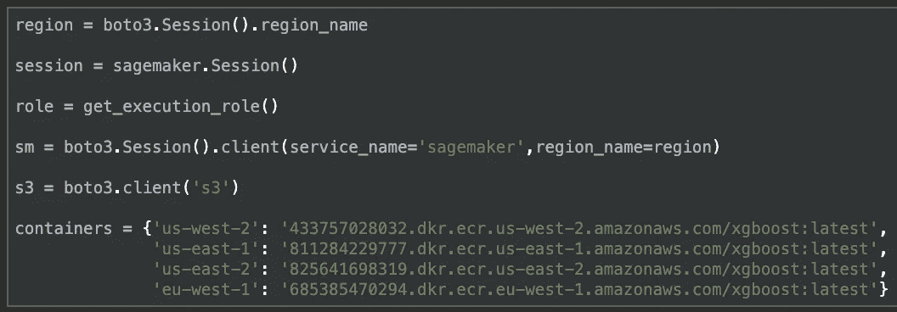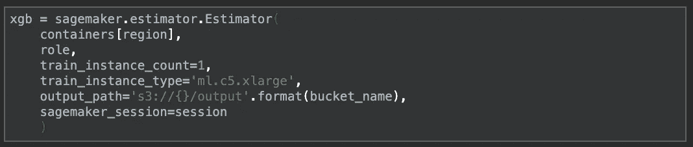

XGBoost is natively supported in SageMaker

将算法转化为模型的过程称为训练，这是 ML 工作负载中最重要也是最令人生畏的部分。这是一个过程，通过该过程，算法运行您的训练数据，以识别解释数据的模式，并最终做出预测。

为了运行这一培训流程， *ServCo* 利用了 SageMaker 的内置超参数优化(HPO)功能，该功能可以自动选择超参数，根据数据集的具体情况找到最佳组合。

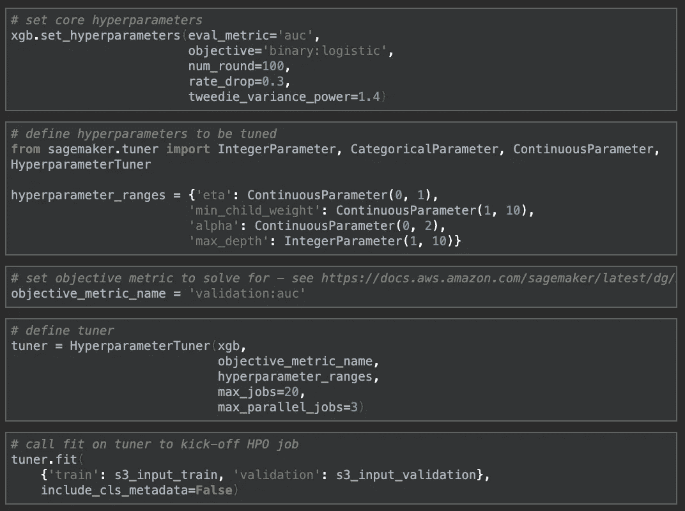

HPO automates the most difficult parts of ML

有了这个定义，剩下的就是调用他们的“调谐器”上的 fit 来开始训练过程，SageMaker 开始比较 20 种不同的变体，以找到他们模型的最佳表现版本。使用一个 C5 EC2 计算实例进行训练，这个过程只需要 20 分钟。

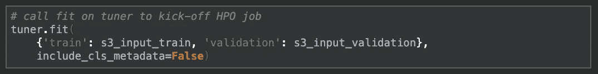

Calling .fit() kicks off the training process

一旦完成，就该看它表现如何了。为此， *ServCo* 使用 SageMaker 的内置部署功能对其最佳性能模型进行预测。这使它能够在为此目的保留的 20%的训练数据集上测试模型的性能。

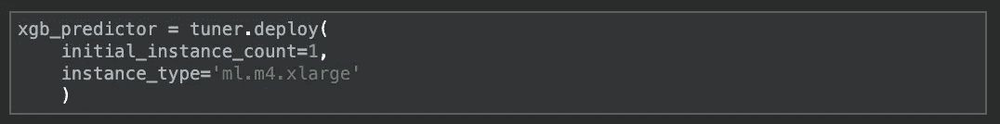

Calling .deploy() creates an endpoint for testing

结果看起来相当不错！该模型能够在 94%的情况下准确识别有交易和无交易账户。

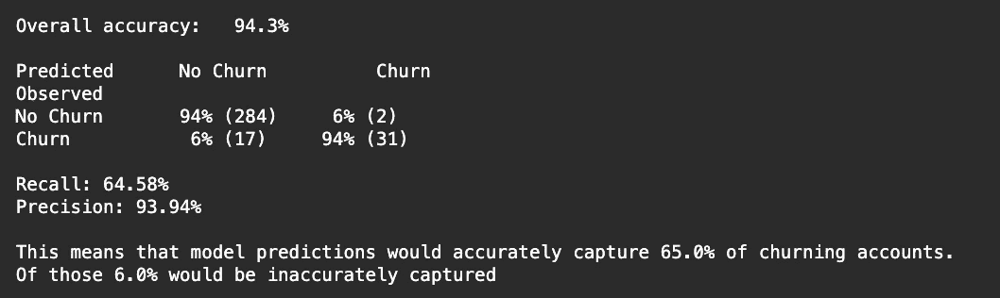

ServCo’s first ML model captured 65% of churn

为了了解该模型的有用程度， *ServCo* 还查看了该模型的“混淆矩阵”——实质上是对误报和漏报的比较。在这些更深层次的指标上，即所谓的召回率和精确度，该模型也表现良好:它的预测准确地捕捉到了所有交易账户的 65%,准确率为 94%。

虽然还有更多的改进可以进一步提高这些指标，但这已经足够开始了。就这样，在仅仅几个小时的开发时间里，在没有专业知识的情况下， *ServCo* 完成了一些以前需要高度专业化团队数周才能完成的事情:他们训练并部署了一个 ML 模型，该模型可以预测大多数客户的流失。

## 应用 ML 增加收入

为了理解这种 ML 模型的价值，首先理解传统流失缓解策略的挑战是很重要的。

要做到这一点，我们可以考虑 *ServCo 的*最近的客户流失缓解活动，在该活动中，他们根据广泛观察到的特征，如支出减少、客户服务联系增加、客户满意度降低，或者仅仅是他们成为客户已有很长时间的事实，来确定客户以获得客户流失缓解关注。

这种细分确定了以下三个可能流失的客户群:1/最近有服务问题的客户，以客户服务联系增长率最高的 15%来衡量；2/那些看起来普遍不满意的人，用最低的 15%客户满意度分数来衡量；以及 3/那些在过去一年中减少了他们使用的服务数量的人，以服务使用量减少最多的 15%来衡量。

考虑到重叠，这相当于他们客户群的 30%,总计 1200 个账户中的 362 个。为了保持这些努力的经济性，总预算被设定为收入的 1%。这意味着他们可以在每个目标客户身上花费 2000 多美元，相当于他们普通客户花费的 5%。

现在，让我们假设 *ServCo 的*细分相当准确，他们能够识别出比随机样本高 50%的交易账户。

此外，我们假设他们的花费(比如信用、折扣或定制关注)在减少客户流失方面非常有效，这种更大的关注(相当于平均客户花费的 5%)能够成功防止 20%的客户流失。

在此基础上，他们的 362 个目标账户将获得 45%的实际流失账户，总共 81 个，他们将能够从中转换 20%，从而导致总共 16 个“挽救”账户，流失减少 1.4 个百分点，从 15%到 13.6%。

这将创建下面的“标准”客户流失缓解活动形状。

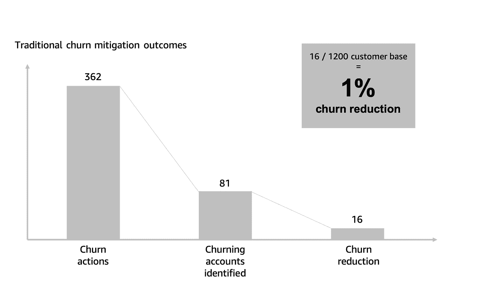

现在让我们将其与使用 ML 的方法进行比较。

为了应用 ML， *ServCo* 只需将其客户数据输入到客户流失模型中，并使用其预测来确定应受到客户流失缓解关注的个人客户。

根据对历史数据进行训练后的 *ServCo 的*模型的性能指标，我们预计它能够以 94%的准确率正确捕获 65%的交易账户。

应用于 ServCo 的全部客户群，这意味着该模型将识别 124 个可能流失的客户。这些客户将获得上述客户流失缓解关注。

虽然 124 个账户远远少于之前确定的 362 个账户 *ServCo* ，但该模型的准确性要高得多(94%)。这意味着，我们可以预计这些账户中有 117 个被正确识别为实际交易账户——比通过传统细分识别的账户多整整 25%*,而只需三分之一的工作量。*

*这种效率在有效性方面得到了回报；这意味着每个账户的支出可以高得多，而总体成本不会更高。事实上，由于这种效率，即使在保持总体预算不变的情况下， *ServCo* 现在也可以在这些目标客户上花费比传统方法多三倍的成本，从而能够为预计会流失的客户提供更有价值、高接触度或量身定制的帮助。*

*有了这种更高的效率， *ServCo* 现在不仅能够识别更多的交易账户，还成功地影响了更高的比例。*

*因此，使用 ML 减少客户流失的方式看起来完全不同，效率和效果都更高，ServCo 正确地识别了更多的客户(117 个)并转化了更多的客户(82 个)，从而使客户流失减少了约 7 个百分点，比传统方法高出约 5 倍。*

*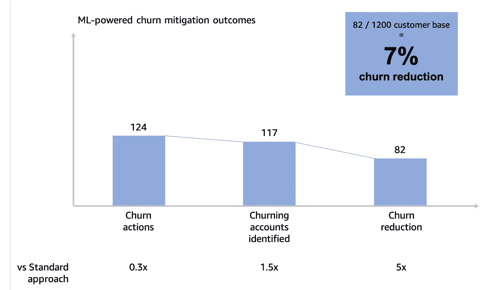*

*ML reduces churn 7ppt; 5x standard approach*

*降低 7 个百分点，ServCo 的流失率减半，从 15%降至 8%。*

*流失率的降低对收入增长产生了重大影响，从本年度增加了 380 万美元的额外收入，比“标准”流失率活动下的收入足足多了 270 万美元。总的来说，这将 0.3%的历史增长率转变为 8%。*

*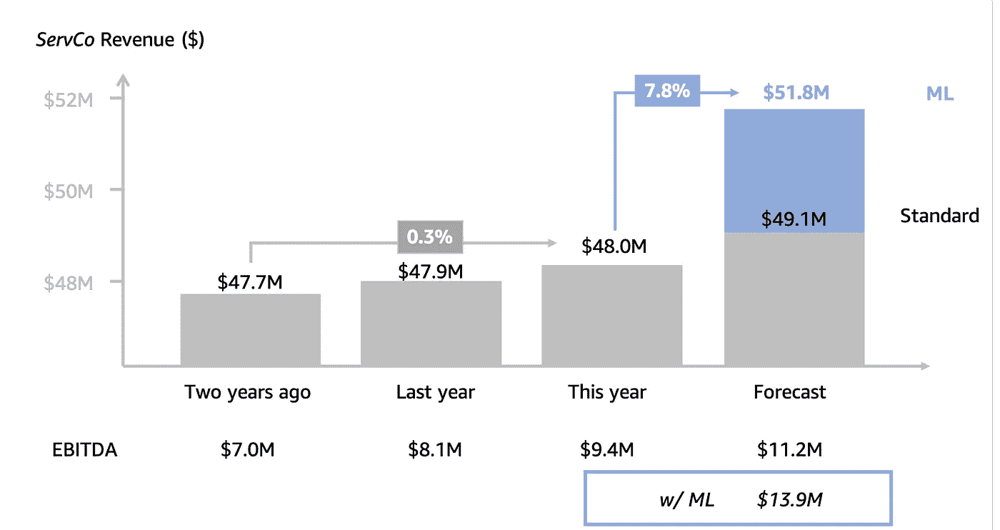*

*ServCo revenue growth jumps to 8%*

*此外，由于这一增长是在与传统方法相同的预算内实现的，这一收入增长转化为有意义的 EBITDA 改善，产生 1390 万美元的 EBITDA，而基线预期为 1060 万美元，标准流失预期为 1120 万美元。*

*这些收入和 EBITDA 的增长对 ServCo 的潜在企业价值有相当大的影响。然而，同样值得注意的是采用 ML 本身的估值优势，在最近的哈佛商业评论[研究](https://hbr.org/2019/06/research-investors-reward-companies-that-talk-up-their-digital-initiatives)中被量化，该研究发现采用先进技术的公司可以期望得到比没有采用的公司平均高 3 %- 9%的估值。这一更高的估值反映在下面的 *ServCo 的*更高的倍数中。*

*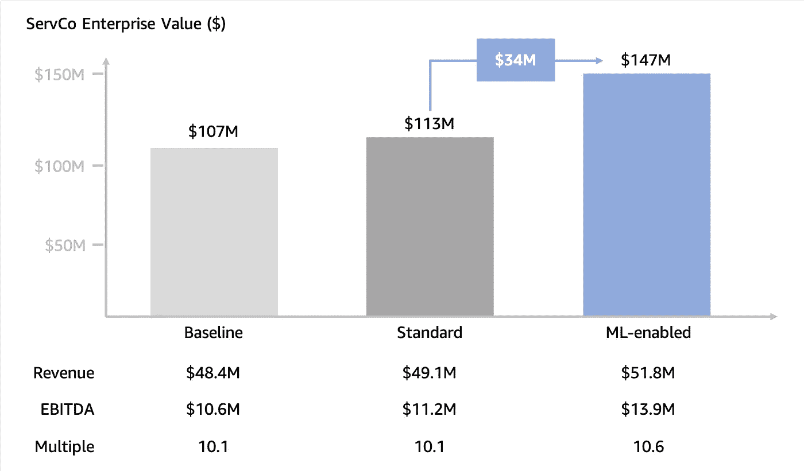*

**ServCo’s enterprise value has jumped by 30%**

*总之，采用 ML 产生的额外 EBITDA 和更高的倍数使 *ServCo 的*潜在企业价值增加到 1.47 亿美元，与标准流失缓解方法相比增加了 30%(从 1.13 亿美元增加到 1.47 亿美元)。*

*此外，它能够更准确、更有效地识别和减少客户流失，这使其收入增长从 0.3%的历史水平跃升至 8%。*

## *结论*

*这是一个简单而有用的例子，说明了首席风险官和其他创收高管如何应用 ML 来提供有意义的价值。*

**ServCo 的*采用 ML 帮助启动了收入增长，并使其企业价值增加了 30%。通过这样做，他们帮助证明了 ML 解决方案可以成为增长的有力杠杆的一种方式。此外，他们的故事表明，无论技术多么先进，几乎任何公司都可以轻易获得 ML。*

*对于那些仍然认为 ML 与他们无关或者遥不可及的 cro 来说，这是一个重要的教训。*

*随着 ML 继续被世界各地像 ServCo 这样的公司迅速采用，cro 和其他继续忽视其潜力的高管们越来越有可能被视为将钱留在桌面上。*