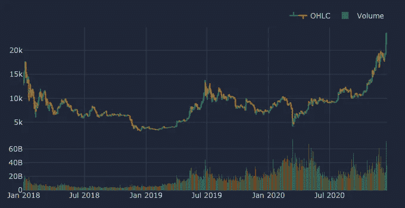
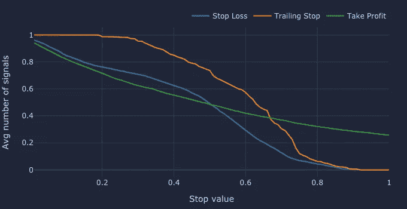
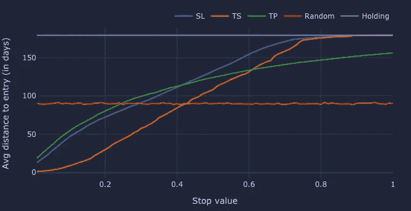
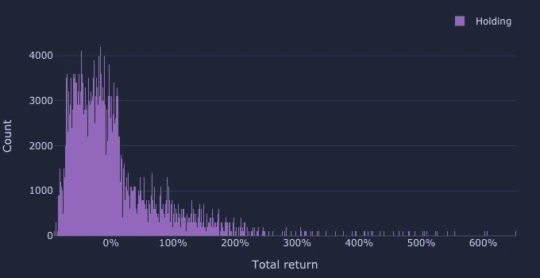
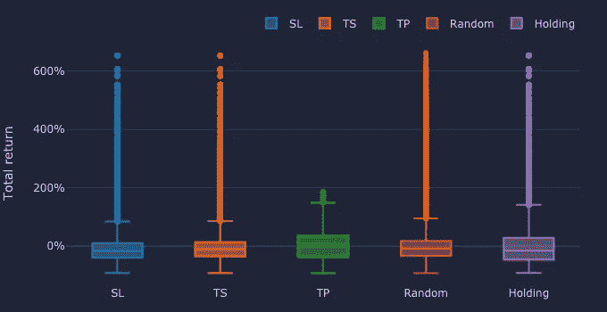
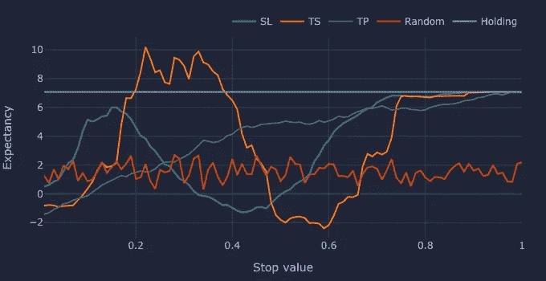
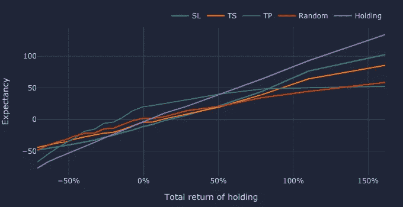
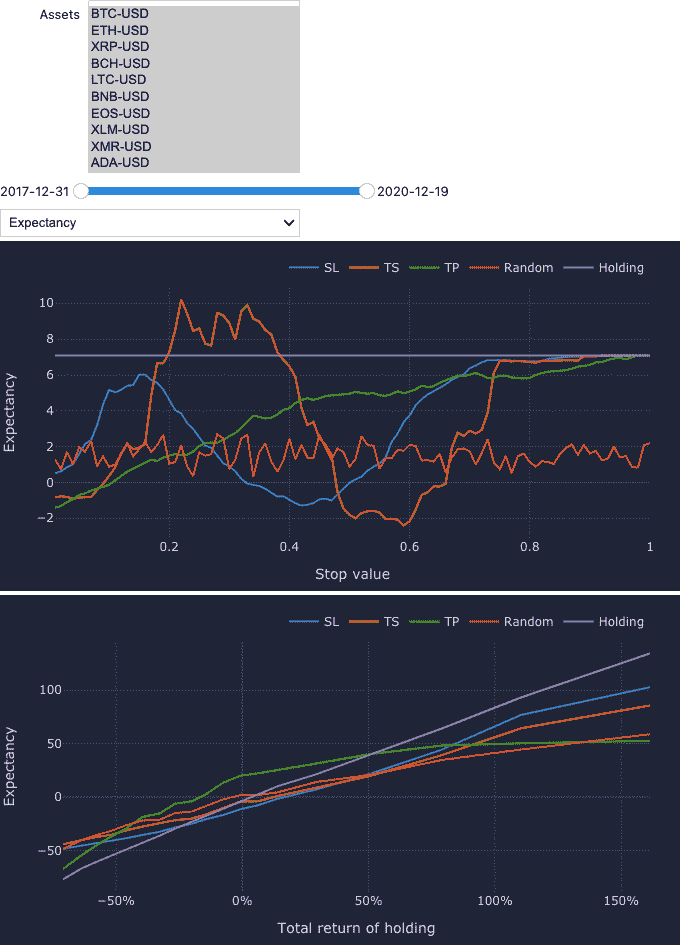

# 止损，跟踪止损，还是止盈？200 万次回溯测试揭示了

> 原文：<https://medium.datadriveninvestor.com/stop-loss-trailing-stop-or-take-profit-2-million-backtests-shed-light-dde23bda40be?source=collection_archive---------0----------------------->

## 5 分钟后进行大规模回测

在本文中，我们将使用 [vectorbt](https://github.com/polakowo/vectorbt) 进行大规模回溯测试，以探索不同加密货币、时间段和停止值的最常见停止信号的性能。


Photo by [FLY:D](https://unsplash.com/@flyd?utm_source=unsplash&utm_medium=referral&utm_content=creditCopyText) on [Unsplash](https://unsplash.com/@flyd?utm_source=unsplash&utm_medium=referral&utm_content=creditCopyText)

> 与所有可能的策略相比，交易策略只是一粒沙子；只有大局才能揭示其质量。

# 方法学

我们的目标是利用大规模回溯测试来比较有和没有止损(SL)、跟踪止损(TS)和止盈(TP)信号的交易表现。为了使这种尝试具有代表性，我们将在三个不同的维度上运行大量的实验:仪器、时间和超参数:

*   首先，我们将按市值挑选 10 种加密货币(USDT 等稳定货币除外)，并获取它们 3 年的每日定价数据。特别是，我们的目标是回测 2018 年至 2021 年的时间段，因为它包含价格大幅下跌(例如，2017 年 12 月 ATH 和 2020 年 3 月冠状病毒的调整)和飙升(2020 年 12 月 ATH)的时期，这使事情保持平衡。
*   对于每种工具，我们将这个时间段分成 400 个更小的(重叠的)时间窗口，每个窗口 6 个月长。我们将在每个窗口上运行我们的测试，以考虑不同的市场体制。
*   对于每个工具和时间窗口，我们将在第一根棒线生成进场信号，并根据止损配置找到出场信号。我们将测试 100 个 1%增量的止损值，并将每个止损值的表现与随机交易和在特定时间窗口内持有的表现进行比较。

总的来说，我们将进行 2，000，000 次回溯测试。

# 设置

我们需要的只是 Python ≥ 3.6 的 [Jupyter 笔记本/实验室](https://jupyter.org/)、 [yfinance](https://github.com/ranaroussi/yfinance) 、 [vectorbt](https://github.com/polakowo/vectorbt) ，以及他们需要的包。我们将使用 yfinance 下载定价数据，使用 vectorbt 在 5 分钟内运行 200 万次回溯测试，并对结果进行可视化分析。

> vectorbt 是 Python 的下一代回溯测试库，它将各种回溯测试和数据科学技术应用于技术分析。它的工作方式是将交易数据——从时间序列到订单记录——表示为 nd 数组，并使用 NumPy 和 [Numba](https://github.com/numba/numba) 处理它们。这反过来又支持一些用例，例如速度惊人的超参数优化，否则这主要是使用分布式和云计算来完成的。另一个优势是集成了 [Plotly](https://github.com/plotly/plotly.py) 和 [ipywidgets](https://github.com/jupyter-widgets/ipywidgets) 以在 Jupyter 笔记本中显示交互式图表和仪表盘。

# 定义参数

第一步是定义分析管道的参数。如上所述，我们将回溯测试 3 年的定价数据、400 个时间窗口、10 种加密货币和 100 个止损值。我们还会将费用和滑点都设置为 0.25%，初始资本设置为 100 美元(金额本身并不重要，但所有资产必须相同才能进行比较)。随意更改任何感兴趣的参数。

```
Start date                       2018-01-01 00:00:00
End date                         2021-01-01 00:00:00
Time period (days)                              1096
Assets                                            10
Window length                      180 days, 0:00:00
Windows                                          400
Exit types                                         5
Stop values                                      100
Tests per asset                               200000
Tests per window                                5000
Tests per exit type                           400000
Tests per stop type and value                   4000
Tests total                                  2000000
dtype: object
```

我们的配置产生的样本量具有足够的统计能力来分析四个变量:资产(每个资产 20 万次测试)、时间(每个时间窗口 5k 次测试)、退出类型(每个退出类型 40 万次测试)和停止值(每个停止类型和值 4k 次测试)。类似于 Tableau 处理维度和度量的方式，我们将能够根据这些变量中的每一个对我们的性能进行分组，但是我们将主要关注 5 种退出类型:SL 退出、ts 退出、TP 退出、随机退出和持有退出(放在最后一个柱上)。

# 下载数据

使用 yfinance 可以直接获得每种加密货币的每日定价数据:

```
dict_keys(['BTC-USD', 'ETH-USD', 'XRP-USD', 'BCH-USD', 'LTC-USD', 'BNB-USD', 'EOS-USD', 'XLM-USD', 'XMR-USD', 'ADA-USD'])
(1083, 5)
```

字典`ohlcv_by_symbol`现在包含加密货币名称的 OHLCV 数据。每个数据帧有 1083 行(天)和 5 列(O、H、L、C 和 V)。您可以按如下方式绘制数据帧:



OHLCV of BTC-USD pair

由于资产是我们想要分析的维度之一，vectorbt 希望我们将它们作为列打包到单个数据帧中，并相应地标记它们。要做到这一点，我们只需交换资产和特性，就可以得到一个由特性名(比如“Open”)作为关键字的数据帧(现在资产是列)字典。

```
dict_keys(['Open', 'Low', 'High', 'Close', 'Volume'])
(1083, 10)
```

# 生成时间窗口

接下来，我们将在整个时间段内移动一个 6 个月的滑动窗口，并在该窗口内对每个价格数据帧拍摄 400 个“快照”。每个快照将对应于应该独立回测的数据子集。与资产和其他变量一样，快照也需要水平堆叠成列。结果，我们将得到 180 行(以天为单位的窗口长度)和 4000 列(10 个资产 x 400 个窗口)；也就是说，一个列将对应于一个特定时间窗口内的一项资产的价格。

```
(180, 4000)
```

vectorbt 的一个很好的特性是，它利用[层次索引](https://pandas.pydata.org/pandas-docs/stable/user_guide/advanced.html)来存储关于每个回溯测试的有价值的信息。它还确保了这种列层次结构在整个回溯测试管道(从信号生成到性能建模)中得以保留，并且可以轻松扩展。目前，我们的列具有以下层次结构:

```
MultiIndex([
    ('BTC-USD', '2017-12-31', '2018-06-28'),
    ('BTC-USD', '2018-01-02', '2018-06-30'),
    ('BTC-USD', '2018-01-05', '2018-07-03'),
    ...
    ('ADA-USD', '2020-06-16', '2020-12-12'),
    ('ADA-USD', '2020-06-19', '2020-12-15'),
    ('ADA-USD', '2020-06-21', '2020-12-17')
], names=[
    'symbol', 
    'range_start', 
    'range_end'
], length=4000)
```

这个多索引捕获三个参数:符号、时间窗口的开始日期和结束日期。稍后，我们将使用退出类型和止损值扩展这个多指数，这样 200 万个回溯测试中的每一个都有自己的价格系列。

# 产生进入信号

与大多数其他回溯测试库相比，信号不是以有符号整数数组的形式存储的，而是被分成两个布尔数组:entries 和 exits，这使得操作更加容易。

在每个时间窗口的开始，让我们产生一个进场信号，指示一个买入订单。数据框将具有与价格框相同的形状、索引和列，以便 vectorbt 可以将它们的元素链接在一起。

```
(180, 4000)
```

# 生成退出信号

对于我们生成的每一个进场信号，我们将根据我们的 5 种出场类型找到一个出场信号:SL，TS，TP，random 和 holding。我们还将把它们的数据帧连接成一个有 180 行和 2，000，000 列的单个(巨大的)数据帧，每个数据帧代表一个单独的回溯测试。因为退出信号是布尔型的，所以它们的内存占用是可以容忍的。

让我们首先根据停止条件生成退出信号。我们想测试 100 个不同的止损值，增量为 1%，从 1%开始，到 100%结束(即找到一个价格超过进场价格 100%的时间戳)。通常，当 OHLC 数据与这些条件核对时，头寸在触及特定止损点时(或之后不久)被平仓，但是我们将简化事情，使用“收盘”价格来退出任何头寸。

```
(180, 400000) (180, 400000) (180, 400000)
```

这也扩展了我们的列层次结构，增加了一个新的列级别来指示止损值，我们只需在所有数据帧中保持一致即可:

```
MultiIndex([
    (0.01, 'BTC-USD', '2017-12-31', '2018-06-28'),
    (0.01, 'BTC-USD', '2018-01-02', '2018-06-30'),
    (0.01, 'BTC-USD', '2018-01-05', '2018-07-03'),
    ...
    ( 1.0, 'ADA-USD', '2020-06-16', '2020-12-12'),
    ( 1.0, 'ADA-USD', '2020-06-19', '2020-12-15'),
    ( 1.0, 'ADA-USD', '2020-06-21', '2020-12-17')
], names=[
    'stop_value', 
    'symbol', 
    'range_start', 
    'range_end'
], length=400000)
```

vectorbt 的一个主要特点是它非常关注数据科学，因此它允许我们将流行的分析工具应用到回溯测试管道的几乎任何部分。例如，让我们探讨退出信号的数量如何取决于止损类型和值:

```
SL    0.434195
TS    0.590803
TP    0.514545
Name: avg_num_signals, dtype: float64
```



Average number of signals by exit type and stop value

我们看到 TS 是目前为止出现最多的退出信号。SL 和 TP 曲线在达到 50%的止损值时结合在一起，然后偏向 TP。虽然看起来似乎是多头在主导，特别是对于更大的价格波动，但请记住，公布 50%的利润比公布 50%的损失要容易得多，因为后者需要 100%的利润才能恢复；因此，向下的负峰值似乎主导了中小范围的价格变动(并有可能动摇弱势群体)。这些都是众所周知的加密货币动态。

为了简化后面的分析，我们应该确保每一列至少有一个出场信号来平仓，这意味着如果一列现在没有出场信号，它应该在最后一个时间戳得到一个。这是通过使用 OR 规则将止损止损点和最后一根止损点结合起来，并选择最先出现的止损点来实现的:

```
SL    1.0
TS    1.0
TP    1.0
Name: avg_num_signals, dtype: float64
```

接下来，我们将生成两种剩余退出类型的信号:随机和持有——它们将作为比较 SL、TS 和 TP 的基准。

“持有”退出信号是放在每个时间序列最后一根棒线上的信号。在大多数情况下，我们不应该费心去设置它们，因为我们可以简单地评估未平仓头寸。我们这样做的原因是一致性——我们希望确保每一列都有(恰好)一个信号。另一个要考虑的是形状和列:它们应该与停止信号相匹配，这样我们可以在以后连接所有的数据帧。

```
(180, 400000)
```

要生成随机退出信号，只需洗牌的任何信号阵列。唯一的要求是每一列应该正好包含一个信号。

```
(180, 400000)
```

最后一步是沿着列轴连接所有数据帧:

```
(180, 2000000)
```

`exits`数组现在包含 2，000，000 列——每个回溯测试一列。列层次结构也是完整的——每个回溯测试有一个超参数元组。

```
MultiIndex([
    (     'SL', 0.01, 'BTC-USD', '2017-12-31', '2018-06-28'),
    (     'SL', 0.01, 'BTC-USD', '2018-01-02', '2018-06-30'),
    (     'SL', 0.01, 'BTC-USD', '2018-01-05', '2018-07-03'),
    ...
    ('Holding',  1.0, 'ADA-USD', '2020-06-16', '2020-12-12'),
    ('Holding',  1.0, 'ADA-USD', '2020-06-19', '2020-12-15'),
    ('Holding',  1.0, 'ADA-USD', '2020-06-21', '2020-12-17')
], names=[
    'exit_type', 
    'stop_value', 
    'symbol', 
    'range_start', 
    'range_end'
], length=2000000)
```

这使我们能够按一个或多个级别对信号进行分组，并方便地一次性进行分析。例如，让我们通过出场信号到进场信号的平均距离(以天为单位)来比较不同的出场类型和止损值:

```
exit_type
Holding    179.000000
Random      89.929929
SL         123.815830
TP         114.185100
TS         103.323425
dtype: float64
```



Average distance of exit signal to entry signal by exit type and stop value

这个散点图让我们更详细地了解出口信号的分布。正如所料，普通持有的退出信号在进场后有 179 天的精确距离(最大可能)，而随机退出信号在时间窗口内均匀分布，不依赖于任何止损值。但我们更感兴趣的是止损曲线，它是平的，因此暗示了我们时间框架内价格运动的高波动性——曲线越低，止损的可能性就越大。举个例子，20%的 TS 平均只需 30 天就能达到，而 SL 需要 72 天，TP 需要 81 天。但是提前退出有什么好处吗？

# 运行模拟

下面是实际的回溯测试部分:

```
3995570
```

相当简单，对吧？

在我的 MacBook Air 上，模拟花了 4 分钟完成，总共生成了 3，995，570 个订单，可以进行分析(应该是 400 万，但一些价格数据点似乎丢失了)。但是，请注意，由与我们的退出信号(如投资组合价值或回报)形状相同的投资组合对象生成的任何数组都需要 8 * 180 * 2000000 字节或几乎 3GB 的 RAM，并且它会被自动缓存以供其他投资组合组件重用。因此，一旦投资组合绩效的计算结束，我们将禁用缓存来释放内存:

我们可以分析从交易到夏普比率的任何东西，但是考虑到数据量，我们将坚持一个快速计算的指标——总回报。

```
(2000000,)
```

如果您的计算机需要大量时间进行模拟，您有几种选择:

*   使用 [Google Colab](https://colab.research.google.com)
*   减少止损值的数量(例如，从 1%减少到 2%)
*   投射到`np.float32`甚至更低(如果支持的话)
*   将出口信号阵列分割成块，并对每个块进行模拟。只要确保每个块的形状与价格和条目的形状一致即可(如果是模拟的，记得删除之前的投资组合):

```
100%|██████████| 5/5 [01:19<00:00, 16.98s/it]
(2000000,)
```

那好多了。

# 分析性能

第一步是始终观察基线的分布:

```
count    400000.000000
mean          0.069392
std           0.814803
min          -0.915331
50%          -0.148971
max           6.526005
Name: Holding, dtype: float64
```



Distribution of holding returns

持有业绩在时间窗口上的分布是高度左偏的。一方面，这表明在我们的时间框架内，长期横盘和熊市。另一方面，任何资产的价格都可以攀升至无穷大，但受到 0 的限制——这使得左边的分布更密集，右边的分布更稀疏。每秒钟的回报是超过 7%的损失，但由于牛市，该策略仍能实现 7%的平均利润。

让我们将其他策略纳入分析:

```
 Mean    Median       Std
exit_type                              
SL         0.035266 -0.168662  0.750711
TS         0.038908 -0.112648  0.685156
TP         0.038539  0.070077  0.477094
Random     0.016484 -0.083610  0.570806
Holding    0.069122 -0.148971  0.814248
```



Distribution of returns by exit type

没有一种策略超过基线的平均回报。TP 策略是最一致的策略——尽管它引入了一个限制巨额利润的上限(见遗漏异常值),它的交易回报波动较小，而且大部分是正的。SL 和 TS 在顶部没有界限的原因是一些止损点没有被触及，所以它们的柱回落到简单持有。随机策略也很有趣:虽然它在平均回报方面较差，但在中值回报和回报波动性方面仅次于 TP。

为了证实上图，我们来计算一下每个策略的胜率:

```
exit_type
SL         0.309275
TS         0.354683
TP         0.569420
Random     0.395713
Holding    0.394750
Name: win_rate, dtype: float64
```

几乎 57%的 TP 交易是盈利的——与其他策略形成鲜明对比。但是，如果你的盈利交易经常比亏损交易少得多，那么高的盈利率并不一定保证长期的交易成功。因此，让我们按止损类型和值合计，并计算[预期](https://www.icmarkets.com/blog/reward-to-risk-win-ratio-and-expectancy/):

```
exit_type
SL         3.657913
TS         4.073352
TP         4.156836
Random     1.715895
Holding    7.100061
dtype: float64
```



Expectancy by exit type and stop value

从长远来看，每种策略都能够逐渐增加我们的账户，持有策略在这里是明显的赢家——在每持有 6 个月之后，我们可以预计每 100 美元投资中平均会增加 7 美元到我们的账户。唯一优于基线的配置是 ts，其 stop 值在 20%到 40%之间。表现最差的配置是 SL 和 TS，止损值分别在 40%和 55%左右；一旦大多数修正找到底部，两者似乎都会被触发，这比随机退出更糟糕。另一方面，TP 策略在 30%的止损值后击败了随机退出策略。一般来说，等待对加密货币来说似乎是有回报的。

最后，让我们看看我们的策略在不同的市场条件下表现如何。我们将考虑一种简化形式的制度分类，将持有回报分为 20 个仓位，并计算每个仓位边界内每个策略的预期(为了图表可读性，我们忽略了最新的仓位)。请注意，由于持有回报的高度偏斜分布，我们需要考虑观察的密度，并使仓位大小相等。



Expectancy against binned holding returns by exit type

上面的图表证实了止损单行为背后的一般直觉:SL 和 TS 限制了交易者在下跌趋势中的损失，TP 对有兴趣从价格快速上涨中获利的短线交易者有利，持有在顶部增长市场中表现最好。令人惊讶的是，虽然随机出场在横盘和牛市中表现不佳，但在熊市中，它们与止损出场相匹配，而且表现更好。

# 额外奖励:Jupyter 仪表盘

仪表板是一种非常强大的数据交互方式。

首先，让我们定义仪表板的组件。我们有两种类型的组件:控件(如资产下拉列表)和图表。控件定义参数并触发图形更新。

第二步是定义更新函数，一旦任何控件发生更改，就会触发该函数。我们还手动调用这个函数，用默认参数初始化图形。

在最后一步中，我们将定义仪表板的布局并最终运行它:



Illustration of the dashboard with every asset selected

# 结论

大规模回测的使用并不局限于超参数优化，但如果利用得当，它为我们提供了探索与交易相关的复杂现象的工具。特别是利用多维数组、动态编译和与 pandas 的集成，如 vectorbt 所做的那样，通过将流行的数据科学工具应用于回溯测试管道的每个组件，我们可以快速获得新的见解。

在这个特殊的例子中，我们进行了 200 万次回溯测试，以观察不同的止损值如何影响止损信号的表现，以及不同的止损信号与随机持有和交易相比有何不同。一方面，这些发现证实了我们已经知道的在各种市场条件下停止信号的行为。另一方面，它们揭示了在过去几年的加密货币交易中可能运行良好的最佳配置。

但是总有比我们上面画的两张图表更多的东西。如果您想对自己的数据进行分析或尝试不同的超参数，请随意运行[笔记本](https://nbviewer.jupyter.org/github/polakowo/vectorbt/blob/master/examples/StopSignals.ipynb)。

# 更多文章

查看 [SuperFast SuperTrend](/superfast-supertrend-6269a3af0c2a) ，在这里您将学习如何使用 TA-Lib、Numba 和 vectorbt (PRO)在 Python 中设计和实现最快的 SuperTrend 指示器。

# 支持

请在 [Github 赞助商](https://github.com/sponsors/polakowo)上支持我，为新的离线交易分析生态系统做出贡献。作为回报，你将可以提前获得[vector Bt pro](https://vectorbt.pro/)——vector Bt 的积极开发的商业继任者，旨在为量化分析师提供专业的分析工具——和新的独家学习内容❤️

在[**Data Science/AI/ML/DL**](https://app.ddichat.com/category/data-science-ai-ml-dl)中安排 DDIChat 会话:

[](https://app.ddichat.com/category/data-science-ai-ml-dl) [## 专家-数据科学/ AI / ML / DL - DDIChat

### DDIChat 允许个人和企业直接与主题专家交流。它使咨询变得快速…

app.ddichat.com](https://app.ddichat.com/category/data-science-ai-ml-dl) 

在这里申请成为 DDIChat 专家。
与 DDI 合作:[https://datadriveninvestor.com/collaborate](https://datadriveninvestor.com/collaborate)
点击此处订阅 DDIntel [。](https://ddintel.datadriveninvestor.com/)