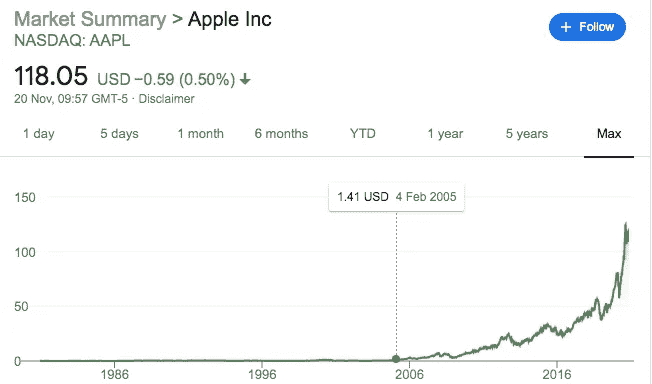

# 停止购买负债，开始投资

> 原文：<https://medium.datadriveninvestor.com/stop-purchasing-liabilities-and-start-investing-6fee888ed2a?source=collection_archive---------3----------------------->

## 如果你不这样做，财务自由将永远遥不可及

Photo by [Markus Spiske](https://unsplash.com/@markusspiske?utm_source=unsplash&utm_medium=referral&utm_content=creditCopyText) on [Unsplash](https://unsplash.com/s/photos/finance?utm_source=unsplash&utm_medium=referral&utm_content=creditCopyText)

每年苹果都会发布一款新产品。无论是新的 iPhone、iMac 还是 iPad，这种产品都会像钟表一样在全球各地上架。每年这种情况发生时，你也会发现许多人在商店外面排队，想要得到这些闪亮的新东西。

现在你可能在想这有什么问题。如果有人想买一部新手机或笔记本电脑，会有问题吗？从表面上看，没什么。他们可以用他们的时间和金钱做他们想做的事情。但你我都知道这笔钱可以用在更好的地方。

花 1000 美元买一部全新的手机是个好主意吗？尤其是 12 个月后什么时候会换成新的？我觉得不是。

除非你的手机在充满电几个小时后仍然玩 snake 或者电池没电，那么你很可能不需要手机，你只是想要一个。这是一个巨大的差异，对于理解消费主义至关重要。

我们不需要我们拥有的大部分产品，我们想要它们。我们看到光滑的广告和这些小玩意拥有的所有全新功能，并想如果我们拥有它们，我们的生活会变得多么美好。

然后有趣的事情发生了。我们购买这些产品，最初几天就爱上了它们。一旦蜜月期结束，我们将它们视为另一件物品，而不是我们认为的科技奇迹。

简单的事实是，你花在最新最棒的设备上的钱可以更好地分配。如果你愿意花 1500 美元买一台新的笔记本电脑，但你不愿意向生产这些笔记本电脑的公司投资同样的金额，那你就错了。

# 翻转脚本

在我们进一步讨论之前，说明负债和资产之间的区别是很重要的。没有这种区分，你为自己创造财务自由的努力就会枯萎。

负债是指前期花费你很多钱，但从长远来看没有什么价值的东西。想象一辆全新的汽车。把车开出展厅要花钱。你已经因为这个简单的行为从汽车的价值中损失了 2000 多美元。

假设你已经跑了 10，000 英里，三年后你的车会贬值 40%。如果这辆车价值 10，000 美元，这可能只相当于 4，000 美元的损失，但你支付的越多，你失去的就越多。这就是为什么不管看起来有多便宜，买一辆新车几乎总是一个坏主意。

 [## 了解偿还债务和拯救环境的绿色投资|数据驱动型投资者

### 走向绿色是一种流行趋势。世界正面临着迫在眉睫的全球变暖的危险以及随之而来的…

www.datadriveninvestor.com](https://www.datadriveninvestor.com/2019/03/18/know-about-green-investments-to-repay-debts-and-save-the-environment/) 

除非是法拉利或劳斯莱斯，否则随着时间的推移，它们几乎肯定会大出血。

相比之下，资产是指在你购买后很久还会升值的东西。房子就是一个完美的例子。我父母在 90 年代初花了大约 35，000 英镑在英国买了我们的房子。近 30 年后，除了一个小的扩建部分，同样的房子现在价值超过 20 万英镑！

这真是物超所值。当然，这种资产是不流动的，但由于他们没有抵押，这代表着一个重大的财务收益。股票、黄金等大宗商品也被认为是资产。

你只需要看看苹果公司自成立以来的股价图，就能知道自 1980 年上市以来，苹果公司的市值增加了多少。

The upwards trajectory of Apple stock.

这是一般人在匆忙购买最新产品时没有考虑到的。尽管花钱买一部全新的手机或笔记本电脑感觉很好，但除非你也把钱投资到资产上，否则你实际上是在浪费钱。

没有一家公司能保证永远存在，但即使是最悲观的投资者也会同意，如果你今天向苹果投资 1000 美元，到 2030 年就会获得可观的利润。相反，如果你把这笔钱投入到一项贬值的资产中，比如一部新的 iPhone，你所做的只是把钱交给公司以获得即时满足，而没有长期回报。

当你的视角以这种方式转变时，你看待金钱的方式将永远改变。

# 你只需要知道

听着，我知道这篇文章可能会给人鼓励节俭的印象，但这不是我的建议。如果你的收入还不错，比如说每月 5000 美元以上，无论如何，如果你想的话，买一部新的 iPhone 吧。如果你同时投资，那么你可以随心所欲地花钱。

我的目标是像我这样的人。直到最近，我都没有投资。虽然我没有在新设备上花很多钱，但我也没有投资我的未来。

这样做的问题是，当你确实买了一部新手机或汽车时，你并不比几年前过得更好。如果你早点开始投资的话，你已经错过了本可以获得的复利。

投资是一场持久战。你必须把满足感推迟到未来。当你几乎看不到投资组合或储蓄账户的任何变动时，这可能会很困难。这就是为什么在没有长期价值的物品上挥霍的诱惑变得太大，我们屈服了。

我们并不擅长理解长期利益能产生多大的影响力。沃伦·巴菲特，这位被称为奥马哈先知的传奇投资者，[在 52 岁后获得了 99.7%的个人财富](https://medium.com/the-10x-entrepreneur/warren-buffett-has-made-99-7-of-his-money-after-the-age-of-52-71e2ce04c347)！复利就是这么厉害。

从这个角度来看，你现在投资的钱将保证你将来的财务自由。鉴于技术变革的速度，你愿意未来有更多的钱，还是愿意最新的 iPhone 在发布五年后不再得到苹果的支持？

你不需要仔细考虑。从今天开始投资，停止购买负债。

**进入专家视角—** [**订阅 DDI 英特尔**](https://datadriveninvestor.com/ddi-intel)