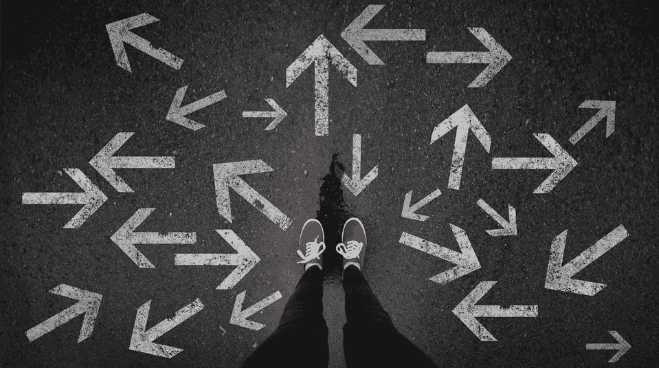

# 停止沉思，采取行动消除不确定性

> 原文：<https://medium.datadriveninvestor.com/stop-ruminating-and-take-certain-action-to-eliminate-uncertainty-bf9c1d8f756f?source=collection_archive---------19----------------------->

*思考不确定性不会让任何事情变得确定*

Forbes

## 什么是不确定性？

这是…

*   **未知的**
*   某事缺乏**可预测性/准确性**
*   这是一种**不可预测**，不精确**决定**，**可变**的情况/状况

我们想要确定性，因为它让我们感到安全和可控。

不知道你的生活将走向何方是最可怕的事情之一，尤其是现在！

## 我们想要确定性在哪里？

1.  关系
2.  健康
3.  资产
4.  职位

这些大概是**最突出的**了。

对我们大多数人来说，其中一个领域的不确定性会转化为不眠之夜。

不确定性也意味着**未回答的问题**不断困扰着你的大脑。在上述 4 个类别中，问题可能是这样的:

1.  我们只是约会还是情侣？她(他)像我一样爱我吗？
2.  我会恢复健康吗？
3.  我会收支平衡吗？我财务稳定吗？
4.  我会签合同吗？我的生意会成功吗？

我们几小时、几天、几个月、有时几年都在反复思考和过度思考他们。但是沉思或过度思考到底改变了什么呢？它丝毫没有改变。

# 思考不确定性不会让任何事情确定！

可以肯定的是，你**觉得**自己**傻**。

## 但是，是什么让不确定性变得确定呢？

**行动！执行！**没别的。

1.  问对方你是在约会还是认真的。无论哪种回应即将到来，至少，你会**知道你的立场**。我们自己创造了不确定性。我们没有问，因为我们害怕被拒绝，我们害怕不被选择，不被像我们一样被爱。为了获得确定性，我们必须有足够的勇气面对任何答案。正面还是负面！
2.  为你的健康创造确定性始于**健康饮食，积极锻炼，**和**练习** **感激**你所拥有的！**教育自己**健康的生活方式**是什么样子的**(身体上和精神上)。我痴迷于这样一种观点:你吃的是你的药，你认为你会成为什么样的人。在这里，不仅你的物质饮食至关重要，你的精神饮食(你看什么，你在社交媒体上关注谁，你读什么)对健康生活也至关重要。
3.  省下比你花费更多的钱！经验法则是你收入的 10%。明智地花钱，注意你的开销。你需要它还是冲动购买？巴菲特说:“不要买你不需要的东西，否则你将不得不卖掉你需要的东西”。此外，我从**极简主义者** : *如果我想买更大的东西，我会把它写在清单上，看看几周/几个月后我是否还想要/需要它。如果我说‘是’，我就买。*
4.  尽你所能做好你的工作，但是如果你不确定你的朝九晚五的工作或者签署一份长期合同，通过兼职工作来获得你的**确定性。不要只依赖那一份工作！沃伦·巴菲特说得太明智了: ***“不要把所有的鸡蛋放在一个篮子里！”*** 那么一份**激情**可以变成一份**事业**呢？一开始可能不会盈利，但听起来确实像是一个确定的计划，对吗？！**

## 最终想法:

对不确定的情况/条件采取行动让你感觉在控制之中；否则，这是一个可怕的、不确定的、糟糕的、令人沮丧的结果的恶性循环。

# 停止沉思，采取一定的行动来消除不确定性！

感谢阅读:-)

哈蒂斯。