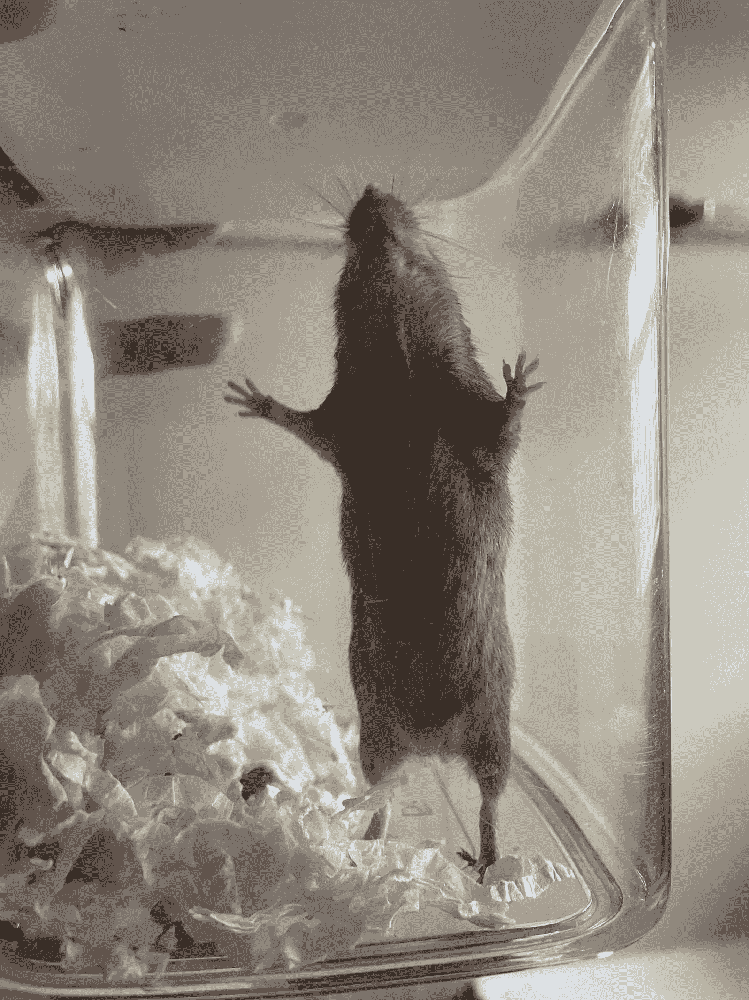
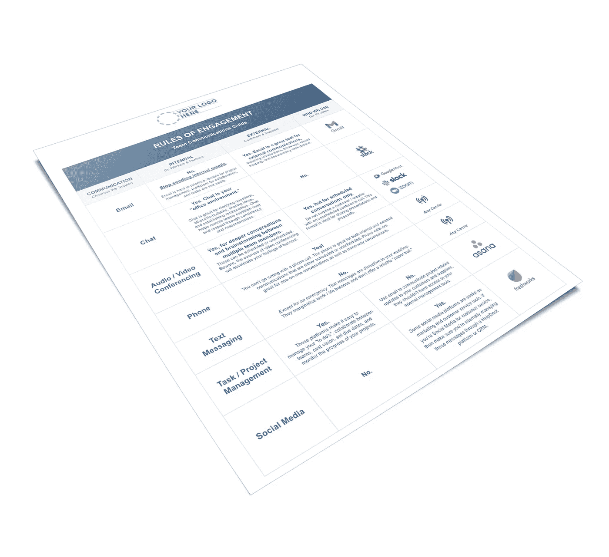

# 停止发送内部邮件

> 原文：<https://medium.datadriveninvestor.com/stop-sending-internal-emails-6cfccd1845b9?source=collection_archive---------5----------------------->

## 和远程团队的其他参与规则

多亏了新冠肺炎，大多数企业现在都面临着远程工作的挑战。作为一家已经完全远离尘嚣十多年的公司的创始人，我对这些挑战有着丰富的经验。在我看来，最有可能成就或打破你公司文化的问题是沟通。不管你喜不喜欢，学会在分布式环境中与你的同事和经理进行有效沟通，在你发展的文化中起着巨大的作用。

> “不管你喜不喜欢，学会在分布式环境中与同事和经理有效沟通，在你发展的文化中发挥着巨大的作用。”

你的团队由独特、复杂的个体组成，他们都有不同的沟通风格和偏好。如果你不给你的团队配备明确定义的参与规则，这些差异会导致一些非常不健康的习惯。

*说真的，仅仅因为你每周 7 天每天 24 小时都在脸书，并不意味着我会在 Messenger 应用程序中回答你的问题。虽然第一次很有趣，但请不要再提交你们在抖音的表现报告了，即使是在那种节奏下。*

当我们在 2006 年与一个完全远程的团队一起启动 Abenity.com****时，**我没有想到每个新员工会给我们的工作流程和内部沟通带来的复杂性。我们还没有发现沟通计划会给我们完全分散的团队带来的价值。**

> **“我不知道每个新员工会给我们的工作流程和内部沟通带来怎样的复杂性。”**

**事实上，在第 6 或第 7 名员工之前，我们的“一切皆有可能”方法运行得非常好；人们以他们最喜欢的方式交流，我们没有遇到很多问题。**

**但是随着我们远程工作人员的增加，我们意识到我们的沟通计划(或缺乏沟通计划)带来了问题。很快，我们围绕一个共同的使命构建远程工作团队的梦想就在我们眼前开始破灭。因此，我们开始在经常干扰我们工作的场景中寻找模式。**

**没过多久，我们就发现了造成沟通障碍的四个主要原因:**

1.  **我们的团队成员对彼此的响应时间有*不同的期望*,由于不可能在办公桌前互相拜访以获得反馈，当某人的可用性或缺乏可用性影响了他们推进工作的能力时，我们的员工通常会感到沮丧。**
2.  **我们的团队成员有*不同的沟通偏好*。一个人喜欢打电话，另一个人喜欢电子邮件、聊天工具或短信。**
3.  ***通过电子邮件、短信或聊天委托任务时，任务和截止日期总是被错过*。**
4.  ***当澄清或时间敏感的对话以文本格式*(即:电子邮件、聊天、短信)* *进行，语调和意图难以理解*时，团队成员之间的紧张关系会例行公事地上升*。**

**例如……看看这个句子的意思是如何通过改变你强调的地方而改变的:**

****我**没说他抢银行。
我**没**说他抢银行。我没有说他抢了银行。
我没说**他**抢银行。
我没说他抢了银行。我没说他抢了银行。我没说他抢了银行。**

**我没说他抢了银行。**

**另外，除非你想打架，否则不要全大写。**

**理解这些场景使我们开发了一套统一的沟通标准，我们内部称之为“交往规则”十多年来，这些规则一直支配着我们的日常沟通节奏，在我们保持健康的远程团队文化的同时，它们在我们驾驭指数级增长的能力中继续发挥着关键作用。**

# **远程团队的参与规则**

**随着我们团队的成长，我们继续分析我们的合作方式，经过多年的流程改进，我很高兴地分享以下计划，该计划继续满足我们完全远程团队的需求，尽管他们之间存在物理距离:**

****#1:邮件**——*无内部邮件。*这一开始听起来可能很疯狂，但是相信我，在没有电子邮件 的内部协作 ***十年之后，我可以保证你永远不会后悔*停止发送内部邮件的决定。******

****

**Gmail’s elusive Inbox Zero graphic.**

**电子邮件不是委派任务、合作项目或询问澄清问题的好工具。而且，删掉那些讨厌的内部邮件，你会发现自己离难以捉摸的零收件箱更近了。**

**然而，电子邮件是一种优秀的外部沟通工具，通常比后续电话更有效。电子邮件也是记录和记录期望的好方法。**

****#2:聊天** —聊天有趣、快捷、实用。**

**从本质上来说，聊天是你曾经拥有的“办公环境”，但现在不要了。**

> **"从本质上说，聊天是你曾经拥有的办公环境，但现在不要了."**

**像 [Slack](http://www.slack.com/) 这样的聊天平台已经有效地取代了“水冷却器”，让团队保持联系、建立信任、分享想法、犯傻和实时获得反馈变得极其容易。**

**聊天可以让您发送私人的点对点消息(如文本消息)，或同时与团队中的多人协作。你也可以用 APB(全点公告)一次通知团队中的每个人。我们专门使用聊天进行*内部*跟进、澄清问题、团队更新、公告和提醒。我们也用聊天来庆祝我们的胜利，汇报偶尔的失败。**

**聊天还有助于我们真正地互动，并建立有意义的人际关系。**

**我们建立了一些定制渠道，为我们的团队建立一个健康的社区。我们还为我们的团队配备了以下渠道，以帮助他们彼此建立更有意义的关系:**

*****核心价值观频道*** —我们的团队成员定期(几乎每天)在该频道中相互认可，以实践我们的 R-GIST 核心价值观之一。**

*****所有团队渠道*** —我们使用该渠道发布影响每个人的公告和提醒，如新客户和新团队成员介绍、调查请求等。**

*****今日事件*** —我们把这个频道和 Google Calendar 连接起来，自动宣布生日、工作纪念日、外出通知、观察到的假期。**

*****赞助儿童*** —在 [Abenity](https://abenity.com/?utm_source=brianroland.com&utm_medium=link&utm_campaign=rulesofengagement) ，我们赞助塞内加尔儿童，作为[我们社会使命](https://www.brianroland.com/single-post/are-you-secretly-running-a-social-enterprise)的一部分。每周五，我们都会在这个频道中推出一个我们赞助的孩子，让我们的使命始终在脑海中浮现，并贴近我们的内心。**

*****随机频道*** —一切皆有可能！可怕的笑话星期二，祈祷请求，大量的猫，爱好分享，孩子的照片，你的名字！**

****

***Just for fun, I grabbed the latest image from our random channel. This mouse’s name is Mouse. She was rescued 3 weeks ago by our V.P. of Client Sales and she’s ready to return to the wild.***

**重要的是要注意，聊天是**而不是**一个请求反馈的好地方*(使用调查工具代替)*，委派新任务*(使用项目管理工具)*，充实伟大的想法*(主持视频电话)*，或者完成任何会受到信息丢失、被埋没或被忽略不利影响的事情，这是聊天的常见问题。**

****#3:音频/视频会议** —在内部，我们使用 [Google Meet](https://meet.google.com/) 进行预定的团队会议和协作，这需要多个团队成员的参与、更深入的对话、头脑风暴和故障排除。在展示比讲述更容易的情况下，这些面对面的合作通过屏幕共享功能得到了增强。我们喜欢使用 [Zoom](http://www.zoom.com/) 与客户、潜在客户和供应商进行外部沟通。**

**重要的是要认识到过度使用视频进行交流会加速你的疲惫感。根据最近的一篇 BBC 新闻文章，进行视频通话比面对面聊天或打电话需要更多的能量，因为我们的大脑必须处理我们的大脑在没有身体的情况下与他人在一起时所经历的不和谐。**

****#4:电话** —我们不像过去那样频繁地使用电话，但有时电话对团队来说是最健康的选择。一个简短的电话仍然是解决澄清问题的最简单的方法，这些问题对于聊天来说太复杂了，但又没有复杂到需要团队音频/视频会议。电话给你的身体和大脑提供了一个很好的机会去伸展身体，四处活动，并体验风景的变化。**

****#5:发短信**——我们不会在内部互相发短信，除非是紧急情况，需要不在办公室的人帮忙。我们不建议向外发短信给供应商或客户，因为他们会很快将工作/生活平衡边缘化，并且不能提供可靠的“书面记录”**

****#6:任务/项目管理** —我们使用 [Asana](http://www.asana.com/) 在内部委派任务。这使我们能够沟通优先事项、制定愿景、设定截止日期、监控进度，并在各种项目中跨多个团队进行协作。**

****#7:社交媒体** —我们高度鼓励我们的团队在工作之外相互联系，但社交媒体作为一种沟通工具在我们的日常业务节奏中没有一席之地。**

**最后，不要忘记任何交流方式的黄金法则——**永远称呼对方的名字，**即使是一对一的交流。如果你在一群人面前演讲，那么选择一个人开始演讲。这个简单的步骤确保了清晰性，并保持事情的进展。**

> ***“不要忘记任何交流方式的黄金法则——即使在一对一的交流中，也要称呼对方的名字***。**********

****今天， [Abenity](https://abenity.com/?utm_source=brianroland.com&utm_medium=link&utm_campaign=rulesofengagement) 的团队有 30 多人，分布在 10 个州和 4 个时区。如果我们没有在早期建立这些参与规则，那么我们就不会取得指数级的增长，不会作为一个[目的驱动的团队](https://www.brianroland.com/single-post/the-unexpected-perks-of-a-social-business)建立起强烈的社区意识，也不会获得支持我们今天如此自豪地服务的财富 500 强公司和小企业的权利。****

********

****Create your own Rules of Engagement with this free template at BrianRoland.com****

****我已经创建了一个[免费远程沟通指南](https://www.brianroland.com/downloads)来帮助你快速为你的远程团队设计你自己的参与规则。这份单页模板与我们在 Abenity 员工手册和入职流程中使用的格式相同。****

******说吧！******

****请给我留下一两条评论。****

****>如果不发送内部邮件，你的公司还能运转吗？这个想法会引起焦虑吗？****

****>谈到团队沟通，你创造了哪些独特的“参与规则”让我们都可以借鉴？****

*******寻找下一步？*** [***加入我的社区***](https://www.brianroland.com/downloads) ***目的驱动的领导者为你的团队获取免费资源。*******