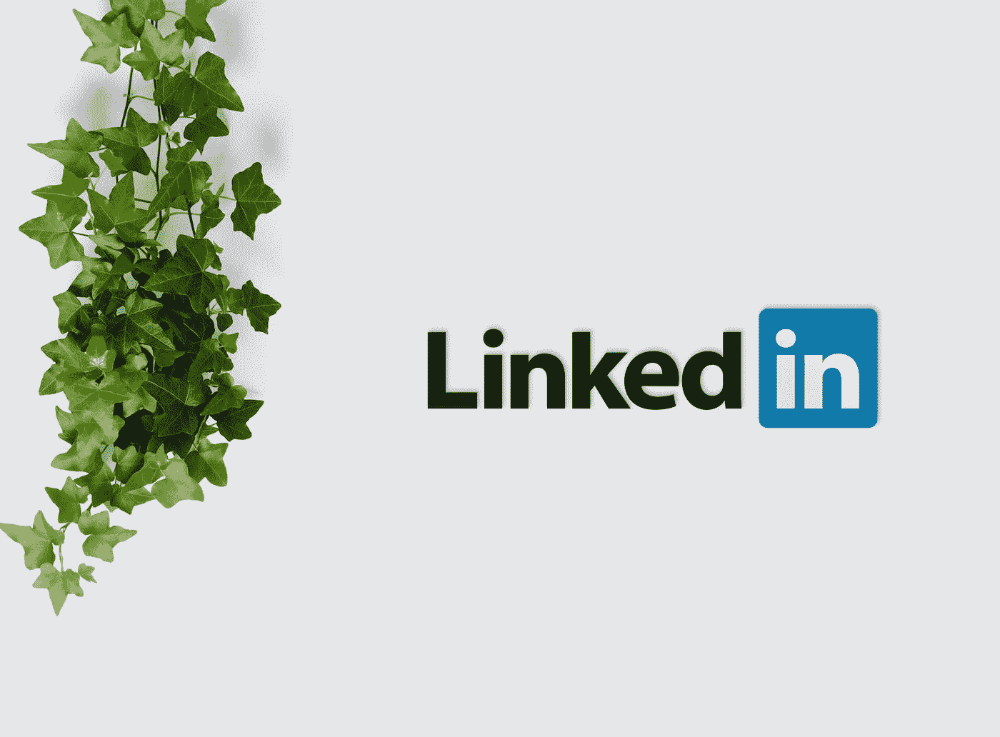

# 停止在 Linkedin 上发送那些“谢谢你联系我”的信息

> 原文：<https://medium.datadriveninvestor.com/stop-sending-those-thank-you-for-connecting-with-me-messages-on-linkedin-58516132423a?source=collection_archive---------0----------------------->

## 至少没有后续行动

Photo by [inlytics • LinkedIn Analytics Tool](https://unsplash.com/@inlytics?utm_source=medium&utm_medium=referral) on [Unsplash](https://unsplash.com?utm_source=medium&utm_medium=referral)

Linkedin 是一个和你所在领域的人联系的很好的平台。我们都在这里建立网络，创造有意义的关系，Linkedin 为我们提供了一个帮助与其他专业人士联系的平台。

在使用 Linkedin 平台不到一年的时间里，我从该平台获得了无数机会；这只是表明，如果你打对了牌，你能取得多大的成就。

 [## 抓住智能营销，获得巨大成果|数据驱动的投资者

### 网上的人都看过。每当人们在谷歌上搜索某样东西，他们最终都会与类似的广告互动…

www.datadriveninvestor.com](https://www.datadriveninvestor.com/2020/08/19/grab-on-to-intelligent-marketing-for-great-results/) 

发送冷推销是必不可少的，这让许多人尝试不同的策略来接触他们的目标客户，以回应他们并充分购买他们的服务。

我不知道很多正确的方法，但我知道一种错误的方法，它永远不会带来想要的结果。错误的方式是发送令人讨厌的信息:“谢谢你与我联系”我知道你试图不太主动，并试图保持冷静，但有时，你必须清楚你想要什么，因为不是每个人都有时间，你可能会被视为令人讨厌。

当你收到信息通知和电子邮件，然后你打开应用程序，看到有人感谢你与他/她联系，你会有什么感觉？那不会让你生气吗？

是的，做一个感恩的人很好，但有时候最好还是开门见山，有什么说什么。您可以在“感谢您接受”消息后附上您需要的内容。为什么我不接受感谢你的联系和使用跟进的想法，因为很多时候，在他们看到“谢谢”信息后，他们可以跳过信息，看别的东西。因为每个人都看了超过一百万次的感谢信息。

然后，当没有人回复你冷漠的求助时，你会感到沮丧

我在 Linkedin 上的冷接触策略很简单。一旦他们接受了，我会暂时关注他们的内容。这个过程是将它们从冷变暖，并使它们变松。让他们把你视为他们观众的一部分。有时，他们甚至会检查你的个人资料，从那里，你进入他们的雷达。

这将使你在推销服务时更容易陈述你的提议。

有时，人们会跟进一大堆信息。还是那句话，人家没时间。如果你不能使你的推销简短，你将失去一半的观众。

这就是我提到的三件事:

1.  不要在意“感谢您的连接”信息。
2.  让你的目标满意，让你冰冷的手臂变得温暖。
3.  不要发长篇大论。

最后一件事是总是在你的页面上创建内容。在客户考虑让你担任某个角色之前，他们必须确信你有一些经验——基本上是告诉他们你知道自己在做什么。因为当你进入他们的雷达，他们会检查你的个人资料。如果是空的，那被录用的机会就小了。

所以，你必须做好你那方面的工作。

感谢您的阅读

**进入专家视角—** [**订阅 DDI 英特尔**](https://datadriveninvestor.com/ddi-intel)