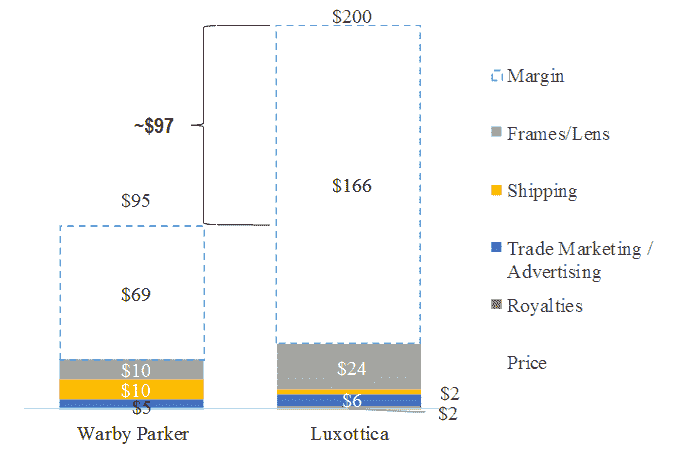

# 不要试图模仿网飞

> 原文：<https://medium.datadriveninvestor.com/stop-trying-to-copy-netflix-44d957d9b867?source=collection_archive---------17----------------------->

## 企业家如何打造独特的永久顾客？

Photo by [Cytonn Photography](https://unsplash.com/@cytonn_photography) on [Unsplash](https://unsplash.com/photos/vWchRczcQwM)

毕加索有一句话——“好的艺术家临摹；伟大的艺术家会偷窃——而我们总是无耻地偷窃伟大的想法。”— [史蒂夫·乔布斯，1996 年](https://www.cnet.com/news/what-steve-jobs-really-meant-when-he-said-good-artists-copy-great-artists-steal/)

当他说这句话时，苹果图标实际上是什么意思？

关键词是*想法*——不是复制同样的*精确的*公式。

传统智慧正在回归赞美订阅模式。*网飞这个，美元刮脸俱乐部那个*。有很多品牌已经成功了。

然而，如果你希望打造“下一个网飞”，盲目地一头扎进订阅模式，你的决定将注定失败。很简单，仅仅因为它适用于网飞并不意味着它也适用于你的企业。

那么你应该怎么做才能*窃取*他们的伟大创意呢？

[罗比·K·巴克斯特](https://medium.com/u/136c0907fbb7?source=post_page-----44d957d9b867--------------------------------)知道答案。

《永远的交易》(The Forever Transaction)一书的作者巴克斯特认为，没有永远的客户，你就无法建立订阅业务。永远的顾客是那些永远留在你的品牌保护伞下的人。

以下是她的书和[后续文章](https://marker.medium.com/what-subscription-businesses-know-about-keeping-customers-through-a-crisis-9e7a5b68ab0b)中的一些步骤，告诉你需要建立永远的客户群。

# 专注于你的“永远的承诺”

我从未想过取消我的 Spotify 订阅。也不是我的网飞订阅。也不是我的脸书账户。

原因是这样的:我依赖于他们对我的承诺。

作为一名远程工作者，我真的无法想象无法访问我想要的任何音乐，尤其是没有广告的音乐。(这就是为什么 Medium rocks，不过我跑题了。)这是我度过一天的动力，就像跳蚤的低音线一样。

即使是像脸书这样几次质疑我的道德指南针的企业，也能留住我，因为他们永远的承诺:我可以随时和世界上的任何人联系。我曾多次考虑删除我的脸书账户，但可惜我没有，因为我的业务需要它。在 [*重复片段*](https://medium.com/the-riff) ，我们定期使用脸书预约[采访](https://medium.com/the-riff/the-band-who-killed-f165df5ed502?source=---------19------------------)。

 [## 数据驱动始于数据素养|数据驱动的投资者

### 光是听到“数据”这个词就令人生畏。老实说，只有 21%的全球员工对自己的工作充满信心

www.datadriveninvestor.com](https://www.datadriveninvestor.com/2020/03/22/data-driven-starts-with-data-literacy/) 

还有我那些来自各地的朋友呢，比如出国留学的？不值得因为我在新闻上看到的而失去那些友谊！

你也需要像扎克伯格那样思考。你的企业永远的承诺是什么？也许你已经有一个了。

让我们来谈谈另一个很酷的行业:[沃比·帕克](https://medium.com/better-marketing/sell-your-brand-then-your-product-cc64d12b71b8?source=---------2------------------)。

这家纽约初创公司设法以仅 95 美元的价格销售处方眼镜——任何人戴起来都好看。他们永远的承诺是，任何视力不好的人，可能包括你，都能以比昂贵的竞争对手更低的价格买到时尚的处方眼镜。

[UCLA Anderson Global Supply Chain Blog, 2017](https://blogs.anderson.ucla.edu/global-supply-chain/2017/08/warby-parker-vs-luxottica-supply-chain-disintermediation-in-the-eyewear-industry.html)

# [**“无论在什么地方做出决策，都要让客户感受到你的存在。**](https://marker.medium.com/what-subscription-businesses-know-about-keeping-customers-through-a-crisis-9e7a5b68ab0b)

本周，我们正在为我们的测试产品做用户体验访谈。我们的一位受访者，迈克尔，特别热衷于做这个会议。

我问他是什么让他如此兴奋，他的回答永远改变了我对我们业务的看法:因为他觉得他可以对产品产生影响。

事实是这样的:迈克尔那天感觉很特别，因为他知道他的意见会导致我们做出最重大的决定。

还记得震撼 2015 年和 2016 年的音乐剧《汉密尔顿》吗？对，就是那个。其中一首歌叫做*故事发生的房间*。

亚历山大·汉密尔顿(Alexander Hamilton)的精神对手和剧中的对手亚伦·伯尔(Aaron Burr)已经建立了自己的律师职业生涯，并最终竞选公职，就在发生这种事情的房间里。以下是一些表达他的情绪的歌词:

> “你想要什么，伯尔
> ”你想要什么，伯尔
> 
> “如果你什么都不代表
> ”伯尔，那你会爱上什么
> 
> “我
> 想在
> 发生的房间
> 发生的房间
> 我
> 想在
> 发生的房间
> 发生的房间】[来源](https://www.lyricfind.com/)

不是每个人都是广受好评的百老汇演员，但是每个人都想感觉自己很重要。这样做是人之常情。坦率地说，任何让我们觉得自己不重要的事情都是非人性化的。

所以你应该这样看待服务你的顾客。没有人想和一个根本不在乎的企业打交道。

Robbie 的书的更宏观的观点是，如果你的品牌不是永远以顾客为中心，你就不能指望拥有永远的顾客。

我们经常听到让商业听起来像战争的术语。 [*竞争*，销售*力*，*猎头*。真相是这样的:客户不是棋子，他们是人。希望这样的语言已经成为过去。](https://www.amazon.com/Zero-One-Notes-Startups-Future/dp/0804139296)

辞旧迎新。新的很有个性。