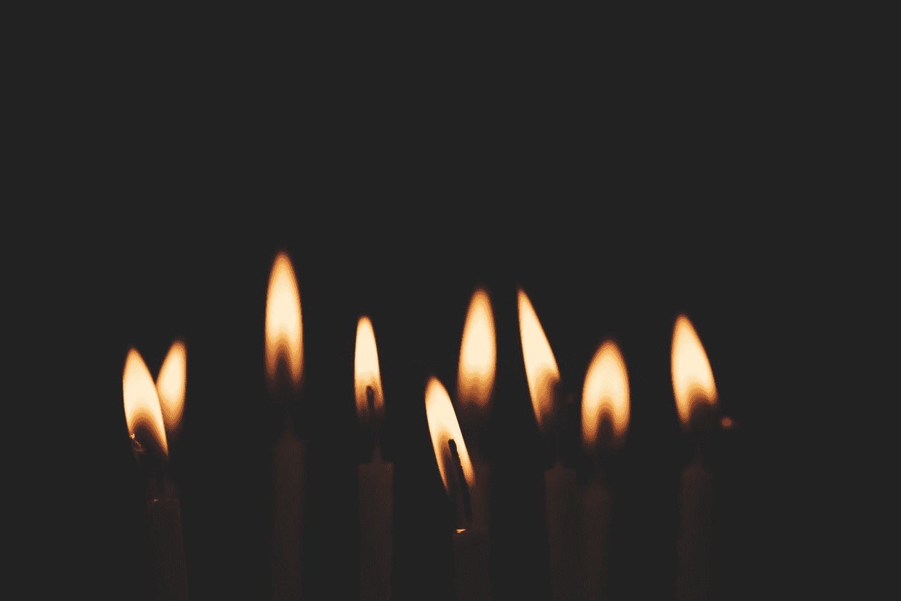

# 不要试图让世界着火

> 原文：<https://medium.datadriveninvestor.com/stop-trying-to-set-the-world-on-fire-8d5ef4d995b4?source=collection_archive---------11----------------------->

## 转变心态，防止精疲力竭。

Photo by [Gaelle Marcel](https://unsplash.com/@gaellemarcel?utm_source=medium&utm_medium=referral) on [Unsplash](https://unsplash.com?utm_source=medium&utm_medium=referral)

一切都结束了。生活取消了。除了你定期安排的责任，你现在必须在家教育你的野孩子。哦，别忘了，人们在死去，科学家们在争论，政客们变得越来越政治化，企业在遭受损失，而你的配偶，就像，总是这样。没错。那里。我们都不知道这什么时候会结束。

*现在开始工作，你这个懒惰的混蛋。*

听起来熟悉吗？

至此，你一定读过一些关于莎士比亚和牛顿在隔离期间如何完成革命工作的狗屁文章。作者很可能鼓励你将这段强制性的社会隔离时间视为在工作中取得真正进步的*机会*。阅读这篇文章可能会让你羞愧难当，因为你穿着“居家鞋”拖着沉重的脚步走向冰箱，看看是否有新的东西(也许是酒？)神奇地出现在你最后一次看的时候。三分钟前。在你读这篇文章之前。

 [## 艾预测:“颠覆，然后是生产力”|数据驱动的投资者

### 人们越来越担心，随着机器学习和互联网的普及，所有白领工作都将消失

www.datadriveninvestor.com](https://www.datadriveninvestor.com/2018/08/06/ai-forecast-disruption-then-productivity/) 

让我们现实一点。莎士比亚和牛顿是杰出的思想家。生活在几百年前。还有男人。幸福无忧的男人。

这个时代很奇怪，我们任何人拿自己和这些人相比都是不公平的。但尤其是——我怎么强调都不为过——如果你是一个有小孩的雄心勃勃的母亲。

但是当她告诉我们要做更多的事情时，我们如何平息内心的声音呢？

## 我们不应该退出吗？

几年前，当我离开 Big Law 去了自己的家园时，我面临着一个巨大的身份转变。过渡并不顺利。

当我在一家大型律师事务所工作时，效率是我的女王。每六分钟一次的长时间工作是一种荣誉。还有薪水支票。哦，薪水支票！甜蜜的，可计算的证明我所做的是有价值的。

我发现，全职妈妈没有这些优点。漫长的、无组织的无所事事的日子不太适合我充满活力的个性。不用动脑的任务一个接一个地排着队。没事做，除非我把它放在日历上。没有人称赞我 24 小时工作。和服务费用。呃？打扰一下。

想象一下，当我发现自己热爱创造性写作时，我有多高兴。我的灵魂和思想同时醒来。我在儿子午睡时开始写小说。我有所有这些我想写的东西。所有我想说的事情。我准备好让世界着火了。

然而。

即使我的头在以最好的方式燃烧，我仍然是一个在家的妈妈。从来没有足够的时间工作。我非常痛苦。我认为，对于某些人来说，无法让世界燃烧起来是痛苦的。尤其是当你知道在你内心深处埋藏着一个曾经可以走得更快、更难、更强的你。

辞职似乎是正确的选择。“只是现在，”我会说。不会有更好的时机吗？如果我等到孩子们都上学了，是不是就不会那么痛苦了。那我真的可以去争取了。不受阻碍。喷火。

但是放弃的想法也很痛苦。如果我没有在做一些事情，难道我不会每天都感觉很糟糕吗？几年后重新开始会有多痛苦，因为我知道在这中间的几年里我没有改进我的手艺。

在这种痛苦中打滚一段时间，反复问自己这些问题，让我找到了一个简单的解决办法。慢点。放轻松。不要试图让世界着火。每天做一点点，你会积累一些东西。最终。

## 一个奇怪季节的标签

我没有放弃，而是为这一季的生活想出了一个标签。我称之为点燃阶段。如果我记得还会有另一个时间和地点让世界着火，那这只是一个季节，我会感觉更好。

每天早上当我坐下来写作的时候，我都会点燃一支蜡烛。火焰向我的大脑发出信号，工作的时间到了，我想起了我的咒语。

> 这是你的点燃阶段。你是一个母亲，在家，带着两个小孩。如果你的目标是让世界着火，你会累垮的。让那团火焰继续燃烧。

当我的孩子打断我的写作时，我最后一次盯着屏幕上未完成的手稿。有些日子，我可能试图抓住我感觉被吸回以太的模糊思想。或者我会让它过去，关上电脑，吹灭蜡烛，记住我明天会回来，至少会回来一小会儿。我也会做同样的事情。一次又一次。一点点，到处都是。让自己燃烧起来。

在这个奇怪的，前所未有的季节，我鼓励你放弃你的高期望，这样你就不会完全放弃自己。没有理由现在就精疲力尽，无论是工作太多，还是因为工作不够而感到太多的羞耻和自我厌恶。

时不时地扔一点火种进去。保持你的热情。

你很快就会让世界再次燃烧起来。