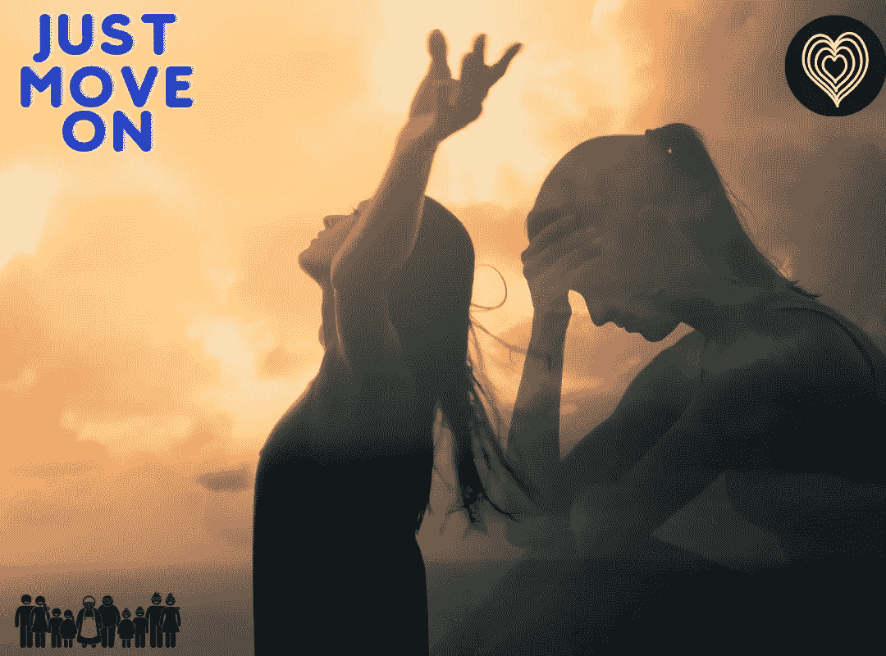

# 不要让自己停留在过去的黑暗中——一个朋友的故事

> 原文：<https://medium.datadriveninvestor.com/stop-yourself-of-being-stuck-on-the-dark-of-your-past-a-story-of-a-friend-d3d6ef251c3c?source=collection_archive---------16----------------------->

"你需要放下一切不值得留恋的东西."

和我爱的男人在一起几年后，我发现自己晚上会不停地哭。已经一个月了，我几乎每天晚上都流泪。我花了几个小时在淋浴间哭泣，问自己怎么了。

这一切都是从上个月开始的，当时我注意到我男朋友的行为有所不同。他似乎不再是几年前我爱过的那个人了——那个曾经爱我并让我快乐的人。他开始变得很奇怪，好像每次我们在一起他都变了一个人。我一直装傻，装作无所谓的样子。

我不停地在心里为他找借口，“也许他只是有问题。”我认为。所以作为合伙人，我延长了我的耐心和理解。我爱他，就像我爱他一样，就好像什么都没发生一样。

即使他已经用行动把我推开了，我还是留了下来。即使他不再对我说我爱你，我也不介意。他被我的出现激怒了；尽管如此，这并不重要。我守在他身边，就像我答应自己要和他在一起一样。

我让自己相信我们之间没有问题。我不停地问自己，“我做错了什么？我做了什么让他变成那样？."无论我如何努力让自己去想一些可能的原因，我都找不到。直到我最害怕的那一天到来。他和我分手了。那晚他把我留在房间里哭泣。我感到崩溃和崩溃。我觉得我的生活已经分崩离析。

> 他让我相信**“无论一个人多么爱你，当他开始对你失去兴趣和爱时，他可以离开。”**

我对一切都失去了兴趣。我找不到任何继续下去的理由。我的心无法接受他不回来了，我需要开始自立。但是我该怎么做呢？你怎么能就这样放弃你多年来深爱的人呢？“我不能。我真的不行”。我感觉被摧毁了，我不能做任何事情让我的生活继续前进。我花时间在哭泣和躺着，感觉好痛苦。

直到有一天晚上，我发现自己在和妈妈说话的时候盯着镜子里的自己。听到她的声音开裂和哭泣击中了我。我感觉像是从长时间的梦中醒来。她不停地问*为什么我要为一个根本不关心我现在过得怎么样的人浪费自己的生命？*

 [## 定义新冠肺炎时代的“生活”|数据驱动的投资者

### 我和妻子即将进行一个月的自我隔离，以避免感染冠状病毒。我们都 70 多了…

www.datadriveninvestor.com](https://www.datadriveninvestor.com/2020/04/23/defining-life-in-the-time-of-covid-19/) 

我妈妈打来的那个电话让我意识到了很多事情。我开始可怜自己，为自己感到难过。我从镜子里看着自己，开始擦着流下来的眼泪，笑了。我值得拥有这些吗？不，绝对不是。我对前任的所有爱都变成了愤怒和失望。它给了我太多的意愿去改变自己，变得更好。

那次分手对我影响太大了。让我意识到它已经让我的生活变得痛苦已经太晚了。我忽视了我的工作，我忽视了我的家庭——那些爱我并一直陪在我身边的人。所以我开始重建自己。

> 我需要理解人们来来去去，我需要放下过去，继续前进。如果我继续抓住那个已经放弃我的人，我可能会失去自我。

*   ***我试着接受却又不勉强快速做*** 。

我告诉自己，我需要接受它。我没有强迫自己，因为这很难。我能做的就是不让自己抱着他会回来的希望。我阻止自己回到我们常去的地方。

我阻止自己去做那些可能让我想起他的事情。这不是不面对你的恐惧，因为那些不是恐惧。帮助自己疗伤，不要停留在脆弱上。

你不需要强迫自己快速忘记。因为你不能，我也不能。我们唯一能做的就是像那些正在与心痛作斗争的人一样，帮助自己逐渐接受这个事实。我们不要成为烈士和肤浅的人。不要在心里编造借口和希望。

*   ***我专注于真心爱我的人*** 。

处于那种关系中，又如此爱他，让我的生活围绕着他转。我忽略了太多身边的事和人。意识到我已经在改变已经有点晚了。我正在变成以前的我。

在那次分手和苦恼之后，它不知何故让我大开眼界。它让我看清了真正爱我的人是谁——那些永远不会离开我的人，他们是我的家人和真正的朋友。

我妈妈，我姐姐，我最好的朋友成了我哭泣的肩膀。在我最需要他们的时候，他们公开拥抱了我。他们听我的；他们理解我的感受，不加评判。而这让我意识到: ***是的，他可能是离开了我。但是我身边还有我确信永远不会离开我的人。***

> 有时候，让我们意识到真正爱我们的人的重要性，就是让我们被我们深爱的错误的人伤害。

*   ***我分清主次，更爱自己*** 。

分手后，大多数女人都忽视了自己。有些女性倾向于剪头发，有些女性倾向于减肥。这些是遭受心碎之苦的女人的共同特征。多亏了我非常支持我的家人，我没有达到那一步。

为了让我再次痊愈，我需要好好照顾自己。我去了发廊，做了新发型。我去购物，花在自己身上。我在我最喜欢的餐馆吃饭；我不在镇上。我喜欢自己的一切。

> 当看到我脸上的笑容时，我意识到；我的幸福不再取决于他。

为了不被痛苦所困，你需要创造自己的幸福。接受事实，原谅，继续前进。亲身经历过心碎，我承认对伤害我们的人心怀怨恨会让我们更难过。怨恨有时会阻止我们再次快乐起来，阻止我们从痛苦中解脱出来。

> 我们需要认识到这样一个事实，我们没有自己的人。我承认我不拥有他。他来了，又走了。

给予原谅并不意味着我可以接受他伤害了我。对我来说，它也原谅了我。原谅自己不能满足他的要求，让他和我分手。

而是接受我没有错。他需要的人和事也许我做不到。他和别人在一起会幸福，他不再是那个让我幸福的人。

*   我继续前进，继续我的生活 。

我原谅了他。原谅他也是原谅我自己。我怎么能说我已经向前看了呢？这只是因为我可以自由地微笑。我不再为他哭泣。我接受了一切。他现在是我记忆中的一部分，给我带来了很多教训，让我更爱自己——还有*让我意识到我真正关心和重视的人的重要性。*

这给我上了一课，告诉我如何成为更好的自己。现在我可以看到我做得更好了。我和家人朋友有了更多快乐的时光。我从擅长我的工作回来。经过长时间的艰苦战斗，我已经有了平和的心态。

所以，对于那些正在从分手的痛苦中挣扎的人来说，不要太贬低自己。很难克服所有的孤独。你需要帮助自己—***在一天结束的时候，你会开始前进。***

## 访问专家视图— [订阅 DDI 英特尔](https://datadriveninvestor.com/ddi-intel)