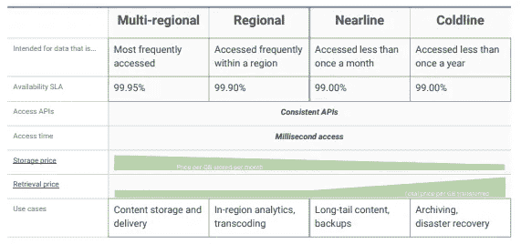
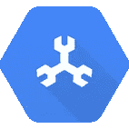
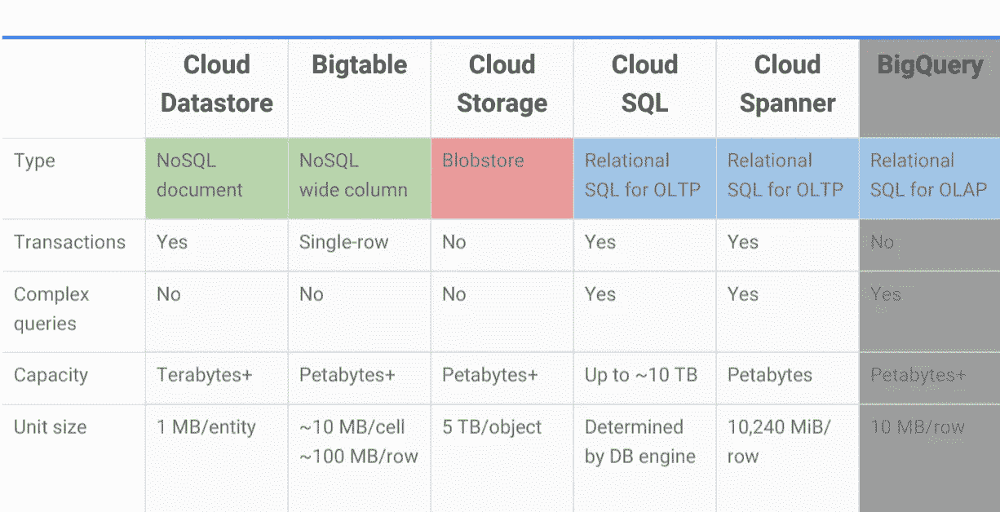
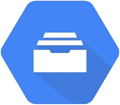

# 谷歌云平台中的存储选项-摘要

> 原文：<https://medium.datadriveninvestor.com/storage-options-in-google-cloud-platform-rundown-f78100c4ed37?source=collection_archive---------1----------------------->


# 介绍

在这篇博客中，我将介绍谷歌云平台(GCP)提供的各种存储选项。选择合适的存储选项对于确保您的服务/应用/数据管道产生最佳结果至关重要。选择正确的存储选项不仅可以提高服务/应用/数据管道的性能，还可以帮助您制定经济高效的项目。通过牢记一些基本原则并在部署任何东西之前获得足够的知识，可以将组织后端系统的运行成本转化为经济高效的系统。很多时候，我们在没有想清楚所有事情的情况下就匆忙创建一个服务或应用程序，最终我们会面临一些问题。因此，最好的建议是，在你着手任何项目之前制定一个游戏计划，花些时间做充分的研究，仓促行事会在那个时候产生效果，但随后你会像往常一样落得同样的下场。如果您需要一些时间来为您的项目想出最佳的存储选项，请不要担心，如果您最终选择了一个不适合您的用例的数据存储，那么在这里花费的时间与您必须花费的时间相比将是微不足道的。

[](https://www.datadriveninvestor.com/2020/03/11/cloud-made-simple-for-undecided-career-change-planners-the-fundamentals/) [## 云让犹豫不决的职业生涯规划者变得简单:基础|数据驱动的投资者

### 尽管 IT 在当今的商业中扮演着重要的角色，但许多 IT 求职者都不愿意从事云计算职业…

www.datadriveninvestor.com](https://www.datadriveninvestor.com/2020/03/11/cloud-made-simple-for-undecided-career-change-planners-the-fundamentals/) 

# CGP 提供各种存储选项:

GCP 给我们提供的存储选项有:**谷歌云存储、谷歌云 Bigtable、** **谷歌云 SQL** 、**谷歌云扳手**、**云数据存储**和**云 Firestore** 。

# 1.云存储


谷歌云存储为开发人员和 IT 组织提供持久且高度可用的**对象存储**。它不征收最低费用；您只需为您使用的东西付费。没有必要预先配置容量。

你一定很好奇什么对象存储是对的？作为一名开发人员，您可能熟悉直接的文件存储。在**文件存储中，**您将数据作为文件夹的**层次结构进行管理。它与块存储不同，在块存储中，操作系统将数据作为磁盘对象存储的块来管理，这与简单的文件存储系统完全不同。对象存储意味着:你对你的存储器说，“这里，保存这个任意的字节序列”，存储器让你用一个唯一的键来寻址它。在 Google 云存储和其他系统中，这些唯一的键是以 URL 的形式出现的，这意味着对象存储可以很好地与 web 技术交互。**

谷歌云存储不是一个文件系统，尽管它可以通过云存储 FUSE 等第三方工具作为一个文件系统来访问。Google Cloud Storage 提供的存储对象是“**不可变的**”，这意味着您不会就地编辑它们，而是创建一个新版本。Google 云存储的主要用途是每当需要二进制大对象存储时:在线内容、备份和归档、处理工作流中的中间结果的存储等等。如果你以前和**亚马逊 s3** 合作过，你一定知道亚马逊 s3 也遵循不变性的概念，如果你不知道，现在你知道了。这种不变性的概念在存储上可能看起来有点笨拙，因为毕竟您保留了文件的所有版本，并添加了越来越多的版本，但是当涉及到实际的开发周期时，这种特性非常有用，通常您可能需要访问一些文件的旧版本，以获取数据仓库的历史数据或运行一些**机器学习/数据科学**分析，这种不变性特性在这种情况下很方便。

# 谷歌云存储的主要特点

●高性能、互联网规模

●简单的管理—不需要容量管理

●静态数据加密

●默认情况下，从 Google 到 endpoint 的数据传输加密

●提供线上和线下进口服务

# 在云存储类别中进行选择

云存储允许您在四种不同类型的存储类别中进行选择:区域、多区域、近线和冷线。多区域和区域是高性能对象存储，而近线和冷线是备份和归档存储。使用云存储 API 以类似的方式访问所有存储类，它们都提供毫秒级的访问时间。



**区域存储**允许您将数据存储在特定的 GCP 地区、美国中部 1、欧洲西部 1 或亚洲东部 1。它比多区域存储便宜，但冗余较少。

**多区域存储**成本稍高，但它是地理冗余的。这意味着你选择一个广阔的地理位置，如美国、欧盟或亚洲，云存储将你的数据存储在至少两个相距至少 160 公里的地理位置。多区域存储适用于存储频繁访问的存储数据:网站内容、交互式工作负载或属于移动和游戏应用程序的数据。另一方面，人们使用区域存储来存储靠近他们的计算引擎虚拟机或他们的 Kubernetes 引擎集群的数据。这为数据密集型计算提供了更好的性能。

**近线存储**是一种低成本、高度耐用的存储服务，用于存储不常访问的数据。在您计划平均一个月或更少一次读取或修改数据的情况下，此存储类别比多区域存储或区域存储更好。例如，如果您想要不断地将文件添加到云存储并计划

**Coldline Storage** 是一种成本极低、高度耐用的存储服务，用于数据归档、在线备份和灾难恢复。对于您计划每年最多访问一次的数据，Coldline 存储是最佳选择，因为它的可用性稍低，最短存储时间为 90 天，数据访问成本和每次操作成本较高。例如，如果您希望归档数据或在发生灾难恢复事件时进行访问。

# 2.云大表


Bigtable 是 NoSQL 的大数据数据库服务， **gmail 和谷歌地图**在后台使用它。SQL 数据库有行和列，有预定义的模式，我们必须遵守模式的规则，只有那些符合模式规则的条目才能插入数据库，不能添加额外的字段。在 NoSQL 数据库中，并非所有的行都需要相同的列，事实上，数据库可能被设计为通过稀疏地填充行来利用这一点。

# 云 Bigtable 的主要特性

如果您需要以下一种或所有数据，则应使用 bigtable:
●大量(> 1 TB)半结构化或结构化数据
●数据是高吞吐量或快速变化的
●不需要事务、强关系语义
●数据是时序数据或具有自然语义排序
●您对数据运行异步批处理或实时处理
●您对数据运行机器学习算法

# 3.云 SQL


云 SQL 是一种易于使用的服务，提供完全托管的关系型
数据库。如果您希望将全部精力放在构建应用程序上，而不是担心数据库管理等繁琐的任务，如应用补丁和更新、管理备份和配置复制。如果你正处于一个创业和开发团队的初级阶段，并且需要一个关系数据库，那么 Cloud SQL 就是适合你的。

# 云 SQL 的特性:

在以下情况下，应使用云 SQL:

●提供 MySQL 和 PostgreSQL 数据库即服务
●自动复制
●托管备份
●垂直扩展(读写)
●水平扩展(读取)
●谷歌安全

# 4.云扳手



Cloud Spanner 支持强一致性，包括强一致的二级索引、SQL 和托管实例，通过同步和内置的数据复制实现高可用性。

# 云扳手的特点

在以下情况下，您应该使用云 SQL:

SQL RDBMS，具有连接和二级索引
●内置高可用性
●强大的全局一致性
●数据库大小超过约 2 TB
●许多 IOPS(每秒数万次读取/写入或更多)

# 5.云数据存储


云数据存储是一个高度可扩展的 NoSQL 数据库，适用于您的应用程序。
像云 Bigtable 一样，您不需要提供数据库实例。
云数据存储使用分布式架构来自动管理
扩展。您的查询随着您的结果集的大小而缩放，而不是您的
数据集的大小。

# 云数据存储的功能

**●原子事务** 数据存储可以执行一组操作，要么全部成功，要么
都不发生。
**●读写的高可用性** 数据存储在 Google 数据中心运行，这些数据中心使用冗余来
最小化故障点的影响。
**●高性能的大规模可扩展性** 数据存储使用分布式架构来自动管理
扩展。Datastore 混合使用索引和查询约束，因此您的
查询随着结果集的大小而扩展，而不是数据集的大小。
●灵活的数据存储和查询
数据存储自然映射到面向对象和脚本语言
，并通过多个客户端向应用程序公开。它还提供了一种类似 SQL 的查询语言。
**●强一致性和最终一致性的平衡** 数据存储确保实体查找和祖先查询总是
接收强一致性数据。所有其他查询最终都
一致。一致性模型允许您的应用程序在处理大量数据和用户时提供
出色的用户体验。

**●静态加密** 数据存储在将数据写入磁盘之前自动加密所有数据，并且
在授权用户读取数据时自动解密数据。有关更多信息，请参见服务器端加密。
**●完全管理，无计划停机** Google 处理数据存储服务的管理，因此您可以
专注于您的应用。当服务接受计划升级时，您的应用程序仍然可以使用数据存储。

# 所有存储选项的汇总比较



如果您需要存储结构化对象，或者如果您需要支持事务和类似 SQL 的查询，请考虑使用云数据存储。该存储服务提供万亿字节的容量，每个实体的最大单元大小为 1 MB。

**如果需要存储大量结构化对象，可以考虑使用云 Bigtable** 。云 Bigtable 不支持 SQL 查询，也不支持多行事务。该存储服务提供数 Pb 的容量，最大单元大小为每个单元 10 MB，每行 100 MB。

**考虑使用云存储**，如果你需要存储大于 10 MB 的不可变 blobs，比如大图片或者电影。该存储服务提供数 Pb 的容量，每个对象的最大单元大小为 5 TB。

**如果您需要在线交易处理系统的完整 SQL 支持，请考虑使用云 SQL 或云扳手**。云 SQL 提供高达 10，230 GB，取决于机器类型，而云扳手提供 Pb。如果云 SQL 不符合您的要求，因为您需要水平可伸缩性，而不仅仅是通过读取副本，请考虑使用云扳手。

# 云文件存储—机器学习—媒体处理



在执行繁重的机器学习任务、媒体处理、渲染等任务时，云文件存储被广泛使用。由于其高吞吐量，它是高度首选的，但不要将其与存储选项混淆，将其视为执行高读取密集型任务的临时驱动器。例如，你想在你的 GCP 项目中跨多个 GPU 运行繁重的机器学习模型，你可以在 GCP 托管一个文件存储，将你所有的图像和文本数据保存在这个文件存储实例上，然后在你所有的 GPU 上运行这个文件存储实例**(如果你的 GPU 在不同的集群上，那么你必须创建一个共享的 VPC 网络)**，这样你就不必在每个 GPU 上保存相同数据的副本，而且由于文件存储提供了更快的读/写操作，它不会导致你的 ML 操作变慢。**通常很多人使用 google drive 来存储机器学习图像和文本数据，但 Google Drive 非常慢，可能不像你希望的那样节省时间，但如果你的预算很低，那么就使用普通的旧 Google Drive，它仍然可以工作，但 filestore 是目前为止此类任务的最佳选择。** Cloud Filestore 是一种托管文件存储服务，适用于需要文件系统接口和数据共享文件系统的应用程序。Filestore 为用户提供了一种简单的本地体验，让他们可以使用 Google Compute Engine 和 Kubernetes Engine 实例来管理网络连接存储(NAS)。独立微调 Filestore 的性能和容量的能力可为基于文件的工作负载带来可预见的快速性能。

# 文件存储的主要功能:

●云文件存储为文件操作提供了低延迟。

●使用云文件存储，您可以为可预测的性能支付可预测的价格。您可以选择每秒的操作数和 Filestore 所需的存储容量，这使您能够针对特定的工作负载调整文件系统。随着时间的推移，特定工作负载的性能会保持一致。

● Cloud Filestore 是一个完全托管的 NoOps 服务，它与 Google Cloud 产品组合的其余部分集成在一起。您可以轻松地在计算引擎虚拟机上装载 Filestore 文件共享。Filestore 还与 Google Kubernetes 引擎紧密集成，因此您的容器可以引用相同的共享数据。

●利用 Elastifile，您可以灵活地扩展文件存储，以适应不断变化的业务需求。当容量或性能要求发生变化时，可以通过 GCP 本地 GUI 或基于 API 的控件轻松相应地扩展或缩减您的集群。

```
Thank You !
My LinkedIn : [Visit Me on LinkedIn](https://www.linkedin.com/in/arneesh-aima-49b516116/)
```