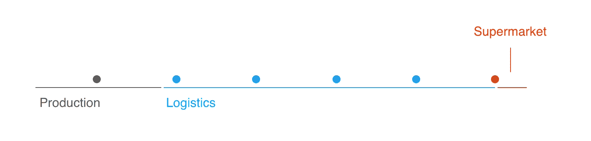
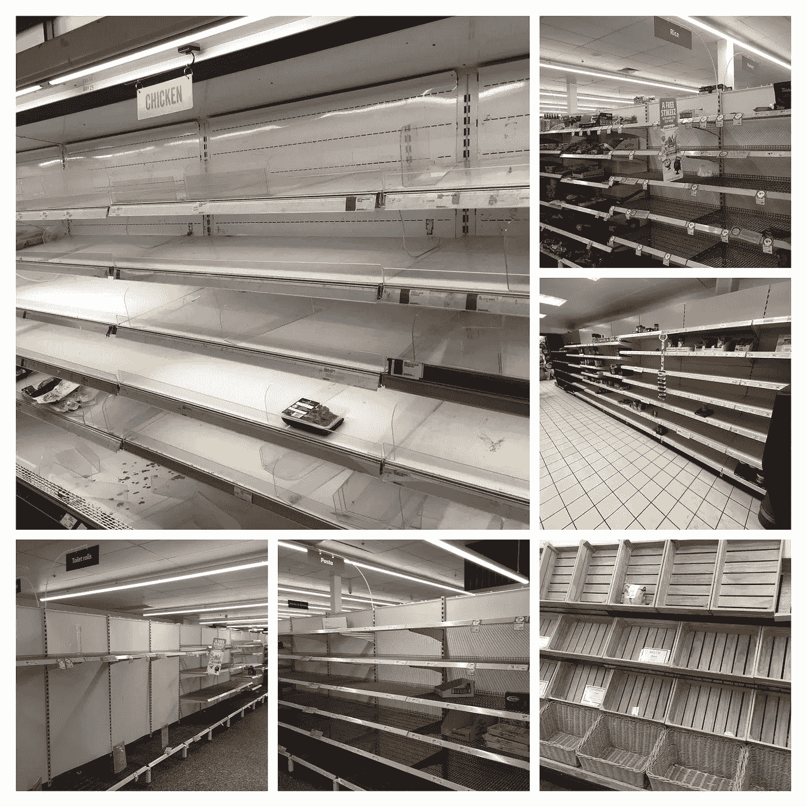
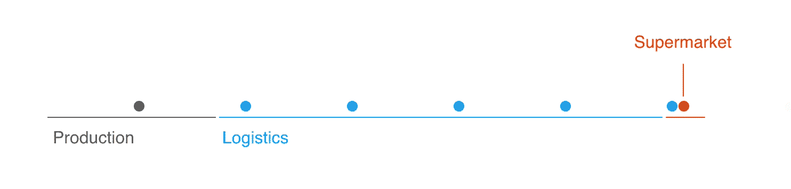

# 杂货店的空货架并不意味着短缺

> 原文：<https://medium.datadriveninvestor.com/store-shelves-arent-empty-because-there-is-no-food-10fbb4551e42?source=collection_archive---------16----------------------->

## …只是比通常的需求高。新冠肺炎告诉我们，当有序系统遇到特殊情况时会发生什么，我们总能适应

这是供应链和新型冠状病毒影响系列的第一部分。非常感谢 ***艾琳·德·拉·托雷阿里纳斯****(*[https://www.behance.net/irenedelatorre](https://www.behance.net/irenedelatorre)*)帮我做插图。*

 [## 另一场精心策划的全球经济危机正在逼近？如果我们的数据经济可以帮助它|数据…

### 我们的 DApp 的开发，称为 DECENTR，目前正与我们的 R&D 同步进行，作为我们即将到来的…

www.datadriveninvestor.com](https://www.datadriveninvestor.com/2019/03/06/another-engineered-global-economic-crisis-looming-not-if-our-data-economy-can-help-it/) 

最近去超市的经历让许多人感到恐慌。自从新冠肺炎在欧洲和美国爆发以来，社交媒体上到处都出现了杂货店货架耗尽的图片。事实上，这种现象可以在世界范围内观察到，类似的图片来自澳大利亚、南非和其他国家。

杂货店货架空空如也的照片给许多人的印象是，有些商品实际上供应不足。这促使更多的购物者去超市购买，通常是批量购买。对许多人来说，只是为了保险起见，多带几包面条和罐头食品似乎是个好主意。此外，有些不合理的是，卫生纸已经成为一种需求量很大的商品，许多商店现在限制其销售量为每户一张。

**但是不缺吃的(或者卫生纸)。**相反，这是对适应正常操作模式的系统的冲击的一个例子。这种模式的突然改变会导致暂时的中断。就超市货架而言:如果需求突然超过正常水平，杂货店的员工就无法快速填满货架，直到下一个顾客比平时需求更多时，货架才会显得满满的。

在供应链的稍下游，商场需求的增加耗尽了现场的库存。尽管通常交付的产品会在第二天早上到达(或者有时，在非常大的商店中，仅在几个小时后)，但会有一段时间货架会是空的——尤其是在营业时间的开始和结束时。空货架、社交媒体上的图片和超市挤兑的恶性循环出现了——这是推动当前全球空货架出现的原因。

这种现象的心理和社会影响已经过详细讨论。理性地看，需求上升会产生(暂时的)短缺，这很容易理解。但是我们的大脑习惯于在不确定的时候做出快速决策，而不能真正计算当前的情况。或者更确切地说，他们可以，如果我们坐下来想清楚的话。相反，我们听从我们的直觉，直觉告诉我们明天可能没有食物，所以我们最好现在就储备。我们被训练去期待满满的货架，并把这和安全联系起来。看到空瓶子会激发我们最基本的本能——因此，我们会买比我们需要的更多的东西。但是跟随这些直觉会给那些买不起大宗商品的人带来额外的压力。

杂货连锁店一直强调没有生产短缺，也没有迹象表明会有。食物仍然以正常的频率运送，只是需求的突然激增耗尽了货架。现在，各地的商店经理都在努力解决这个问题。

许多超市已经张贴了招聘广告，承诺快速店内申请和接受。在一次巧妙的资源再分配中，[麦当劳和 Aldi](https://www.manager-magazin.de/unternehmen/handel/mcdonald-s-mitarbeiter-helfen-bei-aldi-aus-a-1305613.html) (德语链接)在德国达成了一项临时劳动力共享协议。在持续的封锁期间，麦当劳无法开放其餐厅，而折扣店 Aldi 迫切需要更多人手来弥补增加的需求——这是一个双赢的局面。

# 正在发生的事情的简单模型

再次强调的是*没有短缺*。相反，我们看到了两种影响:稳态系统中的加速需求和供应链中的突然瓶颈。第一个影响是超市里什么东西清空了货架，第二个影响要深远得多，对生产和物流都有影响。然而，第二个效应对我们来说并不重要，所以我们将把它放到另一个讨论中。

A supply chain in steady state mode.

我们可以用一个简单的稳态供应模型来说明货架的清空。商品被生产出来，然后通过物流从生产地游走到商店，在那里被出售。超市和生产商很清楚特定商品的通常需求。大多数商品没有特定的季节性——比如卫生纸和面条——所以制造商以相当稳定的速度生产它们。为了限制库存的增加，成品进入供应链并被送到超市仓库。从那里，它们被运送到商店。最后，商品被杂货店的员工放到货架上。

这一过程已在上面的插图中捕捉到。在正常的需求水平下，这个供应链确保在供应链的任何一点都没有库存积压。特别是，它确保商店不会有太多的库存，因为它们的足迹通常是有限的。

Higher demand leads to waiting times at the end of the supply chain.

更高的需求加速了供应链末端的商品流动。保持其他一切都处于稳定状态意味着插图中的最后一个球将开始越来越快地移动，即卫生纸和面条在商店中停留的时间将会减少。此外，填充商店货架实际上是连锁中的瓶颈，因为杂货店员工一天只能填充货架几次。杂货店应对这一瓶颈的唯一方法是雇佣更多的人员，加快内部物流。

当然，如果更高的需求将成为新的常态，链条末端的加速步伐将最终转化为起点。这是供应需要增加以满足需求的时候。然而，由于更高的需求不是来自消费的增加，而是来自商品的囤积，因此企业在这个时候增加产量是不明智的。当市场饱和时，即当每个人都有面条和卫生纸库存时，需求很可能会下降。事实上，需求很可能会在一段时间内下降到稳态水平以下，因为每个人都将首先试图降低他们的个人库存——吃他们已经吃过的面条，而不是去杂货店买更多。对生产商来说，预计到这种下降是有好处的，否则他们将冒着自己增加库存的风险。

许多人看到空空的商店货架会产生焦虑和对饥饿的恐惧。这给买不起大量商品的人带来了压力。这让杂货店的员工面临额外的压力，甚至骚扰。有一个简单的方法可以确保这些人和你自己在这个不确定的时期不会承受额外的压力:

> 不要恐慌性购买。没有理由。

*在供应链系列的第二部分，我们将讨论第二个效应:瓶颈和供应冲击。*

# 附加链接

[1]哈佛公报采访
[https://news . Harvard . edu/Gazette/story/2020/03/expert-sees-tough-slog-ahead-for-workers-small-business/](https://news.harvard.edu/gazette/story/2020/03/expert-sees-tough-slog-ahead-for-workers-small-businesses/)

[2]麦当劳与阿尔迪达成协议
[https://www . manager-magazin . de/unternehmen/Handel/McDonald-s-mitarbeiter-helfen-Bei-Aldi-aus-a-1305613 . html](https://www.manager-magazin.de/unternehmen/handel/mcdonald-s-mitarbeiter-helfen-bei-aldi-aus-a-1305613.html)