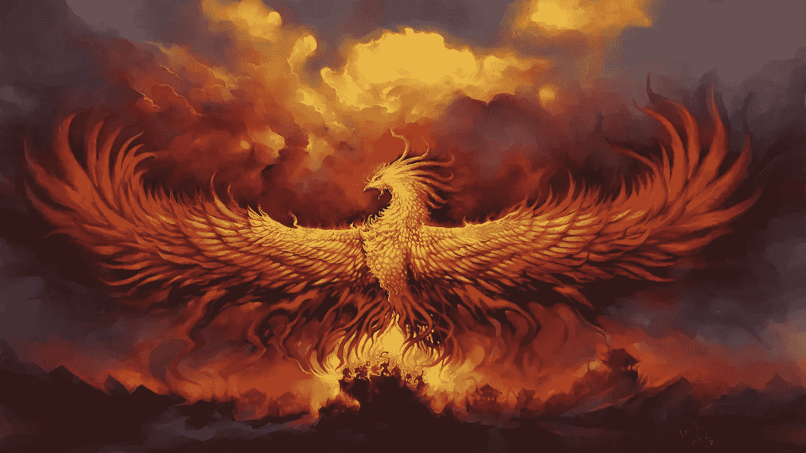
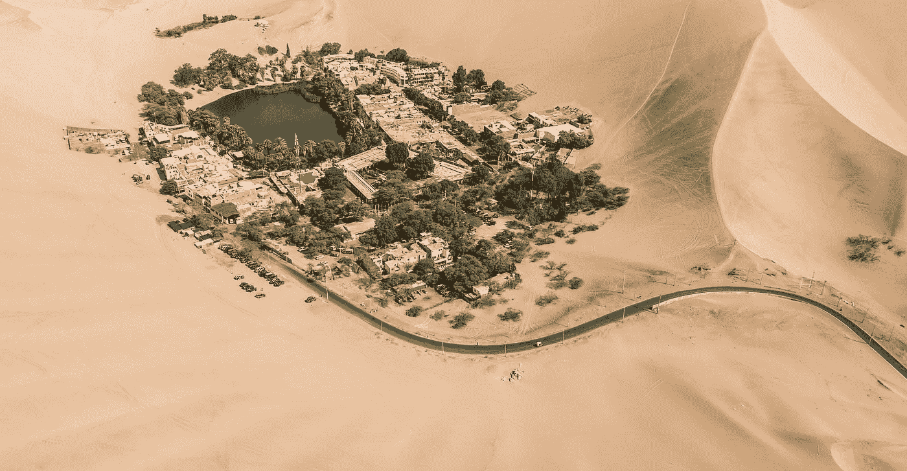
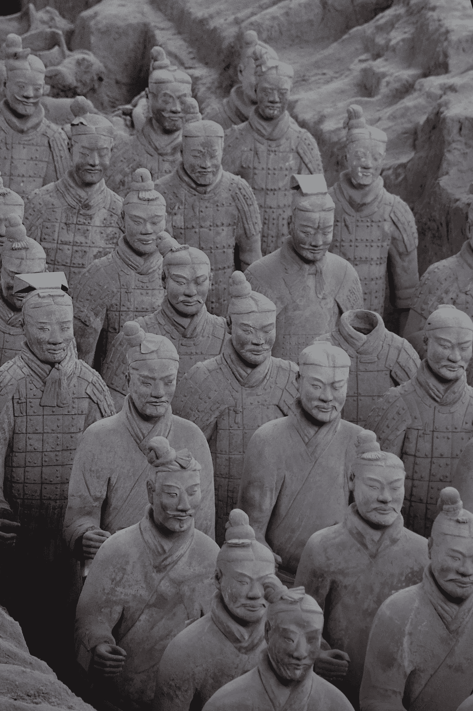
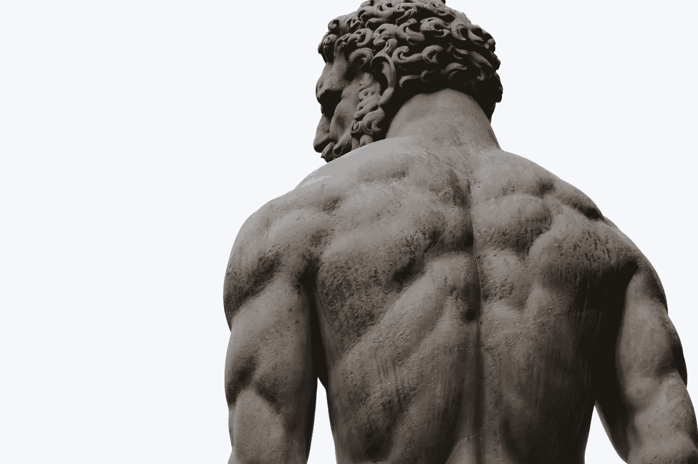
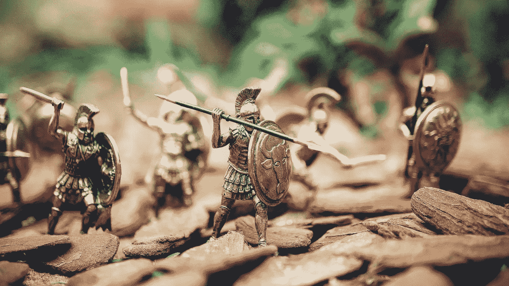
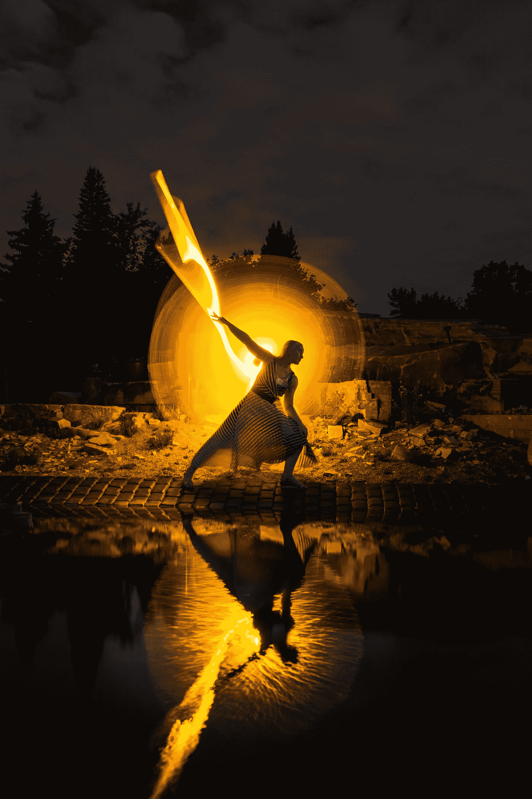
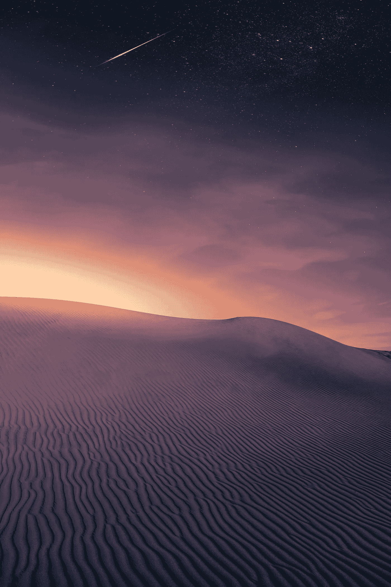

# 故事:像凤凰一样崛起

> 原文：<https://medium.datadriveninvestor.com/stories-rise-like-a-phoenix-20b66e5ae285?source=collection_archive---------11----------------------->

Picture By Wallpapermemory.com

## 奥斯卡住在沙漠附近的一个小村庄里。从年轻时起，他就想成就非凡的事业。奥斯卡大部分时间都在做白日梦。他梦想成为超级英雄，强壮，无畏，帮助那些需要帮助的人。现在他是一个年轻的成年人，他的一生就是为了这一刻而训练。

村子里的生活很艰难；他们不断地与食物短缺作斗争，不断地需要步行数英里去获得水源。

最棘手的是，村民受到外来帮派的压迫，这些帮派试图在村民走出安全区时欺负他们。特别是水上行走需要仔细的计划，隐藏，并确保你不会遇到这些危险的团伙。

村里的男孩们像奥斯卡一样，希望为自己、家人和曾经爱过的人建立更好的生活。

> “这就是为什么这些男孩秘密聚集在一起练习功夫，武术。他们真的想让自己的生活更上一层楼。”—菲特巴德

# 任务

又是新的一天，食物和水正在减少。奥斯卡自愿去一个遥远的山村，在路上买食物和水。

 [## 良好的生活是习惯的形成|数据驱动的投资者

### 过度思考是过度紧张。仅仅几个简单的习惯就会在一天中产生巨大的影响。那是…

www.datadriveninvestor.com](https://www.datadriveninvestor.com/2020/01/17/a-good-life-is-habit-forming/) 

这是一次危险的旅行，可能需要三到五天。奥斯卡已经走了无数次这条路，然而道路变得更加严格，不仅仅是因为帮派，还因为蛇和潜伏的鬣狗正在等待容易的猎物。

Picture by Unsplash

奥斯卡的内心呼唤改变，他觉得这一次，旅行会不一样；他能从骨子里感觉到。他致力于提高比赛，他不知道如何，但他愿意改变。

> "突破个人局限的痛苦是精神成长的痛苦."—坎贝尔·约瑟夫

# 旅程

这项任务常常充满了障碍和挑战。这取决于我们是否决定解除障碍，而不是被埋在下面。

奥斯卡已经远离他的村庄数英里，他的两个朋友帕布罗和菲利普也加入了。两人都是训练有素的士兵，像奥斯卡一样擅长穿越复杂的地形。

他们充满了兴奋，为冒险铺平了道路。

Picture by Unsplash

# 电话

奥斯卡多次梦想成为他的人民的英雄。很多时候，他想为自己和家人建立一个安全的生活。他们不得不过这种充满不确定性、恐惧和焦虑的危险生活。

> 然而，他知道，不会永远这样。他想随机应变。谁知道呢，也许他要为事业献出生命，但他愿意牺牲自己的生命。

朋友们正在迅速而谨慎地前进；他们脚下的空气又重又热。

他们离井和绿洲不远，绿洲很好地隐藏在沙漠中。

# 命运号

突然，所有人都听到空中传来一声呼啸，菲利普倒下了，胸口中箭。他立即死亡。又一支箭射中了帕布罗，几分钟后他也没能成功。

Picture by Unsplash

奥斯卡既害怕又愤怒；他最好的生活朋友都躺在地上死了。就像有人把他的心撕开了一部分。当他躲在附近的一座小山后面时，时光飞逝。他必须做出决定，他必须跑到绿洲去拿食物和水。否则，他的人不会成功。

片刻之前，他还梦想着拯救他的人民，现在他面临着一个艰难的决定。跑回家或者试着穿过去。奥斯卡是一个熟练的战士，他能立刻与十个人战斗，并逐一击败他们。

奥斯卡知道这是他收紧盔甲，拿起剑，屏住呼吸的时刻。他知道这是生死关头。他查看了这个区域，发现至少有七名战士。是时候前进了。

> “你可以控制自己的思想，而不是外界事件。认识到这一点，你就会找到力量。”—马库斯·奥勒留

Picture by Unsplash

奥斯卡对他重复着这句话，他的敏捷、力量和耐力将受到考验。他想通了，他要设一个陷阱让敌人以为他还在躲。于是，他搭起一个简单的稻草人，用死去朋友的衣服。看到他们那样躺着真是太痛苦了。但是奥斯卡会为他们报仇的。

# 战役

奥斯卡向前移动，爬行，然后悄悄地从后面跳过一名敌军士兵。他重复同样的事情几次。如果奥斯卡数得没错，那就只剩下两个敌兵了。但是他再也看不见他们了。

突然在他身后，他听到一个声音，然后挥舞着一把剑。他迅速转身反击。另一个比奥斯卡高一点的士兵从旁边跳了出来，手里拿着一杆长枪。奥斯卡挥了几下，就解除了两个士兵的武装，让他们跑了。

> “不要再浪费时间争论什么是好男人。做一个。”―马库斯·奥勒留

奥斯卡从小和村子里最强壮的孩子一起训练，他们通常是他的两倍大，他从不放弃，甚至当他面对对手被推到边缘时，他也战略性地找到了出路。它不总是关于大小，而是耐力，灵活性和技术。

奥斯卡是控制几乎任何物体的大师，很快就能把它改造成武器。

Picture by Unsplash

# 该区域

奥斯卡感到锐利地聚焦在新涌入的敌兵身上把他逼到了极限。他脚步轻盈，从一个士兵移动到另一个士兵或一群士兵，解除敌人的武装，并深入敌占区。他迅速看了一眼，数出了最后一组 15 人。要么大部分敌人已经逃跑，要么受伤躺在地上。

虽然一段时间的愤怒驱使着他，因为他的两个最好的朋友已经死去，但他不是一个杀手，然而他有一种彻底粉碎敌人的冲动。

左右逢源，奥斯卡已经超越了一个理智的人所能做到的。时间变慢了；他能够在敌人交战前预测敌人会做什么。

他像飓风一样在困惑的士兵之间飞来飞去。他全神贯注，一个接一个地击倒士兵。他立刻面对五个人，但感觉他在几秒钟内就把他们打残了。

> “希望是人内心的努力”。——斯里·钦莫伊

奥斯卡推开了尸体；到处都是躺着的尸体。他不知道自己如何能够应付这样的演出。他很棒，但这次不一样。

Picture by Unsplash

# 战胜

他向对面望去，看到三个强壮的士兵正在打量他。他以前见过他们，即使在他屠杀整群人的时候，他们也没有移动一寸。奥斯卡累了，他投保很少，但不严重。

然而，它觉得这三个士兵是不同的。一个人的脸上有完整的纹身，另一个人很高，看起来牢不可破。最后一个看起来很凶——脸上、胳膊上和腿上到处都是伤口。

> "正是在你做决定的时候，你的命运被塑造了."——托尼·罗宾斯

奥斯卡慢慢靠近，三个士兵在他周围围成一圈。奥斯卡从来没有像激光一样锐利过，感觉他能穿透炎热的沙漠空气。

剑相遇了，奥斯卡在三个士兵之间快速起舞，并得以跳出圈子。他认为自己从未见过的快速而有力的攻击。他遇到了和他实力相当的人，士兵们同样技术娴熟，行动敏捷。

Picture from Unsplash

虽然奥斯卡设法罢工几次，这是不够的；他全身都在流血。感觉他的能量正在耗尽。太可怕了，当敌人推进时，他放慢了速度。

突然，奥斯卡从背后受到了致命的一击，尽管他能够打倒一名士兵，但他还是跪倒在地，血流不止。结束了吗？

# 结束了

这可能只是几秒钟，但对奥斯卡来说，这就像是命运。他的整个人生都在他面前。他一生中从未有人打败过他。他总是能找到出路。然而，在这里，他被似乎拥有超自然能力的超级对手所包围。

虽然用他的快速战斗连击，他把另一个战士打残了，但最勇猛的战士却稳稳地站在他面前。凭借最后一点力气、意志和剑招，他被击倒死了，前面的士兵跪倒在地。

# 反应

他很确定这就是结局。突然，他听到隆隆声，三个士兵突然站了起来，什么也没发生。他们迅速包围了奥斯卡，把他打倒在地。奥斯卡脸朝下跌倒，感到生命在流逝。

奥斯卡最后的想法是，他是如何辜负了他的家人和朋友。现在他们将会灭亡，因为他没有完成任务。

突然，感觉像是一道温暖的光包围了他。感觉所有的伤口都在愈合；怎么可能。一股前所未有的能量传遍了他的全身。

柔和的咝咝声和温暖淹没了他的背部。曾经是致命伤的地方，现在感觉他肩胛骨周围的整个区域都在沸腾。他站稳了，比以前更耐看了。他的全身现在被闪亮的盔甲包裹着。他觉得自己敏捷、响亮、聪明。

突然，一对锋利的翅膀从他的背上出现了。什么？奥斯卡迷惑不解；一秒钟前，感觉他已经死了，现在他站在这里比以前更强大。也许宇宙已经听到了他的召唤，有可能吗？

# 获胜

这三个士兵正在走开，仍然能在远处看见他们。但现在，他们已经转过身来，因为他们看到了光和奥斯卡站在那里。他们是不同的品种，但现在也是奥斯卡。

这三个人现在都在向奥斯卡进军。对于奥斯卡来说，以前看起来像光速的东西现在看起来像是爬行。奥斯卡加速，几秒钟后，他站在了士兵们中间。他把两者在空中互相撞击，然后它们一动不动地落在地上。第三个就像一块木头一样被扔掉了。

奥斯卡到达了绿洲，带着足够的资源回来了。他失去了他哀悼了很久的两个朋友。

但是现在村子里的生活不同了，因为奥斯卡发现了新的力量，并教士兵们为自己的生命而战。

> 凤凰的传说是真实的，奥斯卡成为了弱者的保护者，赶走了敌人，带来了和平。

Picture from Unsplash

# 现在呢？

如今，很少有人带着武器去打仗。然而，如果你仔细想想。生活是一场战斗。我们每天都要战斗，为积极向上而战，学习正确的技能，保持专注。无论是科罗娜，搬到一个新的国家，成长为一个婴儿，做一个负责任的父母。很多时候，我们超越了自己的应对能力——然而我们并没有绝望和迷失。

> 这些是我们的努力和坚持得到回报的时刻。关注价格，发挥我们的才能，反思我们的进步会带来回报。

生活充满了障碍，但它就像一场游戏，只有最强的人才能生存。因此，要到达绿洲，就像巴勃罗·科埃略在他的书《炼金术士》中写的那样，这是一段旅程。

所以，今天就去那里，寻找你丰富的绿洲。你的生活在等待。练就本领，磨砺武器，打造梦之队，努力吧！

Picture from Unsplash