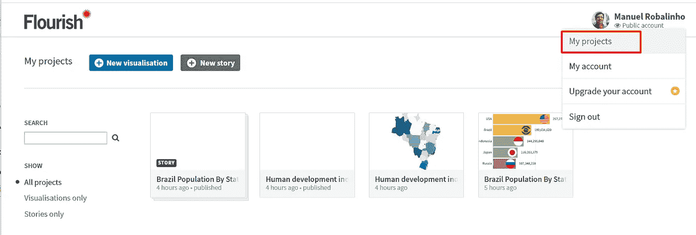
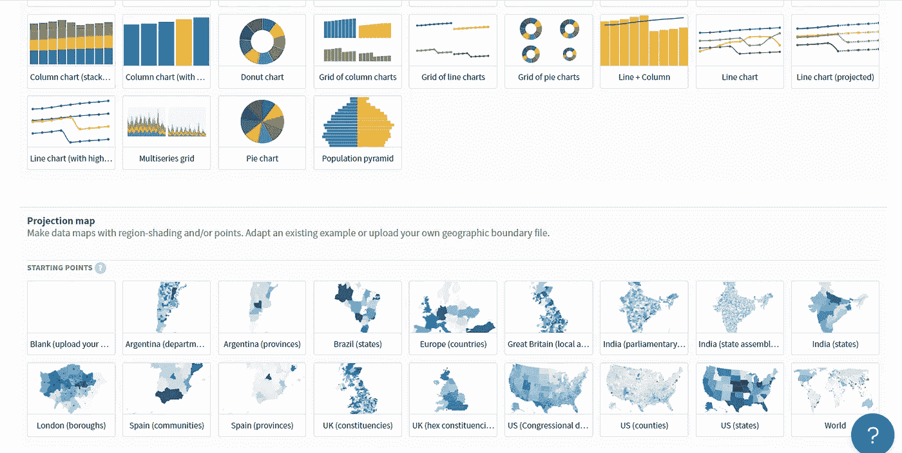
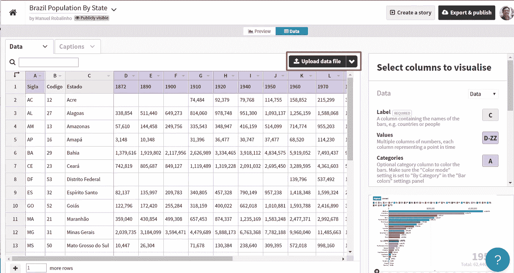
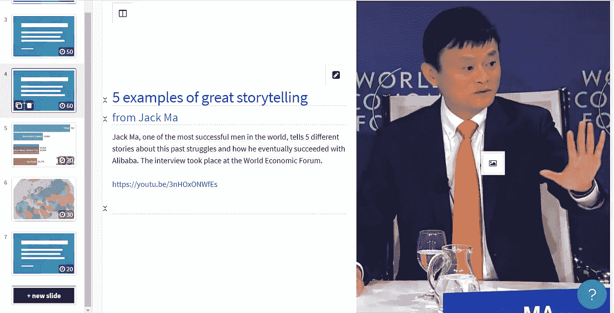
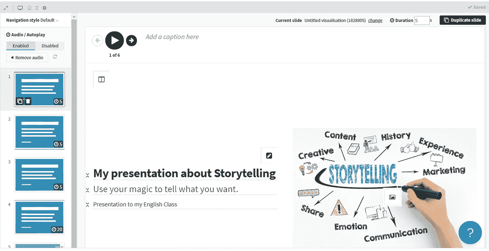

# 用兴旺工作室讲故事

> 原文：<https://medium.datadriveninvestor.com/storytelling-with-flourish-studio-5ddd7e050dd1?source=collection_archive---------3----------------------->

Source: [https://www.domboscoead.com.br/](https://www.domboscoead.com.br/)

torytelling 是一个英语术语，直译过来就是讲故事的行为。这不仅仅是一个简单的叙述，这一战略允许公众参与，更有效地传递信息，支持我们的目标。我们通常在头脑中有一个目标，并应用一个故事，以便信息以更大的幅度和更容易的方式到达。

讲故事是一种通过文字和视觉辅助手段在有开头、中间和结尾的叙述中传达思想的艺术。

今天，光有好的想法和知道如何执行它们是不够的。我们必须赢得投资者，我们必须为我们的想法赢得公众，最终赢得我们产品或服务的消费者。我们越早掌握为观众讲故事的艺术，你的生意就会越好，无论是在销售方面还是在让公众认同你的想法方面。

人脑记住故事比记住数据更容易。因此，好的故事比大量的数据和信息更能引起我们大脑的注意，不管它们可能多么真实和一致。

 [## 将定义 2020 年就业前景的五大数据科学和机器学习趋势|数据驱动…

### 数据科学和 ML 是 2019 年最受关注的趋势之一，毫无疑问，它们将继续发展…

www.datadriveninvestor.com](https://www.datadriveninvestor.com/2020/02/19/five-data-science-and-machine-learning-trends-that-will-define-job-prospects-in-2020/) 

如今，在市场中脱颖而出的是那些设法创造一种能够吸引人们并让他们相信直到他们感到购买安全的沟通方式的人。最好的方法是通过讲故事的技巧。

## 如何使用讲故事:

*1。了解你的受众*

*2。有一个可衡量的目标*

*3。从不同来源搜索信息*

*4。打造醒目标题*

*5。用数据支持你的演讲*

*6。分步骤讲述你的故事*

*7。提供独特而优质的内容*

*8。要真实，不要用假新闻*

*9。思考你的渠道的特点*

10。最好的故事是你的，你自己的故事，启发你的产品或服务的想法来自于你自己的故事。

你可以用来讲故事的好软件是**fluore . studio**，这是一个云平台，你可以免费使用(有一些限制)，但提供非常简单和漂亮的图形、地图和工具来创建一个精彩的故事。

## 我们去试试这个软件吧

首先，你需要一个免费的注册平台。

你的故事可以是一个项目，所以创建你的项目，你可以创建一个可视化(有许多模板的图形)，或创建一个故事。每个故事可以包含许多可视化。

我用这些年来巴西各州的人口数据创建了一个可视化。所有的数据都可以从 CSV 文件导入，也可以在前端数字化数据。

My data imported from CSV

您可以结合声音、照片和视频来改进您的演示文稿。

您的故事可以有许多幻灯片，每张幻灯片都有规定的时间。

您可以创建动态图形，如下例所示:

[https://flo.uri.sh/visualisation/1824982](https://flo.uri.sh/visualisation/1824982/embed)

如果你的信息有地图，那么 fluorescent 就有合适的工具来呈现。下面是巴西国家(人类发展指数)对 IDH 的介绍:

[https://public.flourish.studio/visualisation/1825520/](https://public.flourish.studio/visualisation/1825520/)

## 结论:

这款软件是创建精彩演示的强大工具，在讲述您的故事时会有所不同。发挥你的想象力，使用 fluorescent Studio 的简单工具，有所作为。你是主角，你知道如何讲述你的产品或服务的最佳故事。

## 参考资料:

 [## MRobalinho 讲故事|蓬勃发展

### 漂亮、简单的数据可视化和故事讲述

app . floride . studio](https://app.flourish.studio/story/249506)  [## Produto Interno Bruto 人均-Portal Brasileiro de Dados Abertos

### 国内生产的人均国内生产总值约为 100 亿美元，预计在 2005 年将达到 100 亿美元。

www.dados.gov.br](http://www.dados.gov.br/dataset/cgeo_vw_pib_percapita)  [## 巴西

### 巴西来自世界银行:数据

data.worldbank.org](https://data.worldbank.org/country/brazil?locale=pt)  [## Ipeadata

### 编辑描述

www.ipeadata.gov.br](http://www.ipeadata.gov.br/Default.aspx)  [## 讲故事:阿桂戏剧

### 你觉得讲故事和写故事会有什么样的影响？描述市场和合同…

blog.hotmart.com](https://blog.hotmart.com/pt-br/como-usar-o-storytelling-para-vender-na-internet/)