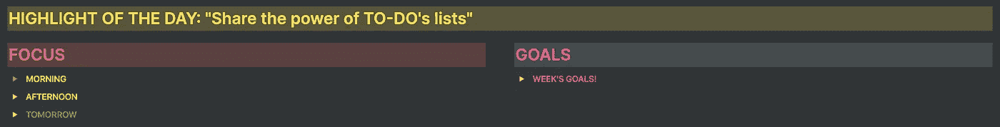

# 直截了当:实现目标的 3 个简单易行的技巧

> 原文：<https://medium.datadriveninvestor.com/straight-to-the-point-3-easy-to-implement-techniques-to-achieve-your-goals-4bc229b578cc?source=collection_archive---------12----------------------->

## 富有成效不应该很难

Photo by [freestocks.org](https://www.pexels.com/es-es/@freestocks?utm_content=attributionCopyText&utm_medium=referral&utm_source=pexels) in [Pexels](https://www.pexels.com/es-es/foto/boligrafo-cuaderno-efecto-desenfocado-escribiendo-131979/?utm_content=attributionCopyText&utm_medium=referral&utm_source=pexels)

# 我把自己定义为“目标达成者”。

我喜欢实现目标，因为这让我的生活有了意义:

*   我知道我为什么每天早上起床。
*   我带着一种奇妙的感觉上床睡觉，感觉这一天是值得的。
*   那带我到许多幸福的状态。
*   最后，这让我想到了用大写字母写的快乐。

这就是为什么我投入大量时间寻找程序、技术、工具和能够改善我的目标实现过程的人。

在这篇文章中，我将与你分享 3 个“愚蠢”的技巧，对我来说，它们代表了我实现目标过程中的关键步骤。

伴随着我的生活，我明白了专注于它不会有任何意义。它是许多小/愚蠢/愚蠢/微小事情的总和，将驱使你朝着那个大目标前进。

这就是为什么总是建议把大任务分解成小任务。

> 我们认为我们已经进化了很多，但是我们离矛和猛犸象并不远。

我们很复杂，但同时也很简单。

我们不能直接去做大事。

**为了实现我们的目标，我们需要:**

1.  把它们分成小任务。
2.  按顺序执行它们。

**作为一个目标达成者，我的程序总是一样的(非常简单，如你所见):**

1.  定义策略。
2.  定义高层次目标。
3.  定义低级目标。
4.  定义任务(如果很多任务在一个相似的或者更高层次的概念中，我用一个项目将它们分组)。
5.  优先排序。
6.  在做。

说到“做”，我总结了一些东西。没有什么比一份简短的待办事项清单更好的了

*   很清楚。
*   您可以快速上下移动项目。
*   你可以很容易地决定何时完成每项任务(如果列表足够短的话)。
*   它让你了解现实。时间就是时间。你有的是时间。你永远不应该对自己撒谎。在短短的待办事项清单中，你可以清楚地看到什么是平易近人的，什么是不平易近人的。

最近，我已经将我所有的生产力软件框架转移到了[概念](https://medium.com/datadriveninvestor/why-i-do-think-notion-software-can-change-your-life-3f09f22af91b)(顺便说一下，我对此很高兴)。在我的主屏幕上，我有 3 个不同的区域:

*   今天的亮点。
*   专注。
*   目标。

Image by Author

## **1。今日亮点**

每天我都在定义我的伟大目标是什么。

不管是我能在一分钟内完成的“愚蠢”事情，还是我需要一天 12 小时才能完成的事情。

每当我上床睡觉时，我都会感到自豪，因为我完成了它。

**你想成功，所以当你的一天开始时，你会投入足够的时间来确保你会写一些东西:**

1.  你可以实现。
2.  这对你很重要，因为它会让你离目标更近一点。

> 这个“突出想法”是我在零年，奥古斯特·布拉德利的在线社区，从一个叫“阿尼克”的家伙那里学到的(他是一个很棒的家伙！).

这是那种一开始看起来很愚蠢的事情，但是如果你深入思考，它可能会改变你的生活。

> 就像我上面说的，你永远不会成功，因为你做了一件伟大的事情。你会成功，因为你做了成百上千件小事。

这是其中之一。

## 2.焦点

如你所见，这里有 3 个切换部分:上午、下午和明天。

它们中的每一个都只是一个待办事项列表。由于隐私问题，我不能展示它们，但你可以了解这个想法。

> 我有一个规则:我不能在头两个(上午和下午)有超过 3 个项目。

除此之外，我还有我所谓的“批次”。它们是 3 个不同的文档(概念的页面):

*   每日一批。
*   每周一批。
*   每月一批。

上面的每一个文件都包含一个待办事项列表，根据我生活的四个方面，它们都有不同的部分。我的 3 家公司各有一个区域，另一个区域用于我的个人问题。

**每当我有事要做的时候，我的第一个问题总是一样的:我什么时候需要做这件事？**

*   **尽快？**然后转到相应部分的每日批处理文件。
*   **本周？**然后它会转到相应部分的每周批处理文件。
*   **这个月？**然后它会转到相应部分的月度批文档。

我在一天开始时检查我的每日批处理文档，并且只选择 6 个项目(3 个进入我的“上午部分”，另外 3 个进入我的“下午部分”)。

如果我看到一些重要和紧急的事情，我会把它放在“明天板块”，只是为了让它在那里，在聚光灯下。

> 如果白天发生了意想不到的事情(不要骗自己。这总是会发生的)，对我来说，毫不费力就能看到我可以把它放在哪里，如果需要的话，把项目从“上午部分”移到“下午部分”，或者如果我知道我今天没有足够的时间，就移到“明天部分”。

> 使用一个开关是很重要的，因为每当我计划我的一天时，我会关闭所有的开关，除了“早晨部分”。

**对我来说，专注于 3 件事是最重要的事情之一。**

每当我决定要做什么任务时，我甚至会关闭“早晨部分”,因为我不想让任何事情分散我的注意力。

使用待办事项清单让我能够以一种非常舒适的方式来区分事情的优先次序。

*   上下移动物品很容易。
*   显而易见，你需要一个循序渐进的过程来提高工作效率。
*   待办事项清单为你指明了方向:从第一个任务开始，当它完成后，进入下一个。

待办事项列表也有一些很棒的东西。看到任务被划掉，您可以检查它们是否完成。

这又是一件“愚蠢”的事情，却激励了我很多。它给我一种充满活力的感觉，一种朝着我的目标前进的感觉。

> 当你完成一天的工作，看到 6 个被划掉的任务，你会觉得自己是个英雄。你做到了。你落下了一些东西。你知道明天还是一样。你知道复合努力会让你走得更远。只是时间问题。

> 你每晚都睡得很好，是因为你做了事情，你感受到了。

你也确定你已经做了你应该做的事情，因为你考虑了它们，你选择了它们，你区分了它们的优先次序，最后，你做了它们。

## 3.目标

每周五，我都会做一个周复习。

基本上就是“给家里带来秩序”。我将解释是什么影响了这篇文章，也就是本周的目标。

每周，我都会定义一周的目标。

> 我称它们为目标，但它们确实是我想做的任务。

它们非常具体、清晰、直截了当。它们是推动我实现目标的基本任务。

不管要花多长时间，我总是努力创造 2-3 个小时的任务。如果一项任务需要花费我 6 个小时，我总是试着把它分成 2-3 项任务，每项最多 2-3 个小时。

**我一周都可以看到这些任务，因为正如你所见，它们在我的主屏幕上，所以:**

*   当我计划我的日常任务时，我总是看我一周的目标。
*   当我对我的待办事项进行优先排序时，我会看看我一周的目标。

> 这给了我一种功能，那就是在实现目标的过程中，总是做我应该做的事情。

在一周结束时，我会在每周回顾中检查清单，并衡量已实现的**目标与总目标**。

每个月，我都会做月度回顾，检查那些百分比。

> 这就是告诉我，我是否太过拖延，我是否朝着我的目标前进，我是否做了我应该做的事情。

每周，当我看到百分比时，我会设定下一周的目标。

*   如果百分比很低，它会激励我更加努力地工作，争取下周达到更高的百分比。
*   如果百分比很高，我会找到保持连胜的动力。

我总能找到一种积极的激励方式来鼓励我，不管百分比是多少。

## 外卖食品

正如你所看到的，许多微小事物的组合推动你:

*   定义什么对实现你的目标真正重要。
*   专注于最重要的事情。
*   做那些最重要的事情。
*   在任何时候，机械地做你应该做的事情，甚至不用思考，创造一个奇妙的生产力循环。
*   创建一个准备好克服意外事件的系统。
*   创建一个每天激励你的系统。
*   创建一个系统来避免拖延，因为它是基于小/微小/简单的任务。
*   创建一个抗压系统，因为它简单易用。

**所有这些，只有 4 个待办事项列表。**

> 富有成效应该不难。生活很简单，我们的系统也应该如此。

简单是生活中最有效的工具。我总是寻找它。