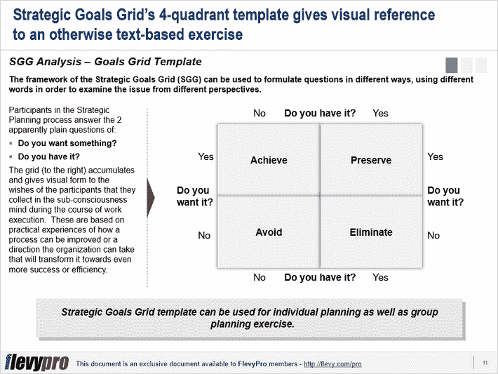

# 战略目标网格(SGG)——战略规划的另一个工具

> 原文：<https://medium.datadriveninvestor.com/strategic-goals-grid-sgg-another-tool-for-strategic-planning-f8da48ed19f?source=collection_archive---------8----------------------->

高管中最流行的战略规划工具之一是 SWOT 分析(或 SWOT 矩阵)。然而，有时评估组织的优势、劣势、机会和威胁并不足以确定规划过程的方向或实施[业务转型](https://flevy.com/browse/stream/transformation)。

一个替代 [SWOT 分析](https://flevy.com/business-toolkit/swot-analysis)的框架是[战略目标网格(SGG)](https://flevy.com/browse/flevypro/strategic-goals-grid-sgg-5262) 。SGG 为计划者提供了一个不同的视角来看待组织、组织所采取的方向、组织的集体智慧想要采取的路线以及设定目标。对于负责规划、[战略发展](https://flevy.com/browse/stream/strategy-development)、转型、[增长](https://flevy.com/business-toolkit/growth-strategy-growth)和盈利的高层领导来说，SGG 是一个极其有效的整体组织分析工具。

SGG 是一个 2×2 矩阵，通过检查两个关键问题的“是”和“否”答案形成:

*   你想要什么吗？
*   *有吗？*

对这些问题的“是”和“否”回答的组合定义了目标和目的的 4 个基本类别:

1.  实现目标——如果你想要你没有的东西，你的目标就是得到它。
2.  保存——如果你想要你已经拥有的东西，你的目标就是保留它。
3.  避免——如果有你不想要也没有的东西，你的目标就是避免它。
4.  消除——如果有你不想要但又拥有的东西，你的目标就是摆脱它。

这 4 类目标——实现、保持、避免和消除——在 2×2 网格上绘制时构成了战略目标网格。

战略目标网格可用于促进讨论，并记录和交流此类讨论的结果。个人可以单独完成表格，然后进行比较、讨论，并将他们的个人努力整合到一个统一的矩阵中。

SGG 可用于启动战略规划流程的 3 个渐进步骤:

1.  **可视化并记录**
2.  **接合**
3.  **合成并对齐**

让我们更深入地研究一下各个框架步骤。

# 可视化并记录

制定战略目标表格的第一步是个人练习，大约需要 15 分钟完成。这一步骤需要听取战略制定研讨会所有相关参与者的意见。该活动要求参与者将他们的回答写在战略目标表格的各个副本上。参与者记录下他们对实现、保持、避免和消除什么的关键问题的意见。

这个问题，“我们想要消除什么？”非常有效地引发对整个组织中存在的任何问题的小组讨论。这个问题，“我们想要避免什么？”将小组讨论的重点放在组织的预期问题和/或威胁上。

# 联合

第二步是小组活动，战略制定小组参与练习，与参与者分享在第一步中收集的个人反馈。每个人的回答被投射到大屏幕上，并记录在电脑上。小组每次使用一个象限来评估列表，并对所有象限重复该过程。基于实地面临的现实，个人反应的清单成为集体愿望清单或在一段时间内积累的集体智慧。

# 合成并对齐

第三步也是一个小组练习，需要通过讨论和分析将前面步骤中收集的答案合理化。考虑到未来的目标，这份清单被仔细审查和删减。这些目标与本组织体现的优先事项和价值观相一致。对个人答复清单进行改进，并就最终清单达成共识。

有兴趣了解更多有关战略目标网格、其利用率、与 SWOT 分析相比的优势以及如何填充网格的信息吗？你可以在**战略目标网格(SGG)** 这里在 [Flevy 文档市场](https://flevy.com/browse)下载[一个可编辑的 PowerPoint。](https://flevy.com/browse/flevypro/strategic-goals-grid-sgg-5262)

## 你在这个框架中找到价值了吗？

您可以从 [FlevyPro 库](https://flevy.com/pro/library)下载关于这个和数百个类似业务框架的深入介绍。FlevyPro 得到了数千名管理顾问和企业高管的信任和使用。有些人不得不说:

> “我的 FlevyPro 订阅为我提供了当今市场上最受欢迎的框架和平台。它们不仅增加了我现有的咨询和辅导产品和服务，还让我跟上了最新的趋势，为我的实践激发了新产品和服务，并以其他解决方案的一小部分时间和金钱教育了我。我强烈推荐 FlevyPro 给任何认真对待成功的顾问。”

–战略商业建筑师事务所创始人比尔·布兰森

> “作为一家利基战略咨询公司，Flevy 和 FlevyPro 框架和文件是一个持续的参考，有助于我们为客户构建我们的调查结果和建议，并提高他们的清晰度、力度和视觉效果。对我们来说，这是增加我们影响力和价值的宝贵资源。”

–Cynertia Consulting 的咨询区域经理 David Coloma

> “作为一个小企业主，FlevyPro 提供的资源材料已被证明是非常宝贵的。根据我们的项目事件和客户要求按需搜索材料的能力对我来说很棒，并证明对我的客户非常有益。重要的是，能够针对特定目的轻松编辑和定制材料有助于我们进行演示、知识共享和工具包开发，这是整个计划宣传材料的一部分。虽然 FlevyPro 包含任何咨询、项目或交付公司都必须拥有的资源材料，但它是小公司或独立顾问工具箱中必不可少的一部分。”

–变革战略(英国)董事总经理迈克尔·达夫

> “作为一名独立的成长顾问，FlevyPro 对我来说是一个很好的资源，可以访问大量的演示知识库来支持我与客户的合作。就投资回报而言，我从下载的第一个演示文稿中获得的价值是我订阅费用的好几倍！这些资料的质量让我能够打出超出自己体重的水平，这就像是用很小一部分开销就能获得四大咨询公司的资源一样。”

–Roderick Cameron，SGFE 有限公司的创始合伙人

> “我每个月都会浏览几次 FlevyPro，寻找与我面临的工作挑战相关的演示文稿(我是一名顾问)。当主题需要时，我会进一步探索，并从 Flevy 市场购买。在所有场合，我都阅读它们，分析它们。我采纳与我的工作最相关和最适用的想法；当然，所有这些都转化为我和我的客户的利益。"

量子 SFE 公司首席执行官奥马尔·埃尔南·蒙特斯·帕拉

在 [**管理和企业咨询**](https://app.ddichat.com/category/management-and-corporate-consulting) **:** 中安排一个 DDIChat 会话

 [## 专家-管理和企业咨询- DDIChat

### DDIChat 允许个人和企业直接与主题专家交流。它使咨询变得快速…

app.ddichat.com](https://app.ddichat.com/category/management-and-corporate-consulting) 

在此申请成为 DDIChat 专家[。
与 DDI 合作:](https://app.ddichat.com/expertsignup)[https://datadriveninvestor.com/collaborate](https://datadriveninvestor.com/collaborate)在此订阅 DDIntel [。](https://ddintel.datadriveninvestor.com/)