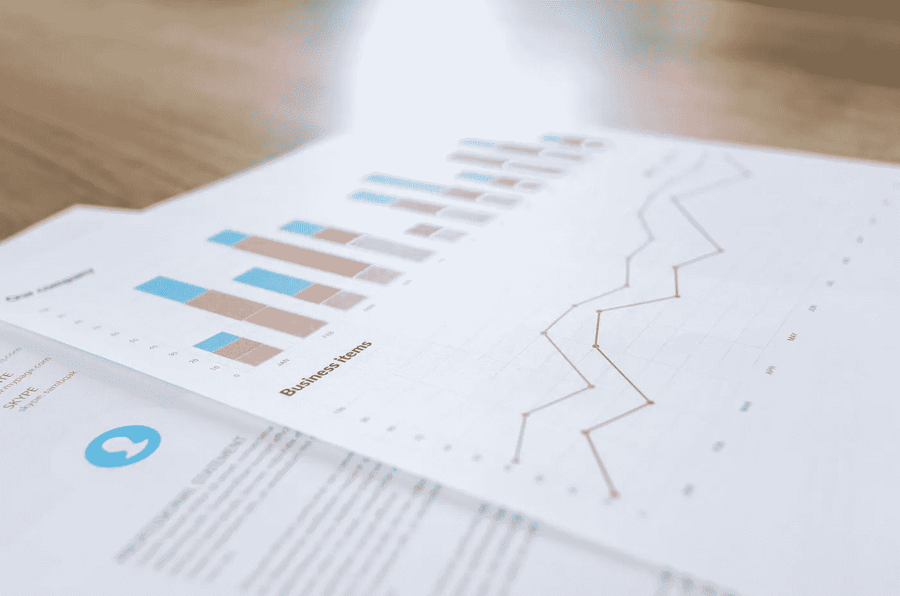
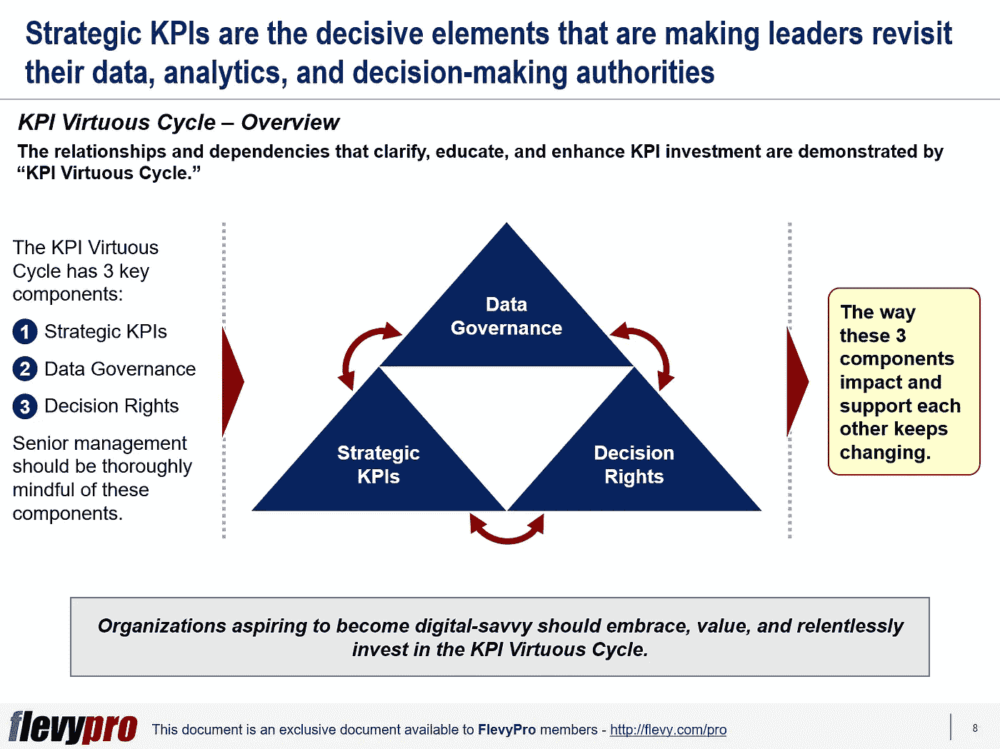

# 战略关键绩效指标(KPI)初级读本:KPI 良性循环介绍

> 原文：<https://medium.datadriveninvestor.com/strategic-key-performance-indicators-kpis-primer-introduction-to-the-kpi-virtuous-cycle-2264e4551962?source=collection_archive---------4----------------------->

技术创新和日益激烈的竞争迫使领导者重新思考他们如何使用[关键绩效指标(KPI)](https://flevy.com/business-toolkit/kpi)来管理和指导组织。数字化不仅增强了关键绩效指标在提高员工绩效方面的重要性，也提升了整个组织的生产力。

KPI 的作用正变得越来越有活力。KPI 在实现战略优势方面变得越来越灵活、聪明和有价值。领先的技术驱动型组织(包括亚马逊、Airbnb 和优步)在很大程度上依赖于指标，并利用 KPI 来指导他们的战略和评估成功。他们对 KPI 的理解与传统的组织完全不同，并将其作为自动化的输入，以指导、管理和改进他们的机器学习工具。

为了充分利用这个数字时代的这些动态的[战略 KPI](https://flevy.com/browse/flevypro/strategic-key-performance-indicators-kpis-4031)，领导者需要更有洞察力和知识。他们应该能够彻底确定要分析哪些 KPI，如何度量它们，以及如何有效地改进它们。理解所选 KPI 的价值及其优化是调整战略的关键；做出投资数据、分析和自动化能力的正确决策；并在人和机器之间建立联系。

# KPI 良性循环

通过“ [KPI 良性循环](https://flevy.com/browse/flevypro/strategic-key-performance-indicators-kpis-4031)”展示了阐明、教育和增强 KPI 投资的关系和依赖关系通过将 KPI、数据和决策数字化链接成良性循环，公司可以将当前形势要求与长期战略规划[保持一致。KPI 良性循环有 3 个关键组成部分，它要求积极的跨职能协作:](https://flevy.com/strategic-planning)

1.  **数据治理**
2.  **关键绩效指标**
3.  **决策权**

这三个组成部分相互影响和支持的方式一直在变化。渴望成为数字通的组织应该接受、重视并坚持不懈地投资 KPI 良性循环。

# 数据治理

KPI 良性循环的第一个组成部分是通过一组实践和流程来管理组织的数据资产，从而运用权威和控制(规划、监控和实施)。领先的数字组织将数据视为一种战略资源、衡量和问责的宝贵工具，以及促进满足战略 KPI 的机制。数据治理框架由战略性 KPI 指导。组织应该知道哪些数据集最适合预测和排序，例如，客户的终身价值和他们的离开倾向，以便优先采取先发制人的预防措施。数据和分析是数据治理的一个组成部分。

# 战略 KPI

战略性 KPI 塑造并管理企业数据治理模型。这些 KPI 包括财务、客户、供应商、渠道和合作伙伴绩效参数。例如，以客户为中心的组织中的数据治理计划被优先考虑，以促进实现以客户为中心的 KPI——例如，[净推介值(NPS)](https://flevy.com/browse/business-document/the-net-promoter-score-nps-3140) 和[客户终身价值(CLV)](https://flevy.com/browse/flevypro/marketing-automation-customer-lifetime-value-3008) 。企业数据治理框架受到战略性 KPI 的强烈影响和启发。

# 决策权

决策权确定了推动业务和战略一致性所需的决策权。以提高组织绩效的方式制定决策包括确定明确参与制定决策的个人，绘制如何制定决策的大纲，使用适当的流程和工具进行强化，以及定义各种决策权场景以促进自动化。然而，当一个企业渴望授权给它的员工并使机器更好地运行时，确定和分配决策权是相当棘手的。

# 创建动态和战略性 KPI 的必要性

为了从战略上定义 KPI 并使其真正动态化，领导层需要通过汇编完整的数据集和执行有意义的分析来提供所需的支持。同时，有必要:

*   决定决策权是否需要分配给个人(而不是机器，反之亦然。
*   增强人和机器的能力。
*   运用决策权来生成数据，以确定和衡量生产力。
*   确定 KPI、数据和决策之间的延迟和瓶颈。
*   以绘制和监控 KPI、数据和决策的方式验证尽职调查。

有兴趣了解更多关于 [KPI 良性循环的组成部分、其应用以及战略性 KPI](https://flevy.com/browse/flevypro/strategic-key-performance-indicators-kpis-4031)的信息吗？你可以在 [Flevy 文档市场](https://flevy.com/browse)点击下载[关于**战略关键绩效指标**的可编辑幻灯片。](https://flevy.com/browse/flevypro/strategic-key-performance-indicators-kpis-4031)

## 你在这个框架中找到价值了吗？

您可以从 [FlevyPro 库](https://flevy.com/pro/library)下载关于这个和数百个类似业务框架的深入介绍。 [FlevyPro](https://flevy.com/pro) 受到 1000 名管理顾问和企业高管的信任和使用。有些人不得不说:

> “我的 FlevyPro 订阅为我提供了当今市场上最受欢迎的框架和平台。它们不仅增加了我现有的咨询和辅导产品和服务，还让我跟上了最新的趋势，为我的实践激发了新产品和服务，并以其他解决方案的一小部分时间和金钱教育了我。我强烈推荐 FlevyPro 给任何认真对待成功的顾问。”

–战略商业建筑师事务所创始人比尔·布兰森

> “作为一家利基战略咨询公司，Flevy 和 FlevyPro 框架和文件是一个持续的参考，有助于我们为客户构建我们的调查结果和建议，并提高他们的清晰度、力度和视觉效果。对我们来说，这是增加我们影响力和价值的宝贵资源。”

–Cynertia Consulting 的咨询区域经理 David Coloma

> “作为一个小企业主，FlevyPro 提供的资源材料已被证明是非常宝贵的。根据我们的项目事件和客户要求按需搜索材料的能力对我来说很棒，并证明对我的客户非常有益。重要的是，能够针对特定目的轻松编辑和定制材料有助于我们进行演示、知识共享和工具包开发，这是整个计划宣传材料的一部分。虽然 FlevyPro 包含任何咨询、项目或交付公司都必须拥有的资源材料，但它是小公司或独立顾问工具箱中必不可少的一部分。”

–变革战略(英国)董事总经理迈克尔·达夫

> “作为一名独立的成长顾问，FlevyPro 对我来说是一个很好的资源，可以访问大量的演示知识库来支持我与客户的合作。就投资回报而言，我从下载的第一个演示文稿中获得的价值是我订阅费用的好几倍！这些资料的质量让我能够打出超出自己体重的水平，这就像是用很小一部分开销就能获得四大咨询公司的资源一样。”

–Roderick Cameron，SGFE 有限公司的创始合伙人

> “我每个月都会浏览几次 FlevyPro，寻找与我面临的工作挑战相关的演示文稿(我是一名顾问)。当主题需要时，我会进一步探索，并从 Flevy 市场购买。在所有场合，我都阅读它们，分析它们。我采纳与我的工作最相关和最适用的想法；当然，所有这些都转化为我和我的客户的利益。"

量子 SFE 公司首席执行官奥马尔·埃尔南·蒙特斯·帕拉

在 [**管理和企业咨询**](https://app.ddichat.com/category/management-and-corporate-consulting) **:** 中安排一个 DDIChat 会话

 [## 专家-管理和企业咨询- DDIChat

### DDIChat 允许个人和企业直接与主题专家交流。它使咨询变得快速…

app.ddichat.com](https://app.ddichat.com/category/management-and-corporate-consulting) 

在这里申请成为 DDIChat 专家[。
与 DDI 合作:](https://app.ddichat.com/expertsignup)[https://datadriveninvestor.com/collaborate](https://datadriveninvestor.com/collaborate)
点击此处订阅 DDIntel [。](https://ddintel.datadriveninvestor.com/)