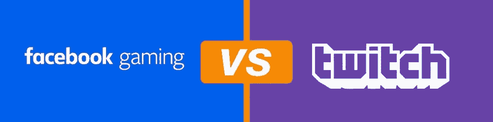
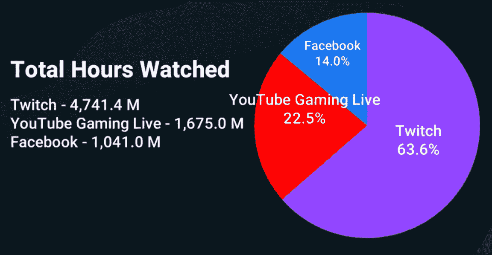
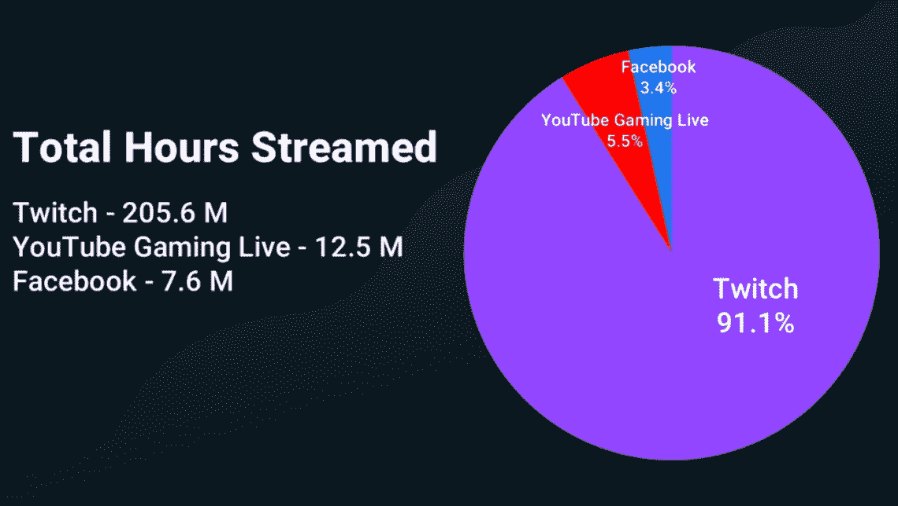
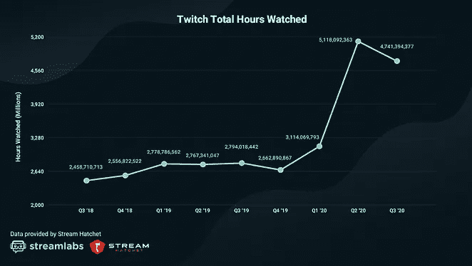
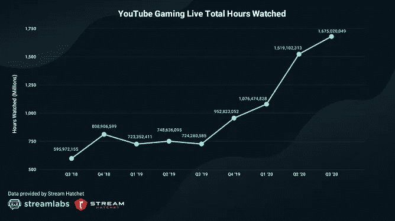
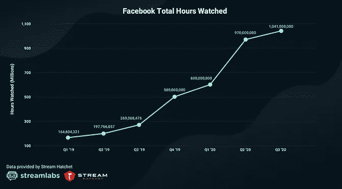

# 与 Twitch 和 YouTube 相比，Streamers 在脸书游戏上赚得更多

> 原文：<https://medium.datadriveninvestor.com/streamers-are-earning-more-money-on-facebook-gaming-vs-twitch-and-youtube-5e586e578b92?source=collection_archive---------2----------------------->

Source: Arte/TechTudo

在我们深入探讨为什么脸书游戏可能是适合你这个新兴玩家的平台之前，我们先来谈谈时间表:

脸书博彩于 2018 年推出。

2011 年 Twitch。

和 2015 年的 YouTube 游戏。

你可能会问，混音器呢？嗯，它关闭了，现在他们把他们的合作伙伴，彩带和观众转移到脸书游戏:

> 7 月 22 日，所有游戏网站和应用将自动重定向到脸书博彩。现有的混音器合作伙伴将被授予脸书博彩公司的合作伙伴地位，任何使用混音器货币化计划的彩带将被授予脸书升级计划的资格。具有杰出会员余额、频道订阅或 Mixer Pro 订阅的 Mixer 观众将获得 Xbox 礼品卡积分。

毫无疑问，Twitch 仍然是最受欢迎的流媒体平台，然而，让我们评估一下图表和调查结果，看看为什么脸书游戏的指数增长不应该被忽视。

Stream Labs & Stream Hatchet 最近发布的一份报告总结了 2020 年第三季度的调查结果，让我们评估一下……好吗？

Image retrieved from [https://streamlabs.com/content-hub/post/streamlabs-and-stream-hatchet-q3-2020-live-streaming-industry-report](https://streamlabs.com/content-hub/post/streamlabs-and-stream-hatchet-q3-2020-live-streaming-industry-report)

看着这些数字，人们会认为 Twitch 肯定是最受欢迎的——不否认它不是，但作为一个正在寻找良好机会的有抱负的 streamer:哪个是最好的平台？

Graph 2.0 Image retrieved from [https://streamlabs.com/content-hub/post/streamlabs-and-stream-hatchet-q3-2020-live-streaming-industry-report](https://streamlabs.com/content-hub/post/streamlabs-and-stream-hatchet-q3-2020-live-streaming-industry-report)

# 突破

对一些人来说，数字没有任何意义，可见性才是。好吧，如果你是其中之一，脸书就是你的能见度元素。这是一个相对较新的领域，与红海相比是一片蓝海——Twitch 和 YouTube。红色的海洋是残酷竞争将水染成血红色的隐喻。因此，一个新的流想要获得能见度应该加入脸书游戏，在那里未开发的深水为你提供了一个探索的机会。

在图 2.0 中，脸书只占整个馅饼的 3.4%，这意味着更少的内容被推出，让你能够**突破**。

此外，脸书的许多横幅广告声称，他们在 FB 上比在 Twitch 上赚得更多。[举个例子，29 岁的哈沃洛克，他在播放《命运 2:暗影守卫》时说:](https://www.businessinsider.com/gamers-earn-more-money-facebook-gaming-twitch-youtube-mixer-streaming-2019-10#:~:text=Gamers%20say%20they're%20earning,than%20on%20Twitch%20and%20YouTube&text=Through%20its%20%22Level%20Up%22%20and,were%20on%20Twitch%20and%20YouTube.)

> “我在脸书赚的钱比在 Twitch 上赚的还多。我不知道这是否是因为我的受众不同，因为我的受众是 25 岁至 30 岁出头的在职人士，这些人有一定的可支配收入，”哈夫洛克说。“我认为人们在脸书上比在 Twitch 上更慷慨了，至少对我个人来说是这样。”

有趣的是，有些人声称，由于脸书平台上的许多人使用他们的真实身份，因此他们更慷慨，毒性更小。

以下是更多数据:

Twitch shows a decline in total hours watched in comparison to FB & YT Gaming

很明显，YouTube 和脸书正在获得更多的关注，然而，考虑到脸书和它最近的出现，与其他两个相比，它正在快速获得关注。

脸书被认为对增长更有利可图。

毫无疑问，流媒体的需求仍在增长。Twitch 已经达到了一个平台期，而如果你是一个小公司，脸书游戏是你的首选。

## 混音器:案例研究

我认为理解 MIXER 失败的原因很重要，因为我们将更好地理解基础经济学是如何工作的。

Mixer 提供了如此多的直播内容，但需求却很少。尽管它们延迟较低(比 Twitch 和 YouTube 低)，这意味着流媒体和聊天可以几乎实时地进行交流。有人会认为，引进像忍者这样的顶级明星，同时每年提供大约 2000 万到 3000 万美元的报酬，让他离开地面搅拌机。可悲的是，搅拌机从未起飞。

微软决定需要一个像脸书这样的巨头来推出它的云游戏平台，而 Mixer 还不够大。因此，联手只会加强信息和资源的交流。

脸书游戏有一天会超过 Twitch 吗？我们会找到答案的。