# 简化您的电子实验室体验

> 原文：<https://medium.datadriveninvestor.com/streamline-your-eeglab-experience-8803c805c5a7?source=collection_archive---------4----------------------->

免责声明:这不是一个全面的 EEGLAB 教程，只是一个关于创建你自己的半自动管道的教程。我强烈推荐你先浏览一下 SCCN 的 EEGLAB 教程[](https://sccn.ucsd.edu/wiki/EEGLAB#The_EEGLAB_Tutorial_Outline)**，如果你还没有的话。**

# *目录*

*[简介](#d91c)
[代码](#79b9)
[流水线 1:无伪像子空间重构](#4651)
∘ [步骤 0:初始化脚本和工作环境](#d84d)
∘ [步骤 1:加载脑电数据](#e40a)
∘ [步骤 2:应用滤波器](#c957)
∘ [步骤 3:历元数据](#1748)
∘ [步骤 4:拒绝不良通道](#e39b)
∘

∘ [第七步:拒绝坏元](#abbe)
∘ [第八步:运行独立分量分析](#8bcd)
∘ [第九步:拒绝坏元](#4d37)
[流水线 2:工件子空间重构(ASR)](#9529)
∘ [第 0 步:初始化脚本和工作环境](#d07a)
∘ [第 1 步:加载脑电图数据](#73ae)
∘ [第 2 步:应用滤波器](#d10b)
∘ [第 3 步:拒绝坏通道](#2f15)
∘ [第 4 步:内插移除的通道](#2a07)
∘ [第 5 步:重新引用平均值](#4137)
∘ [第 5 步](#790f)
∘ [第七步:历元数据](#8ac0)
∘ [第八步:运行独立组件分析](#86e4)
∘ [第九步:拒绝不良组件](#ca5d)
[定制你的流水线](#940a)
∘ [添加并重新排列块](#848e)
∘ [添加 EEGLAB 内容](#6c4c)* 

# *介绍*

*当涉及到 EEG 处理时，就像许多形式的神经生理学数据处理一样，它在某种程度上是一种“艺术形式”虽然确实有您应该遵守的标准，但是不同处理工具和方法的功效是有争议的。许多研究都致力于寻找最佳步骤和管道结构，但仍有余地。*

*Arnaud Delorme 开发的交互式 Matlab 工具箱 EEGLAB 是处理 EEG、MEG 和其他电生理数据的最佳平台之一。它为用户提供了丰富的工具和资源，具有广泛的预期用途。*

*EEGLAB 的独特之处在于它的交互式图形用户界面(GUI)。(有关使用 EEGLAB GUI 的教程，请参见此[链接。](https://sccn.ucsd.edu/wiki/EEGLAB#The_EEGLAB_Tutorial_Outline))虽然 GUI 在使预处理更加直观方面非常出色，但将 GUI 实验转化为可以批量运行的标准化脚本也很有帮助，尤其是在进行具有许多受试者和条件的大规模研究时。*

*创建一个**预处理管道，一组特定的数据处理元素串联在一起，**是非常重要的，因为它将确保您对所有数据应用相同或相似的技术。此外，养成尽可能自动化的习惯而不失去人情味(或理解你自动化了什么)通常在生活中是有用的。*

*我写这篇文章既是为了演示处理 EEG 数据的重要步骤，也是为了举例说明如何在 EEGLAB 中实现处理流程的自动化。这些步骤大致基于 [Makoto 的预处理管道](https://sccn.ucsd.edu/wiki/Makoto's_preprocessing_pipeline)，这是一个很好的资源，它更深入地解释了每个步骤背后的推理。请记住，这只是两种预处理方法。您可能希望使用我在文章底部提供的资源来试验不同的方法。*

*我将通过管道运行的方式如下:*

1.  *我将用来自 EEGLAB 的样本数据引导您运行每个管道，并向您展示预期的图形和 GUI 弹出窗口。*
2.  *我还将描述代码的具体行是做什么的，这样您就可以开始习惯于用脚本/命令行而不仅仅是 GUI 来编码。行号指的是代码段中的行的位置，而不是“母代码”(你可以在我的 GitHub 中找到这个，我已经在下面提供了。)*
3.  *最后，我将告诉您如何使用我的代码作为基础来调整管道或创建自己的管道。*

# *代码*

*你可以在这里下载我的代码以及执行它所需的辅助工具[。](https://github.com/daniellegruber/EEG-Preprocessing)*

*   *“管道”文件夹包含与每个管道相关联的脚本。为了运行管道，只需在 MATLAB 中打开它，然后单击“运行”不需要进一步的行动，除了您在数据处理决策方面的互动。*
*   *文件夹“eeglab2019_1”包含所有的 eeglab 工具。你可以在这里下载一个更新的版本[，尽管这个版本运行得非常好。](https://sccn.ucsd.edu/eeglab/index.php)*
*   *文件夹“altmany-export_fig-4703a84”包含用于导出图形的工具。你可以在这里找到这个文件夹[的 GitHub，只是因为我想把功劳归于作者。](https://github.com/altmany/export_fig)*

# *管道 1:没有人造物品子空间重建*

**如果你是脑电图预处理的新手，我建议你从这条管道开始，因为它涉及更多的“动手”数据解释。换句话说，它要求你在拒绝不良数据和渠道时运用更多的判断力。虽然这可能看起来违反直觉，因为你可能还不相信自己的判断，但它将帮助你建立对好数据和坏数据的理解，而不是简单地依赖算法为你工作。毕竟，算法对于脑电图数据来说并不是“一刀切”的，因为不同的实验条件会有很大的不同。你必须能够判断出什么时候算法对你的数据表现不好。**

*请注意，以下部分不属于“母代码”提醒一下，行号指的是代码段中的行位置，而不是母代码中的行位置。*

## *步骤 0:启动脚本和工作环境*

*当您第一次运行该脚本时，系统会提示您选择希望开始处理的步骤(*第 3 到 7 行)*。如果您是第一次运行脚本，请选择第一步，即“加载数据”在脚本的后续运行中，您可以选择其他步骤，这样您就不必重复之前已经运行过的步骤。*

*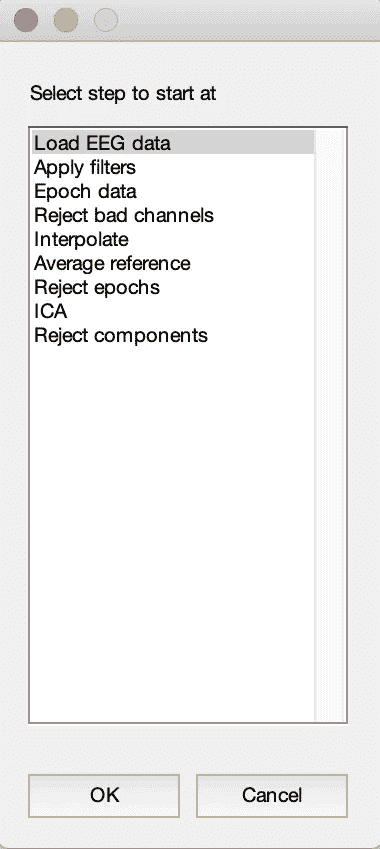*

*接下来，系统会提示您是否要选择以前运行的目录。由于这将是您第一次运行脚本，请选择“否”。您可以在后续运行中选择“是”。*

*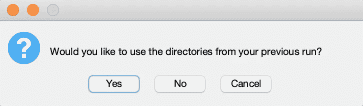*

*然后会提示您选择三个重要目录的位置(*第 19 行到第 31 行*):*

*   *工作目录。这是包含所有其他文件夹的目录，例如 EEGLAB 和 pipeline 文件夹。(请注意，大多数提示会出现在命令窗口中，因此请务必密切关注。)*

*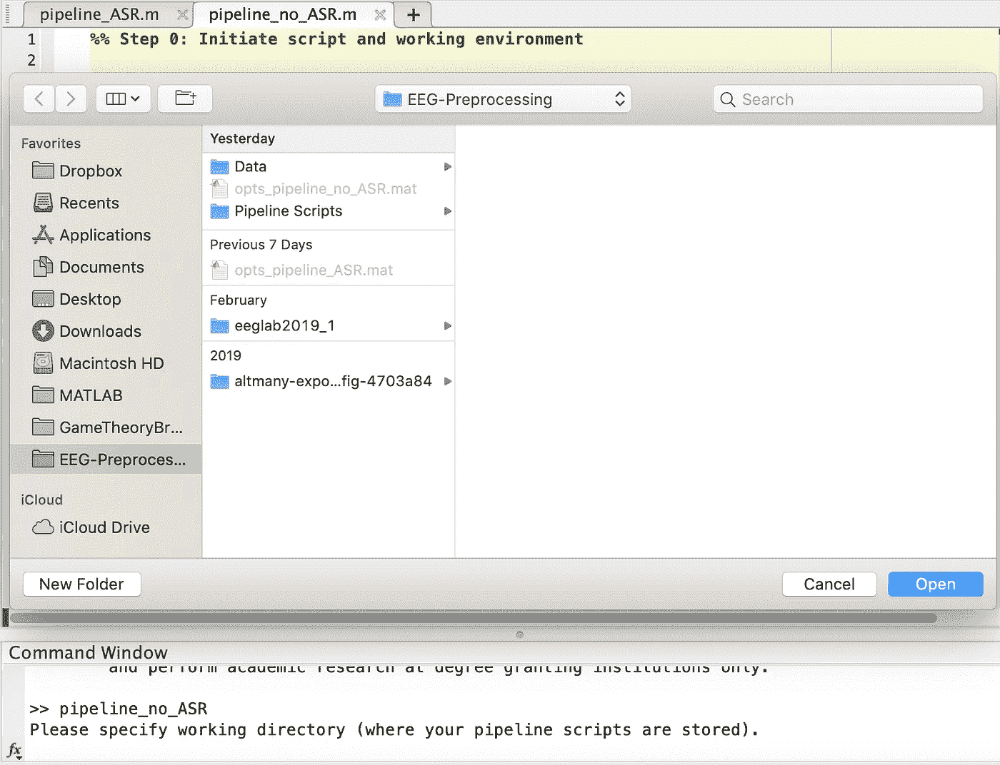*

*   *EEGLAB 目录。这是 eeglab2019_1 文件夹。当 eeglab 加载时，你会看到一些东西出现在命令窗口中。*

*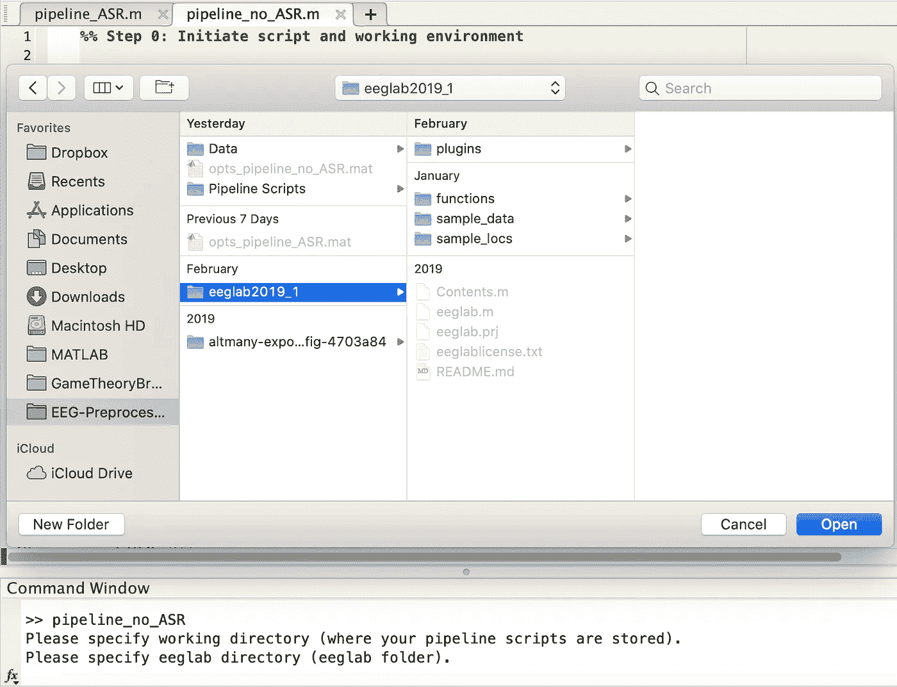*

*   *数据目录。正如你将在我的 GitHub 资源库中看到的，这将是你工作目录中的一个名为“Data”的文件夹。*

*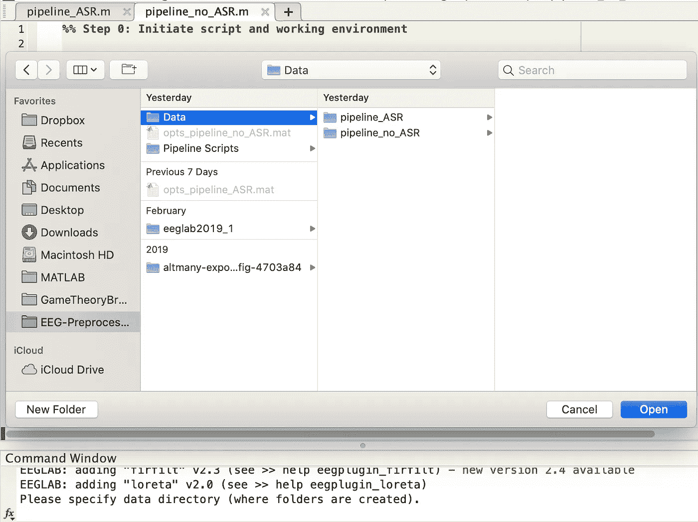*

*接下来，您将被要求选择频道位置文件(*第 33 到 37 行*)。对于本例，您将通过导航到 EEG lab 2019 _ 1/sample _ data/EEG lab _ chan 32 . locs 找到该文件。*

*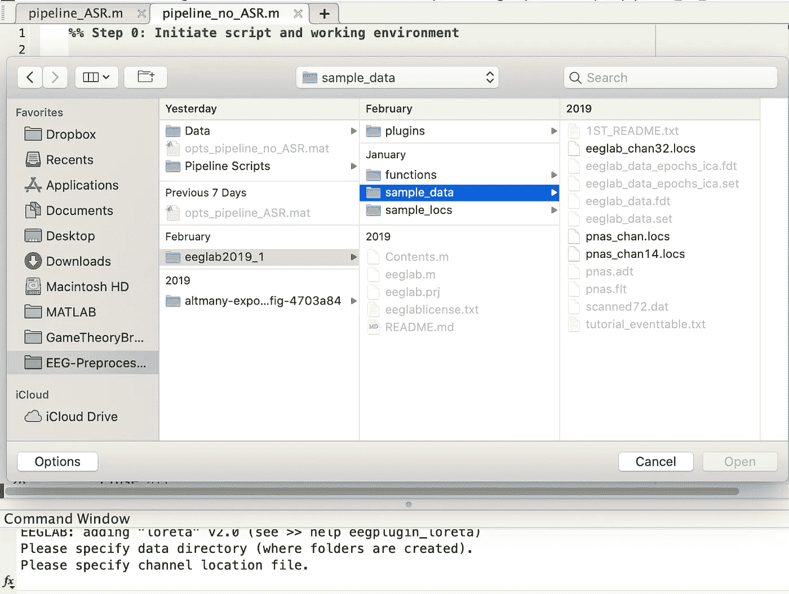*

*最后，通过在命令窗口中输入名字，你将被要求为所有文件附加一个名字(*第 40 到 44 行*)。对于这个示例，您可以使用诸如“sample”这样的名称，但是在其他情况下，您可能希望选择更具描述性的名称，比如主题名称和条件的组合。*

*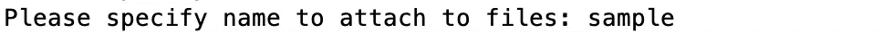*

*将在您的数据目录中创建两个新文件夹，一个名为“pipeline_no_ASR”，一个名为“sample”或您选择的任何名称的子文件夹(*第 45 至 49 行*)。为不同的管道创建不同的文件夹，因为当您进行必须处理大量受试者的研究时，您希望确保处理的一致性。这些文件夹避免了根据不同管道处理的数据之间的混淆。*

## *步骤 1:加载脑电图数据*

*完成后，您将被要求加载一个数据集来使用(*第 3–5 行*)。对于此示例，您将通过导航到 EEG lab 2019 _ 1/sample _ data/EEG lab _ data . set 来选择文件。*

*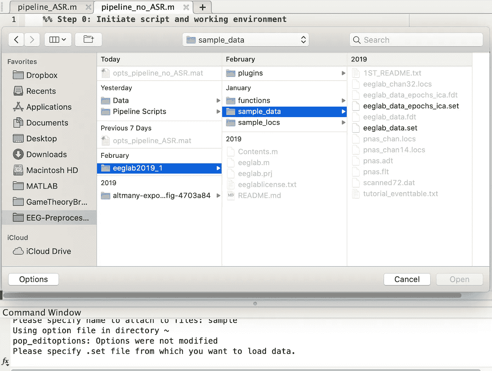*

*如果采样率太高，脚本将对数据进行缩减采样(*第 9 行到第 13 行*)。最后，脚本将加载通道位置(*第 17-18 行*)。*

## *步骤 2:应用过滤器*

*然后，您将过滤 1–30Hz 的数据(*第 7–8 行*)。这样做是因为脑电图的频率范围约为 3-14Hz。高于 30Hz 的频率很可能来自外部电子源，必须予以抑制。(更深入的解释见 [Makoto 的预处理流水线](https://sccn.ucsd.edu/wiki/Makoto's_preprocessing_pipeline#High-pass_filter_the_data_at_1-Hz_.28for_ICA.2C_ASR.2C_and_CleanLine.29.2809.2F23.2F2019_updated.29))。会出现这样一个图形:*

*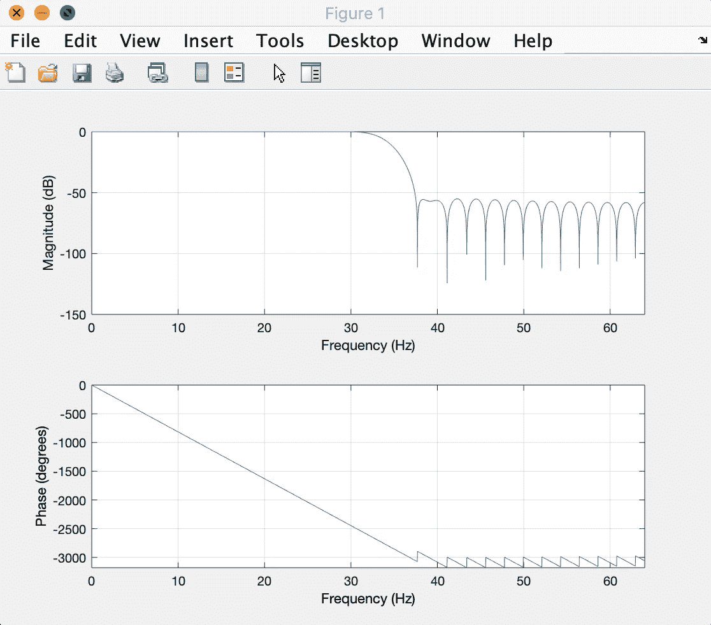*

*请注意，低通滤波器和高通滤波器是顺序应用的，而不是一次应用。这是因为高通区域的截止频率；由于它非常接近 0 Hz，因此分配给带通滤波器的阶数可能足以满足“高通”区域的要求，但不足以满足“低通”区域的要求，如果试图提高阶数，滤波器可能会变得不稳定。*

## *步骤 3:历元数据*

*为了研究与特定实验刺激相关的动力学，脚本随后将刺激开始前后的-1 至 2 秒的数据进行分段(*第 6 至 7 行*)。*

*ICA 之前的电子缓存允许算法聚焦于感兴趣的周期，并避免不相关的动态。请注意，我们可以这样做，因为在与我们使用的示例数据集进行电子缓存后，我们有足够数量的数据点(即(通道数)x 30)。*

*该脚本将询问您是否希望基线正确(*第 11 行到第 15 行*)。*

**

*基线校正有优点也有缺点:*

***优点:**根据 SCCN 的 [EEGLAB 教程](https://sccn.ucsd.edu/wiki/Chapter_05:_Extracting_Data_Epochs)，“当数据时段之间存在基线差异(例如，由低频漂移或伪像引起的差异)时，从每个时段移除平均基线值是有用的。这些是没有意义的解释，但如果留在数据中，可能会扭曲数据分析。”*

***缺点:**根据 [Makoto 的预处理流水线](https://sccn.ucsd.edu/wiki/Makoto's_preprocessing_pipeline#Epoch_data_to_-1_to_2_sec_.2809.2F11.2F2019_updated.29)，一位研究人员“报告称，如果在 ICA 之前减去短基线，如-100 到 0 ms，会使 ICA 性能变差。这是因为这种短基线的平均值很容易受“背景”阿尔法节律的影响而波动，例如，它会独立地改变所有通道的 DC 水平…对于 ICA 来说，这是一种非常糟糕的情况。基线周期越长，您就越接近先前应用的高通滤波器，该滤波器保证均值为零，因此更安全。实际上，只要数据经过适当的高通滤波，就没有必要在这里“校正基线”，这样我们就可以将混淆 ICA 的风险降到最低。”*

*总的来说，只要基线周期足够长(至少 500 毫秒)，您就可以选择删除基线。对于这个例子，我选择删除 1000 ms 的基线周期，所以我们很好。*

## *第四步:拒绝不良渠道*

*一般来说，坏通道是那些即使你拒绝了 5-10%的数据点也无法保存的通道。去除不良通道至关重要，尤其是在平均参考之前，因为参考是所有通道的平均值。噪声信道会将噪声引入所有信道数据。*

*在本节中，系统将提示您首先通过肉眼移除不良通道(*第 9 行到第 13 行*)。在第一个弹出窗口中，保留默认设置，然后选择“确定”*

*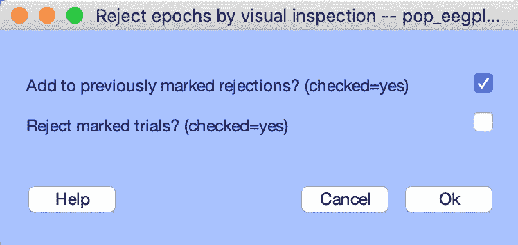*

*下一个弹出窗口将显示所有通道数据，以便您可以用眼睛检查。通过更改“标度”文本框的值并按“输入”来增加电压标度。我选了 79。这将有助于您更清楚地看到频道数据。您可以使用底部的箭头滚动浏览频道数据。*

**

*在这个例子中，如果您滚动数据，您可以确定 EOG1 和 FPz 有点“混乱”但是为了便于举例，假设您仅通过目测捕获 EOG1。当您滚动足够多的内容并记下您想要删除的频道时，请关闭此窗口。*

*将出现另一个弹出窗口，您可以在其中选择要删除的频道(只需担心第四个字段)。单击省略号。*

*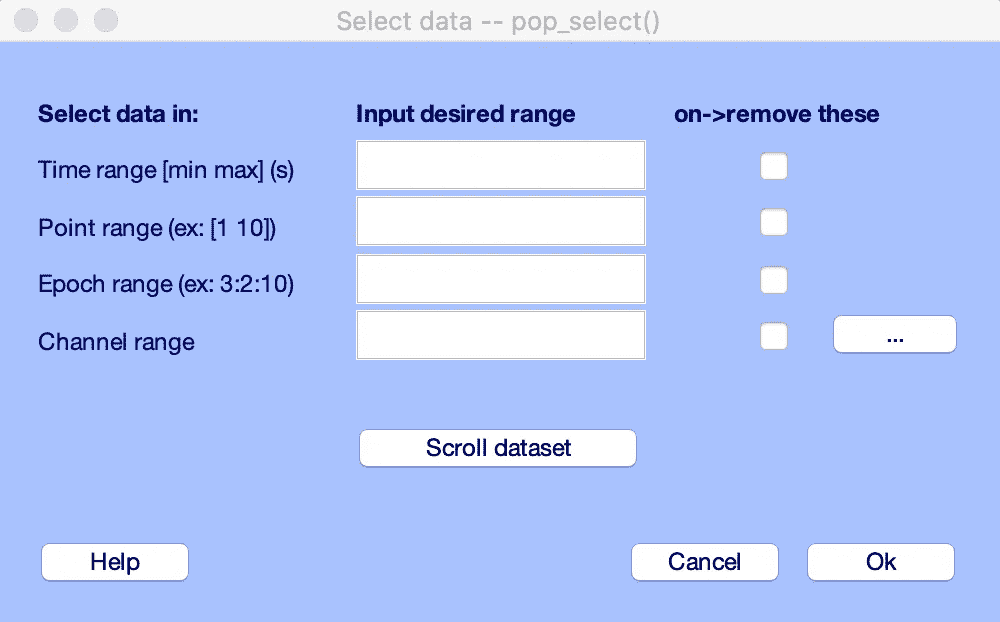*

*您将看到这个弹出窗口，允许您选择想要删除的频道。*

*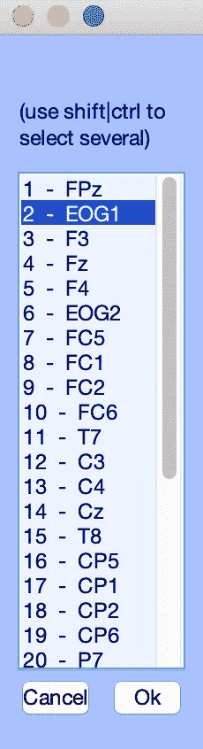*

*单击“确定”后，第一个弹出窗口将自动更新。确保您选择了右侧的复选框，否则您将删除除 EOG1 之外的所有频道*。**

*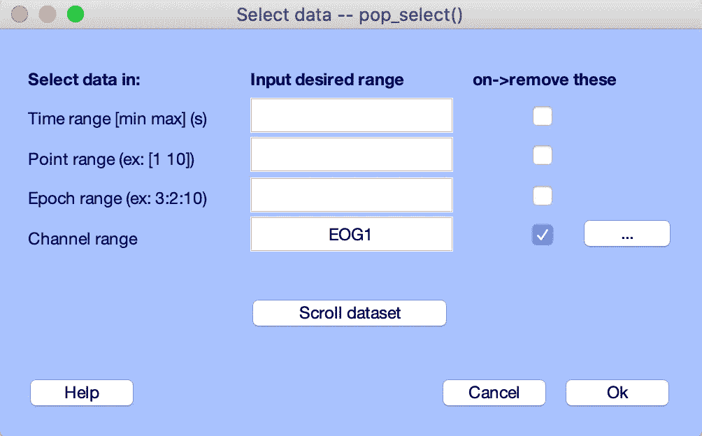*

*接下来，您可以使用 pop_rejchan 或 pop_cleanrawdata 来捕捉您可能错过的任何频道(*第 26 到 29 行*)。您可以使用不同的参数尝试任意多次，因为脚本允许您查看拒绝的结果，如果您对结果不满意，可以选择新的方法和参数集。*

**

*我推荐从 pop_rejchan ( *第 59 行*)开始，因为它使用了比 clean_rawdata ( *第 37 行*)更简单的标准。默认值拒绝峰度大于 5 的通道。它通常工作得很好，但是你可以随意尝试不同的方法，看看它们是如何影响结果的。*

*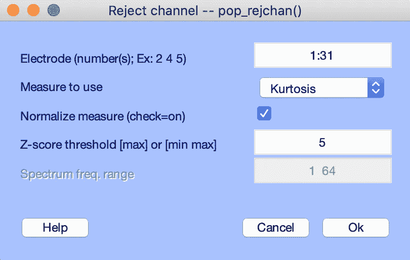*

*单击“确定”后，您将在弹出窗口(它们将以红色突出显示)和命令窗口中看到哪些通道被拒绝。确保你滚动浏览以确定你同意这个决定。*

*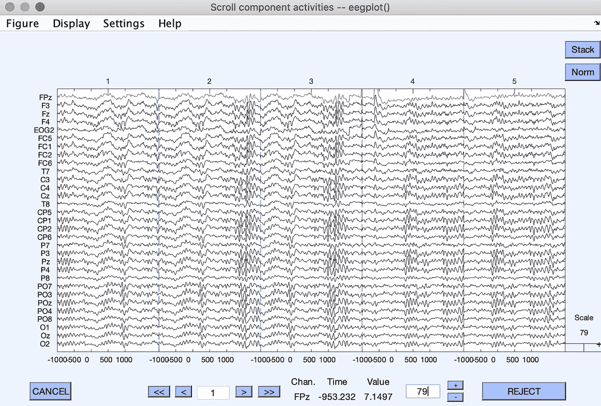*

*从弹出窗口和命令窗口中，您可以看到 FPz 已被标记为坏通道。根据您的调查，这似乎是合理的，因此请单击“拒绝”继续。*

*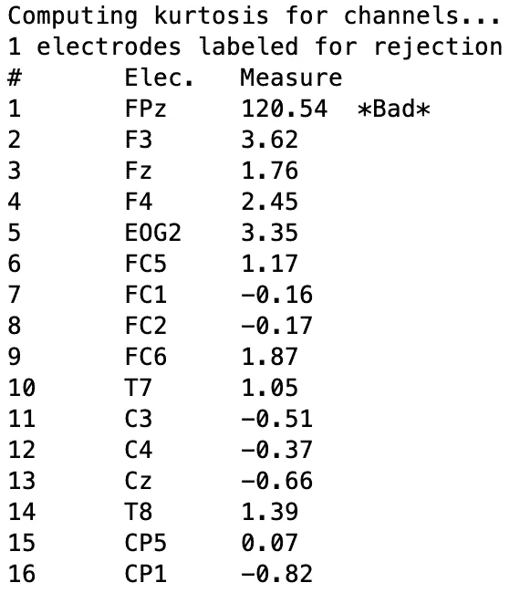*

*然后你会看到这个弹出窗口。只要按“确定”*

*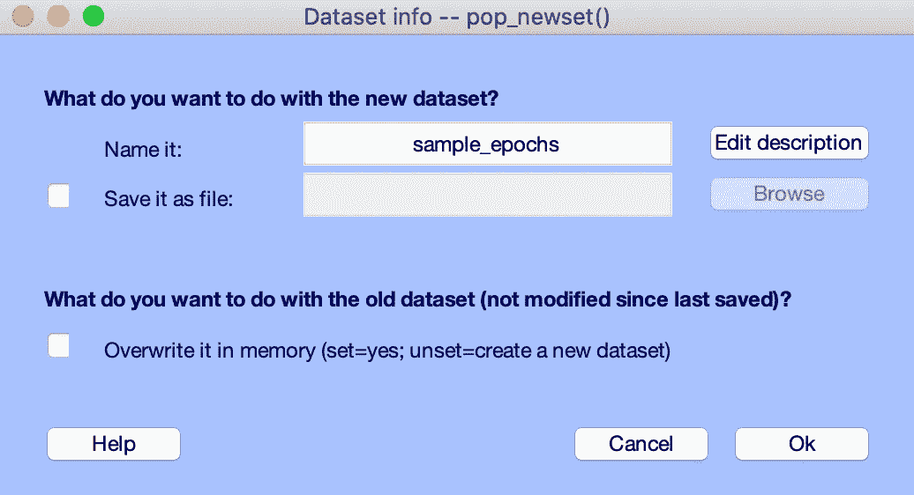*

*如果您认为您想尝试不同的方法或参数集，您可以通过在下一个弹出窗口中选择“是”来再次完成该过程。如果你准备好继续前进，选择“否”*

*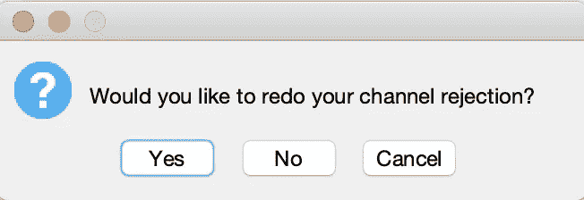*

## *第五步:插值删除通道*

*插值有助于防止下一个平均参考阶段的偏差。这里有一个来自 Makoto 预处理管道的例子:假设有 64 个通道，16 个从右半球被拒绝。那么左半球与右半球的通道比率将是 32:16，从而使平均值偏向左半球。插值确保了更“平衡”的平均值。*

*该脚本对步骤 4 中移除的所有通道进行插值(*第 20 行*)。*

## *第 6 步:重新参考平均值*

*有多种有效的方法来引用 EEG 数据，但 Makoto 的预处理管道建议使用平均引用，因为这个概念很简单，只需要记录的数据，它近似头皮电位，与头皮上的位置无关。*

*该脚本在第 7 行*处引用了平均值。**

## *第七步:拒绝不好的时代*

*在该块中，将出现一个弹出窗口，其中包含不同的统计数据，您可以使用这些数据来拒绝 epoch(*第 10 行*)。使用 Makoto 预处理管道中的标准，我将首先应用-500 到 500 uV 的振幅阈值。*

*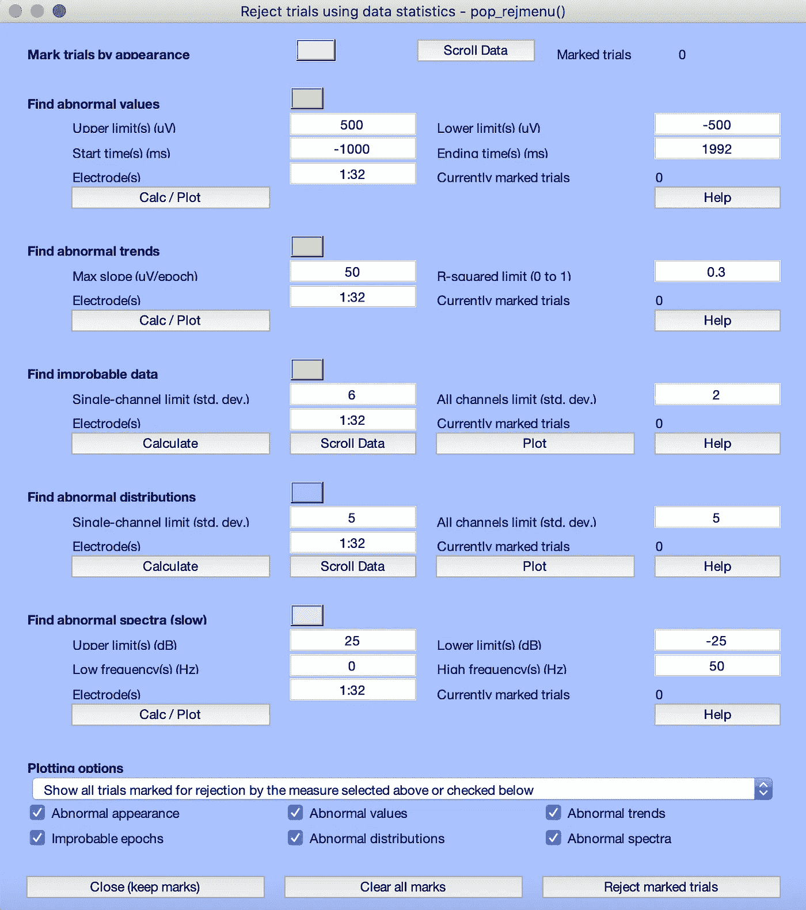*

*选择“Calc/Plot ”(计算/绘图),查看哪些时期被拒绝。(在本例中，不会标记任何时期)。完成后，在弹出窗口中选择“更新标记”。*

*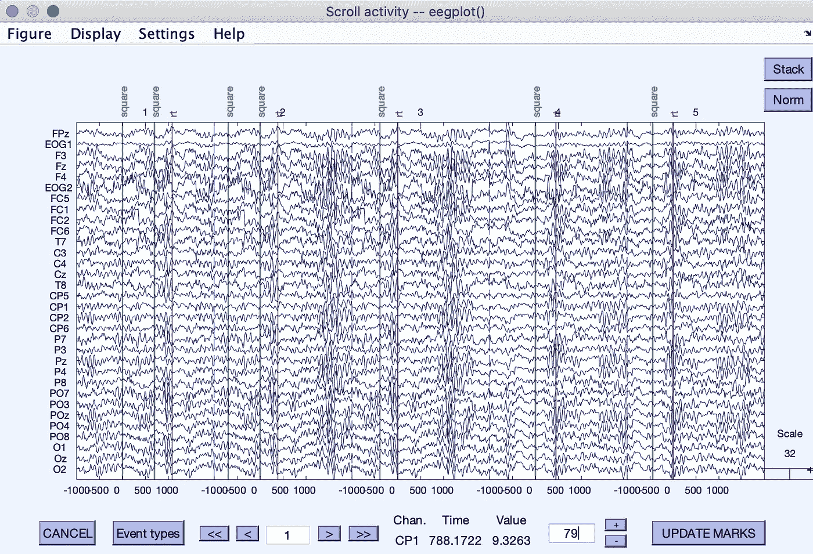*

*接下来，使用原始弹出窗口，键入 6SD 作为单通道概率测试的标准，键入 2SD 作为所有通道的标准。选择“计算”执行测试。要查看哪些时期被标记为拒绝，请点按“滚动数据”在这个例子中，应该标记大约七个。*

*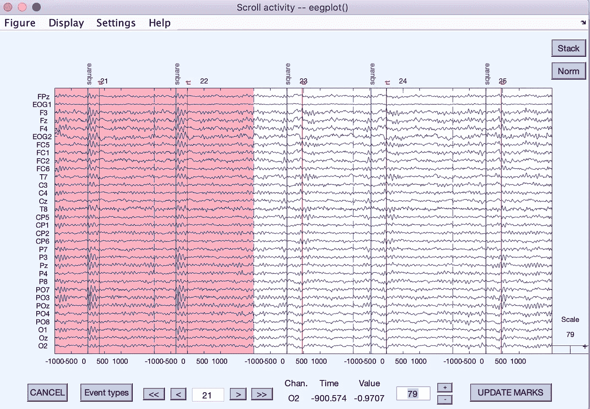*

*如果你愿意，你可以在拒绝菜单中添加更多的统计数据，或者选择“拒绝标记的试验”进行下一步目标是大约 5-10%的拒绝率。例如，本例中使用的数据集最初有 153 个历元，所以您想要拒绝 7 到 15 次尝试(我已经拒绝了 7 次)。选择“是”，然后关闭下图继续。*

*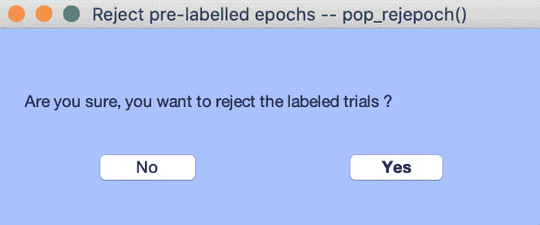**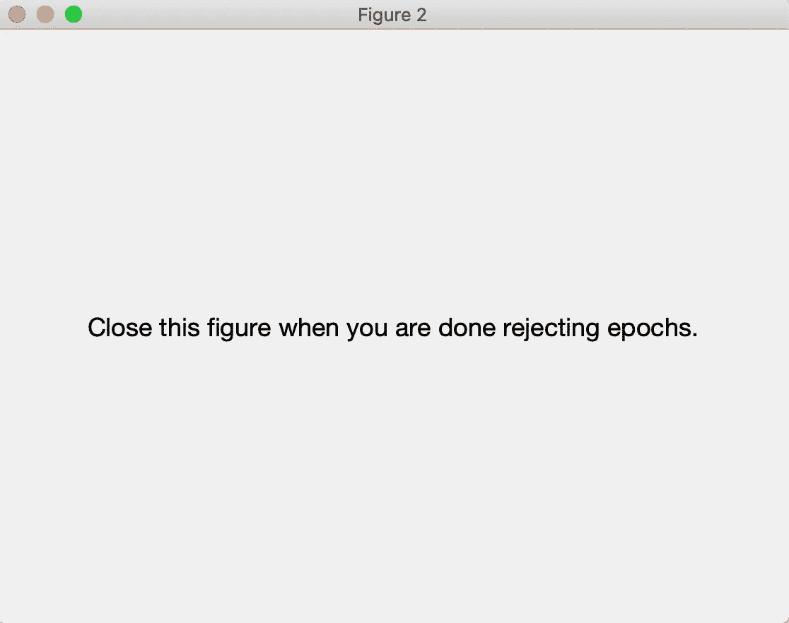*

## *步骤 8:运行独立成分分析(ICA)*

*根据 EEGLAB 背后的大脑 Arnaud Delorme 的说法，ICA 的一个快速概要:*

> *独立分量分析是一种信号处理方法，用于分离线性混合在多个传感器中的独立源。例如，当在头皮上记录脑电图(EEG)时，ICA 可以分离出嵌入数据中的伪像(因为它们通常是相互独立的)。*

*你可以在这里阅读更多关于什么是 ICA[以及如何在 EEGLAB](http://arnauddelorme.com/ica_for_dummies/) [中实现 ICA 的内容在这里](https://sccn.ucsd.edu/wiki/Chapter_09:_Decomposing_Data_Using_ICA)。*

*运行 runica 算法(*第 8 行*)会在 Matlab 命令行上产生以下文本:*

*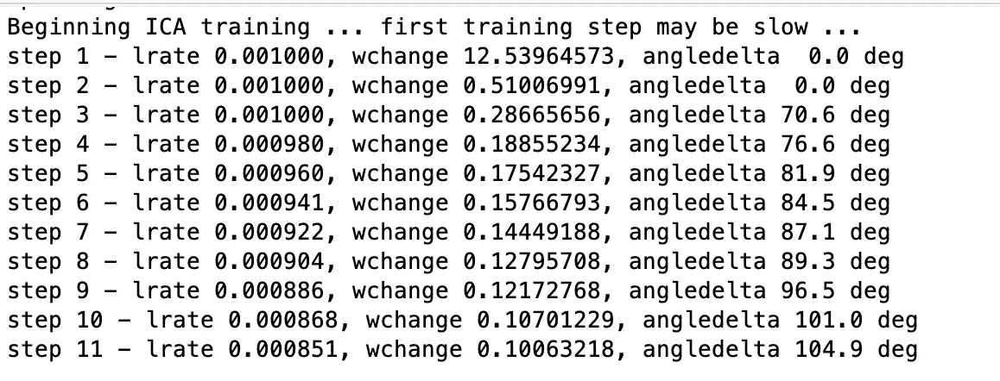*

*当 w 改变< 1e-007 or after 512 steps.*

## *Step 9: Reject bad components*

*This block will allow you to study component properties and label components for rejection (*线 6* 时，训练将结束。*

**

*在这个例子中，前几个组件(解释最大差异的组件)没有一个与诸如眼睛或肌肉组件之类的伪影非常相似。拒绝超过前五个的组件是没有意义的。另外，通常最好不要疯狂地拒绝太多组件。*

*参见[此链接](https://labeling.ucsd.edu/tutorial/labels)获取一个非常有用的关于贴标签剔除组件的教程。*

*一旦您完成了对要拒绝的组件的标记，按“确定”如果您拒绝了组件，将出现第二个弹出窗口，要求您确认。*

# *管道 2:伪像子空间重建(ASR)*

## *步骤 0:启动脚本和工作环境*

*除了列出的步骤之外，几乎与前面管道中的步骤 0 相同。*

## *步骤 1:加载脑电图数据*

*与前面管道中的步骤 1 相同。*

## *步骤 2:应用过滤器*

*与前面管道中的步骤 2 相同。*

## *第三步:拒绝不良渠道*

*与前面管道中的步骤 4 相同。您将看到的唯一区别是，通道数据弹出窗口将是连续的，而不是连续的。*

*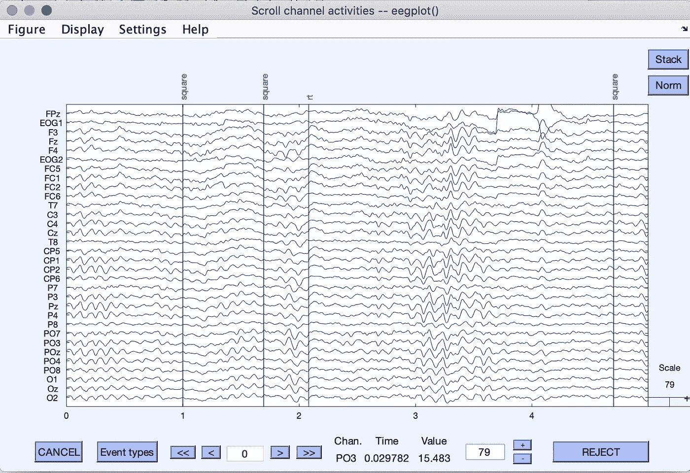*

*我们之所以不在这个流水线中剔除不良通道之前进行 epoch，是因为 ASR 需要连续的脑电数据。*

## *第四步:插值删除通道*

*与前面管道中的步骤 5 相同。*

## *步骤 5:重新参考平均值*

*与前面管道中的步骤 6 相同。*

## *步骤 6:伪像子空间重建(ASR)*

*在第一流水线中拒绝坏数据的方法(步骤 7:拒绝坏时段)的一个缺点是，短时间的伪像突发会污染它出现的整个时段。ASR 允许您解决这个问题。*

*简而言之，ASR 使用滑动窗口(默认 0.5 s，重叠 50%)进行 PCA-分解所有通道，以识别坏 PC。然后，该算法拒绝并从剩余组件中重建被拒绝的 PC 活动。*

*将出现一个弹出窗口，要求您输入 ASR 的参数(*第 12 行*)。*

*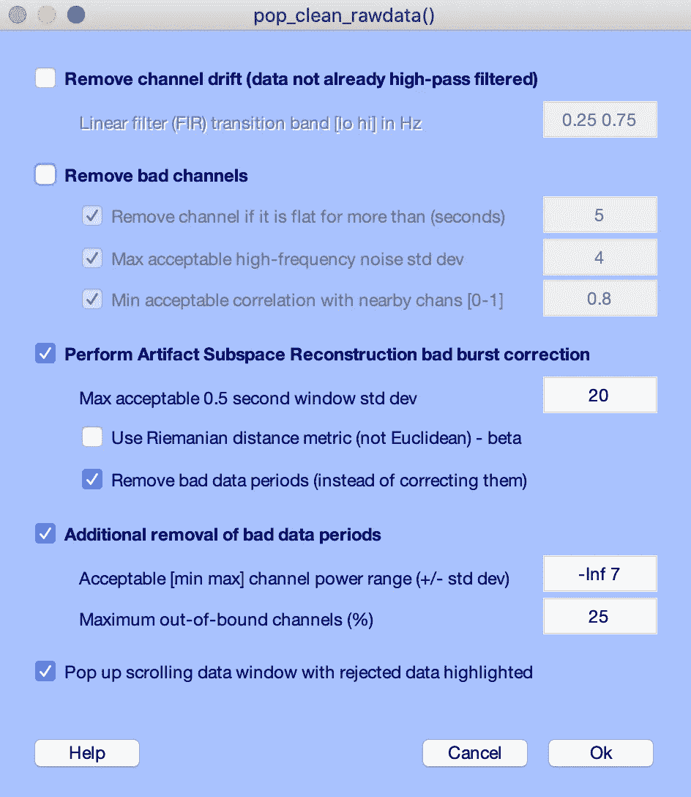*

*   *取消选择“已删除坏频道”的复选框您已经在步骤 3 中删除了坏频道。*
*   *选择“执行伪像子空间重建错误突发校正”复选框[建议](https://sccn.ucsd.edu/wiki/Artifact_Subspace_Reconstruction_(ASR))从 10 到 20 的 SD 开始。*
*   *选择“错误数据周期的附加删除”框*

*在新的弹出窗口中检查修改后的数据。*

**

*如果您发现有太多数据被拒绝，您可以在“最大可接受的 0.5 秒窗口标准差”框中使用较低的值(即使用 ASR 更正更多)，并在“最大出界通道(%)”框中使用较高的值(即拒绝较少的窗口)。当询问您是否要再次执行 ASR 并输入新参数时，选择“是”。否则，您可以单击“否”并继续。*

**

*有关在 clean_rawdata 中使用 ASR 的更多信息，请查看[这一页。](https://sccn.ucsd.edu/wiki/Artifact_Subspace_Reconstruction_(ASR))*

## *步骤 7:历元数据*

*与前面管道中的步骤 3 相同。*

## *步骤 8:运行独立组件分析*

*与前面管道中的步骤 8 相同。*

## *第九步:剔除不良组件*

*与前面管道中的步骤 9 相同。*

# *定制您的管道*

## *添加和重新排列块*

*正如您在上面的代码摘录中注意到的，除了 0 和 1 之外，每个步骤(代码块)的结构如下:*

```
*%% Step [number]: Step [name]if idx <= [number] if idx == [number]
      [load dataset from step (number-1)]
   end ... [save dataset this step]end*
```

*这样，如果您选择从“加载 EEG 数据”之外的步骤开始，您可以这样做，因为每个步骤的数据集都已保存，可以轻松检索。*

*因此，如果您想添加或重新排列区块，请根据上面的内容构建内容。给出一个描述性的名称并找到步骤的编号，将步骤的名称作为字符串插入到步骤 0 的步骤列表中。例如，如果您插入了您在下面的代码片段中看到的新步骤，那么新步骤的编号将是 8。*

```
*steps = {'Load EEG data','Apply filters','Reject bad channels','Interpolate','Average reference','ASR','Epoch','[new step]', 'ICA','Reject Components'};*
```

*接下来，将代码块插入代码中适当的位置。例如，上面的新步骤将被插入到步骤 7 和现在的步骤 9 之间。确保在插入后更新步骤的编号。*

## *添加 EEGLAB 内容*

*现在，对于内容。假设您喜欢 EEGLAB GUI 工具之一，并希望将它包含在您的管道中。例如，您可能想要用头皮图绘制渠道 ERP。*

*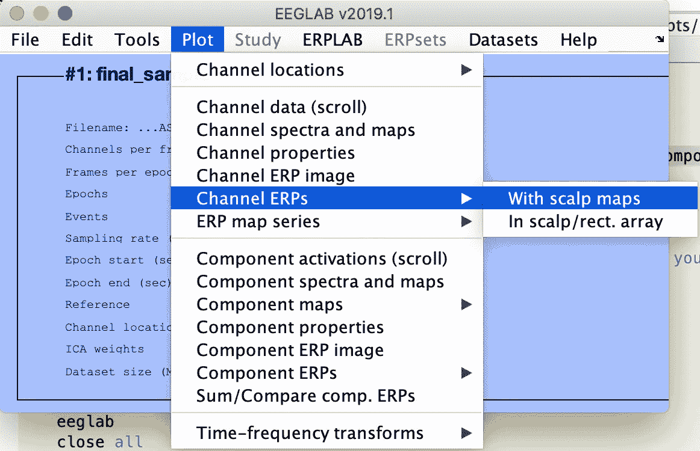*

*如果您从 EEGLAB 窗口中选择此选项，将会出现一个新的弹出窗口。请注意，在顶部的灰色栏中，有一个函数 pop_timtopo。*

*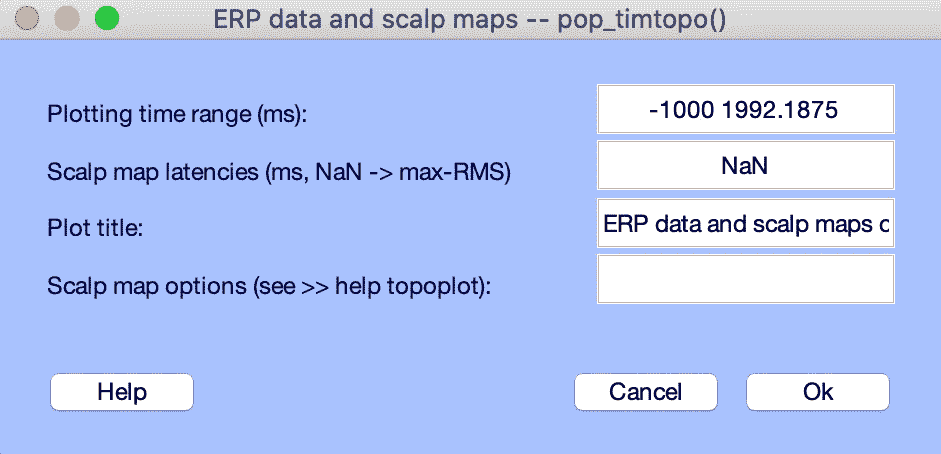*

*现在您已经有了所需函数的名称，在 EEGLAB 文件夹中搜索该函数并打开它。*

*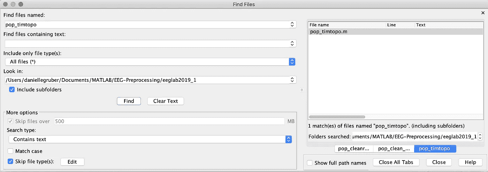*

*您将看到在管道中运行它时必须输入哪些参数。*

*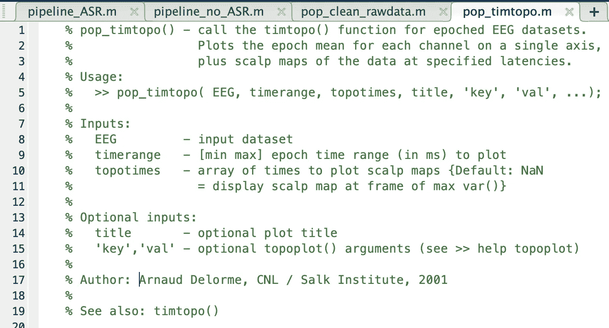*

# *关于作者*

*👋我是 Danielle Gruber，是一名 17 岁的知识社会的创新者，对神经科学、计算机科学、数学以及介于两者之间的任何事物都有特别的兴趣。*

*联系我👇*

*[LinkedIn](https://www.linkedin.com/in/danielle-gruber-8946591a8/)*

*[中型](https://medium.com/@danielle.l.gruber)*

*Gmail:danielle.l.gruber@gmail.com*

***访问专家视图—** [**订阅 DDI 英特尔**](https://datadriveninvestor.com/ddi-intel)*

# *引用的来源和进一步阅读*

*[https://sccn . ucsd . edu/wiki/EEGLAB # The _ EEGLAB _ Tutorial _ Outline](https://sccn.ucsd.edu/wiki/EEGLAB#The_EEGLAB_Tutorial_Outline)*

 *[## Makoto 的预处理流水线

### Arnaud de lorme(EEG lab 的主要开发人员)的注释:也可参见本页，了解拒绝 ICA 组件的快速途径…

sccn.ucsd.edu](https://sccn.ucsd.edu/wiki/Makoto%27s_preprocessing_pipeline)* 

*[https://sccn . ucsd . edu/wiki/Artifact _ Subspace _ re construction _(ASR)](https://sccn.ucsd.edu/wiki/Artifact_Subspace_Reconstruction_(ASR))*