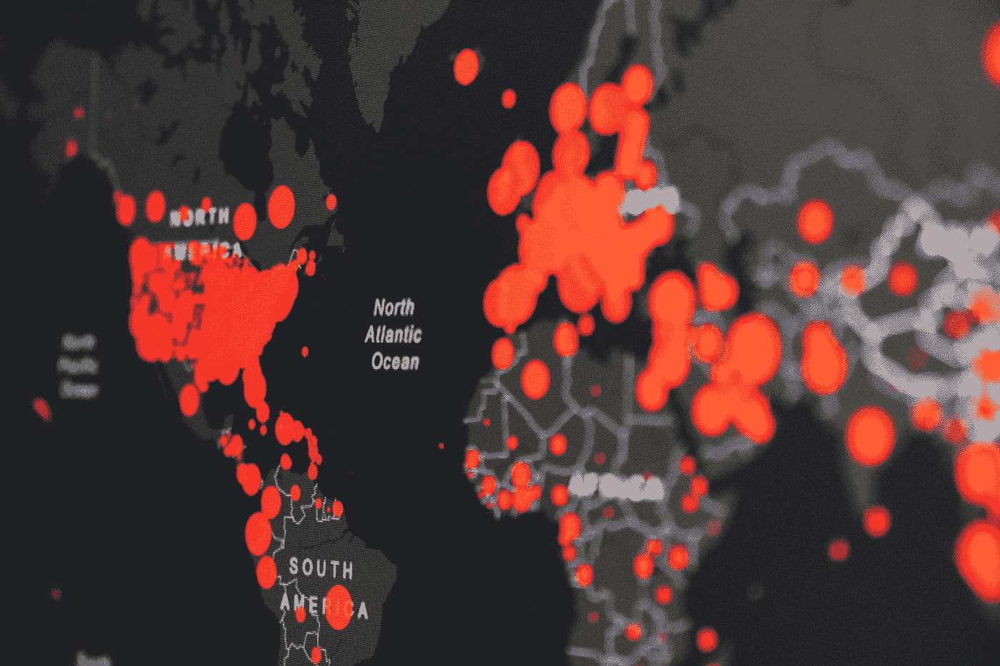
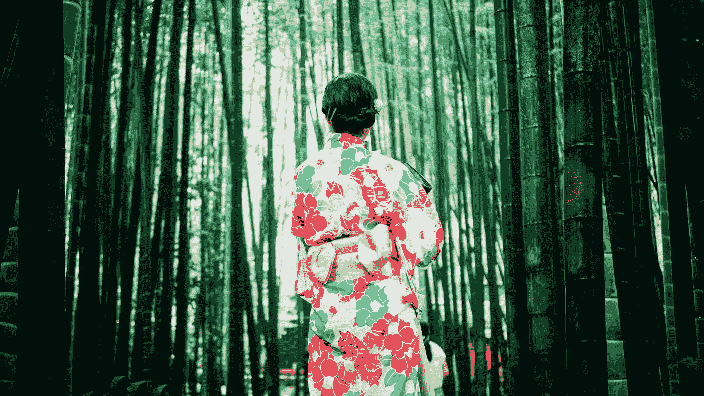
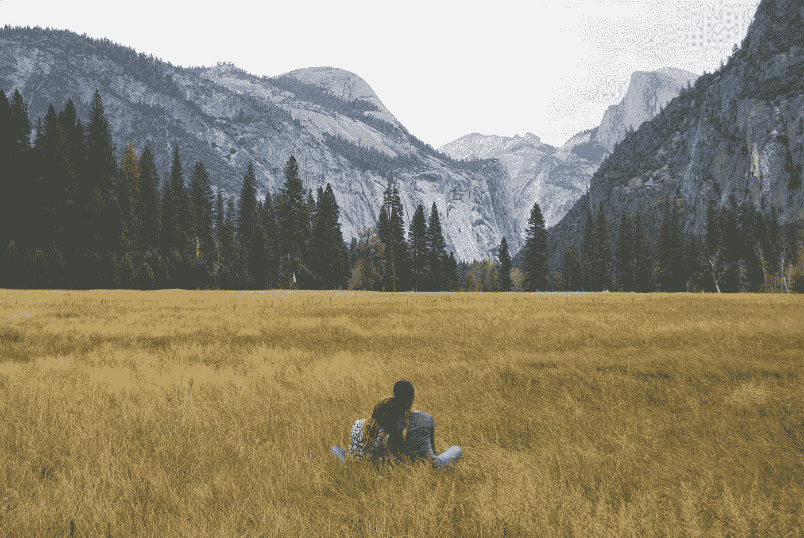
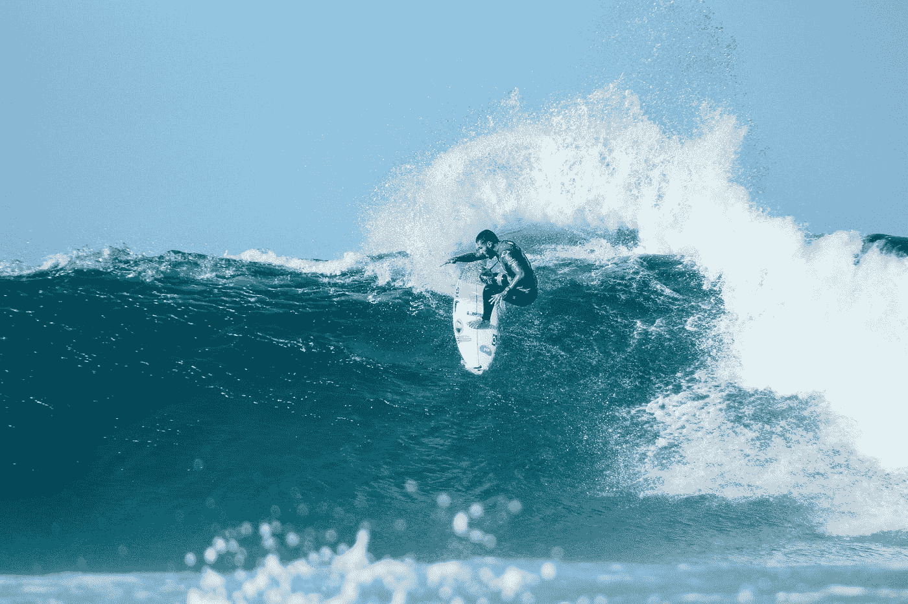

# 关于科罗娜的压力？为了更大的健康、幸福和创造力，与自然联系

> 原文：<https://medium.datadriveninvestor.com/stressed-about-corona-connect-with-nature-for-greater-health-happiness-and-creativity-25e7c96104b8?source=collection_archive---------14----------------------->

## 回归自然，你会有重生的感觉。

Photo by [Simon Migaj](https://unsplash.com/@simonmigaj?utm_source=medium&utm_medium=referral) on [Unsplash](https://unsplash.com?utm_source=medium&utm_medium=referral)

虽然压力受到了不好的指责，但我们的压力反应实际上让我们现在还活着。[汉斯·塞耶，](https://www.ncbi.nlm.nih.gov/pmc/articles/PMC5915631/)匈牙利内分泌学家先驱，将压力定义为*‘身体对任何变化需求的非特异性反应。’*

我们的身体只有一种生物应激反应，但几乎有无限多种应激源。你可以感受到来自环境、想法和身体的压力。任何变化都会改变我们的体内平衡，不管是好是坏。这对过正常健康的生活至关重要。

在我们的现代生活中，我们听到的压力只是负面的。但是我们不讨厌压力；我们讨厌不适当的压力。当它达到最优时，我们称之为刺激。想想你最后一次感到兴奋或受到挑战的时候，比如去跳伞或做一个困难的项目。你可能感觉很棒。

但对另一些人来说，压力会导致长期担忧、疲劳和沮丧的不良状态，并且无法应对。

压力只有在“短暂”时才是正常和恰当的。这是大自然赐予我们的帮助，而不是杀死我们的礼物。压力让我们保持警觉、积极，并为任何突发事件做好准备。

科学家发现了一种叫做**、**、[、**的好压力，也叫“压力”这是我们的“战斗或逃跑反应”——这是我们自主神经系统的一部分。我们的无意识控制中心被称为交感神经系统。当一个压力源被处理后，我们的副交感神经系统接管。他们相互合作，以保持健康的状态。**](https://www.healthline.com/health/eustress)

当我们生活在热带草原上时，我们的压力反应是有益的。但是我们的生物设计并没有很好地融入我们的现代社会。然而，我们再也不用害怕天敌了。战斗或逃跑的反应不仅仅来自外部危险；它也来自内心，通过不充分或恐惧的感觉。

面对现代威胁，我们的身体会以同样的方式被触发；上班迟到，赶项目的最后期限，……这是我们战斗或逃跑反应的持续开火，带来了慢性压力的沉重代价。

在过去，你可能会因为在学校的一场比赛中最后一个被选中而感受到压力。但是一旦你回到家，即使你不是最受欢迎的，你也可以放松。

但在今天的环境下，我们没有这种奢侈。**社交媒体是压力源所有放大器的放大器**。你可以每周 7 天每天 24 小时沉溺于大量比你更好看、更受欢迎的人的证据中。

社交媒体和技术**让弱势群体比过去受到更多伤害。**

不幸的是，社交媒体不再是最大的压力源了。

# 新常态

Photo by [Martin Sanchez](https://unsplash.com/@martinsanchez?utm_source=medium&utm_medium=referral) on [Unsplash](https://unsplash.com?utm_source=medium&utm_medium=referral)

2015 年，比尔·盖茨上台做了一个名为【T4:下一次爆发？我们还没准备好。盖茨发出了令人不寒而栗的警告，如果疫情大地震来袭，世界将会发生什么。

回想起来，我们似乎没有收到备忘录。

新冠肺炎肆虐全球。不仅许多人担心“一级防范”或“就地安置”策略可能会摧毁经济并导致萧条。新病例呈指数级增长，医疗保健系统确实深受其害。

重要的是要充分认识到遏制这种病毒传播的重要性。

但是有一个问题。我们不能永远使用“封锁”策略。随着时间的推移，人们变得更加焦躁不安。在一个自由的社会里，很难强制执行“呆在家里”。当涉及到人们的心理健康时，部署这样的策略和让人们处于黑暗中是不匹配的。

许多人都有心理健康问题。包括我自己在内，我有抑郁症的病史。在禁闭期间，我感到非常沮丧。

我们天生属于一个部落，天生需要社会联系。社交孤立和健康之间有一种奇怪的联系。从心脏病到癌症，再到一些神经退行性疾病，许多疾病都与孤独有关。

2007 年，一项研究发现了孤独和不健康之间缺失的联系。孤独者的免疫系统完全不同。孤立会欺骗身体，让它认为自己处于危险之中——引发我们的压力反应——从而引发炎症，而没有刹车来控制炎症。持续(慢性)炎症会增加许多疾病的风险。甚至 90%的医生就诊都是压力和炎症相关的问题。

有了社交媒体，我们已经有了“危险”备忘录。用一级防范禁闭来放大这一点，“这是人类做过的最糟糕的社会实验”，你就会得到任何疾病的一个非常强大的风险因素。研究表明，被社会排斥的情况会导致炎症的危险激增。

信息是明确的。我们需要控制我们的压力，即使是在封锁期。

# 新林洋久

Photo by [Lan Pham](https://unsplash.com/@lanipham?utm_source=medium&utm_medium=referral) on [Unsplash](https://unsplash.com?utm_source=medium&utm_medium=referral)

我不知道你怎么想，但我总是发现，置身于大自然中是我感到真正活着的时刻，无论是海洋的声音，森林的气味，还是站在希腊某处悬崖上的惊人景色。

每当我对生活感到不知所措的时候。我退到树林里。我试着品味生活，看看树，看看日落。在那之后，我的压力和忧虑消失了，我的注意力又回来了，我感到放松。

人类有与自然联系的深层生物需求的想法并不荒谬。我们有一种东西叫做*’*[*biophilia，来自希腊语，意思是热爱生活和生命世界。*](https://www.britannica.com/science/biophilia-hypothesis)

尽管我们生活在一个高度科技化的世界，但我们对自然世界有着根深蒂固的依赖。

你不用看很远就能看到这一点。

## 你有没有注意到[大多数医院](https://www.takingcharge.csh.umn.edu/explore-healing-practices/healing-environment/what-are-healing-gardens#:~:text=The%20term%20healing%20gardens%20is,patients%2C%20families%2C%20and%20staff.)(至少在欧洲，没怎么去过)都有花园？

如果你没有。许多社区将“康复花园”视为康复过程的重要组成部分。

科学表明，接触大自然可以降低压力，重新平衡交感和副交感神经系统。

日本人将这种艺术发展成一种叫做[***【shinrin-yoku】或森林沐浴的实践。***](https://time.com/4405827/the-healing-power-of-nature/)

在 20 世纪 80 年代早期，日本人被推荐到日本广阔的林地去体验更好的健康。他们确实这样做了。

毫无疑问，日本是世界上最健康的国家之一，拥有世界上最高的预期寿命。

在我们西方社会，我们可以从日本及其文化中学到一些东西。

# 自然与健康——你需要的只是自然

Photo by [Anneliese Phillips](https://unsplash.com/@anneliesephillips?utm_source=medium&utm_medium=referral) on [Unsplash](https://unsplash.com?utm_source=medium&utm_medium=referral)

看起来，大自然母亲拥有不可思议的隐藏治疗能力。《环境健康透视》杂志的研究人员发现，自然可以增强我们的 NK 细胞(我们主要的病毒恐吓细胞和癌症监视系统)。

在森林里，只要闻到一种叫做植物杀菌素的芳香物质，就能带来这些惊人的健康益处。

令人惊讶的是，随着冬天的临近，我们的维生素 D 水平降低，户外活动可以提高我们的维生素 D 水平。花更多时间在绿色空间的人大大降低了患慢性病的风险。

这听起来可能很荒谬，但即使是一扇能看到风景的医院窗户也能促进愈合。

根植是另一个炎性抑制物。

听起来像 woo woo 科学。但是赤脚在大自然中行走可以帮助你。

一项小型研究发现触摸地球有显著的好处。

我们的身体非常导电；我们体内的 [***细胞通过电磁信号***](https://pdfs.semanticscholar.org/2715/b2e745957cc440c915bcca634ada4a7f1a34.pdf) ***进行交流。*** 我们的神经系统是通过电信号来工作的，所以可以接收和传递信息。我们的组织之所以能保持水分，只是因为细胞中含有矿物质。

我们的身体是一块会走路、会说话的导电电池。

当急性炎症发生时，我们的细胞产生自由基。这些自由基携带正电荷，可以破坏有害细菌，分解受损细胞；为健康细胞和修复组织腾出空间。

这是一件好事，除非自由基不受控制，游离在周围组织中，损害健康细胞。

抗氧化剂携带中和自由基的自由电子，阻止氧化发生并减少炎症。

科学家发现地球表面会释放出自由电子。因此，当人体接触到地球表面时。这些自由电子被吸收，这个过程叫做电子转移。从而中和自由基。

大自然充满了奇迹。是时候正确对待了。

# 自然与创意——进入心流

Photo by [Sincerely Media](https://unsplash.com/@sincerelymedia?utm_source=medium&utm_medium=referral) on [Unsplash](https://unsplash.com?utm_source=medium&utm_medium=referral)

> “深入观察自然，然后你会更好地理解一切”~阿尔伯特·爱因斯坦

如果你读过伊丽莎白·吉尔伯特的的 [*美食祈祷爱情*](https://www.goodreads.com/book/show/19501.Eat_Pray_Love) *，你就会知道她谈到了一位非常著名的创作作家，她写了一本畅销书。但是名气并不是他所期望的。于是他决定抛下一切，在希腊的一座山顶上住了十年。在荒野的那段时间之后，他回来写了另一部杰作。每个人都认为他是个天才。如果这还不够，他又做了同样的事情，创造了另一本世界级的书。*

也许这个人是个例外，但是身处荒野会让你对周围的世界大开眼界。你有时间去看一切，享受生活的美好。

在日复一日的世界里，我们生活在；我们被噪音和复杂性轰炸。

## 你有没有静立一分钟去感受生命的荣耀？

许多一生随波逐流的人不会

当你停下来思考过去或未来，进入当下。你的大脑从喋喋不休的猴子思维中

 [## 大脑的默认模式:它是什么？为什么冥想是解药

### 生活就是当你不在自动驾驶仪上时发生的事情

medium.com](https://medium.com/swlh/the-brains-default-mode-what-is-it-and-why-meditation-is-the-antidote-d0408ab989d6) 

简单的存在。

> *这时候你会有很棒的想法，这时候你会开始思考你的生活，这时候你会问一些大问题或者你生活中的正确方向*

那是你**进入心流状态或短暂的低额症的时候。**

你的脑电波变慢，你从β波转换到α波。你产生被称为多巴胺、血清素的神经化学物质，然后你的前额叶皮层关闭。

试一次。当你走进树林时，带上一张纸和一支笔，相信我，你会有灵感的。

也许那也是思考感恩的时候。像勇气、感激和同情这样的资源是大脑和身体的强大工具。

在积极心理学中，感恩与更高水平的幸福紧密相连。这不仅会改善你的人际关系，还会提高你的整体幸福感。

我的观点很简单。

试着找时间出去散步。找时间去寻找你周围的自然美景。也许做一些摄影方面的事情(侧挤的想法)。计划它:

> “你安排的事情就是完成的事情”——罗宾·夏尔马

一周去一次树林，或者一周几次更好。每天总是比每周好。像锻炼一样，你需要每周留出几个小时。营养也是如此，睡眠也是如此

记住— ***80/20 法则:简单地决定你将开始做一些事情来管理你的苦恼，你就成功了 80%。***

**底线:也许我们都应该少花点时间在屏幕上，多花点时间盯着树看👐**