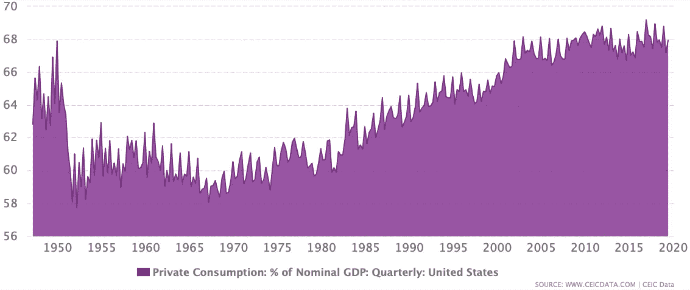
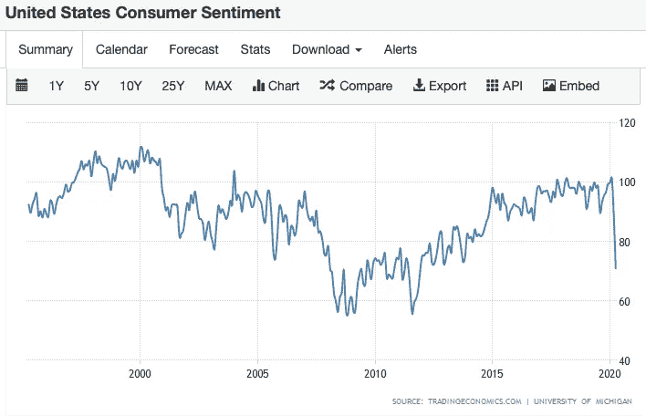

# 在不安全时期，条带成为一种安全的选择

> 原文：<https://medium.datadriveninvestor.com/stripe-becomes-a-safe-bet-during-unsafe-times-b2da8eca9c3e?source=collection_archive---------3----------------------->

## 风险投资者押注于被困时期的消费支持

上周，Stripe 融资 6 亿美元，对该公司的估值为 360 亿美元。投资者现在不敢开支票，所以我想解开这笔巨额交易背后的基本原理。

在开始之前，让我们回顾一下全球经济是如何自我评级的。

国内生产总值(GDP)是一个国家在一定时期内生产的所有商品和服务的货币价值。名义 GDP 是私人消费、政府支出、私人投资和净出口的总和。公式 Y = C + I + G + NX 被灌输到本科生的头脑中，政府领导人用这个综合记分卡来评估一个国家的经济健康状况。

 [## 夏普比率悖论:为什么还要投资风险资本？数据驱动的投资者

### 夏普比率是一种基于风险量化回报的方法，具体来说，它是超过…

www.datadriveninvestor.com](https://www.datadriveninvestor.com/2020/03/29/the-sharpe-ratio-paradox-why-still-invest-in-venture-capital/) 

如果我问美国国内生产总值的百分之多少是由消费支出构成的，你会震惊地知道我们国家国内生产总值的百分之七十是由私人消费支撑的吗？

[https://www.ceicdata.com/en/indicator/united-states/private-consumption--of-nominal-gdp](https://www.ceicdata.com/en/indicator/united-states/private-consumption--of-nominal-gdp)

我们是如何变得如此依赖消费的？为了更好地掌握上图，你需要先了解几件事。美国消费主义是一个太大的话题，无法在一篇博文中解决，但我们如何走到这一步的(过于)简单的历史如下。

在 18 世纪，家庭被视为生产机器。人们自己制作食物、衣服和所有必需品。你养活了自己，家庭和工作几乎没有区别。

工业革命给这种文化带来了变化，人们开始离家去工作。美国人开始根据经济产出给自己打分，工人开始追求旨在为大众生产的高薪工作。人们不再把家看作是生产的地方，而是开始把它看作是逃避工作的地方。人们开始消费商品以造福家居生活，消费主义开始随着收入而兴起。

第一批百货商店开始出现。交通基础设施扩张，铁路、公路和汽车允许更多的商品和服务的供给和需求。

Photo by [Mike Petrucci](https://unsplash.com/@mikepetrucci?utm_source=medium&utm_medium=referral) on [Unsplash](https://unsplash.com?utm_source=medium&utm_medium=referral)

作为一个社会，我们的消费习惯在二战期间和之后发生了变化。战后，政治家和领导人担心美国正走向另一场衰退。为战争目的创造的就业机会一夜之间消失了，供应短缺推高了价格和通胀，美国背负了数十亿美元用于资助战争的债务。债务的积累限制了联邦政府提供任何刺激方案的能力，除此之外，当世界上其他经济体都在努力应对战争的影响时，出口就不能被依赖了。

为了保持经济运转，私人消费必须增加，美国人民需要一个增加消费的理由。

美联储履行了自己的职责，将利率维持在历史低位。三个月期国债的交易价格低于 1%，直到 20 世纪 50 年代中期才升至 2%以上。消费信贷诞生了，店内信贷、分期付款信贷和发薪日贷款都促使人们重新思考他们的金钱。

在战争期间和之前，储蓄被提倡，人们被鼓励过节俭的生活。似乎一夜之间，一切都变了。70 年后，我们的观点没有改变。

作为美国人，我们的消费习惯控制着我们，随着这个国家努力应对封锁和在家订单，这种习惯正在受到考验。然而，鉴于我们对消费的依赖，演出必须继续，大量资金仍在转手。起初，消费集中于储存必需品，但消费者在娱乐购买上的支出已经呈上升趋势，因为数百万人想知道我们将被锁在家里多久。

所有这些都是为了快速总结消费对于经济健康的重要性。

自从上次经济衰退以来，消费者的信心有所上升，然而，你可以看到这个指标从悬崖上跌落的速度有多快。为了保持私人消费相对稳定，很多事情需要改变，Stripe 的定位是帮助度过当前的风暴。今年之前，电子商务仍被视为新生事物，销售额估计仅占全球零售额的 14%；这个数字今年可能会增加两倍，零售商和商家都被迫适应或申请破产。

我将省略 Stripe 业务的细节，因为我更感兴趣的是得出结论，这笔融资在整体计划中意味着什么。我的一些想法如下:

## 1)为了经济的全面复苏，消费主义必须持续下去。

吸取上面的历史教训，我们现在的处境与二战时期相似，因为名义 GDP 等式(Y = C + I + G + NX)中的所有其他变量都已经用尽。

有人可能会说，鉴于目前的融资成本，现在是私人投资的好时机，但鉴于近期的不确定性，很少有企业愿意投资于长期资本支出。 **(I)**

联邦政府已经使出浑身解数。再次减税的可能性是不存在的，隔夜利率已经接近于零，随着每个新的刺激计划，未来几代人将负担更高的账单。 **(G)**

净出口不会成为未来的增长动力。 **(NX)**

消费是唯一可以拉动的杠杆，而增加消费将是止血所必需的。消费者信心已经跌落悬崖，从 3 月到 4 月的信心下降是有史以来最大的单月下降。私人消费是消费者信心的一个函数，希望总统和联邦政府尽一切努力让公众相信未来的日子会更好。

## 2)风投仍然对特定公司开放业务。

Twitter 上有很多关于风投是否仍在投资的争论，似乎每个有观点的人都没有合格的观点。作为一名在风险投资领域工作的人，如果未来几个月或几个季度交易量保持稳定，我会感到震惊，但我预计交易量会大幅收缩。

也就是说，风险、增长和私募股权基金仍然处于创纪录的干粉状态，除了常青基金，大多数有限合伙人文件都规定资本必须在给定的投资期内部署。投资量可能会下降，但美元量应该不会受到太大影响。尽管人们担心有限合伙人满足资本要求的能力，但预计更多的资本将进入更少的交易。

## 3)旧的采用策略正在消失，开发者优先的方法已经成为金融科技公司的成熟模式。

与 Plaid 类似，Stripe 采取了开发人员优先的方法。

对于希望接受在线支付的企业而言，客户体验涉及困难的入职、复杂的集成以及支持多种支付选项的挑战。过去，首席财务官负责选择支付提供商和处理软件，然而，这种模式已经发生了变化。

如今，开发团队更多地参与到供应商选择过程中，通过优先考虑这组用户，Stripe 能够识别需要解决的早期问题领域。

众所周知，Stripe 优先考虑简单性，其核心产品只有七行前端代码。这种简化的产品以简化集成的承诺吸引了开发人员。通过使用 Stripe，企业可以减轻与设置在线信用卡支付相关的负担，而无需经历设置传统商家账户的过程。

Photo by [rupixen.com](https://unsplash.com/@rupixen?utm_source=medium&utm_medium=referral) on [Unsplash](https://unsplash.com?utm_source=medium&utm_medium=referral)

离线到在线的迁移是逐渐发生的，然后突然发生。今天的购物者被迫尝试购买必需品和非必需品的新方法，还没有这样做的零售商被迫彻底重新考虑他们的配送计划。不管是不是疫情，消费主义会一直存在，让消费者有能力是目前值得进行的少数赌注之一。