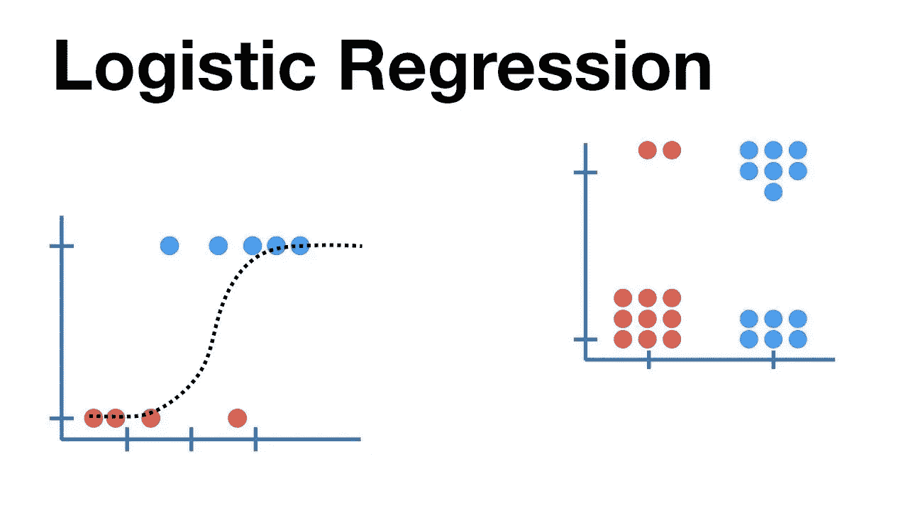
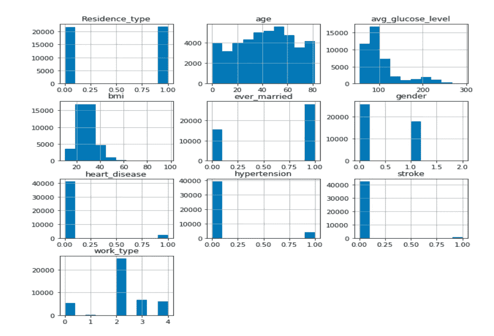
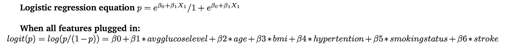
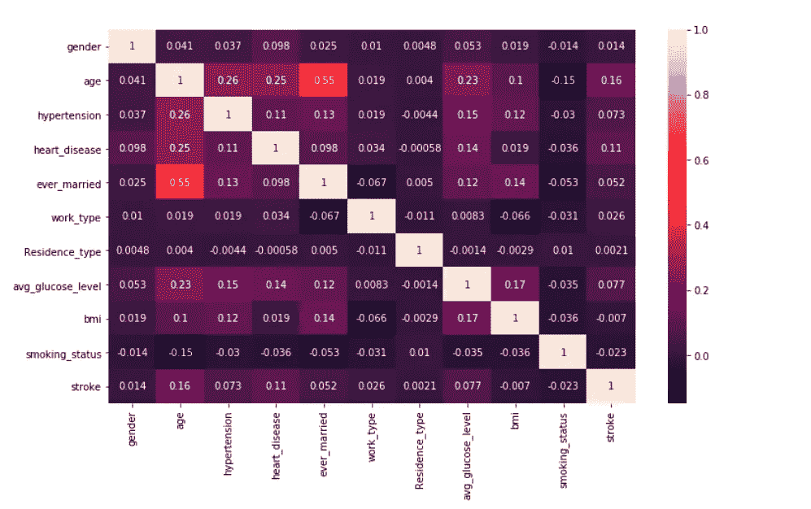
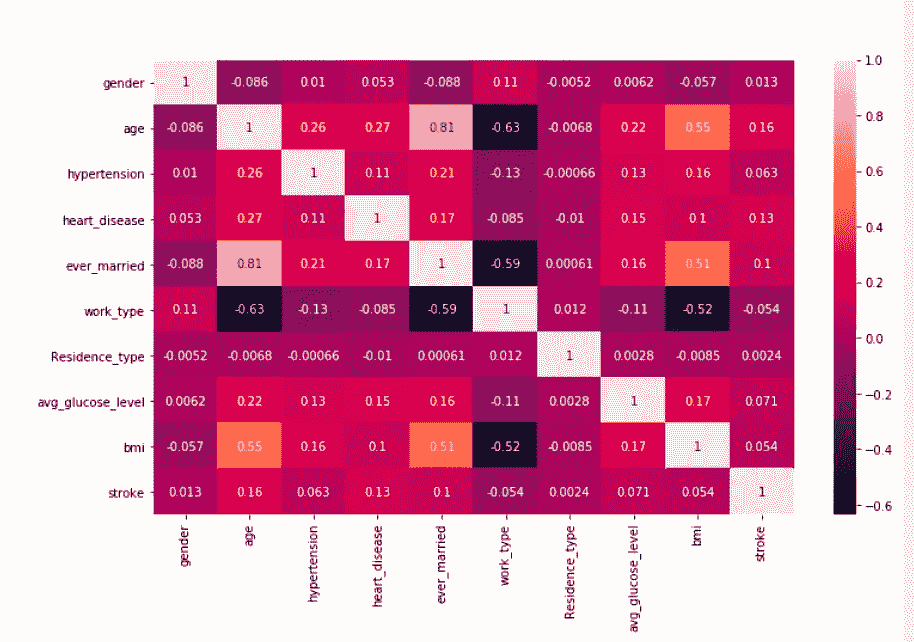
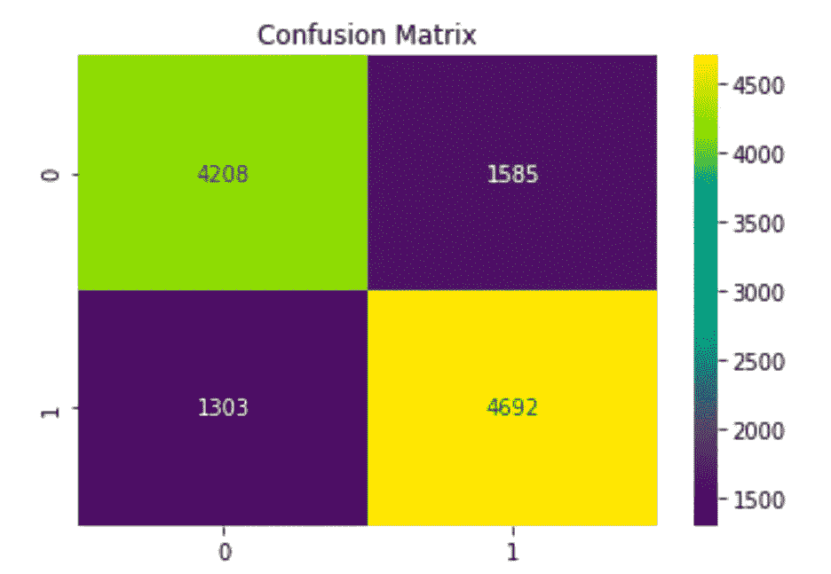
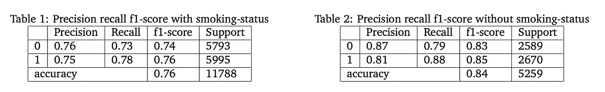

# 使用逻辑回归预测中风

> 原文：<https://medium.datadriveninvestor.com/stroke-prediction-using-logistic-regression-72f62edf4792?source=collection_archive---------3----------------------->

**使用逻辑回归的统计学习中风预测**

机器学习是许多行业中发展最快的技术，医疗保健行业也不例外。机器学习算法在预测心脏病、癌症等疾病的存在/不存在方面发挥着至关重要的作用。如果提前做好准备，这些必要的知识将为医生提供有价值的指导，然后医生可以改变他们的治疗方法并对患者进行适当的治疗。
世界卫生组织估计，全世界每年有 1200 万人死于心脏病。美国和其他发展中国家一半的死亡归因于心血管疾病。中风疾病的明确预后可能有助于我们对高危患者的饮食改善决策提供信息，此外，还可以降低风险。如果伙伴关系即将建立，并且影响它的条件可以提前补救。这项研究的目的是对心脏病的最相关/风险因素进行分类，并使用逻辑回归估计总体风险。
在本文中，我将使用机器学习算法来探索中风预测。我介绍的算法是一个关于适应度的逻辑回归。

**什么是逻辑回归？**逻辑回归用于表征数据，并说明一个因变量与一个或多个条件、序数、周期或比率水平自变量之间的关联。

**数据集**:-train . CSV 文件包含行和列。这个数据集中偶然有 12 个变量，我们必须在下面的描述中找到所有的变量:
**变量**:-潜在的风险因子是每个属性。出现人口统计学、行为和医学风险因素。
**人口统计**:-性别:男性或女性年龄:患者年龄
-吸烟状况:患者是否是当前吸烟者，工作类型:私人或政府工作，是否已婚:患者是否正在约会，居住类型:患者是在城市还是农村
**医疗**:-心脏病发作:个体是否患有心力衰竭，身体质量指数:身体质量指数，平均葡萄糖:葡萄糖含量

**实现** 数据集包含一些字符串值列。所以我用 Label encoder 把字符串变成数值。

Histogram of age, avg glucose level, BMI, heart disease, hypertension, id, stroke

直方图显示了数据集的特征。

**精度&图线**

Pearson correlation coefficient with Smoking Status

Pearson correlation coefficient for without Smoking Status

Confusion Matrix test predictions

Confusion Matrix Test1 predictions

混淆矩阵显示 4692+4208 = 8900 个正确预测和 1585+1303= 2888 个错误预测
**真阳性= 4692
真阴性= 4208
假阳性= 1585
假阴性= 1303**

混淆矩阵显示 2360+2048 = 4408 个正确预测和 310+541= 851 个错误预测
**真阳性= 2360
真阴性= 2048
假阳性= 310
假阴性= 541**

**结论**

*   年龄、婚姻、心脏病、高血压和身体质量指数是给定数据库中预测中风的重要特征。
*   吸烟被认为是关键特征之一，并且数据集被分为吸烟状态和非吸烟状态
*   该模型的准确率为 76%,对于不吸烟的数据集，准确率下降到 84%。

[Sangramsingkayte/Stroke-Prediction-Using-Logistic-Regression
机器学习是许多领域发展最快的技术，医疗保健行业也不例外，this…github.com](https://github.com/Sangramsingkayte/Stroke-Prediction-Using-Logistic-Regression)