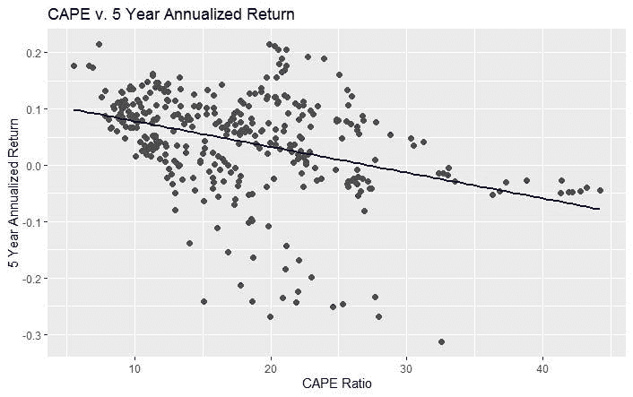
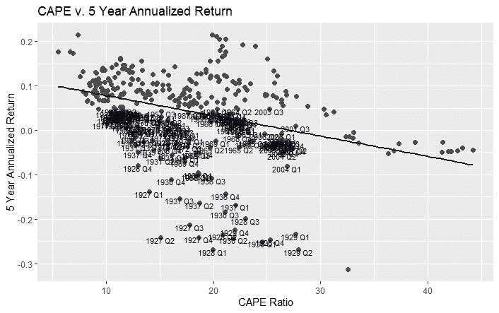
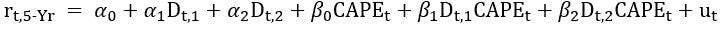
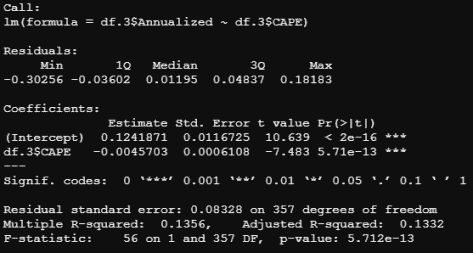
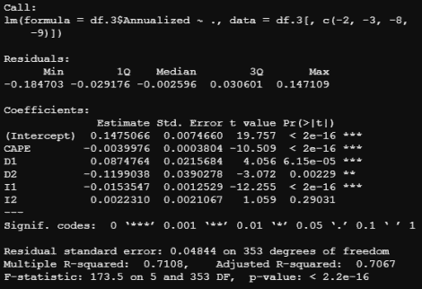
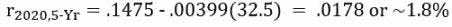

# 股票市场估值的结构性变化

> 原文：<https://medium.datadriveninvestor.com/structural-change-in-stock-market-valuations-1cf35c87f22f?source=collection_archive---------10----------------------->

Photo by [Joseph Chan](https://unsplash.com/@yulokchan?utm_source=medium&utm_medium=referral) on [Unsplash](https://unsplash.com?utm_source=medium&utm_medium=referral)

在“[股票市场估值和 2020 年的 R](https://lightfinance.blog/stock-market-valuation-and-the-2020s-in-r/) ”中，我研究了 CAPE 比率是否可以预测 1980 年至 2019 年期间收益和/或股票回报的未来轨迹。从这项研究中，我们得出了一些观察结果:

1.  CAPE 比率不能用于预测未来 1 年或 5 年的收益增长
2.  CAPE 比率只能微弱地解释下一年的股票回报。
3.  CAPE 在预测未来 5 年的年化回报率方面做得非常好(T2)。

从这些观察中，我们得出的结论是，估值并不代表未来的收益增长(即公司不会“赚”出高估值)。相反，估值预测未来的股价，因此现在的高估值将与未来的低回报相关联(反之亦然)。

鉴于 CAPE 比率目前高达 32.5，我继续被欧洲一体化的幽灵和投资者 10 年的惨淡回报所困扰。为此，本文通过考察股市估值的结构性变化，对之前的分析进行了扩展。具体来说，我的目标是确定投资者之前是否对股票进行了不同的定价，以及在任何时候，估值是否比简单的长期平均水平更高或更低。我的希望是，通过这样做，我们可以确定股票是否真的像看起来那么贵，或者投资者对估值的看法是否已经改变，股票是否还有进一步上涨的空间。

这项研究中使用的所有数据都可以从罗伯特·希勒的网站[这里](http://www.econ.yale.edu/~shiller/data.htm)免费获得。我在 Excel 中创建了一些变量，你可以在这里下载电子表格。考虑的时间跨度为 1926 年至 2019 年；数据保持一致和可靠的最长时间。

# 可视化变化

下图是 1926 年至 2019 年的季度 CAPE 比率和随后 5 年的年化回报率。

在绘制了这张图表后，我开始考虑结构变化的可能性。可以看到数据几乎是分叉的；看起来好像我们在绘制两个不同的数据集。随着 CAPE 的增加，年化回报率通常会下降，但是，如果我们想象一条趋势线，斜率并不一致。

让我们放大这些集群，用它们各自的年份和季度来标记这些点。下图用 15 度

我们可以看到，这些点大多发生在几个选定的时间段内:

1.  ~1926–1940.股票市场崩溃和大萧条。
2.  ~1969–1977.放弃金本位，滞胀和两次衰退。
3.  ~2004–2007.金融危机和大衰退

或许不足为奇的是，这三个时期的特点都是信贷冲击，需要美联储的干预来阻止。

 [## 收盘，但没有雪茄-股票市场目标在停滞的 COVID 救济中创新高|数据驱动…

### 专家聊天程序:一个协作市场，在这里人们可以和能够解决他们问题的专家聊天。是……

www.datadriveninvestor.com](https://www.datadriveninvestor.com/2020/08/18/close-but-no-cigar-stock-market-targets-record-highs-amidst-stalled-covid-relief/) 

# 型号和规格

既然我们已经确定了股票估值中潜在结构性差异的时期，我们可以继续进行一些正式的测试。为了测试结构变化，我选择使用回归和虚拟变量来实现一个 Chow 测试版本。Chow 检验的虚拟变量版本是方便的，因为它使我们能够检验差异是归因于截距、斜率还是两者。这意味着有四种可能性:

1.  截距和斜率系数在所有回归中都是相同的。这是**重合**回归的情况。
2.  截距不同，但斜率相同。这就是**平行**回归的情况。
3.  回归的截距相同，但斜率不同。这就是**并发**回归的情况。
4.  截距系数和斜率系数是不同的。这是**不同**回归的情况。

之前的图表表明，1926-1940 年和 1969-1977 年期间的估值与整个时期的回归方程明显不同。2004 年至 2007 年这段时间更为模糊，因此我们将暂时不考虑这段时间，而将重点放在两个更为明显的时期。

回归方程如下:

其中:

r t，5 年=从时间“t”开始的远期 5 年年化回报

D t，1 =虚拟变量，如果观察值为 1926-1940，则取值“1 ”,否则取值“0”

D t，2 =虚拟变量，如果观察值为 1969-1977，则取值“1 ”,否则取值“0”

CAPE t =时间“t”时的 CAPE 比率

在我们的方程中，α 1 和α 2 是微分截距，分别表示 1926-1940 年和 1969-1977 年与整个周期的截距差异。而β 1 和β 2 是测量斜率差异的微分截距。

# 测试和结果

让我们先来看看整个时期的结果:

我们可以看到 CAPE 比率的系数为负，这意味着随着估值的上升，未来 5 年的年化回报率下降。此外，该系数非常显著，表明当前估值是未来回报的重要决定因素。这两个结果都符合我们的预期(谢天谢地！).R 平方约为 13%,这表明 CAPE 解释了回报率变化的合理部分，但模型也没有解释很多变化。

现在让我们进行食物测试:

这些是一些有趣的结果！从 CAPE 开始，我们观察到该系数仍然为负且显著。但是，斜率实际上已经变成了*小于*的负值；从“满”期的-.0045 变为该模型下的-.00399。这告诉我们，估值对“典型”时期(即非 1926 年至 1940 年或 1969 年至 1970 年)的未来回报影响较小。

D1 和 I1 分别对应于 1926-1940 年间的虚拟变量和相互作用项。两者都具有高度的统计显著性，这是前面讨论的不同回归的情况。而且，这个结果证明了我们的猜想，大萧条时期估值存在结构性差异。综合来看，研究结果表明，在此期间，回报率和估值之间的关系变得“更加陡峭”。实际上，这意味着更高的估值会带来更高的惩罚，这可以从 1930 年代被炸飞的收益图中看出。

回到 1969-1977 年这段时间，我们观察到 D2 非常重要，而 I2 不重要。虽然这仍然证实了 60 年代末和 70 年代股票估价的结构性变化的存在，但差异仅限于回归的截距，而斜率保持不变；这是平行回归的情况。D2 是负的，它在视觉上相当于一条回归线，位于整个周期的回归线之下。实际上，这意味着这一时期的估值只是低了很多，即使投资“便宜”的股票也没有得到同样的未来回报。

最后，我们注意到通过 R-squared 测量的模型的解释能力有了实质性的提高。对于全周期模型，我注意到 R 平方约为 13%；好吧，但不是很好。在考虑潜在的结构差异后，我们可以看到 R 平方已经跃升到 70%以上！这是对基本模型的重大改进，甚至比我在[股票市场估值和](https://lightfinance.blog/stock-market-valuation-and-the-2020s-in-r/) 2020 年的 40%估值中开发的模型还要好。

# 这对今天的股票意味着什么？

使用新的和改进的模型和当前的标准普尔 500 角，我们可以预测未来 5 年的股票年回报率。现在，我们无法判断 2020 年的估值是否会与过去的估值有结构性的不同。这可能是因为投资者对价值的看法已经改变，他们认为股票即使在当前水平也很便宜。然而，我们知道的是，2020 年不在 1929 年和 1940 年之间，也不在 1969 年和 1977 年之间(希望这对你来说是显而易见的)。我们的预测归结为插入当前 32.5 的 CAPE 如下:

如果你是投资者，这就令人不安了。未来 5 年 1.8%的年化回报率相当糟糕，甚至可能无法弥补通胀。

# 结论

我提出了一个 5 年远期年化回报率模型，该模型使用 CAPE 比率，并考虑了随着时间的推移发生的结构性变化。该模型能够解释观察到的大部分差异。基于这些结果，我们开发了一个预测，表明投资者可以预期未来 5 年的年化回报率约为 1.8%(不包括任何股息)。

这让我们想知道，“我们能对我们的投资组合做些什么？”。我想，对许多人来说，这种回报根本不会削减它。虽然这是另一篇文章(或者更可能是一系列文章)的主题，简而言之，我认为投资者扩大视野，持有更多元化的投资组合是有意义的。在撰写本文时，大约 20%的 S&P 由 5 只股票组成(你知道的)，我真的不认为这种情况会无限期持续下去或变得更加明显是合理的。

在过去的 4 年里，价值已经被彻底摧毁，与国际股票或商品相比，这些回报看起来*不错。*

这次不同吗？我认为这值得深思。

下次见，感谢阅读！

王高·莱克丝。

*原载于 2020 年 11 月 21 日*[*https://light finance . blog*](https://lightfinance.blog/structural-change-in-stock-market-valuations/)*。*

**访问专家视图—** [**订阅 DDI 英特尔**](https://datadriveninvestor.com/ddi-intel)