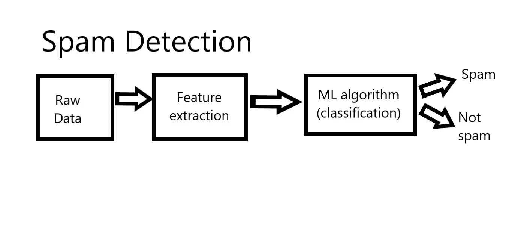
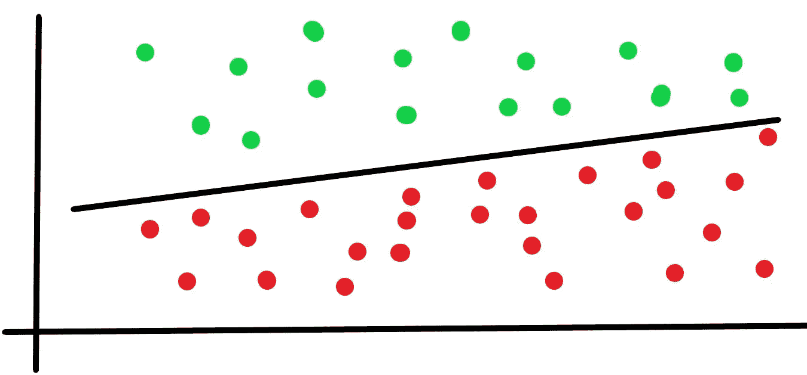

# 一个机器学习问题的结构

> 原文：<https://medium.datadriveninvestor.com/structure-of-a-machine-learning-problem-2f93696fbbd2?source=collection_archive---------17----------------------->

**特征提取:**找到一个实体/项目(如图像、网页、心电图等)对应的 x。).让我们用 f(x)来表示

**分类:**找到一个可以做出正确预测的参数化函数。

据说所有的机器学习问题本质上都是这个抽象:

Y = F(x)

在哪里

-Y 是输出

-F 是预测函数

-x 是要素表示

训练:给定一个训练集，通过最小化预测误差来估计预测函数 f()

测试:对未知测试样本 x 应用 f()，预测值(输出)为 y。

为了有更精确的抽象，我们必须考虑 f 是由一组 Ws 参数化的

Y = f(W，x)

其中 W 是重量

现在训练将是:给定一个 x，找出最佳 w，使得 f(x)的输出和实际 y 之间的差最小

测试:应用 f(W，。)到看不见的测试样本 x 和预测值(输出)是 y

参数-首要问题是找到参数 W

**端到端:**我们可以直接从 f(x)学习 y 吗

**线性分类器:**

在抽象中，Y = f(W，x)如果 f 是线性的，那么它被称为线性分类器。

如果您可以在两个数据类之间画一条直线，使得属于一个类的大多数数据点位于直线的一侧，而属于第二个类的大多数数据点位于直线的另一侧，那么您的直线就是您的线性分类器。

 [## 机器学习和 NLP 能预测石油的崩溃吗？答案是肯定的。|数据驱动…

### 2020 年 4 月 20 日，WTI 原油期货(美国原油基准)历史上首次达到负…

www.datadriveninvestor.com](https://www.datadriveninvestor.com/2020/05/04/could-machine-learning-and-nlp-have-predicted-oils-crash-the-answer-is-yes/) 

通过线性分类器，您总能看到预测变量与其结果之间的关系。有了数字数据，你就有了可量化的贡献。在使模型的解释更容易的同时，使用线性分类器也使模型可以用传统的编程技巧简单快速地操作。线性分类器的一个显著特征是它们接受所有的变换来使数据线性。与一些更复杂的“黑盒”方法相比，它们的运行速度相对较快。

在 2D，函数中使用两个参数，它被称为直线。在 3D 中，函数中使用了三个参数，它被称为平面。在 d 维空间中，函数中使用 d 个参数，称为超平面。

## 访问专家视图— [订阅 DDI 英特尔](https://datadriveninvestor.com/ddi-intel)