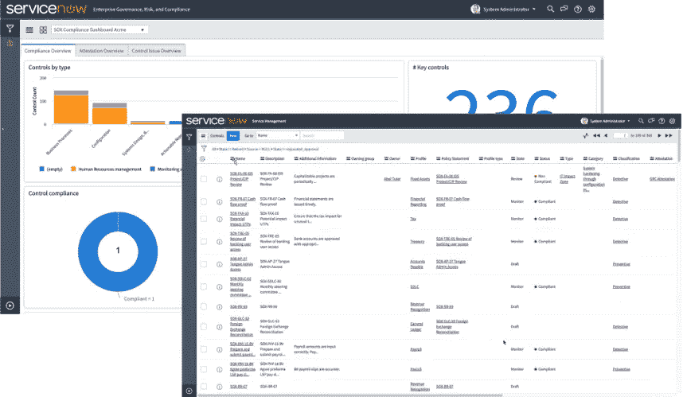
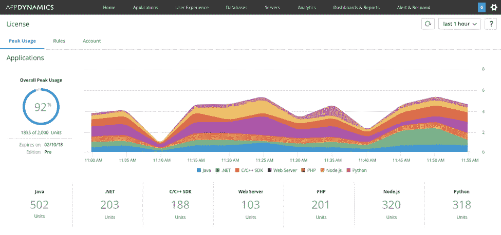

# 努力从自动化投资中获得回报？这可能是为什么

> 原文：<https://medium.datadriveninvestor.com/struggling-to-get-returns-from-your-automation-investments-this-is-probably-why-36d1a83adc61?source=collection_archive---------10----------------------->

***服务自动化曾被宣传为 IT 界的灵丹妙药，但成效一直不及势不可挡的*** *。*

自动化寻求从根本上减少日常任务管理对人类 IT 主管的依赖。无论是票据创建、问题解决、报告生成，还是根本原因分析(RCA)，自动化都声称可以解决所有问题。

现在，我并不否认自动化的巨大潜力——麦肯锡建议，到 2030 年，至少 60%的职业将有 30%的自动化活动。其中很大一部分包括 IT 工作，即**数据处理(69%)和数据收集(64%)** 。

但是争先恐后地在大规模 IT 生态系统中引入自动化，我看到企业遇到了前所未有的障碍。这些阻碍了投资回报(ROI)并阻碍了数字化转型。这主要是因为现有的 IT 系统早于下一代自动化，并且在设计时没有考虑自动化就绪的架构。

这就是为什么我看到小的、颠覆性的参与者快速跟踪他们的转型之旅，拥抱企业范围的自动化，将大企业甩在身后。这些数字原生玩家诞生于自动化时代，并不像传统企业那样背负很高的技术债务。最重要的是，他们利用数据使他们的 IT 运营更加情境化，这样转型就不会在孤岛中发生。

正如我们大多数人从经验中知道的那样，随着时间的推移，IT 不可避免地变得越来越复杂——无论是由于孤立的技术实施、领导层变更还是其他原因。在这种环境下，很难实现大规模自动化，因为每个独立的 it 组件都将遵循各自的路径。

随着大型企业试图实现现代化，这将产生重大影响。 [Gartner 预测](https://www.mckinsey.com/~/media/mckinsey/featured%20insights/digital%20disruption/harnessing%20automation%20for%20a%20future%20that%20works/a-future-that-works-executive-summary-mgi-january-2017.ashx)到 2021 年，传统企业完成数字化转型的时间将是平均时间的两倍；它也要花两倍的钱。

显然，尽管自动化有不可否认的好处，但它并不是在每个场景中都可行。昂贵的项目可能会因低工资率而脱轨，阻碍采用。如果没有有效的流程和服务的上下文化，企业将很难从投资中获得期望的价值。

目前，中国、印度、日本和美国近三分之二的员工(占总工资的一半以上)的工作在技术上是自动化的。然而，它远非 it 行业的主要产品。这大概就是为什么:

● **有太多的技术蔓延。** IT 领导不确定从哪里开始，如何集成，以及可扩展性是否可以实现。

● **缺乏清晰的战略。**并非所有的 IT 活动都可以而且应该自动化，需要一个蓝图来突出最可行和最有意义的自动化领域。

● **自动化本身太有限了。**希望实现敏捷 IT 运营的公司可能无法从基于规则的自动化中找到足够的价值，这使得 AIOps 变得至关重要。

● **业务部门各自为政。因此，特定业务的动画也将彼此独立运行。您需要一个卓越的自动化中心来整合自动化功能并实现规模经济。**

这是否意味着自动化只是炒作？一点也不。

IT 技术领域现在已经达到了令人难以置信的成熟水平，最新的服务管理平台可以帮助从 IT 投资中获取最大价值。这些可以在一个不断增长的大环境中发现相关性，并使企业能够做出符合背景的决策。

它在两个方面有所帮助:首先，它让员工更聪明地工作(不一定更快)，摆脱你可能积累的技术债务*即绩效管理*。其次，它提供更好的最终用户体验，直接影响您的底线*即体验管理*，最后确定需要大规模简化和补救的架构机会*即模式管理*。

*(我在之前的一篇文章* *中更详细地谈到了这两种影响* [*)。)*](https://medium.com/@arvind_mehrotra/use-these-4-tools-to-realize-contextualization-of-it-86-it-pros-believe-in-the-potential-of-eac45d9a9b2c)

特别引起我注意的三个平台是 ServiceNow、OpsRamp 和 AppDynamics，我有幸将它们集成在一起并提供大规模性能。

ServiceNow 允许企业在几周甚至几天内，而不是几个月内，以低代码模式创建任务履行应用程序。它包括一个可以与几乎任何 It 节点连接的数据库层和一个可以用来设计面向用户的界面的应用层。

对于拥有内部编码能力的企业，ServiceNow 的功能几乎是无限的。不管积累了多少技术债务，它都可以为查看和使用 it 工具创建一个整合的平台。

公司已经在各种环境中使用 ServiceNow 来简化 IT 并充分利用其自动化功能。

[来源](https://www.google.com/url?sa=i&url=https%3A%2F%2Fcommunity.servicenow.com%2Fcommunity%3Fid%3Dcommunity_blog%26sys_id%3D6ce4715fdbd39f40feb1a851ca961927&psig=AOvVaw0VkG-bOHmpxB1wb96RyjLm&ust=1583222412233000&source=images&cd=vfe&ved=0CAMQjB1qFwoTCLiTtaCp--cCFQAAAAAdAAAAABAu)

OpsRamp 略有不同，因为它引入了人工智能的力量来帮助管理它。2018 年，OpsRamp 推出了我觉得印象极其深刻的统一服务智能、服务地图和 AIOps 功能。

它不仅仅是效率和时间/成本的降低。它自动发现 It 资产，并映射事件/资源之间的相互关系，以生成即使是最复杂的 IT 环境的简化视图。这为企业提供了拥抱变化和跟上新时代颠覆者步伐所需的灵活性。

**AIOps 与 ITSM 的结合可能是自动化投资回报困境的答案。** ServiceNow 和 OpsRamp 是两个领先的参与者——还有强大的竞争对手，如 ConnectWise(承诺 [194%的投资回报率](https://www.connectwise.com/resources/case-study-forrester-tei-of-connectwise))和 Resolve，后者帮助其客户 CenturyLink 在其网络运营中心节省了 180 万美元。

[来源](https://www.google.com/url?sa=i&url=https%3A%2F%2Ftechcrunch.com%2F2020%2F01%2F30%2Fopsramp-raises-37-5m-for-its-hybrid-it-operations-platform%2F&psig=AOvVaw0BjUi7W7OjqOAHte_KhoCS&ust=1583222552758000&source=images&cd=vfe&ved=0CAMQjB1qFwoTCPiMg-Kp--cCFQAAAAAdAAAAABAK)

最后，AppDynamics 是一个非常可视化的监控和管理平台，在一个整洁、全面的仪表板中为您提供了应用程序前景的清晰画面。AppDynamics 与我们经常面对的几个用例相关，从云监控和迁移到 CI/CD 和 DevOps。AppDynamics 通过 Business Tunes 提供 IT 的业务环境，可以帮助管理技术债务以及确定业务服务的季节性。

AppDynamics 现在是思科的一部分，但继续作为独立的应用运营或业务运营解决方案运营。您可以根据团队职能定义特定的角色，轻松管理复杂的环境。如果您希望获得一个上下文化的视图并映射多个资源之间的关联，像 AppDynamics 这样的平台可以证明是至关重要的。

如果你正试图跃进下一波数字化转型，Automaton 是一个令人兴奋的领域。但这需要谨慎、专注的管理。Gartner 也同意这一观点— **到 2025 年，90%的企业将拥有一名自动化架构师(相比之下，目前只有 20%)**并且 40%的企业将在三年内使用人工智能。像 Servicenow、Appdynamics 和 Opsramp 这样的平台可以改变这一旅程的游戏规则，*让自动化变得更有意义*。

【arvind@am-pmassociates.com**想了解更多，请在* [*给我留言。*](mailto:arvind@am-pmassociates.com)*