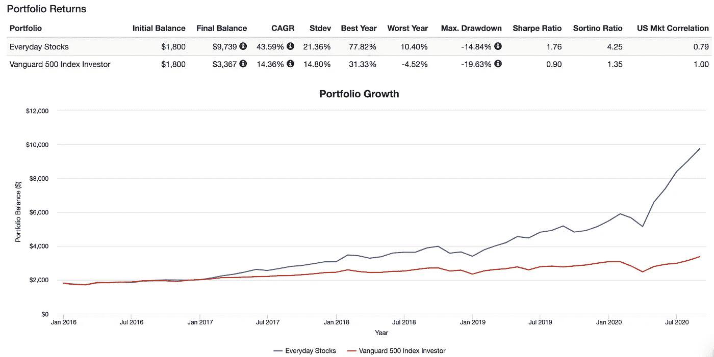

# 受困于投资理念？睁开你的眼睛

> 原文：<https://medium.datadriveninvestor.com/stuck-for-investment-ideas-just-open-your-eyes-cccebf67abc0?source=collection_archive---------15----------------------->

Opportunity is all around you — [Photo from Unsplash.](https://unsplash.com/photos/DL1GlK9HgFM)

有时候想出投资的点子会很难。我认为这是由于所涉及的风险。一想到你的某个想法可能会让你丢钱，你就很不爽，我明白。

但是你可以得到一些想法的一个方法是看看你周围。

在我十几岁的时候，我注意到世界上最大的公司都在某个时候从我的口袋里拿过钱。不管是直接的还是间接的。事实证明是真的。

 [## 2020 年最佳短期投资选择精选资源|数据驱动型投资者

### 投资是增加你净财富的一个好方法。如果你通过遵循一个严格的…

www.datadriveninvestor.com](https://www.datadriveninvestor.com/2020/03/28/handpicked-resources-for-the-best-short-term-investment-options-of-2020/) 

看看你周围，想一想。

## 你的钱流向哪里

看看钱都去了哪里:

*   你的整个办公室都运行微软软件，直到时间结束。(MSFT)。
*   你今天已经谷歌搜索了无数次(如果你看到了一个广告，谷歌就会得到报酬)。(GOOGL)。
*   你在网上寻找任何商品的第一个地方是亚马逊。(AMZN)。
*   你可能正在苹果 iPhone 或苹果 Mac 上阅读这篇文章。(AAPL)。
*   今晚下班后你可能会看《网飞》。(NFLX)。
*   你今天在脸书、Instagram 或 WhatsApp 上花了相当多的时间。(FB)。
*   你可能会在一天中的某个时候经过星巴克、麦当劳和沃尔玛。(SBUX，麦当劳，WMT)。
*   你的房子很可能用来自 Lowes 和 Home Depot 的物品来装饰。(低，高清)。
*   3M 公司和霍尼韦尔公司生产你车库里的许多产品。(嗯，亲爱的)。
*   几乎每一笔金融交易都是通过 Visa 或 Mastercard 进行的。(V，马)。
*   您最喜爱的精品在线商店使用 Shopify 和 Paypal 来管理您的订单。(商店，PAYL)。

在你人生的某个时刻，我敢打赌，如果你住在美国，你会把部分工资交给 80%的这些公司，如果你住在美国以外的地方，你的工资会稍微少一点。

你现在可以投资这些公司中的每一家。

## 寻找的力量

所以你现在知道了，但是如果你五年前就知道了呢？

为了说明这一点的力量，我计算了这些数字。如果你在我五年前提到的每只股票上投资 100 美元，你已经在市场上投入了 1800 美元。

Congratulations, you just beat Warren Buffet over five years — Portfolio Model from [Portfoliovisulaizer.com.](https://www.portfoliovisualizer.com/backtest-portfolio#analysisResults)

投资组合由 17 只日常股票组成。你们都知道的。这些股票在过去五年里的增长是惊人的，这在一定程度上要归功于你。你只要环顾四周，就能打败 S&P500。从你开始的 1800 美元投资，你现在会有超过 9700 美元的余额。

你的平均复合回报率是 43%。S&P500 追踪器是 11%。

虽然未来五年可能不会以同样的方式重复，但名单上的一些公司已经经营了 30 多年。他们一直在创造稳定的回报。

你可以打开一个免费的投资应用程序，如 Robinhood、TD-Ameritrade、查尔斯·施瓦布或欧盟的 Trading 212，并在这些股票中投入 100 美元。

## 结果

这些不是你需要花几个月时间研究的晦涩难懂的选股。

这些是世界上最大的公司。他们每年赚取数十亿美元，并以股息的形式向股东支付数十亿美元。你也能拿到钱。

所以，下一次当你想知道如何投资时，睁开你的眼睛看看你周围的东西。

**进入专家视角—** [**订阅 DDI 英特尔**](https://datadriveninvestor.com/ddi-intel)