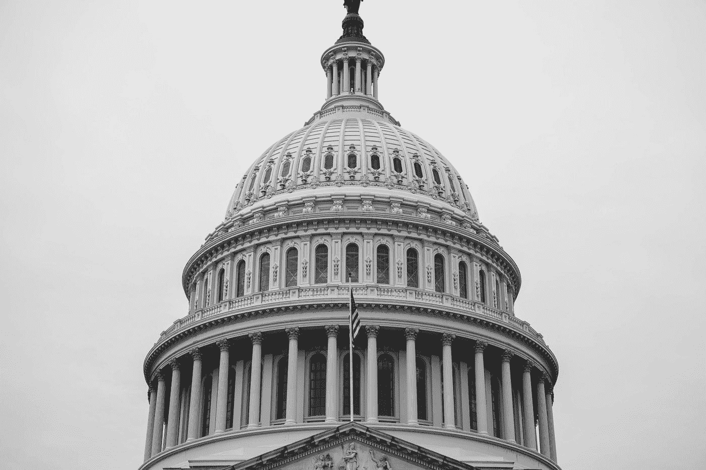

# 学生贷款偿还:一个可怕的传奇

> 原文：<https://medium.datadriveninvestor.com/student-loan-repayment-a-terrible-saga-2d875ac07ff7?source=collection_archive---------31----------------------->

## 在 10k 取消谈判期间，学生应该还清贷款吗？

Photo by [Joshua Sukoff](https://unsplash.com/@joshuas?utm_source=medium&utm_medium=referral) on [Unsplash](https://unsplash.com?utm_source=medium&utm_medium=referral)

11 月初，当我穿着睡衣喝着早晨的咖啡因时，学生贷款的想法突然出现在我的脑海里。

自然，欠一些影子贷款公司的数万美元足以引起持续的担忧——但拜登暂时赢得选举的事实让我考虑免除学生贷款的可能性。

我在家工作，但是律师助理的工作，仅仅够支付每月学生贷款和疫情之前的个人开销。

那时，通过节俭，我已经攒够了一大笔贷款，但是我想；我应该试着付钱给他们吗？

拜登的主要政策建议之一是取消每个借款人价值 1 万美元的政府学生债务。如果我把这个还清了，我肯定不会报销，所以我决定等等。

到目前为止，除了纯粹的猜测和华盛顿方面的沉默，什么都没有。

最近，参议院的民主党人、舒默和沃伦向拜登总统施压，要求他批准 5 万英镑的学生贷款减免计划。这有可能为 3600 万人消除学生贷款债务负担。

如果是这样的话，我所有的贷款都将还清，拜登只需在纸上动一动手腕就能做到。不幸的是，免除学生贷款并不是[拜登疯狂冲击行政命令的一部分。这个问题必须得到解决，这也是桑德斯、沃伦和 AOC 等民主社会主义者在民主党候选人中支持拜登的主要原因。](https://www.theguardian.com/us-news/2021/feb/08/joe-biden-executive-orders)

> 根据[学生贷款英雄](https://studentloanhero.com/student-loan-debt-statistics/)(美国消费者新闻与商业频道赫斯)的说法，2018 届学生中约 69%的人申请了学生贷款，毕业时平均债务余额为 29800 美元。

这笔债务对年轻一代不利。除非有所作为，否则停滞不前的工资以及不断上涨的住房和医疗成本将在未来一段时间内削弱我们的实力。

学生贷款危机只是美国经济这块溃烂的蛋糕上的一颗烂樱桃。

但拜登将如何解决这一问题？许多左翼人士担心拜登的廉价言论，认为他是一个空洞承诺的人——这是有道理的。过去，拜登在许多问题上并不完全一致。

> 有几种方式可以取消学生贷款。首先，拜登可以签署一项行政命令，取消学生贷款债务，无需国会批准。然而，他说他不打算这么做。他更有可能推出新的刺激方案，或者等待国会通过取消学生贷款债务的决议(普拉穆克，美国消费者新闻与商业频道)。

一个主要的担忧是共和党对学生贷款免除的强烈反对。出于某种原因，他们宁愿把钱给那些用纳税人的钱挣扎的航空公司和公司，也不愿直接帮助学生。拜登在维持现状，任何危及现状的事情都会遭到冷漠和偏见。

然而，学生贷款是我们这个时代最紧迫的问题之一。年轻人在经济上苦苦挣扎。他们毕业后发现大规模裁员和休假。由于残酷的美国工作文化和对“要么工作，要么彻底失败”的态度的直接预期，难怪年轻人的心理健康状况急剧下降。

在一个每个人的价值都与工作挂钩的国家，不符合大学毕业后获得一份好工作的期望是不可思议的。我认为，这在疫情之前已经是不可能的了，但现在它的荒谬性凸显出来了。我们被灌输了杰夫·贝索斯、埃隆·马斯克和比尔·盖茨的故事，并被告知如果我们努力工作，我们也可以做得一样好。我们没有意识到这些都是轶事，大多数人都没有“成功”。

这整个谎言让我们为教育付出了这么多，尽管它不再像过去那样给我们提供同样的机会。

## 所以这回避了最初的问题。我们应该还清学生贷款吗？

拜登的措施之一是将付款和学生贷款延长至 2021 年 9 月 30 日——足以平息任何对在此之前产生利息或延迟付款的担忧。

另一个考虑是，虽然这些宽恕的想法已经被谈论，但政策尚未起草。它可能会发生变化或被完全取消。

最有可能的选择是支付价值 1 万英镑的学生贷款。如果你和普通学生一样，这不会毁掉你所有的贷款。许多人还会剩下数万元。一个好主意是利用这段时间，在利息没有累积的情况下，慢慢地削减你的本金。大多数贷款都是以每月付款的方式设立的，只触及本金的表面。这导致了一段长达数年的艰难时期，贷款公司可以从贷款中获得尽可能多的利息——经常让你支付远远高于贷款原本价值的金额。

细节决定成败，这些公司希望你不了解或不关心细节。

如果你没有太多要偿还的，而你又是幸运儿之一，那么把你要用来贷款的钱投资到一些能获得更高利息的东西上可能是值得的。类似指数 ETF 的东西。像 VOO 这样的标准普尔 500 ETF 是一个不错的选择。

无论如何，学生贷款对大多数借款人来说都是一场噩梦。如果你能在这次疫情期间设法维持下去并支付你所有的基本费用，我为你鼓掌。希望立法者能明白一些道理，并尽快采取措施。