# GIAC 安全专家学习指南:第一部分

> 原文：<https://medium.datadriveninvestor.com/study-guide-for-the-gse-giac-security-expert-part-1-da6ca4e4da7a?source=collection_archive---------0----------------------->

## GIAC 安全专家(GSE)认证的学习指南，包括 Google 云部署、Jupyter 笔记本电脑、参考资料和技巧

我已经决定写一本关于我获得 GIAC 安全专家之旅的指南。本指南主要针对那些也计划获得普通中等教育证书和/或正在准备资格考试或实验室的人。

*即使这不适用于你；这里有大量关于命令行和脚本的高质量提示，可以帮助您进行日常安全管理*。

这是一个三部分系列。**第 1 部分**是关于我的资格考试准备和实验室动手准备工作，包括:

*   设置 f *ree* Google Cloud VPS 和 Colab Juypter 笔记本环境用于脚本编写，基于 linux 的工具用于实践学习
*   收集和编译用于索引的“脱机”资源

[**第 2 部分**](https://medium.com/@dw.chow/study-guide-for-the-gse-giac-security-expert-part-2-d7b30ddd5845) 侧重于资格考试和实验室考试的动手练习。并不是 GSEC/GCIH/GCIA 的每个主题都包括在内；但我觉得我没有天生的键盘肌肉记忆；可能类似于其他候选人的挣扎:

*   工具在 Windows 和 Linux 下执行和操作语法方面的差异示例
*   当您选择的主要“前往”工具失败或不起作用时，可以使用替代脚本和工具
*   分析很可能在你的考试中出现的例子

[**第三部分**](https://dwchow.medium.com/study-guide-for-the-gse-giac-security-expert-part-3-52d6798b45f0)【2022 年 7 月 16 日更新】关于考试的实验室部分和我的成绩的提示

[](https://www.datadriveninvestor.com/2020/06/29/cybersecurity-is-in-meltdown-heres-a-new-idea/) [## 网络安全正在崩溃，这里有一个新的想法|数据驱动的投资者

### 对于许多公司来说，网络安全策略是在安全系统和服务上花费数百万，遵循最佳…

www.datadriveninvestor.com](https://www.datadriveninvestor.com/2020/06/29/cybersecurity-is-in-meltdown-heres-a-new-idea/) 

# **Q2 2019 年后资格赛考试**

早在 2019 年 5 月，我应邀参加了测试，用动手实践取代了笔试。这样你就可以参加第二部分的考试，也就是从笔试日期起 18 个月内必须参加的实验。对于那些已经获得 GIAC 认证或者最近获得认证的人来说，你们会注意到，现在有一些实际问题，要求基本上采用旗帜式的回答。许多问题都是类似的格式，所以有效利用你的时间是关键。我不能确认也不允许透露考试的具体内容；但是我可以向别人展示我是如何准备的。我的准备工作进行得非常顺利，我带着 90%以上的分数离开了测试。现在我在等待 SANS 再次开放实验室，因为新冠肺炎基本上已经暂停了我应该采取的措施。

# **资格考试的三大备考技巧**

通过资格考试后，您将有机会进入先到先得的等候名单，参加实验室考试，这种考试通常一年不超过两次，而且只能亲自参加。时间、问题数量及其相当低的 64%及格分数的具体细节列在[这里](https://www.giac.org/certification/security-expert-gse)。如果有一件事我想指出的是，**速度是 GSE** 的游戏名称。尽可能完成最有效的考试，以便您可以在提交或标记问题之前正确地检查每个答案；考虑以下提示:

*   提示 1:不要把你所有的 GSEC、GCIA 和 GCIH 的书都带进来。只选择 1-2 本书和你认为自己最薄弱或在实践考试中遇到最大困难的索引。最好像准备实验室考试一样准备资格考试；真正挑战自己，带上最少的衣服，看看你有多公平。具有讽刺意味的是，对我来说，我带了 GSEC 的 Windows 和 Linux 管理书籍，因为我不会整天在这两个系统上进行系统管理。
*   提示 2:在你的主要索引或补充材料中，打印出你需要参考的内容的彩色副本，并使用多种标签颜色代码来区分主题类型甚至深度。真正有用的例子可能是堆栈溢出、tcp 封装计算和协议头。找一个有口袋或拉链的活页夹来包裹和保护所有东西。如果你已经准备好了，希望你不需要太依赖你的材料。
*   技巧 3:自己练习书中提到的每一种工具，不要局限于书中的研讨会/实验室部分。尝试将书中涉及的每个工具或脚本应用到您可以自己构建的场景中，或者使用其他人的数据集，这些数据集超出了您在书中看到的预期参数。你可以使用不同的环境来获得更多的机会，或者在你和其他 GSE 候选人之间交换想法，在 [Google group](https://groups.google.com/g/giac-study?pli=1) s 或[slack channel](https://gse-prep.slack.com)l 中相互挑战。注意:Slack channel 是为那些为实验室而学习的人开设的；和来自管理员的邀请，所以你可能必须先把时间放在论坛上。

# **基线指标材料**

这里是我编辑的伟大资源列表，可以打印出来，放入你的活页夹中快速参考。它尽最大努力寻找有颜色和易于参考显示的项目，这将有助于我的考试。拥有易于阅读的协议头和十六进制/十进制/二进制表格对于提高您回答考试和实验问题的能力是必不可少的。这些是我为资格考试准备的资料，也是我将带去实验室的资料:

*   RTFM 和 BTFM 袖珍指南
*   用于 DFIR 和渗透测试的印刷 SANS 备忘单
*   所有 PacketLife 备忘单(Wireshark 显示过滤器、Scapy、Tcpdump(用于高级 BPF 位屏蔽考虑)、IPv4 子网划分等:[https://packetlife.net/library/cheat-sheets/](https://packetlife.net/library/cheat-sheets/)
*   来自 Nmap.org 的协议标题图片:[https://nmap.org/book/tcpip-ref.html](https://nmap.org/book/tcpip-ref.html)
*   十进制、十六进制、八进制和二进制图表:[https://ascii.cl/conversion.htm](https://ascii.cl/conversion.htm)
*   Bro 通过 Corelight 记录备忘单:[https://github . com/Corelight/Bro-Cheat Sheets/blob/master/Corelight-Bro-Cheat Sheets-2.6 . pdf](https://github.com/corelight/bro-cheatsheets/blob/master/Corelight-Bro-Cheatsheets-2.6.pdf)
*   US-CERT 的丝绸快速参考指南:[https://tools.netsa.cert.org/silk/silk-quickref.pdf](https://tools.netsa.cert.org/silk/silk-quickref.pdf)
*   Snort 备忘单:[https://cdn . comparitech . com/WP-content/uploads/2019/07/Snort-Cheat-Sheet . pdf](https://cdn.comparitech.com/wp-content/uploads/2019/07/Snort-Cheat-Sheet.pdf)

# **为资格考试和实验设置动手工具和环境**

这对一些人来说似乎是显而易见的；但值得注意的是，您并不总是能够访问装有 VMware 或 Virtualbox 的主要笔记本电脑或台式机。所以在你之外使用本地虚拟机；考虑第二个和第三个资源，以便在准备时促进学习和协作。

## *谷歌云平台——计算机虚拟机实例*

先说谷歌云平台( [GCP](https://console.cloud.google.com/) )。为什么要在 AWS EC2 免费层上使用它？AWS 将在 1 年后过期，除非你用不同的电子邮件注册。GCP 每月在其最小的虚拟机实例上的特定小时数内是“始终免费”层，包括磁盘存储、WAN IP、防火墙以及您在 VPC 网络中的实例所需的入/出流量。继续注册并使用你的信用卡；只有当你查看[自由等级分配](https://cloud.google.com/free/docs/gcp-free-tier)时才需要。

在撰写本文时，对于大多数美国地区的任意数量的 F1-Micro 虚拟机，您每个月可以获得大约 30 天的 cpu 时间，这些虚拟机具有 30 GB 的驱动器、5 GB 的存储快照和 1 GB 的出口流量配额。F1 微型虚拟机并不花哨；您可以选择在 600 MB 内存和 1 个共享 CPU 上运行的个性化实例。这几乎将您的范围缩小到了一个普通的 Linux 实例。你可以免费存储多个实例。我还不会导入 Kali 或 Metasploitable2。

注册后，打开您的控制台，创建一个 F1-Micro VM，并创建包含您的 VPC 环境的第一个“项目”。将会打开一个向导；但是，如果您关闭它，您可以点击左上角的“汉堡包”图标，并访问计算机>虚拟机实例。

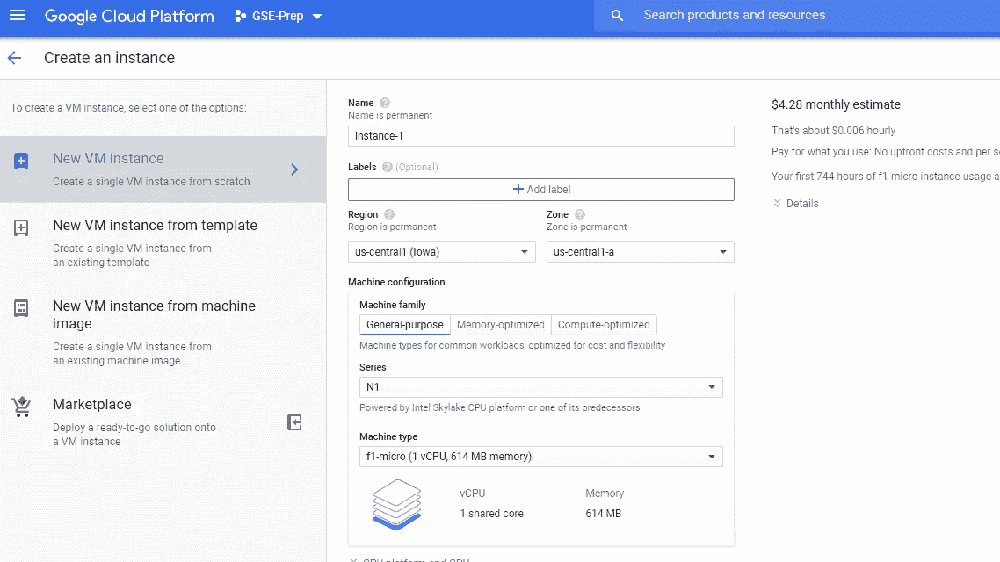

命名您的实例，并给它任何您想要的标记标签。考虑使用实例名作为您的标签，以及您能记住的任何其他内容，如果您计划以后构建您的订阅的话。不要介意每月 4.28 美元的估计，F1-Micro 实例 744 小时免费，即使你一直在线，也有大约 30 天免费。

确保选择美国西部 1、美国中部 1 或美国东部 1 作为您的地区。任何其他地区可能会产生费用。完成向导后**不要选择接受入站/入站 http/s 连接**。我们将自己创建适当的网络标记和入站防火墙规则。

接下来，在您的虚拟机实例屏幕上，单击绿色复选标记旁边的虚拟机实例主机名本身(表示它已联机并正在运行)以深入了解详细信息:

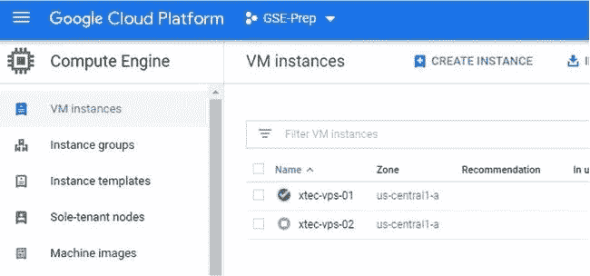

VM instances Screen

在“虚拟机实例”屏幕中，在“网络标记”下设置您需要的标记。我们将使用 xtec-vps-01，因为这是我们的实例名称，我们获取流量的主要用例是 netcat-listener。所以我们为此创建了第二个标签。滚动到底部，然后点击蓝色的保存按钮。

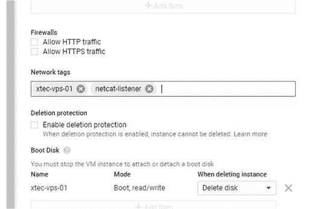

Create network tags that your firewall rules will use

下一步是创建防火墙规则，允许/拒绝 VPC 实例之间以及进出互联网的双向流量。再次转到控制台左上方的“汉堡”图标，选择 VPC 网络>防火墙。

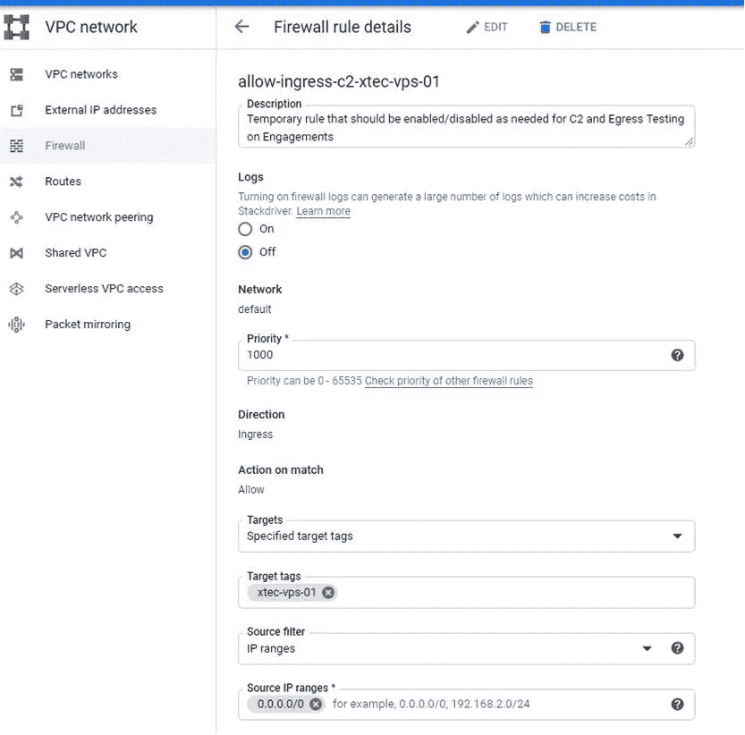

Create a firewall rule for any inbound traffic

命名您的防火墙规则，并启用它。保持**注销**，这样你就不会产生费用。除了添加实例名的“目标标签”之外，其他都保持默认。整个互联网的源是 0.0.0.0/0，您也可以指定您认为要使用的 TCP/UDP 端口。只有当您打算稍后接收流量时，才需要此规则。您可能希望禁用它，直到您需要它作为最佳实践。要测试它，请保持启用状态；我们将我们的设置为进入 TCP 端口 65000，这样我们就不太可能被如此多的网络噪音扫描击中。因为它已经启动了，继续点击实例列表中的“连接 SSH”图标，您将得到一个漂亮的 web 浏览器弹出窗口，这将是您的控制台会话。

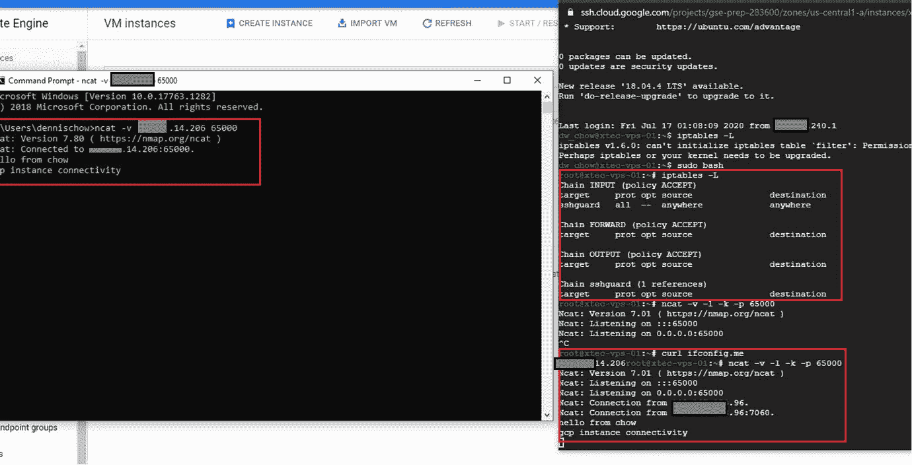

VM instance running a ncat listener and no host firewall rules

正如您在上面看到的，我的主机正在将出口连接到我们的 VPS 实例，请注意，我不需要 iptable 规则就可以让它工作。只需 sudo to root 或 sudo bash yourself，并像使用其他任何东西一样使用实例。如果我忘记了我分配的 WAN IP 地址，我喜欢做的一个有趣的提示是“curl ifconfig.me ”,它会自动返回我的 WAN IP。你也可以用 wget 访问其他网站，如“wget ipchicken.com”或“curl whatismyip.com ”,只是它不会返回一个干净的 ip 地址字符串，你会在 HTTP GET 请求中获得额外的 HTML 标记和内容。

从这里开始，你有几个选择。您可以集中精力让这个实例一天一天地运行。或者，您可以添加第二个 F1 微实例，也许可以将[metapsliotable 2](http://downloads.metasploit.com/data/metasploitable/metasploitable-linux-2.0.0.zip)映像导入到您的控制台中，并在长达 15 天的计算时间内运行它们，您可以攻击或枚举并练习针对它的工具。枚举是 GSE 的核心基础，所以如果你真的想专注于命令行枚举工具，如 Nikto、Nmap、NetCat connectivity，或者只是想专注于旋转技术，我会使用 import image。说到旋转*提示，提示*这是你的 GSE 的核心目标，因为它来自于你的 GCIH 基础。来自 SANS 的 Gordon Fraser 撰写的这份[白皮书是一份很好的资料来源，它很好地解释了我们将在第 2 部分演示的易于设置的旋转技术的用法。](https://www.sans.org/reading-room/whitepapers/testing/tunneling-pivoting-web-application-penetration-testing-36117)

让我们更进一步，继续生成 SSH 密钥，并使用 GCP 的本地端口转发隧道功能，称为“IAP 隧道”，代表[互联网感知代理。](https://cloud.google.com/iap/docs/using-tcp-forwarding)它本质上是一个本地端口，通过封装的隧道，可以使用 SSH 或 RDP 转发到 GCP 的代理侦听 APIservice，该服务将自动路由您的实例，而无需向互联网的其余部分打开通用 TCP 套接字端口。相当漂亮。是的，在 GCP 这也是一项免费服务，别担心。

在 GCP 控制台中，转到“安全”部分>身份识别代理


您必须授权来自 35.235.240.0/20 的访问，这是 GCP 的本地范围池，将作为您的侦听代理来接受您的隧道连接。单击编辑防火墙规则，并像上次一样将该范围应用于您标记的主机；但是请注意目标端口的差异，这在最后一个窗口中没有指定。

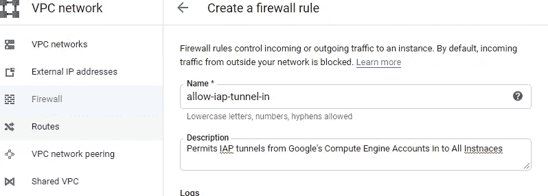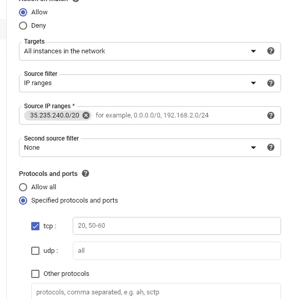

注意，对于第一次来说有点奇怪；您可以选择 TCP **而无需输入任何值**。你看到的灰度值只是例子，并不是我输入的。选中 allow TCP 协议，将其他内容留空。继续保存。返回 IAP 菜单。

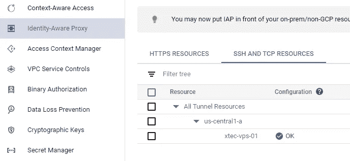

在允许 SSH 和 TCP 资源 IAP API 之后，您应该为您的区域和实例拥有隧道资源组，并带有绿色复选标记，表明您的配置正常。这并不意味着隧道通了；这只是意味着它能够将其转发到您的实例。

现在从任何机器创建隧道；你需要安装名为' [gcloud](https://cloud.google.com/sdk/install) '的 GCP SDK。将它安装在您想要的任何计算机上:

*   脚本、API 或 CLI 管理您的 VPC 实例、网络和 GCP 控制台的其他方面。请将此视为您的云服务帐户的 PowerShell。这是关于如何动态创建 SDN 的众多工具之一。整洁对吗？
*   建立直接到您的实例的 IAP SSH 或 RDP 隧道，而无需一直直接向您的实例开放防火墙规则。**注意:**默认情况下，允许 RDP/SSH 等管理端口从互联网进入您的防火墙。您可以在防火墙 VPC 网络控制台部分禁用这些规则，以提高安全性。*这可以防止你的实例受到危害，比如你的私钥甚至从你的本地主机上被盗。*

因为我使用 Windows 连接到我的实例，所以我将使用为 gcloud SDK 创建的[交互式 MSI](https://dl.google.com/dl/cloudsdk/channels/rapid/GoogleCloudSDKInstaller.exe) 。或者，您可以使用 powershell 并使用。NET 下载器对象并执行。请注意，这种方法通常被攻击者滥用，因此如果您运行下面列出的 PowerShell 下载器，您的终端安全(如 AV 或 EDR)可能会将其检测为“特洛伊木马下载器”。*提示提示*这可能是您的事件或事件分析的一部分，以日志的形式作为您考试的感染点。

```
(New-Object Net.WebClient).DownloadFile("https://dl.google.com/dl/cloudsdk/channels/rapid/GoogleCloudSDKInstaller.exe", "$env:Temp\GoogleCloudSDKInstaller.exe")

& $env:Temp\GoogleCloudSDKInstaller.exe
```

开始安装并完成所有步骤。安装完成后，您将使用 google 控制台帐户声明 IAP 隧道的身份部分，如下所示:

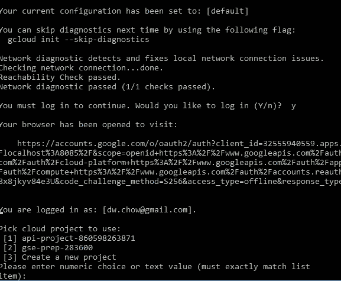

请注意，您的浏览器将会打开；如果您已经像我一样登录；选择您在注册 GCP 时为 VPC 订阅命名的项目。

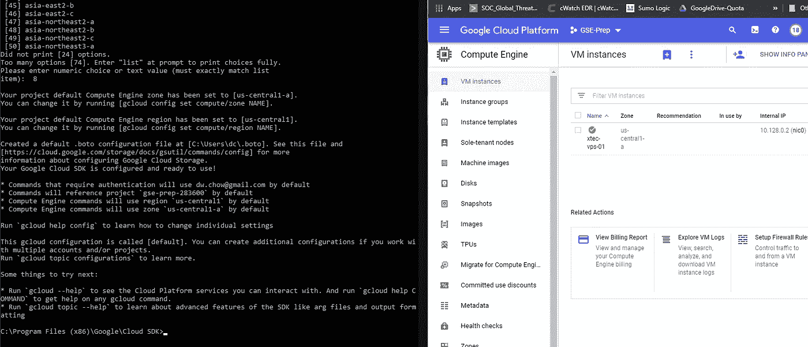

浏览选项。还记得您在哪个区域部署了实例吗？对我来说，这是美国中央 1-a；所以我在选项中选择了那个区域。您可以在控制台>计算引擎>和虚拟机实例下找到它。这应该是你的最后一个问题。请记住，您还没有**而不是**建立隧道。您只需创建一个*默认配置文件*，供 gcloud CLI kit 在每次从浏览器要求您进行身份验证时使用和连接。让我们继续探索如何更改概要文件，以防您第一次就搞砸了向导。(这种情况时有发生，尤其是当你有多个项目的时候)

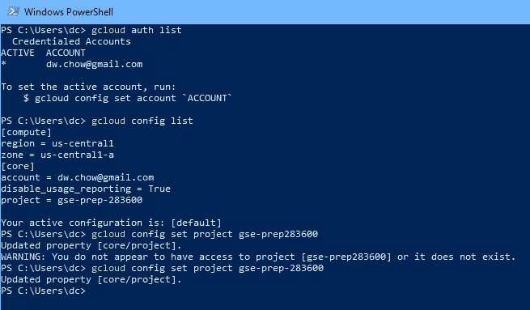

您可以运行 gcloud auth list 和 gcloud config list 来检查您当前的配置文件。您还可以运行“gcloud 配置集项目<your project="" name="">”，它也可以在控制台中找到，以防它改变上下文。使用[文档](https://cloud.google.com/sdk/gcloud/reference/config/set)中的语法‘g cloud config set<propertyobj><yourvalue>’。您也可以通过运行“ [gcloud init](https://cloud.google.com/sdk/docs/initializing) ”来重新启动向导。</yourvalue></propertyobj></your>

我们已经设置了配置文件，如何启动本地端口转发隧道？获取该语法的最简单方法是再次从您的控制台获取，并保留它以备将来记录。转到您单击“SSH 连接”的虚拟机实例，而不是单击它；使用下拉菜单:

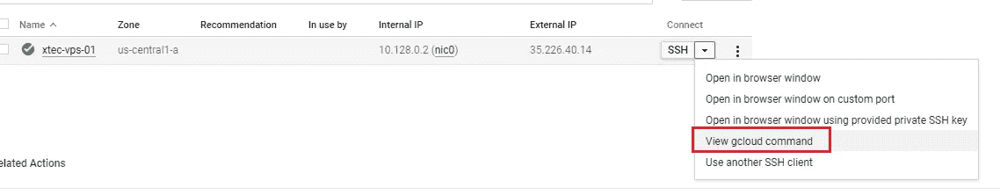

您应该可以点击“查看 gcloud 命令”,复制该字符串并将其粘贴到当前 powershell 或 cmd 会话中:

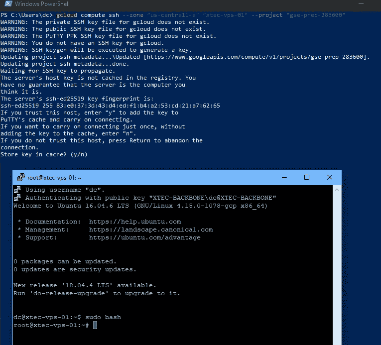

请注意，使用 Gcloud SDK 将充当您在代理的防火墙规则中输入的那些 google ranges 的本地端口转发器。它们不会从互联网直接进入您的虚拟机。请注意区域、实例和项目名称是如何指定的，以便 IAP 隧道能够工作。细心的人会注意到没有生成 SSH 密钥。您还会注意到，它还以适当的 PPK 格式生成 Putty 兼容的密钥，以便与 [Pageant](https://www.ssh.com/ssh/putty/putty-manuals/0.68/Chapter9.html) 或 Putty 客户端本身一起使用。如果一切顺利，您将从桌面上立即弹出 Putty 登录窗口。**注意:您的用户名现在是您桌面上的公钥用户名；这不是你的谷歌云控制台帐户名称**。

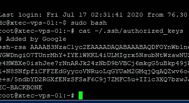

如果需要在实例上找到公钥，可以在本地主机名的主目录下找到它。ssh/authorized_keys，并保存它以备后用，例如，如果您的密钥出现故障或验证失败，您可以重复使用备份的公钥/私钥对。尽管这不太可能。这也是另一个*提示提示*可能的领域，您必须在 linux 管理或关键管理目标下的 GSE 资格考试中进行检查。

你可能想知道。那太好了，丹尼斯，谢谢——但是如果我的桌面一直打开一个 Putty 实例，我该如何将任何东西从我的桌面切换到这个实例呢？很好的问题。有两个东西你可以用。Putty 自己的 PSCP 二进制或标准的 WinSCP/ [FileZilla](https://wavemotiondigital.com/tutorials/using-putty-pageant-with-filezilla-on-windows/) 类型的应用程序。您还可以考虑将 [Plink](https://www.ssh.com/ssh/putty/putty-manuals/0.68/Chapter7.html) 与 Pageant 结合使用，这样当 IAP 隧道从一个单独的命令窗口打开时，您就可以自动化 VM 实例管理或任务。

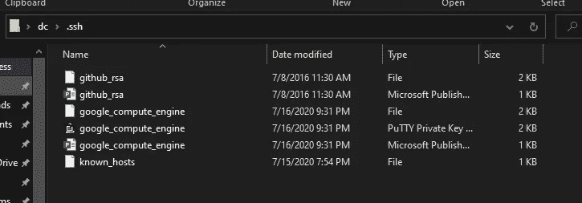

首先，找到 gcloud 慷慨地为您生成的私钥。注意，它使用了标准的 rsa-keygen 和 putty 风格的密钥。你可以在“C:\users\ <your user="" profile="" name="">下找到它。ssh\ "。它将被标记为 google_compute_engine.ppa。</your>

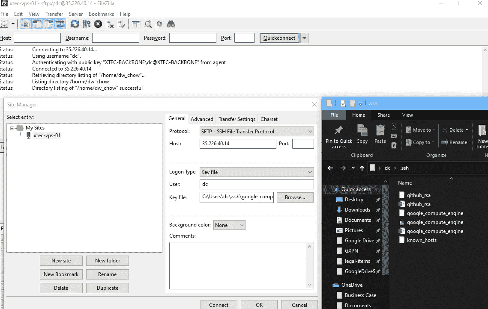

打开“我的站点”下的 FileZilla，定义 SFTP(实际上是 SCP)协议的使用以及分配给实例的当前 WAN IP。这种情况在每次关机和开机时都会发生变化。如果有疑问，使用您现有的 putty 会话并在 quick“curl ifconfig . me”下执行以获取它。将用户设置为在 users\profile 目录下指定的本地 Windows 桌面用户名**。如果你指定了错误的用户，并允许 FileZilla 连接，这将使你的 IP 被谷歌的防火墙暂时禁止，你可能不得不关闭/打开你的实例来获取一个新的 IP。将您的**密钥文件**设置到 google_compute_engine.ppa 的位置，然后连接。现在您可以导航到/home/ <您用来传输文件的本地桌面用户名>(如二进制文件、pcaps、日志等)。)**

## *Jupyter 笔记本— Google Colab 设置*

如果您对维护完整的 VPC 不感兴趣，也不打算接受入口连接；你可能更适合 Google Colab Juptyer 托管的笔记本。也是免费的。但是，每个任务的计算时间会在 90 分钟后超时。因此，如果您不需要让某些东西从头开始运行或编译；这是自动构建和托管 Python 2/3 环境并与通过 [IPython](https://jakevdp.github.io/PythonDataScienceHandbook/01.05-ipython-and-shell-commands.html) 解释的 Bash shell 命令协同工作的一个很好的选择。重要的是要注意，你没有得到一个完整的交互式 TTY。

您得到的东西可以作为任务加载作业输入和运行，并通常以标准输出返回。然而，某些输出或命令不能很好地与 IPython 的解释器(如“cat ”)兼容。谷歌 Colab 笔记本将允许你在它的笔记本控制台中查看文件。因此可能需要使用标准输出重定向。如果对你来说这不是一个很好的展示，这也是一个很好的出口枚举方式。下面你会看到 IPython 的解释器在解析我的 bash shell 命令时出现了一个错误，原因是我的管道使用了 cat。嘘。

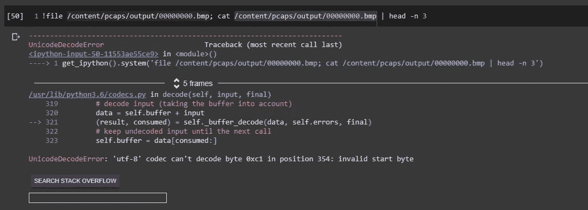

要纠正这个 IPython 解释问题，有两个技巧。将您的“cat”输出重定向到一个文件，而不是标准输出，并在控制台中读取它。还有将 bash 命令语法包装成变量中的字符串，或者使用“eval”调用它。有关更多详细信息，请参见以下示例:

```
#Code block cat viewing and piping issues
!stuff-that-creates-std-out >> my-std-out-file.txt #view in the Colab console#Code block meta characters causing IPython interpreter errors
!eval "multi command string and arguments here"!variable=$(command and/or arguments here with regex)
!command -func $variable <arguments>
```

在上面的解决方案中，让我们看看使用 tshark 的效果，我们希望使用正则表达式作为显示过滤器，从 pcap 中为 URI 寻找最少 10 个字符。我们还并排展示了它如何在 Colab 笔记本之外的 Wireshark 中完美运行:

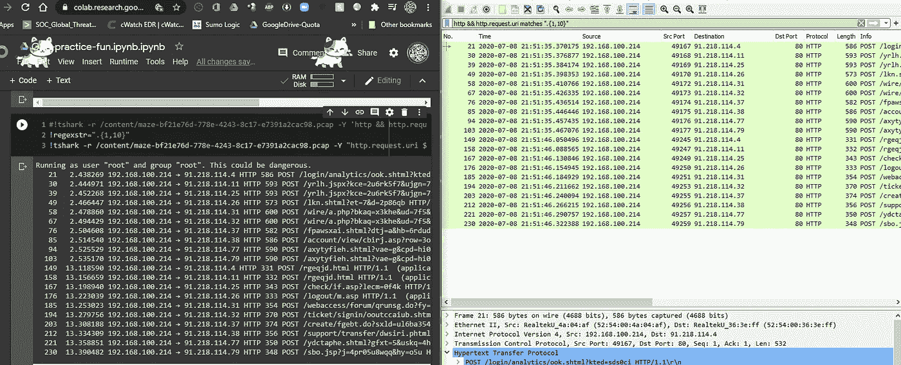

让我们看看当我们将标准输出或重定向到一个可以在控制台中查看的文件时会发生什么。我们展示的例子是使用 tcpxtract 的本地 write 来输出文件，这与重定向字符是一样的:

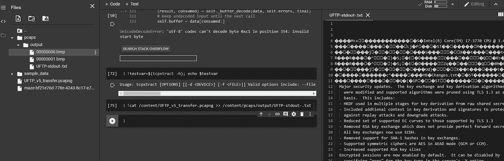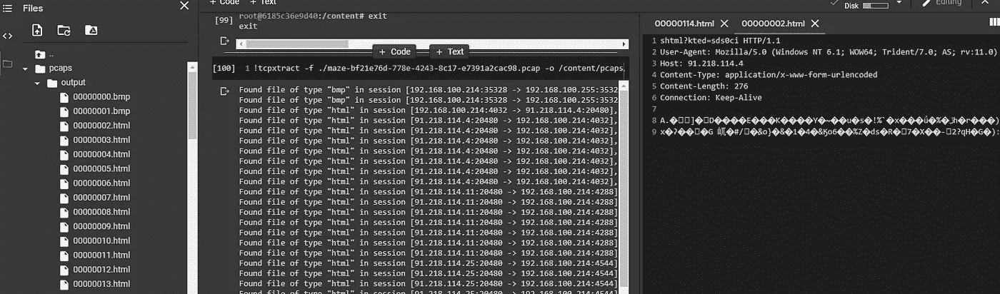

colab 笔记本还具有连接到互联网的能力。让我们来研究一下它的一般用法。它是便携式的，你可以和其他人分享它来进行“colab”分析，甚至可以互相进行突击测验。

从这里开始，你有两个选择。我在 Github 上做了一个 colab 笔记本，免费提供给公众使用，这样你就可以看到我的用例以及思考过程。对于这个路径，你需要安装 Chrome 的“ [Open in Colab](https://chrome.google.com/webstore/detail/open-in-colab/iogfkhleblhcpcekbiedikdehleodpjo) ”扩展。接下来，导航到我的 Github，点击我的 colab 笔记本链接[这里](https://colab.research.google.com/github/dc401/mixed_scripts/blob/master/GSE_practice_fun_ipynb.ipynb)。从这里开始你应该都准备好了。那不是很容易吗？如果你想制作你自己的，你可以直接去 https://colab.research.google.com/[制作你自己的，并链接到你的 Google Drive 账户。由你决定，反正计算资源都是免费的。](https://colab.research.google.com/)

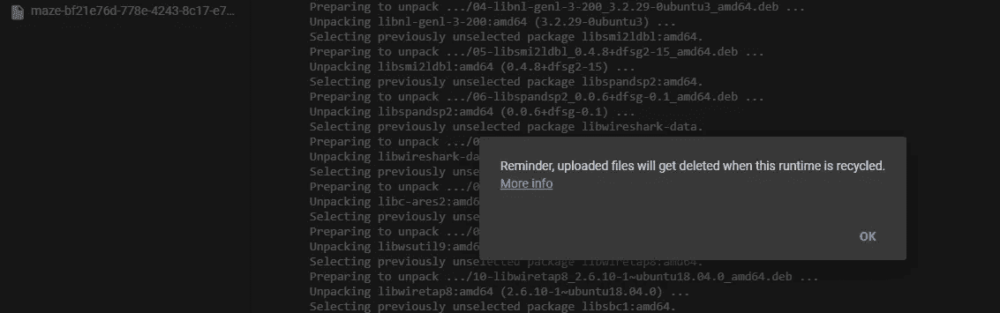

colab 笔记本的第一课是，如果你使用左侧窗格直接上传文件到会话；它将在会话超时后消失。让这些文件“粘”起来的唯一方法就是把它链接到你的谷歌硬盘上。但是如果你不介意的话，可以随意上传。

接下来，需要注意的一点是，如果您运行的代码块出现超时问题或性能下降，您可以在 colab 笔记本中查看运行时日志文件。当你等待一项任务完成时，请记住这一点。您还会看到右侧的 ram 和磁盘使用情况，以监控您的计算时间。是的，我知道屏幕上有一只猫。默认情况下，它有猫和柯基模式选项，当你因代码而沮丧时，它们会在你的屏幕上爬行，给你一种友好的感觉。

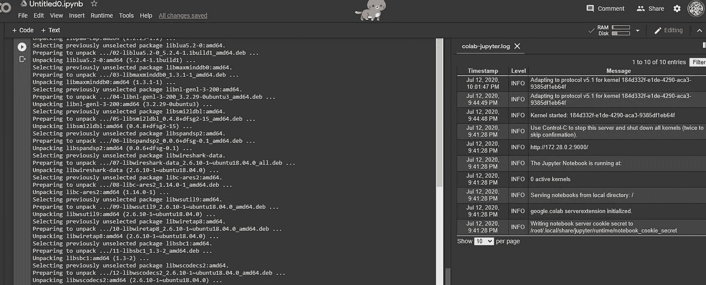

现在，这些“已知的问题”已经解决了，让我们来看看使用 Colab 的一些用例。我将在第 2 部分中展示更多的案例。现在，让我们把重点放在我们能在 colab 中做些什么来获得乐趣和可移植性。

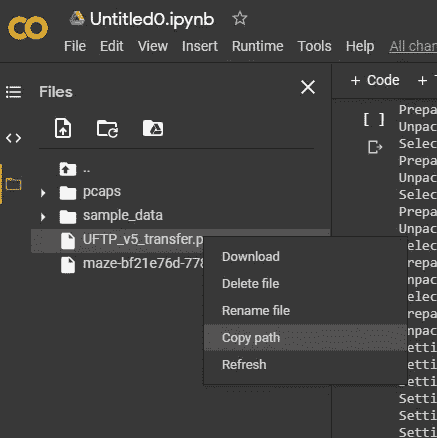

要上传一个文件，打开你左边的文件夹面板，进入“文件”,你可以使用图标或者像 PCAP 那样拖放文件。如果您需要知道在哪里引用该文件，例如以“cd 或 ls”的方式，右键单击该文件并选择“复制路径”,现在您可以将它粘贴到您的代码片段中。

让我们利用一点我们的集成 Python 环境，让 Scapy 运行起来。我把这张来自 packetlife.net 的[大小抄带到了我的考试中，它帮助我记住了交互对象和功能，而不必参考它的内置帮助，这非常慢，减少了你可以用来思考答案和捕捉标志的时间。一定要用彩色打印。它确实帮助了我。](https://packetlife.net/media/library/36/scapy.pdf)

让我们继续添加代码块，进行标准的 pip 安装，并设置**笔记本环境**，就好像它是一个大型脚本文件一样。我强调这一点的原因是，当我们通过 IPython 解释器运行 bash shell 命令时，您会看到非 Python 变量和环境设置是针对每个代码块运行的，而不是**跟随您到后续的代码块。**

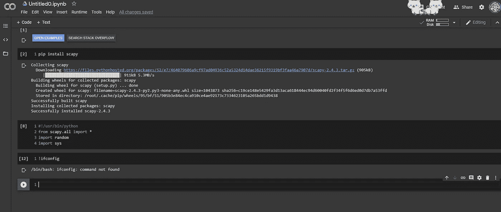

如您所见，我在第一个代码块中添加了一个简单的 pip 安装。要**执行** it，快捷方式是“ **SHIFT + ENTER** ”，然后它将执行并为您提供标准输出/结果，然后自动为您创建第二个代码块。在第[8]行，我设置笔记本使用 python3，然后导入 scapy 模块以及 random 和 sys 作为示例。注意每个代码块中都有后续的行号**。代码块本身基于输出线的数量，而块内数量仅基于该块进行编号。**

在与其他团队成员交流或参考时，请记住这一点。您还会看到代码块的第[12]行，其中“ifconfig 前面加上了一个砰”！ifconfig”。“bang”字符用于告诉笔记本将它作为/bin/bash IPython 解释的命令来执行。我们的输出显示 ifconfig 没有安装，不用担心；你总是可以”！apt-get 更新；apt-get install ifconfig”来获得该功能。

让我们通过使用 Scapy 和 shell 命令，将我们所学的关于基本笔记本用法的知识放在一起。下面我们快跑”！ls-lah；PD；文件。/ <my file="" uploaded="">”。注意每行只有一个刘海字符。在 bash 中，您可以使用分号将多个命令链接起来，并运行单行循环。</my>

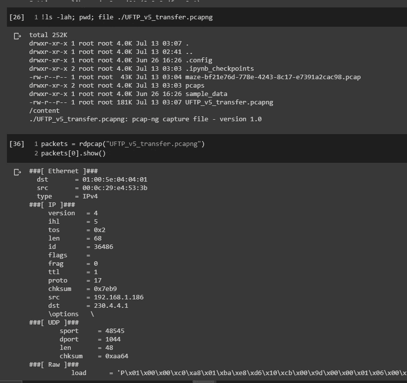

现在我们已经在/content 目录下找到了上面的文件，让我们继续在 scapy 用例中引用它，并在将第一个**包加载到数组中时读取它。您可以在 scapy 语法中通过“variable = rdpcap("/local/path/to/pcap ")后跟变量[#]来实现这一点。显示()。如果需要，您甚至可以在同一个脚本块中这样做。**

你可能想知道你能做的就是接收标准输出。好消息是，根据运行的命令或包的类型，您可以运行半交互式 shell 会话。然而，它相当笨重，而 colab 笔记本代码块就是为此而设计的。还是可以做到的；记住无论你做什么都有 90 分钟的休息时间。要进入“根”bash shell 会话，您可以通过 IPython 解释器执行它，并以“交互式”方式运行您的命令，而不是作业任务。您将得到 shell 会话的错误和警告。

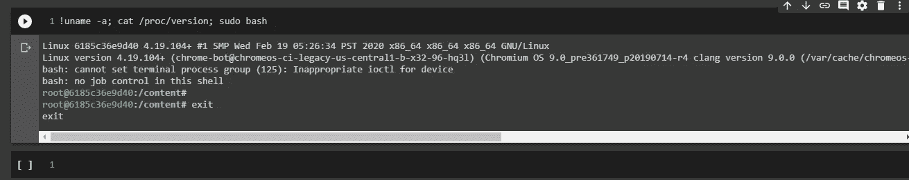

除了通过“！apt-get 更新；apt-get install <package name="">“笔记本电脑有一条通往互联网的默认路径。酷！我们来练习一下 nmap“foo”好吗？</package>

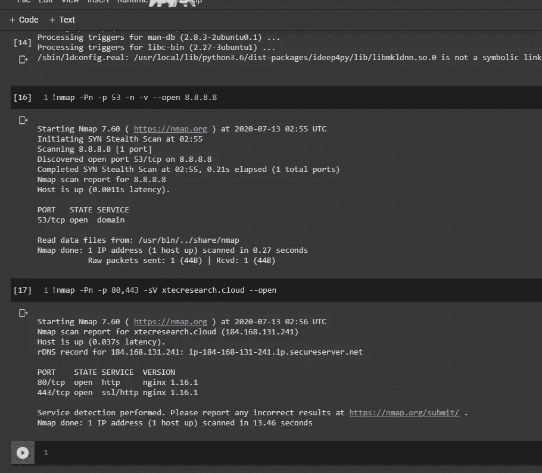

我们在没有 ping 的情况下运行标准的 Nmap SYN 端口检查，我们不仅可以访问 google 地址空间，还可以访问其他主机。现在，让我们继续推进我们的 colab 用例。我们将继续为一个工具安装依赖项，我们知道 San 将在实验室和资格考试中安装在他们的 Kali 虚拟机上。

这个工具就是 US-CERT 开发的众所周知且令人苦恼的 [iSilk 套件。这是大多数安全专业人员不经常使用的东西，因为他们的组织可能会购买商业流量许可和分析器，通常与他们的 SIEM 结合使用。如果你在我的笔记本上跟着做，这些已经调好的命令和**代码块**需要运行**以便**从上到下启动一个完整的安装。如果你想自己做这些，可以参考 SANS storm 日记中的 iSilk 链接。注意，这些命令不会像你一样 100%在 Colab 笔记本上工作。其中一些需要调整一下，如下所示:](https://isc.sans.edu/forums/diary/Netflow+on+Nexus+1000v/16865/)

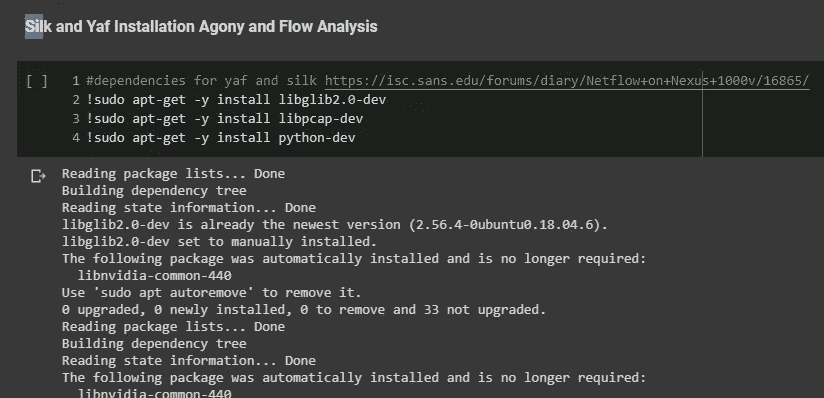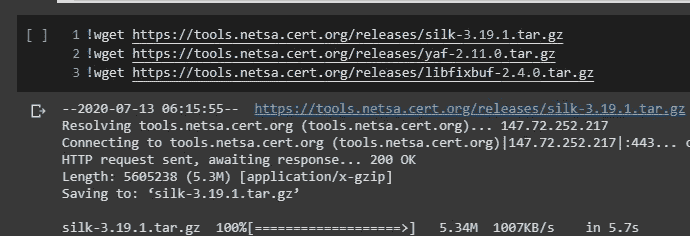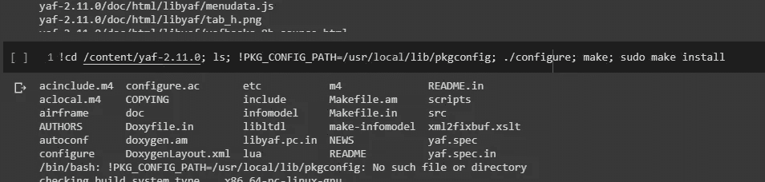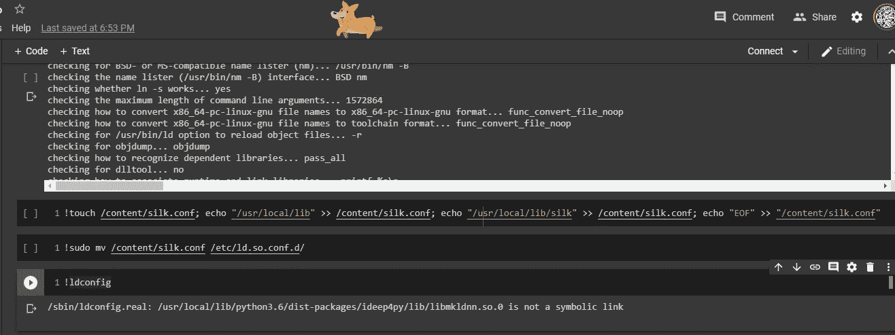

现在我们已经安装了 silk 标准工具；我们不会设置 YaF 来“收集”流量，因为这不是最终目标。我们想把重点放在 rw-tools 套件上，这就是您在 GCIA 看到的。下面是一些例子，说明如何将 PCAP 文件转换为创建流记录进行分析所需的适当的 IPFIX 格式。请注意，使用 rwfilter 和 rwcut 可以在完整的 TTY 交互 shell 中工作，但是管道无法正确解释，因此读取到 rwcut 中的文件会失败。虽然免费也不可怕！


因此，我们从恶意迷宫勒索软件 PCAP 获得了 C2 的详细信息。让我们在 tshark 中做类似的事情，因为为什么有时要采取额外的步骤呢？我提到过，当您的主要工具对您不起作用时，有时您需要考虑替代工具。我们可以在特定的字段和协议上使用 tshark 统计数据，就像我们在 flow 上所做的一样，它将提供类似于您在没有运行 X 服务器的情况下在其附带的 wireshark gui 中看到的内容。让我们从基于 IP 地址的端点分析开始，我们看到每个主机进出的数据包的字节数。

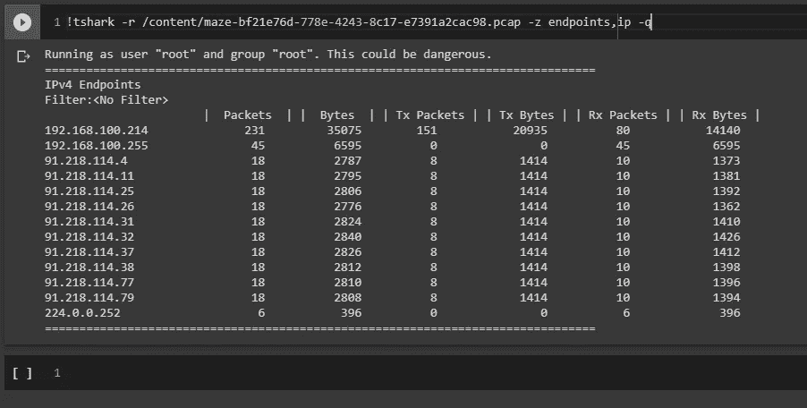

现在我们已经看到了一些正在聊天的主机字节；我们可以明显地看到一些 C2 心跳，发送相同的传输字节和数据包计数，而不是接收到/24 块中的 IP。也许一些替代端口值得在 L4 检查 TCP 和 UDP，看看除了一些可能的心跳流之外，我们是否还能看到任何东西:


使用我们的模式和大约 10-11 秒的短脉冲间隔，通过 HTTP 明文向相同的主机发送大量的短期端口。有意思…

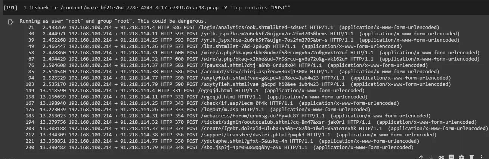

使用 HTTP POST 命令的简单显示过滤器检查 closer，我们看到一些随机生成的语法，与我们的间隔和短突发流量相对应。有要检查的域名或域名吗？

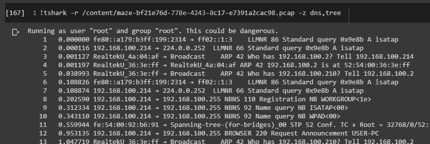

让我们再次使用 tshark "-z "进行统计，并部署一个 DNS 树，看看我们能否将 IP 与别名匹配起来。

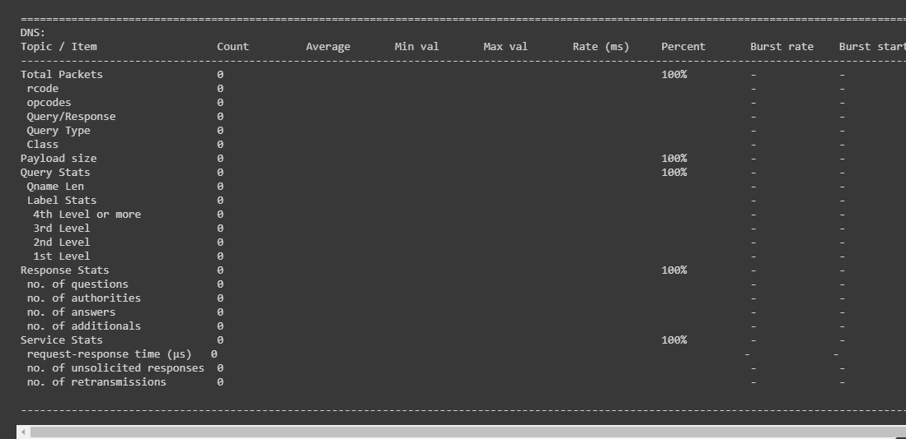

哦，看，0 个 DNS 查询——如果你问我的话，肯定不是正常的网络流量；假设我们进行了完整的 pcap，而 BPF 没有过滤掉 DNS 流量。那绝对是任何人的网络都不好的东西。

在我们结束第 1 部分之前:让我们探索一下 Google 的 Colab 笔记本设置。我们如何引用 Tshark 和 Tcpdump 接口？通过与笔记本的 bash shell 交互，我们获得了有趣的输出:

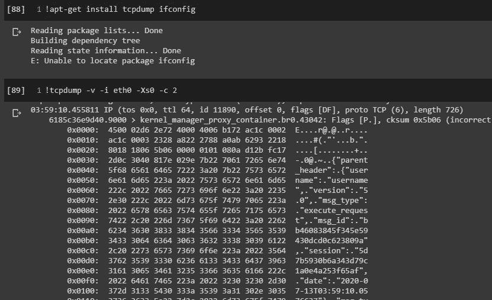

从 ifconfig 看起来很简单，但是当我们进行接口转储时，Tshark 看到了什么？

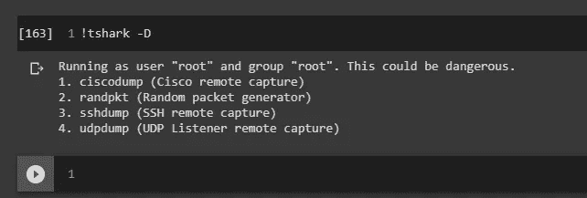

我们在这里看到的是没有明确的列表，因为 Tshark 找不到 ifconfig 可能能够识别的接口。因此，您可以参考 tshark 安装中列出的扩展“extcap”实用程序。这些 extcap 接口对于环回测试非常有用，比如随机生成数据包。更多信息可以在[开发者文档](https://tshark.dev/capture/sources/extcap_interfaces/)网站上找到。

## **收官第一部**

我希望您喜欢我们的一些探索技巧和额外的免费资源，我们可以用它们来支持分析，并让您掌握几乎来自世界任何地方的技能。请继续关注第 2 部分，该部分将重点介绍许多值得寻找威胁的攻击技术，并考虑从取证分析的角度收集的 IOC，这些应该在您的检查中加以考虑。

你准备好第二部分了吗？点击[此处](https://medium.com/@dw.chow/study-guide-for-the-gse-giac-security-expert-part-2-d7b30ddd5845)继续。

一如既往，让我知道你对这篇文章的看法，如果你需要任何安全服务，请在[www.scissecurity.com](http://www.scissecurity.com)找到我

**访问专家视图—** [**订阅 DDI 英特尔**](https://datadriveninvestor.com/ddi-intel)