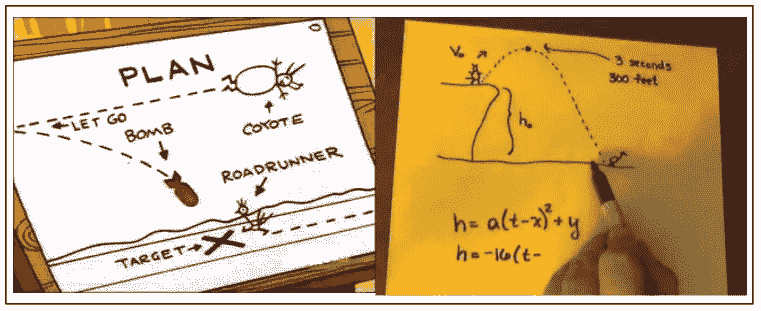
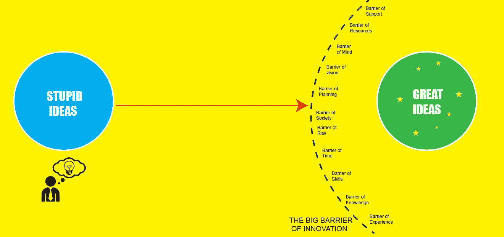
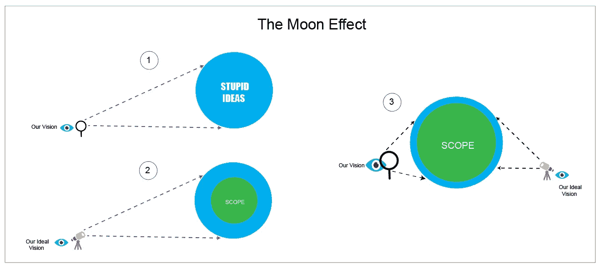
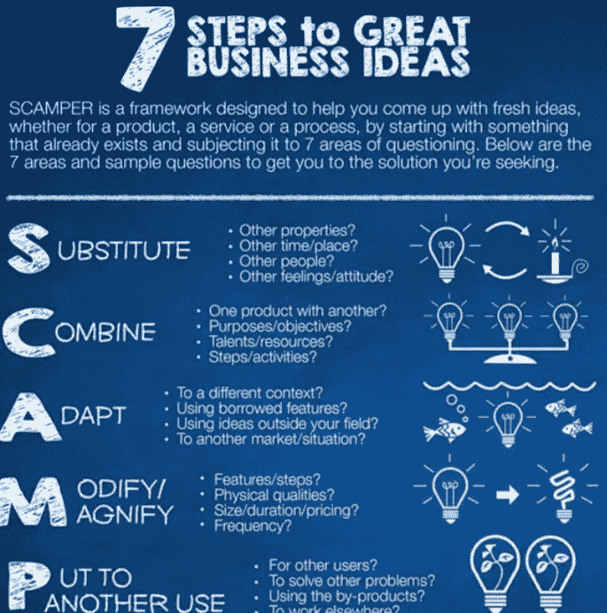
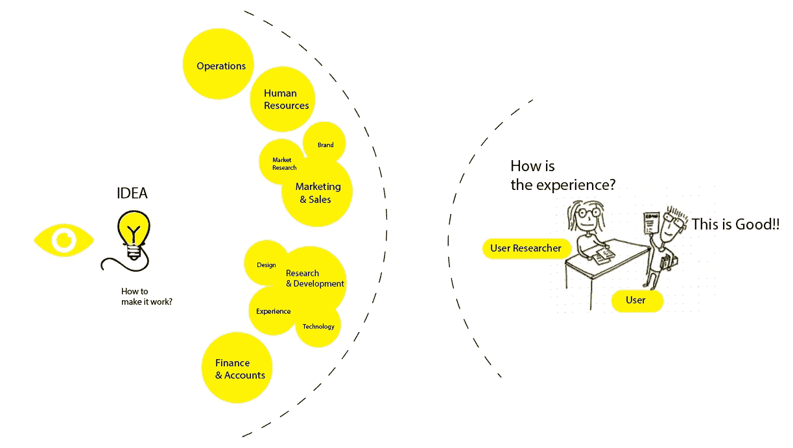
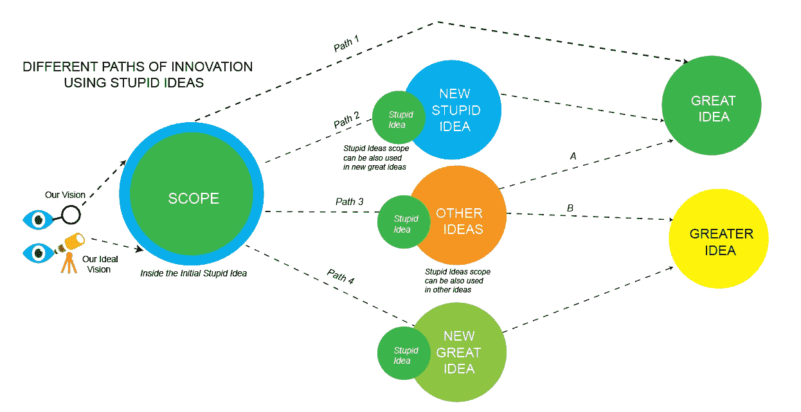
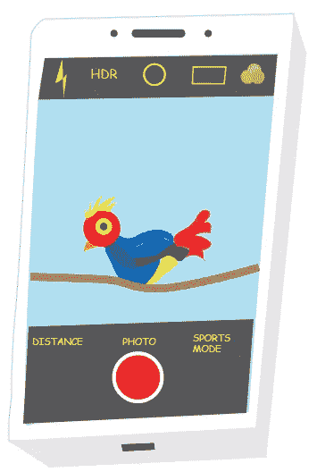
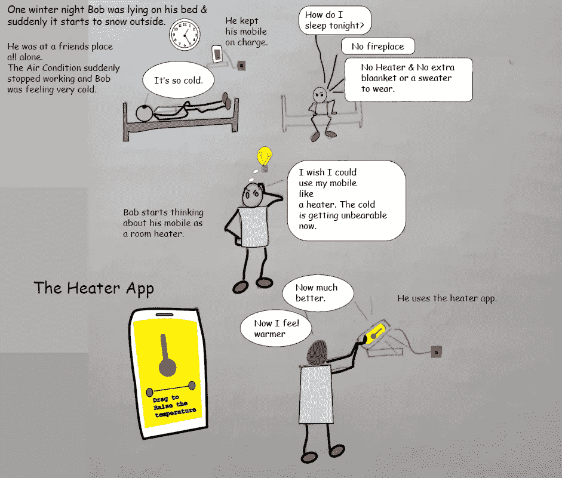
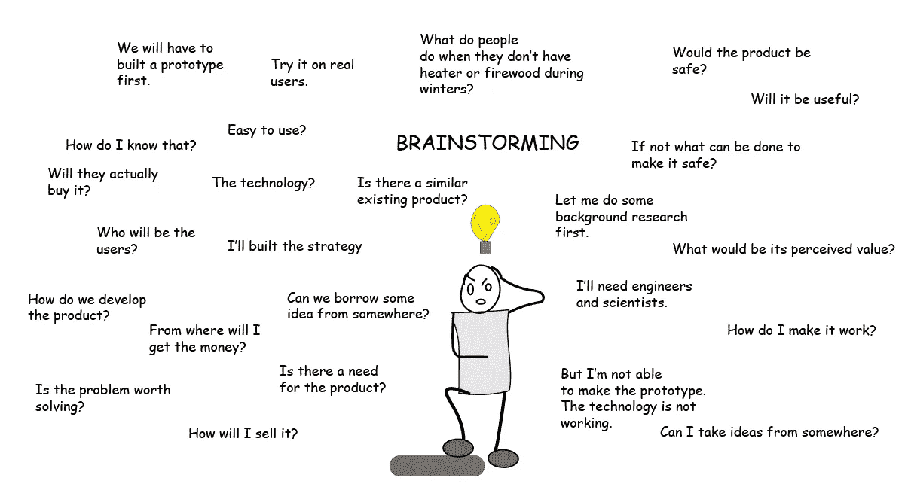
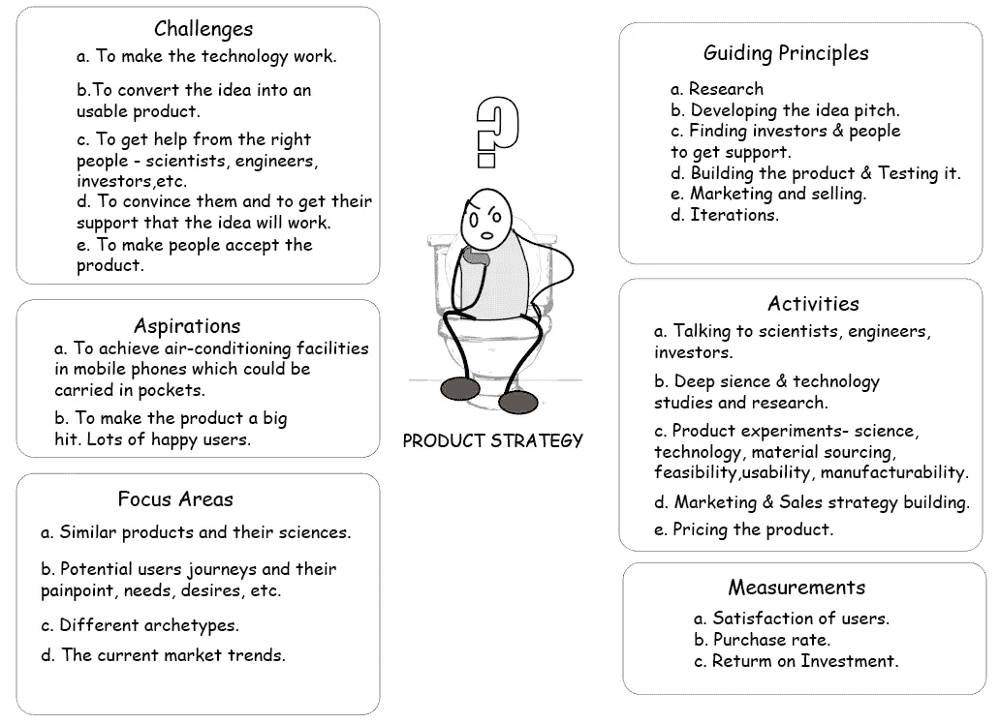

# 愚蠢的想法实际上是好主意:建立创新思维

> 原文：<https://medium.datadriveninvestor.com/stupid-ideas-are-actually-good-ideas-building-the-innovation-mindset-6aaffaeec2e1?source=collection_archive---------5----------------------->

所有工作领域的创造性问题解决者的必读读物。

人们说，每个问题的解决方案都在这个宇宙中，我们只需要通过我们创新的眼睛来看待它们。有些人甚至称之为第三只眼。人们一直告诉我们要发挥想象力。但是他们也告诉我们，如果我们试图去想一些在他们看来不可能的事情，那是愚蠢的。很少有人鼓励我们发挥想象力，并将其转化为伟大的东西。人们认为，如果你变得过于固执，无法让一个愚蠢的想法奏效，你最终会像《马路赛跑者秀》 中的郊狼一样，试图用愚蠢的想法抓住马路赛跑者，但从未成功。

但是他从不放弃。每一个有创意的问题解决者都应该以他为动力。你也可以问自己这些问题，就像练习— *为什么走鹃从来没有成功地抓住郊狼。如果你把郊狼想象成企业家，把走鹃想象成顾客，你的答案会是什么？如果郊狼是一个用户研究员，他将如何通过帮助产品设计师建立优秀的策略来抓住郊狼？*

同样，大多数发明在发生之前，即使对社会上最聪明的人来说，听起来也是愚蠢或不可能的。每个创新者都有一个只有他在开始时才看到的愿景。这个愿景在几乎所有人听来都很愚蠢。

我觉得愚蠢的想法就像生殖过程中争夺卵子的精子细胞。这些精子有些在我们的思想中，有些在宇宙中，而卵子是价格，是被称为创新的目标。现在只要有人赢了，竞争就是好的。但我的想法是产生双胞胎。我想让更多的人赢。要实现这一点，更多愚蠢的想法，比如迷失方向的精子细胞，需要达到它们创新的目标。我们能做什么？创造更多的精子细胞(愚蠢的想法)或帮助现有的精子细胞(愚蠢的想法)到达卵子(创新阶段)或通过给它们一个方向来创造更多的卵子来为它们找到其他卵子。现在，在我们忙于讨论卵子和精子或关于跑步者之前，让我们进入正题。

# **开始吧**

有时候，我想收集世界各地人们的想法，这些想法被人们拒绝，他们认为这些想法愚蠢、糟糕、疯狂、不切实际或不可能以服务或产品的形式变成任何有用的东西，并创办一家名为**愚蠢想法**的公司，成为一名超级成功的企业家。

公司的愿景声明将是—

*“让世界上所有愚蠢的想法变得可用，并通过它们为普遍问题提供解决方案”。*

**价值陈述应该是—**

*“我们尊重人们和他们的想法。我们喜欢愚蠢的想法。我们努力让这个世界充满愚蠢的想法，让这个世界变得更美好”。*

**使命陈述将是—**

*“让任何有想法的人改变世界”。*

# 什么是愚蠢的想法？

*我对“愚蠢想法”的定义是—*

****

愚蠢的想法通常也是经过深思熟虑的想法——它们被贴上愚蠢的标签只是因为我们看不到它们的用处。

如果一个被拒绝的愚蠢想法是人类的形式，他将是这个宇宙中最孤独的人，他交不到任何朋友。

他需要我们的一些关注。他希望我们听他的，花时间和他在一起，最重要的是理解他，试着从他的眼中看世界。同样，每一个愚蠢的想法都在寻求这种关注。我们应该训练我们的头脑去关注他们，因为他们值得关注。

# **为什么愚蠢的想法会失败？他们如何给自己贴上愚蠢的标签？**

*人很懒他们不喜欢练习* [***深以为然***](https://stephenguise.com/deep-thinking-can-change-your-life/) *因为很辛苦。通常没有太多有深度的思考者。深刻的思考者通常试图在一个愚蠢的想法中找到范围，使它以某种方式工作，或者在其他地方使用它，或者从中提取一些东西。*

人们根据自己的理解给愚蠢的想法起了不同的名字——你可以在下图中看到。

诚然，一些愚蠢的想法只是来自我们直觉或直觉的随机快速想法。这种类型的快速思维或想法来自系统 1 思维。说到思考**，我们脑海中有两个系统——系统 1 思考**稍快，系统 2 思考**相对较慢**。我们需要这两种思维方式一起工作，这样才能形成良好的和谐，这将有助于我们更经常地做出正确的决定。****

**根据定义:**

**系统 1 思维**是我们大脑快速、自动、直观的方式，其活动包括我们与生俱来的精神活动，如感知周围世界、识别物体、确定注意力方向、避免迷失——以及害怕蜘蛛。

**系统 2 思维**是大脑较慢的分析模式，在这种模式下理性占主导地位“通常，当我们做一些不自然的事情，需要某种有意识的精神努力时，系统 2 活动就会被激活。

我们的目标应该是创造一个**系统 3** ，它的工作将是在相互协作的同时保持两个系统的活跃，并且在你将要采取错误的步骤或决定时向大脑发出警告信号。

这非常困难，因为——这就是为什么我们说像错误判断这样的错误是不可避免的，但我们可以通过改善我们的**系统 3 思维来减少它们。**

因此，这篇文章的目的是敦促所有创造性的问题解决者和任何正在阅读这篇文章的人，通过在我们的头脑中灌输接受愚蠢想法的实践来发展创新思维，这将开始发展系统 3 的思维。虽然这种练习可能不会每次都完美地执行，因为伴随而来的障碍，但是发展这种思维框架肯定会帮助我们成为更好的思考者，我们将能够称自己为“深刻的思考大师”。

你可以点击这个链接来阅读更多关于系统 1 和系统 2 思考的细节。

 [## 系统 1 和系统 2 思维

### 行为科学为我们提供了概念、理论和框架，有助于我们理解人类…

www.marketingsociety.com](https://www.marketingsociety.com/think-piece/system-1-and-system-2-thinking) 

我也强烈建议你至少读两遍丹尼尔·卡内曼的《思考的快慢》这本书。

但首先让我们了解为什么愚蠢的想法会失败，潜在的原因。这样我们就可以借助**系统 3 思维**运用各种思维方法让愚蠢的想法变得有用。

## **愚蠢的想法因为这些障碍而失败:**

一般来说，大多数人会说愚蠢的想法会失败，因为它们是愚蠢的，你不可能利用它们并把它们留在那里。但是我们想让它们工作，因此我们需要知道它们为什么不工作—

缺乏信心——你认为人们不会喜欢它，他们会嘲笑你，你认为它不会成功，因为你不知道如何让它成功，也不知道如何让它成功的战略思维框架。你不知道思考方法，因此你自己也不知道它们将如何工作。

*   缺乏知识
*   害怕失败或被拒绝
*   害怕被评判

**(b)过度自信偏差——**错误地过分依赖事实和我们自己的直觉、知识、天赋等。这也是一个障碍，不允许我们深入思考，也不允许我们看到愚蠢想法的范围。

 [## 过度自信偏差——定义、概述和金融实例

### 过度自信偏见是对我们的技能、智力或天赋的错误和误导性的评估。简而言之，这是一个…

corporatefinanceinstitute.com](https://corporatefinanceinstitute.com/resources/knowledge/trading-investing/overconfidence-bias/) 

**(c)时间限制—** 你认为你的时间少了，因为你有其他更重要的问题要解决，而你肯定知道这些问题都有解决方案。因此，你不会冒险把时间浪费在一个愚蠢的想法上。

**(e)错误的指导或建议—** 与错误的人分享你的想法。他们可能是任何人。一个你觉得是专家的人或者随便一个人。

# **我们如何克服障碍？**

就像我们用正常的视力从远处看月球时看不到月球表面的环形山，但只有用高倍望远镜才能看到一样。同样，当我们不使用深层思维时，我们在愚蠢的想法中看不到范围。我们只有在使用**深度思考**时才能看到范围。

但是，当我们从世界的角度看待一个愚蠢的想法，并将其与我们自己的深刻思考相结合时，我们可以看到更多将这个愚蠢的想法转化为伟大想法的空间。我想称之为“月亮效应”。

即使专家说这不可行，也不要气馁。大多数专家对愚蠢想法的看法是什么，为什么？

专家会告诉你一些事情，比如你的想法或你想象中的产品是愚蠢的，因为它是不可制造的，成功所需的技术是不可发明的，即使它是不需要的，他们也会告诉你一些事情，比如没人会买它，营销是不可能的，违背科学规律，等等。

如果你在一家公司工作，告诉你的老板——他们是对的，因为他们不能浪费时间绞尽脑汁让愚蠢的想法发挥作用。他们一直在寻找容易实现成功的想法。

他们受到约束，他们必须与所有部门合作，满足最后期限，满足客户的需求。我们经常从业内专家那里听到一句非常常见的话——“好主意，但我们没有时间让它发挥作用，而且如果它不起作用，我们的客户会不高兴”。

*但有时是因为缺乏战略信心和糟糕的创新愿景——他们无法看到* [***大局***](https://www.fingerprintforsuccess.com/blog/big-picture-thinking) *即使他们觉得自己是。*

但是你不应该停止产生愚蠢的想法，并试图让它们发挥作用。从长远来看，这会帮助你——发展你的创新思维。

# **如何生成它们？**

***质疑一切。*** *愚蠢的问题。我们认为显而易见的只是事情一直以来的做法，但现在它受到质疑，我们实际上并不知道原因。很多时候，问题的解决方案是通过愚蠢的问题，通过质疑显而易见的事实而发现的。*

**开发思维模式**

继续努力解决那些现在很难、不可能或很难解决的事情。问自己这些问题——怎样做才能让这个愚蠢的想法行得通？我们如何利用这个想法？我们怎样才能从这个愚蠢的想法中获得灵感，从而把它应用到其他地方呢？

b.让头脑一直思考。继续训练它。想想那些没人相信会存在的想法、产品和服务。

*c.* ***不受约束地发挥创造力。*** *避免批评观点，不管是你自己的还是别人的。避免过早放弃想法。接受挑战..制造挑战。*

试着在每一个好的或坏的想法中找到范围，以充分利用它。

**所需的态度**

这种态度必须建立在强烈的愿望、信念、想象力、有组织的计划(这是大多数人失败的地方)、做出决定和坚持不懈的基础上。

不要害怕问题的大小。不要试图解决你知道你最终会解决的简单问题。尝试解决人们认为不可能的问题。永远不要停止从错误中学习。永远保持学习的心态。

**思维方法和策略**

坚持不懈地努力，直到你以某种方式让那个想法或思想发挥作用——学习这些思维方法并掌握它们——****[**SCAMPER**](https://www.inloox.com/company/blog/articles/innovation-better-problem-solving-with-the-scamper-method/)**[**5 why’s**](https://www.mindtools.com/pages/article/newTMC_5W.htm)**——********

****用策略和框架去思考— [**卡诺模型、**](https://www.mindtools.com/pages/article/newCT_97.htm) [**加权打分、**](https://www.aira.net/blog/why-you-should-be-using-weighted-sort/) [**价值 vs 复杂性象限。**](https://www.productplan.com/glossary/value-vs-complexity/#:~:text=Complexity%20Model%3F-,Value%20vs.,a%20quadrant%20and%20prioritized%20accordingly.)****

********

****学习使用这些方法也将帮助你最终放弃一个想法，如果它没有办法被使用的话。但是你丢了什么东西吗？你赢了。你获得了—****

****a.你可以用在其他地方解决其他问题的知识。****

****b.更强的心智。你已经锻炼了你的思维肌肉。你已经锻炼过了。就像我们的肌肉在锻炼时生长一样——就像下棋一样——策略随着时间的推移而改进——想法变得更好是因为试图解决问题、制定策略和失败，以及从错误中学习和更好地看到更大的画面。****

# ****为了不让你的想法看起来太蠢，你应该做的事情:****

****a.确定对愚蠢想法的需求，如何用它来解决问题，如果你知道用户将从中受益，你就可以开始工作，让它发挥作用。****

****b.知道你想要实现什么，并据此制定策略。****

****c.了解你将要面临的挑战，以及你将用来克服它们的方法。****

****d.了解你的目标市场，像营销和销售，研究，开发，了解产品和市场策略，甚至销售****

****知道了所有这些事情，你的愚蠢想法会显得不那么愚蠢，甚至伟大。****

********

****因为人们总会质疑你这些。如果你只有想法，但不知道如何实现它，也看不到事情的全貌，那么当你提出自己的想法时，你会显得很愚蠢。这就是为什么我会敦促所有的创新者，他们也应该努力学习这些与商业相关的东西。如果你在创意领域或任何其他行业工作，这项技能从长远来看会把你从初级水平提升到高级水平。这项技能也将帮助你向投资者推销更有说服力的商业理念。永远记住，一些伟大的想法不会成功，而一些愚蠢的想法会成功。****

# *****我们只需要增强我们的创新愿景*****

****只有当我们看到大局，学会深入思考，并试着从别人的角度看问题时，我们才能在愚蠢的想法中看到现实的范围。在每一个愚蠢的想法里，都有一个范围，我们可以用它来把那个愚蠢的想法变成一个伟大的想法。****

********

****即使我们做不到这一点，我们最终还是会利用一些愚蠢的想法，用一个新的愚蠢的想法来使它成为一个伟大的想法，用其他的想法来使它变得伟大或更伟大，也用新的伟大的想法来使它们成为更伟大的想法。请看看上面我画的图，理解我想表达的意思。****

# ****想象的类型****

*******合成想象—*** *将旧的概念、计划或想法重新整理成新的组合。在这种类型的想象中，经验、教育和观察被用来解决问题和产生新的想法。*****

*******创造性想象—*** *在这里我们有限的头脑与无限的智慧直接沟通。它是接收大多数“预感”和“灵感”的媒介。正是通过这种媒介，所有新的或基本的思想都传递给了我们。在这里，有创造力的人可能会“调谐”或与他人的潜意识交流。当意识头脑以非常高的速度振动时，所有这些都起作用。例如，当意识受到强烈欲望和意志力的刺激时。*****

*****这两种类型的想象力都是必要的——但不幸的是，当我们在一家公司工作时，我们的创造性想象力通常会因为不同种类的潜在因素和障碍而被扼杀。*****

# ******一些建议的愚蠢想法生成练习和做法要做:******

*******在公司—*******

****a.可以鼓励员工在小组讨论期间进行**快速的愚蠢想法头脑风暴**，就像他们进行快速原型测试一样。会议的格言可以像*——“让我们试着通过愚蠢的想法找到解决方案”。*****

****b.每个公司都可以为不同的部门或一个公共小组创建愚蠢的想法小组，员工可以匿名分享他们在董事会议、小组讨论等过程中想到的愚蠢想法。因为害怕被评判、被拒绝或被别人嘲笑，他们当时不能分享这些。****

*******在家靠个人——*******

****a.保留一个笔记本，记下你脑海中出现的每一个愚蠢的想法或念头。甚至那些你自己有时认为可能有点愚蠢的想法，或者认为谁会利用它。****

*****例如，你突然想捕捉远处物体的图像，比如一只鸟坐在树枝上，知道这只鸟离你的确切距离。*****

********

****Illustration by Author****

****问自己这些问题:****

*****这项技术将如何发挥作用？然后做一些研究。*****

*****有没有类似的现有技术？我能做得更好吗？我如何增加价值？*****

****如果你在搜索时发现了谷歌的增强现实应用，那就开始考虑在手机上使用增强现实的其他方式。当你这样做的时候，你最终会学到新的东西。这个想法就是保持学习的热情。****

******在这些练习和实践中要记住的事情有:******

****1.拥抱失败。失败是好事。你从中学习。****

****2.当你有想法时，要勇敢无畏。让思想自由流动。****

****3.批判你自己的愚蠢想法，不要拒绝它们，把它们扔进垃圾桶，而是重复它们，直到它们可以被使用。****

****4.不要试图把你愚蠢的想法强加给别人，让他们相信它是好的。抵制诱惑。像推销员或营销人员一样思考。问自己这样的问题—****

*****为什么有人会接受这个想法？为什么有人会拒绝这个想法？我如何修改这个愚蠢的想法，使它对每个人都有吸引力？我需要发展什么样的技能或思维才能让它发挥作用？我如何增加价值？谁会喜欢这个主意？我如何让人们通过我的眼睛看到？*****

# ******为什么创造性的问题解决者应该喜欢愚蠢的想法？******

****你可能是企业家、营销人员、设计师、用户研究员、推销员，无论你做什么，任何需要解决问题技能的工作都需要创新思维。经常和愚蠢的想法一起工作，通过深入思考(系统 3 思维)使它们成为伟大的想法，只会建立你的创新思维，从而使你成为更好的问题解决者。****

****我想到了一个愚蠢的想法****

****a.冬天没有空调时，这款手机还可以用作取暖器。拿起来作为**取暖器 App 项目。******

********

****Illustration by Author****

****既然你想象了一些愚蠢的事情。你已经想到了一个使用产品的用户。你知道人们对产品有需求。您还想象了产品的一个用例场景。现在，对于这个出现在你脑海中的愚蠢想法，你的思考过程应该是怎样的？****

******这就是你对待这种愚蠢想法的方式:******

****从**头脑风暴**开始——把所有事情都彻底想一遍。这是产品的**发现阶段**。使用设计思维来与像 Bob 这样的潜在用户产生共鸣。试着找出这个世界上有多少像鲍勃这样的人。只有几个或更多。拿起一个样本。了解他们的行为、动机和对使用产品的态度，并通过**用户研究，尝试找出对你想象的愚蠢产品的需求。******

********

****Illustration by Author****

****如果研究结果表明你的产品在市场上有市场，你的产品实际上解决了一个问题，人们认为它对他们有用，这就是你的绿色信号。但是你的产品应该完全基于人们所说的他们想要的。有时他们也不知道自己真正需要的是什么。这就是为什么我们还需要市场调查来了解潜在用户的产品购买行为、动机和态度，这样当你的产品上市时，人们就会购买。****

****对头脑风暴会议中想到的问题做更多的研究，但问自己更多的问题，并使用**思维导图方法**来组织你的想法。写下策略—****

****目标、你想要达到的目标、思考你可能面临的挑战、你将如何解决它们、你将使用的原则、你的关注领域、要执行的活动等等。****

********

****Illustration by Author****

****策略可能会失败或不像计划的那样。你总是可以在不同的阶段迭代——你可以采取 [**迭代战略**](https://www.projectmanagement.com/blog-post/19545/Strategic-Iteration-versus-Strategic-Planning) 方法是敏捷实践的基石。****

****你可以从 SCRUM、DSDM 和 FDD 那里获得灵感。这些是一些敏捷实践的例子，他们将软件开发分成一系列重复的周期。你也可以用你的策略做到这一点。你会遇到新的挑战，你会看到走向完全不同的方向的机会，当你迭代时，新的焦点领域可能会出现。****

****解决这类问题没有固定的方法。有人可能已经确定人们会购买该产品，所以他们立即开始开发技术，使产品工作。这样他们就可以使用一个合适的工作原型来了解人们实际上是怎么想的，或者与它互动，以及他们是否真的认为它有用。否则，就像问别人****

*****“嘿！你对飞行汽车有什么看法？“要不要用一个？“你认为飞行汽车对你有多大用处”？*****

****但是我们做的练习也是非常必要的。它为产品指明了方向。我们可以肯定的是，人们真的会购买这种产品，他们认为这种产品有用，容易使用，并能给他们的生活增加价值。****

******加热器应用是个愚蠢的想法吗？******

****是的，如果你仍然不相信愚蠢的想法是好想法——但是如果你可以想象——也许你可以试着让它发挥作用，或者至少从中获得一些灵感，开始接受愚蠢的想法，并用它们来发展你的创新思维。****

********

****我喜欢小说，我想象事物。我相信开发大脑。一旦你开发了它，你就可以更有效地利用你获得的所有知识。我认为应该改进思维模式，在我们脑海中出现的每一个愚蠢的想法中看到范围。我喜欢想象产品和服务的想法，疯狂的想法，疯狂的解决问题的方法，即使看起来不可能。****

# ******结论******

****让我们鼓励愚蠢的想法，激励自己去想象愚蠢的事情，理解愚蠢想法的价值，并从中汲取知识，培养创新的心态。****

********

******访问专家视图—** [**订阅 DDI 英特尔**](https://datadriveninvestor.com/ddi-intel)****

******要读的书******

*****最后，给大家分享几本书看看。这些是我最喜欢的五本书，它们总是帮助我，也可能帮助你培养创新思维。*****

********

******链接阅读:******

**** [## 为什么这个世界需要更多聪明的“愚蠢”想法

### 创业投稿人发表的观点均为个人观点。在他的新书《开始做蠢事的力量》中…

www.entrepreneur.com](https://www.entrepreneur.com/article/228927)  [## 541 - SCAMPER -让商业创意变得简单

### 播客:下载(时长:10:40 - 10.0MB)获得未来剧集的通知苹果播客|谷歌播客| Spotify…

www.superfastbusiness.com](https://www.superfastbusiness.com/business/541-scamper-business-idea-creation-made-simple/)  [## 吉卜林方法(5W1H)

### 1.作者:拉迪亚德·吉卜林(1865 -1936)，英国短篇小说作家、诗人和小说家。2.历史:方法得到…

geniusrevive-com.cdn.ampproject.org](https://geniusrevive-com.cdn.ampproject.org/v/s/geniusrevive.com/en/the-kipling-method-5w1h/amp/?amp_js_v=a6&amp_gsa=1&usqp=mq331AQHKAFQArABIA%3D%3D#aoh=16097989616432&csi=1&referrer=https%3A%2F%2Fwww.google.com&amp_tf=From%20%251%24s&ampshare=https%3A%2F%2Fgeniusrevive.com%2Fen%2Fthe-kipling-method-5w1h%2F) 

**要看的视频**

希望你们喜欢读这篇我满怀爱心为你们写的文章。我尽最大努力让它们内容丰富，读起来有趣。如果你喜欢它，那么你可能也会喜欢我写的另一篇关于人工智能的文章，它是基于人工智能如何让所有的处女都上床。

以下是链接:

 [## 2060 年人工智能可能让所有处女上床的 5 种方式

### 这是一本有趣的小说，适合所有喜欢解决问题的有创造力的人。

biswajeetlearns.medium.com](https://biswajeetlearns.medium.com/5-ways-artificial-intelligence-may-get-all-the-virgins-laid-in-the-year-2060-49a381894d89) 

此外，请点击“鼓掌”按钮，与朋友分享这篇文章，分享你的爱。

****