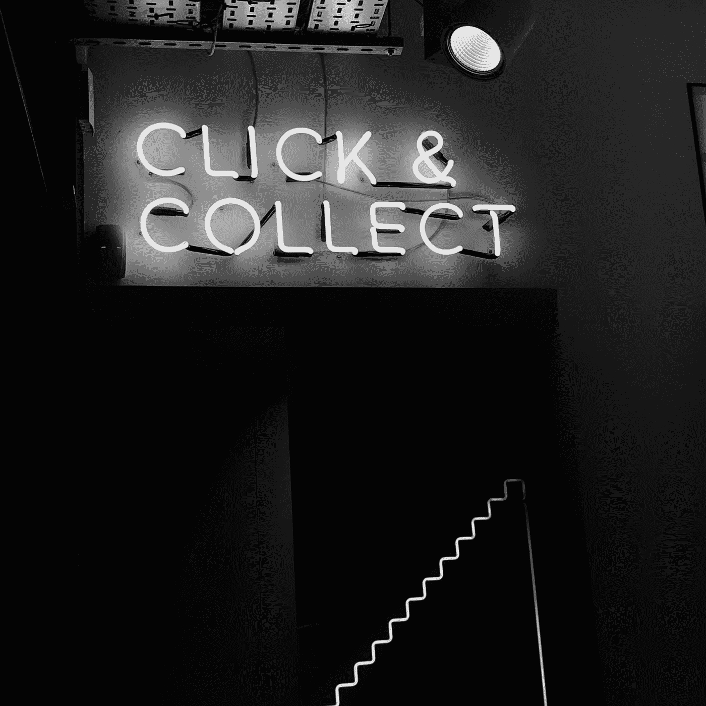
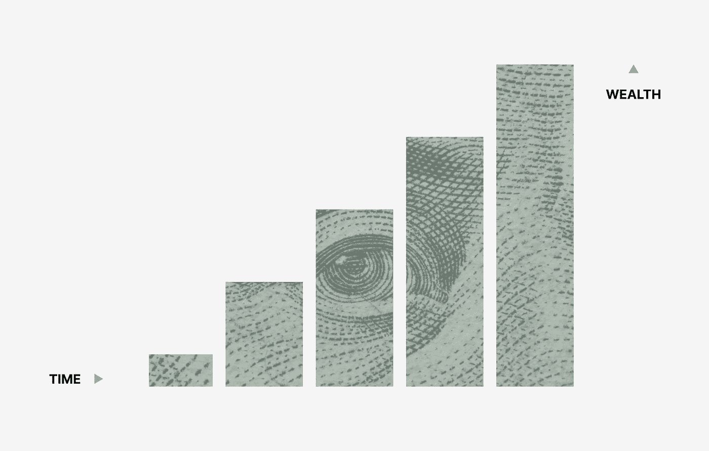

# 通过点击诱饵进行微妙的营销。

> 原文：<https://medium.datadriveninvestor.com/subtle-marketing-via-clickbait-b0dc2b8fc8a1?source=collection_archive---------15----------------------->

## 不点击是不可能的

Photo by [Henrik Dønnestad](https://unsplash.com/@spaceboy?utm_source=medium&utm_medium=referral) on [Unsplash](https://unsplash.com?utm_source=medium&utm_medium=referral)

海滩，几百万美元，和一个可爱的女人，我们大多数人羡慕的生活。成为百万富翁不会解决你的生活问题，但肯定会减轻你收支平衡的压力。

我们中的一些人是通过营销来实现的。

工业 4.0 把两件大事融入了我们的生活。

> ***通过互联网连接***
> 
> ***咄咄逼人的营销***

这导致了像“[影响者](https://influencermarketinghub.com/what-is-an-influencer/)”或更确切地说“[间接营销者](https://www.demandcurve.com/article/indirect-marketing)”这样的术语的产生。**间接营销是专注于首先赢得潜在客户信任的营销。其目的是增加你的品牌知名度，培养潜在客户最终从你这里购买。**

你一定听说过其中一些人从这项业务中赚了数百万，特别是通过 Instagram 和 Youtube 等平台。

影响者仅仅通过巧妙的营销项目就赚了大钱的最好例子是凯西·奈斯塔特。公司送他昂贵的产品，他使用它。作为回报，他每月得到一份丰厚的薪水。

听起来好得难以置信，对吗？

让我们来看看它的核心。为什么公司会给他一大笔钱来使用他们的产品？没有直接营销，只是拿来用！

首要原因是。他和它生活在一起。一次又一次地使用它，说出它的优点和缺点，让它成为你生活中绝对必要的一部分。

Neistat 推出的愚蠢却完美的产品的最好例子是 Boosted-Board。Neistat 把它作为他的主要交通工具。在纽约市中心，踩着电动滑板滑行。

Neistat 在滑板行业赢得了狂热的追随者。他几乎一致认同这种类型，就像他自称的那样。

> 加速板上最快的 Vlogger

关于这个话题的一篇有趣的文章。

 [## 尽管失败了，Boosted 还是给我们上了一堂营销大师课

### 就连凯西·奈斯塔特也是狂热的粉丝

medium.com](https://medium.com/better-marketing/despite-failing-boosted-gave-us-a-master-class-in-marketing-97f24bfa2713) 

既然我们已经讲述了影响者如何向我们灌输营销理念。下一步是理解他们实际上是如何强迫我们听他们的。通过点击诱饵。

## [点击诱饵](https://en.wikipedia.org/wiki/Clickbait)

clickbait 的官方定义是创建内容，其主要目的是吸引注意力并鼓励访问者点击特定网页的链接。

通俗地说，这是一个吸引普通大众的非常激动人心的话题。最知名的有《如何一天暴富》、《如何 7 天减肥》等。非常普通但令人兴奋。

点击诱饵的问题是人们知道它是一个点击诱饵。因此你不能直接推销你的产品。

点击诱饵必须非常非常非常微妙。

这本身就有一定的惊喜成分。消费者不应该意识到产品正在被出售。另一位 YouTuber 先生[野兽](https://www.youtube.com/user/MrBeast6000)给出了最好的例子。

他所有的标题都是点击诱饵。他们能看到风景。很多观点。

他销售产品的简单技巧就是他的视频博客。

1.  有一个带有点击诱饵的标题。
2.  一个既有人类情感又有名人的缩略图。

我们以他的视频为例。

Credit: Youtube

一个非常简单的标题和一个简单的缩略图不是吗？

但这是一款经过深思熟虑的产品，拥有大量有吸引力的消费者。

有三个简单的方面。

**信用卡+一个小女孩+陌生人**

在许多人眼里，信用卡驱动所涉及的金钱因素。最重要的是，对许多人来说，掌管信用卡业务是一场噩梦。为了进一步刺激消费者，她是一个陌生人。

1.  现在，野兽先生能在这个视频中帮助营销产品吗？
2.  万事达卡、维萨卡等信用卡公司。
3.  任何商场，如 D-mart，沃尔玛，她可以在那里花钱。
4.  他送她什么特别的礼物，比如手机或者衣服。

这样一个简单的想法导致了无数产品的各种营销机会。当涉及到高点击率和销售产品时，他是一个真正的天才。

Photo by [Morgan Housel](https://unsplash.com/@morganhousel?utm_source=medium&utm_medium=referral) on [Unsplash](https://unsplash.com?utm_source=medium&utm_medium=referral)

## 该不该用来做营销？

Clickbait 可能是 SEO 家族中的害群之马，但这仅仅是因为它从所有其他绵羊中脱颖而出。投资惊人的标题有助于确保你的内容得到应有的关注

人们经常避免使用点击诱饵的真正原因是他们没有足够的物质来支持他们。如果访客几秒钟后就没兴趣了，那找他有什么用？你也可以用媒介**阅读时间 Vs 视角** s 来理解。您的内容可能会显示给数百万人。但是，如果连 1/10 的观众都不参与，那么过度营销是没有用的。

至于该不该用的问题。

没有明确的答案。这要看情况。

如果你真的有 **10 种在一个月内减肥的方法**那么你一定可以把它贴出来。但是如果你用假信息引诱你的顾客。你不会有好下场的。任何创作者能被给的最差标签就是**假**。

但是，驱动流量对收入的正面或负面影响是不可忽视的。

点击诱饵标题绝对会对访问者产生这样的影响。事实上，这些标题是激发兴趣的大师。与千篇一律的 SEO 标题不同，一个吸引人的标题有能力让人们在阅读一个段落之前就对你的文章感到兴奋。

祝你点击诱饵快乐！

**访问专家视图—** [**订阅 DDI 英特尔**](https://datadriveninvestor.com/ddi-intel)