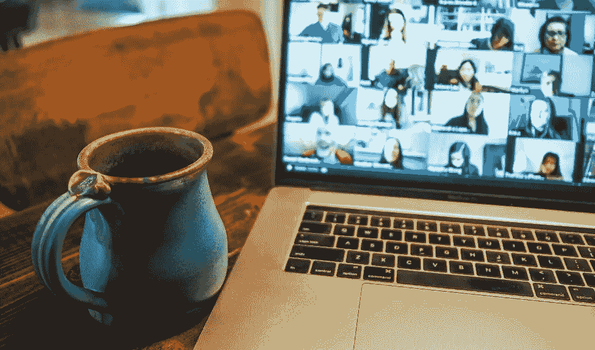

# 成功的远程工作平衡了生活质量

> 原文：<https://medium.datadriveninvestor.com/successful-remote-work-balances-quality-of-life-b4c838001a3a?source=collection_archive---------13----------------------->

## 获得如何在家庭环境中工作的焦点和清晰度

Photo by Chris Montgomery

合作是商业成功的关键。在家工作时，这一点尤为重要。如果远程工作包括共享一个家和家人，那就更上一层楼。

[玛利亚·奥罗佐娃](https://twitter.com/MariaOrozova/)和[斯科特·托马斯](https://twitter.com/Scott_R_Thomas/)每天都在迎接这些挑战，他们经营着他们共同创立的数据驱动的创意营销机构 [MODintelechy](https://twitter.com/MODintelechy) 。从抚养孩子到关注时间管理，他们已经掌握了如何获得远程工作的好处。

这对强有力的夫妇通过“真正意识到”如何以及何时展现他们人性的一面来保持员工的参与和平衡。

托马斯说:“分享你自己的弱点首先会给人们分享的任务或许可。”

Orozova 和 Thomas 与分析师、品牌策略师、播客和 TalentCulture 首席执行官 Meghan M. Biro 就在家工作如何让员工获得新的关注和清晰的工作方式进行了交谈。

 [## 企业文化的未来就在现在

### 想窥探未来的工作吗？吉姆·奈特说没那么快。企业家应该认真看看哪里…

medium.com](https://medium.com/datadriveninvestor/corporate-cultures-future-is-now-2f7fd6bfcaa1) 

企业领导人必须感受到并表现出对员工的真正关心。积极的工作文化不仅仅是在布告栏上说你有。团队根据他们的直觉和所见做出反应。

“有*同理心*，”奥罗佐娃说。“和你的队友报到。真诚地对他们的行为和感受感到好奇。疫情对每个人的影响都不一样。

“建立一个结构，遵循一个常规，”她说。“这对激励和防止精疲力竭都非常重要——无论你处于光谱的哪一端。”

# **调节变化很大**

Biro 同意这一观点，并指出每个人都有不同的应对方式，这有助于领导者改进实践。

“吸收并鼓励员工公开发言，”她说。“无论是协作、分享信息，还是分享个人想法，人们都需要一个开放的论坛。

“领导者需要带着同情和理解接近员工，”比罗说。“这意味着你的互动要人性化，要随时可用。孤立对我们所有人都有压力。在 COVID 之前，我们的大部分社交活动都是在办公室进行的。”

 [## 改善之旅始于福祉|数据驱动的投资者

### 一场普遍的健康危机让人们认识到将健康融入工作文化的重要性。过去的陈词滥调已经…

www.datadriveninvestor.com](https://www.datadriveninvestor.com/2020/06/01/journey-of-improvement-starts-with-well-being/) 

这显示了保持联系的脆弱本质。

“联系是关键，”托马斯说。“我们的团队相当成功地协调了快乐时光和琐事会议，并正在尝试虚拟团队咖啡和午餐休息。我们尽最大努力不越线，让虚拟事件迁移成强制性的乐趣。

“开有效和有意义的会议，”他说。“确定哪些人必须参加，哪些人应该参加。与你的同事交谈，找出最好的沟通方式——一天中的几个小时以及电子邮件、聊天或空闲电话等方式。”

对待远程工作人员就像他们就在大厅里工作一样。缩放和其他连接保持关系活跃。此外，通过分配项目和给予员工自由生产的机会来显示信任，而不需要从远处对击键进行微观管理。

# **支撑缓解压力**

“确保他们拥有所需的工具和技术，”比罗说。“不要让人们因为缺乏资源而感到压力。这样会影响生产力，增加焦虑。

“用每个人都想要的技术与人交流，”她说。“对一个人有用的东西，对另一个人未必有用。问吧。理解在压力环境下远程工作可能会影响工作效率。保持警觉，随时准备回答问题。”

远程工作者必须学会调整自己的节奏。休息一下来减压，避免因为总是“工作”来满足经理们不断增长的需求而筋疲力尽。强调保持工作与生活的平衡。

 [## 精疲力竭耗尽了简单的答案|数据驱动的投资者

### “大多数卫生专业人员知道如何照顾病人，但不知道如何照顾自己。”医疗保健…

www.datadriveninvestor.com](https://www.datadriveninvestor.com/2019/01/15/burnout-exhausts-easy-answers/) 

比罗说:“坚持时间表，每天都有规律可循。”。“有条理可以减少压力，增加对未来的信心。

“善待自己，”她说。“你不需要每天坐在办公桌前 10 个小时来证明你在工作。休息一下。拉伸。走路。冥想。这些策略都有助于理清思路。”

工作并不意味着一直工作。

“每天做一些令人愉快的事情，”比罗说。“也许培养一种新爱好，或者读一读书架上那本积满灰尘的书。愉快的消遣有助于区分工作生活和家庭生活。”

Orozova 和 Thomas 写了一篇博客，回顾了[学到的主要经验教训和在家工作后继续](https://modintelechy.com/blog/wfh-lessons-learned-and-tips-to-take-forward/)的建议。

“关键信息是*注销*，”Orozova 说。“倦怠是真实存在的。”

**关于作者**

吉姆·卡扎曼是拉戈金融服务公司的经理，曾在空军和联邦政府的公共事务部门工作。你可以在[推特](https://twitter.com/JKatzaman)、[脸书](https://www.facebook.com/jim.katzaman)和[领英](https://www.linkedin.com/in/jim-katzaman-33641b21/)上和他联系。