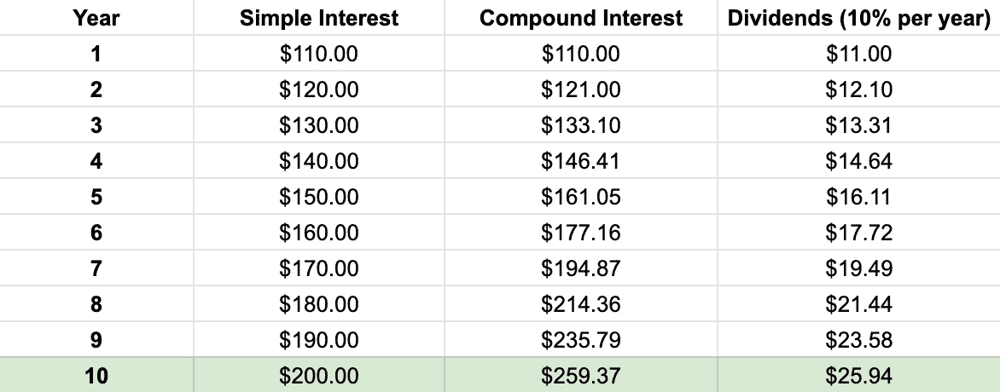

# 用这个简单的策略来增加你的储蓄

> 原文：<https://medium.datadriveninvestor.com/supercharge-your-savings-profitably-with-this-simple-strategy-f7315d701d10?source=collection_archive---------10----------------------->

Photo by [Vlada Karpovich](https://www.pexels.com/@vlada-karpovich?utm_content=attributionCopyText&utm_medium=referral&utm_source=pexels) from [Pexels](https://www.pexels.com/photo/woman-working-at-home-with-her-laptop-4050296/?utm_content=attributionCopyText&utm_medium=referral&utm_source=pexels)

任何类型的金融投资都应该为你赚取复利。随着时间的推移，这会被动地为你的投资增值。

如果你开始投资，你应该学会如何理解时间的流逝会影响你投资的一美元的价值。

意思是钱的时间价值是指投入的钱在未来可以赚取利息，比现在更值钱的概念。

> “今天有人坐在树荫下，因为很久以前有人种了一棵树。”—沃伦·巴菲特

假设年市场利率为 10%，这 100 美元的存款到年底将获得 10%或 10 美元的收益:2020 年的 100 美元是 2021 年的 110 美元。

因此，今天 100 美元值 100 美元，但一年后，这 100 美元将值 110 美元。

[作为投资者](https://ilonacodes.com/investor-profile/)，在投资任何资产之前，你都应该做出有关现金流的决定，并准备好考虑未来现金流的现金流分析。

**在投资前计算你投资的现在和未来价值，因为现在的价值总是小于未来的价值。**

这是真的，因为钱可以赚取单利和复利:

*   **单利**仅按照上面列举的例子:2020 年 100 美元，本金金额(投资原始金额)赚取；2021 年 110 美元；2022 年 120 美元= >每年，这 100 美元的投资将获得 10 美元。
*   **复利**本金+前期赚取的利息:2020 年 100 美元；2021 年 100 美元* 1.10 美元= 110 美元；110 美元* 1.10 美元= 121 美元= >由于复利，原来的 100 美元投资每年会增加 10 美元以上。

使用单利和复利，10 年后的投资余额会有什么不同？

[**这里用我的复利计算器！**](https://compound.ilonacodes.com/)

下面是一个简单的复利计算器的主要实现算法，它使用 JavaScript 根据初始本金轻松计算复利和投资的总存款未来值:

> *“复利是世界第八大奇迹。懂的人赚，不懂的人赔。”―阿尔伯特·爱因斯坦*

# 复利对投资者的重要性

如果你想不花太多力气就学会如何让你的钱为你工作，首先要学会复利是如何工作的！它可以帮助你成倍地增加你的财富，因为你不仅可以从你的初始投资(本金)中获得利息，还可以在利息之上获得利息！

让我举例说明你的钱如何能为你赚更多的钱:

## **1。为孩子的大学学费存钱**

目标:18 年从出生就开始储蓄。

***问题:以 10%的平均利率计算，你今天要存多少钱才能使投资在 18 年后增长到 50000 美元？***

公式:pv = fv / (1 + i) ^ n

**解释**:

1.  你想在 18 年末拥有 50000 美元，那么 fv(未来价值)就是 50000
2.  周期数是 18 年，n = 18
3.  利率是 10%，i = 0.1
4.  你不知道 pv(现值)，所以它在我们的方程中是未知的

***解:PV = $ 50000/(1+0.1)^ 18 = $ 8992.94***

你今天需要投资 8992.94 美元，每年支付 10%，在 18 年后拥有 50000 美元。

如果你想按月投资，而不是一次性付清，你每月需要多少钱？

## **2。X 年后买车**

目标:在 5 年内攒够钱买一辆 50000 美元的车。

***问题:在目前市场利率为 7%的情况下，5 年后你每月需要投资多少才能存下 50000 美元？***

公式:PMT =(Fv * I)/(n x((1+I/n)^ n x(t-1)))(大写字母表示是年金问题)

**说明:**

1.  为了在 5 年内拥有 50000 美元，你想每年储蓄。你必须计算一个 FV(年金的未来价值)
2.  时间 t = 5 年，复利次数每月 n = 12
3.  利率是 7%，i = 0.07
4.  你不知道 PMT(5 年内达到目标必须支付的月供)，所以在我们的方程中是未知的。

***解:PMT =(50000 * 0.07)/(12 x((1+0.07/12)^ 12 x 5–1))= $ 698.30***

你需要每月拿出 698.30 美元的存款，利率为 7%，在 5 年内以 50000 美元的价格购买一辆汽车。

## **3。投资债券**

目标:长期投资债券(一年以上)。

让我们假设你正在考虑投资债券。你的经纪人建议购买 200 张 3 年期 6%的 XYZ 公司债券，每半年支付利息。

你要求经纪人进一步澄清，他们很乐意提供:

*   这些债券的面值为 50 美元，从发行日起 3 年后到期
*   6%是合同规定的利率，你将会得到
*   这些债券每半年支付利息，所以你每 6 个月将得到 3%的利息

你所知道的:

1.  债券投资= 200 只债券 x 50 美元= 10000 美元
2.  每半年支付的利息= 10000 美元 x 3% = 300 美元(你每年将得到两次)
3.  合同利率=每年 6%
4.  通货膨胀率= 2%
5.  到期日= 3 年或 6 个时间段

***问题:你的投资的现值是多少，3 年后你会回多少钱？***

要回答你的问题，你必须分析债券——进行债券估值:

***第一步:计算债券票面的 pv(现值)***

公式:PV = Fv/(1+ir)^ n-等式现值等于未来值乘以系数，其中“IR”是通货膨胀率。

PV = $ 10000/(1+0.02)^ 3 = $ 9423.22-3 年后债券面值的现值。

***第二步:计算定期债券利息支付的 PV(年金现值)***

首先，我们需要计算半年利息支付额= 10000 美元×3% = 300 美元(你每年将得到两次)

pvi fa =(1—(1+I)^-n)/I = >(1—(1+0.03)^-6)/0.03 = 5.42

这意味着你收到的每 1 美元现值为 5.42 美元。现在，您可以根据每半年收到的付款金额计算出现值:PV = $300 * 5.42 = $1626

***第三步:将第一步+第二步的结果相加，计算债券 3 年的价值:***

你的钱在 2022 年的现值是 9.423，22 美元+1.626 美元= 11.049，22 美元，受 3 年内 2%的通货膨胀率影响。

# 结论

财务经理的主要任务之一是使用复利来估计投资的风险和回报，并比较投资风险和回报，以分析财务挑战和机会。

作为一名投资者，要选择适合长期投资的金融产品，你需要了解一些衡量标准。复利的力量就是其中之一。

这比听起来容易，你不需要成为一名财务经理。请记住，年度回报的微小变化会影响我们投资的未来价值。因此，如果你的目标是最大化未来的财富，任何减少年回报的事情都应该避免，每一个增加年回报的机会都应该抓住。

# 来源

[什么是货币的时间价值，为什么很重要？](https://www.thestreet.com/personal-finance/education/time-value-of-money-14796679)

[PVIFA(年金现值利息系数)](https://studyfinance.com/present-value-interest-factor-of-annuity/)

[复利的 72 法则(视频)](https://www.youtube.com/watch?v=mec-QpjQMXY)

*免责声明:作者的观点仅代表其个人观点，不以任何方式构成财务建议。作者发布的任何内容都不构成投资建议，作者发布的任何数据或内容也不应作为任何投资活动的依据。*