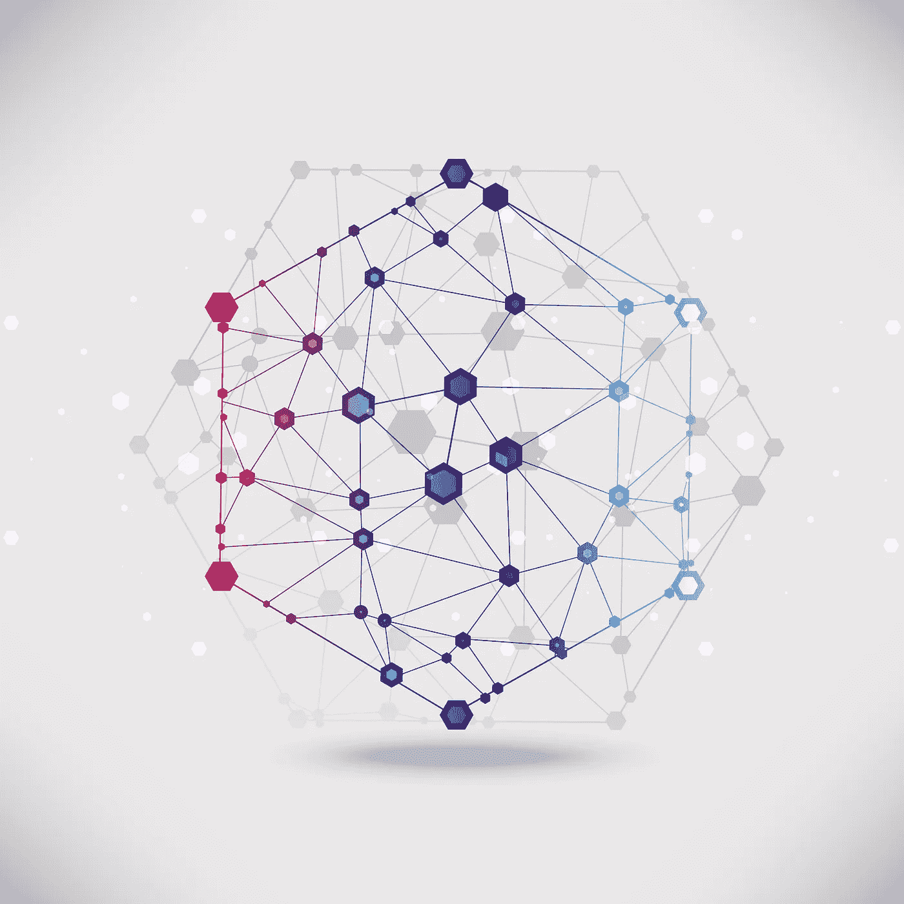
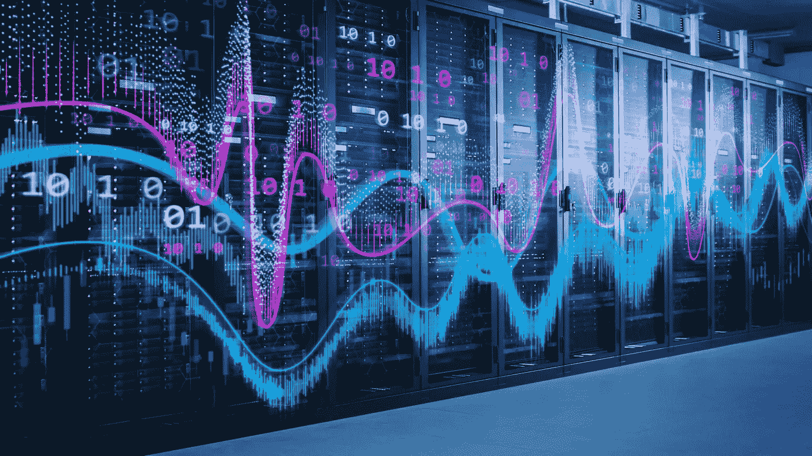

# 超级计算机识别出 77 种可以限制新冠肺炎病毒传播的化合物

> 原文：<https://medium.datadriveninvestor.com/supercomputer-identifies-77-compounds-that-can-limit-the-spread-of-covid-19-54b6024b1230?source=collection_archive---------10----------------------->

## 超级计算机和人工智能如何向新冠肺炎开战？

Source: [Deedman](https://depositphotos.com/portfolio-3169507.html) / [depositphotos.com](http://www.depositphotos.com)

## 疫情的崛起

随着全球减少新冠肺炎病例的斗争愈演愈烈，很明显，这种疾病的传播速度超过了最初的预期。因此，我们对能够帮助患者完全康复的疫苗或药物组合的需求更为迫切。

像文森特等人这样的研究人员。早在这一迫在眉睫的危险变成危机之前，就试图提醒世界警惕这一危险。2007 年，他们的警告几乎无人理睬。他们的研究工作名为“严重急性呼吸综合征冠状病毒作为新出现和再次出现的感染的媒介”，将中国南方食用马蝙蝠和其他外来哺乳动物的习惯描述为一个定时炸弹。他们警告说，这些动物携带了像 SARS-CoV 这样的病毒，这可能导致了 2003 年 SARS 的爆发，也很有可能导致了我们当前的新冠肺炎全球紧急状况。

随着 200 多万人对新型冠状病毒的检测呈阳性，并且人数还在增加，世界上许多地区都处于完全封锁状态，因为我们试图遏制传播。还有一种疯狂的努力，旨在创造一种疫苗和/或确定正确的药物组合，可能会阻止疫情的进展。

 [## 冠状病毒；惊慌失措；字里行间的 z |数据驱动的投资者

### 围绕冠状病毒的话题；更准确地说，新冠肺炎几乎占据了整个新闻预报的头条…

www.datadriveninvestor.com](https://www.datadriveninvestor.com/2020/03/23/coronavirus-a-to-panic-z-between-the-lines/) 

此外，我们限制人与人之间互动的全球运动催生了一个基于人工智能的系统和机器人的巨大市场，这些系统和机器人可以在几乎没有监督的情况下取代人类。[在这里看我们关于他们的文章。](https://www.aimblog.io/2020/04/13/ai-robots-winning-the-fight-against-covid-19/)创新技术被用来运送重要物品、识别病人、减轻医护人员的疲劳，甚至分发洗手液。科学家们还利用人工智能和超级计算机来发现那些可以帮助我们更快更安全地解决我们悲惨的新冠肺炎局势的药物和化合物。

Source: [Gorodenkoff](https://depositphotos.com/portfolio-2572561.html) / [depositphotos.com](http://www.depositphotos.com)

## 人工智能，超级计算机，以及拉平这条曲线

2020 年 2 月发表的一项研究工作解释了世界上最快的超级计算机 SUMMIT 如何识别出 77 种可能限制新冠肺炎扩散的不同化合物。在他们的研究中，Smith 等人(2020)发现，已知 SARS 冠状病毒感染与病毒刺突蛋白(S 蛋白)和特定人类宿主受体(如血管紧张素转换酶 2 (ACE2)受体)之间的相互作用密切相关。[刺突蛋白](https://www.sinobiological.com/research/virus/hcov-spike-protein-overview)是一种大的跨膜蛋白，对于禽传染性支气管炎病毒，它含有大约 1160 个氨基酸，对于猫冠状病毒，它含有大约 1400 个氨基酸。

在继续给出可以抑制冠状病毒和受体蛋白之间相互作用的化合物清单之前，Smith 等人(2020 年)提出，新型冠状病毒 S 蛋白和人类 ACE2 复合物的相互作用确实是促进新冠肺炎感染的原因。因此，互惠是一个合乎逻辑的目标。他们还建议，美国的传统药物开发可能需要长达 15 年的时间；如果我们必须遵守通常的规则，时间是不在我们这边的。截至 2020 年 4 月中旬，全球死亡人数超过 157，000 人。

SUMMIT 的创建和运营背后的故事引人入胜。由 IBM 根据美国能源部 2014 年 3 月的指令开发的比当时世界上最快最强大的计算机 Titan 快 5 到 10 倍。SUMMIT(以及世界上另一台最快的超级计算机 Sierra)的开发花了四年多时间，其特点是一个由人工智能和深度学习组成的大脑系统，而 125 个 petaflops (Sierra)和 200 个 petaflops (SUMMIT)分别充当了它们的肌肉。当尘埃落定，它们完成时，人们发现它们比最快的笔记本电脑要好一百万倍，并且足够强大，可以在创建模型和模拟时筛选数百万个变量。

峰会实际上是为了应对世界的挑战而设计的:抗击癌症，发现更好的材料，如半导体、电池和建筑材料，以及加快我们对疾病的理解。

根据研究结果，新冠肺炎首先影响人体的外层细胞，然后进入呼吸系统，正如我们所知，它在那里造成严重破坏。在 SUMMIT 确定的 77 种可能有用的化合物和药物靶标中，Smith 等人(2020 年)挑出[千金藤素](https://www.ibm.com/thought-leadership/summit-supercomputer/)和  [金丝桃素](https://www.frontiersin.org/articles/10.3389/fphar.2019.01272/full)作为最有希望开发抗病毒剂的药物。有了这些重要的信息，研究人员现在有了更好的理解和更集中的方法，继续抗击新冠肺炎的传播，让我们的世界恢复正常。

Source: [AndreyPopov](https://depositphotos.com/portfolio-1010613.html) / [depositphotos.com](http://www.depositphotos.com)

## 结论:在我们信任的超级计算机中？

随着我们寻找最佳药物组合和疫苗来结束疫情冠状病毒，人工智能、深度学习和机器学习过程继续让我们惊叹。他们为我们提供关于如何保护我们生命安全的基于事实的信息的效用和能力是不可或缺的。当我们从这场危机的另一边走出来时，我们肯定会的，你可以肯定，技术将在我们的复苏中发挥巨大的作用。

*如果你想看到更多这样的帖子或亲自与我联系，你可以在*[*LinkedIn*](https://www.linkedin.com/in/sohail-merchant-370aaa59/)*，*[*Twitter*](https://twitter.com/smerchantMD)*上添加我，或在下面发表评论。你也可以在* [*中等*](https://medium.com/@smerchant40k) *上查看我的帖子。*

这个帖子最初发布在 [www。AIMblog.io](https://www.aimblog.io/2020/04/23/supercomputer-identifies-77-compounds-that-can-limit-the-spread-of-covid-19/) 。