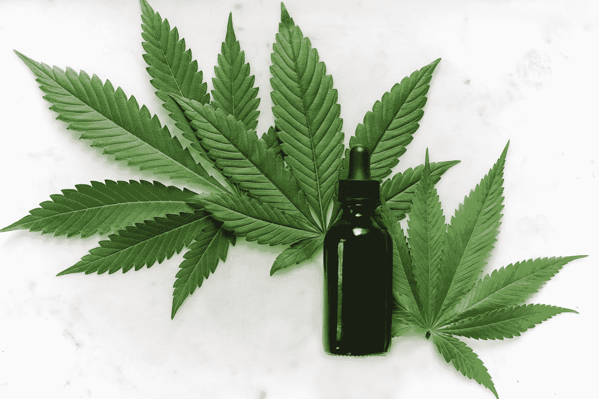
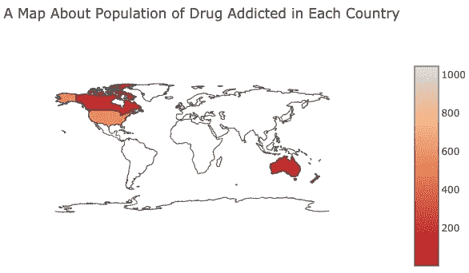
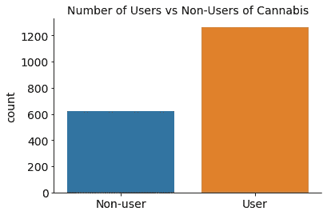
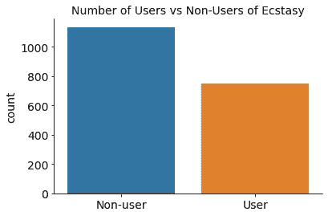
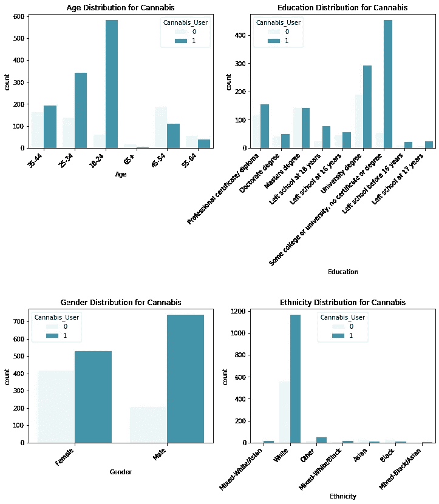
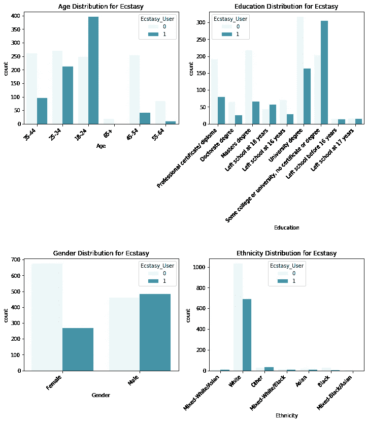

# 监督大麻和摇头丸使用者的机器学习

> 原文：<https://medium.datadriveninvestor.com/supervised-machine-learning-on-cannabis-and-ecstasy-users-602e3ec462d8?source=collection_archive---------12----------------------->

Photo by [Kimzy Nanney](https://unsplash.com/@kimzy?utm_source=medium&utm_medium=referral) on [Unsplash](https://unsplash.com?utm_source=medium&utm_medium=referral)

根据国家药物滥用研究所的数据，在美国，与药物使用相关的成本可以达到甚至超过每年 7400 亿美元:在影响下驾驶的事故，由药物引起或驱动的犯罪，医疗保健成本，或者当人们从潜在的劳动力中退出时。药物过量导致的死亡每年都在稳步上升。

我和我在熨斗学校的项目合作伙伴想做一项研究，确定哪些人群更有可能成为某些药物的使用者，希望通过预防计划和/或有针对性的教育计划来防止他们的使用。这就引出了我们的问题:*哪种人口统计和/或性格特征最能影响一个人吸食毒品的可能性？*

## 数据

数据来自加州大学欧文分校的[机器学习库](https://archive.ics.uci.edu/ml/datasets/Drug+consumption+%28quantified%29#):该数据库包含 1885 名受访者的记录。

每位受访者都有 12 个特征:

*   个性测量(对经验的开放性、责任心、外向性、宜人性、神经质、冲动性和寻求感觉)
*   教育水平
*   年龄
*   性别
*   侨居国
*   种族划分

参与者被问及 18 种合法和非法药物的使用情况(酒精、安非他明、亚硝酸戊酯、苯二氮卓、大麻、巧克力、可卡因、咖啡因、快克、摇头丸、海洛因、氯胺酮、合法兴奋剂、LSD、美沙酮、蘑菇、尼古丁和挥发性物质滥用；一种虚构的药物(赛美龙)被引入来识别过度索赔者。对于每种药物，他们选择一个答案:从未使用过该药物，十年前使用过，或在过去十年、年、月、周或天使用过。

 [## DDI 编辑推荐:5 本让你从新手变成专家的机器学习书籍|数据驱动…

### 机器学习行业的蓬勃发展重新引起了人们对人工智能的兴趣

www.datadriveninvestor.com](https://www.datadriveninvestor.com/2019/03/03/editors-pick-5-machine-learning-books/) 

## 数据清理和准备

由于时间限制，我们将重点放在了大麻和摇头丸上(我计划在未来运行其他 16 种药物的模型)。因此，我们首先删除了与其他药物相关的列。然后，我们注意到年龄、性别、国家、种族和教育列已经被编码和标准化。出于探索的目的，我们将它们非标准化并解码为原始类别。

## 探索性数据分析

我们使用了各种可视化工具，使用 Python 的 Plotly、Matplotlib 和 Seaborn 包，来发现数据中的模式和趋势。

我们首先探索了被调查者所在的国家。

由于调查偏向于北美和澳大利亚，正如您在上面看到的，我们删除了模型训练的国家功能。下图显示了大麻和摇头丸使用者与非使用者的分布情况。在这个项目中，我们将“非使用者”归类为从未使用过该药物或在十多年前使用过该药物的人。“用户”被定义为在过去十年、年、月、周或日使用过它的人。

与两种药物的非使用者人数相比，药物的合法性以及药物的共性可能会对使用者人数产生影响。下图显示了年龄、教育水平、性别和种族的分布情况。

对于这两种药物，20 多岁的参与者使用最多，这些人拥有大学学位或目前在大学。男性也比女性更有可能使用这两种药物。种族倾向于白人，所以我们在训练模型之前也删除了种族特征。在 EDA 之后，年龄、性别和教育特征被再次编码以准备建模。

## 4.模型

在我上一篇[博客](https://medium.com/@hkwak515/regression-analysis-of-nyc-public-schools-state-assessment-scores-aeecc1bff9fc?)中，我使用了回归，两种监督学习方法之一，来研究纽约学生的评估分数。另一方面，对于这个项目，我们使用分类，另一种监督学习方法，因为输出(预测值)是分类的。分类可以是二元的，也可以是多类的。二元分类预测 2 个类别，而多类分类预测 2 个以上。

我们按照 [scikit-learn 指南](https://scikit-learn.org/stable/tutorial/machine_learning_map/index.html)选择合适的机器学习算法:因为我们预测的是一个类别，样本少于 100k，所以我们使用了 SVC(线性和‘RBF’内核)、KNN 和集成分类器(随机森林分类器和 LightGBM 分类器)。我们使用 GridSearch 进行超参数调整以优化模型，并使用“准确性”度量进行评估。

## 5.口译

在预测一个人消费大麻的可能性时，LightGBM 的准确度最高。

五大预测特征:

1.  对经验的开放
2.  年龄
3.  外向性
4.  寻求刺激
5.  教育水平

在预测一个人消费摇头丸的可能性时，线性核的 SVR 具有最好的准确性。

五大预测特征:

1.  年龄
2.  性别
3.  寻求刺激
4.  对经验的开放
5.  尽责

# 结论

正如你在上面看到的，年龄和对经验的开放程度是对预测一个人消费大麻或摇头丸的可能性有更大影响的特征。年龄越低、意识越弱、经验越开放、寻求感觉的人越容易使用摇头丸；男性也更有可能使用摇头丸。年龄越小、受教育程度越低、经验越开放、越外向、越寻求感觉的人越有可能使用大麻。

# 挑战和后续步骤

我们面临的最大挑战之一是在一个小的、有偏见的数据集中。该调查只有 1885 名受访者，并且只针对美国和澳大利亚的白人参与者。这项调查只针对那些至少使用过一种所列药物的人。

如果有机会和资源，我们希望让更多的人参与调查，并增加参与者的地域和种族多样性。我们还想探索从未使用过药物的人的性格和人口统计数据中是否存在任何显著的模式和趋势，以便更准确地了解性格和人口统计数据与一个人使用药物的可能性之间的关系。