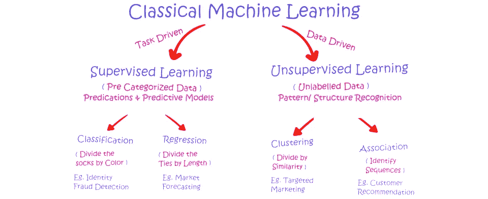
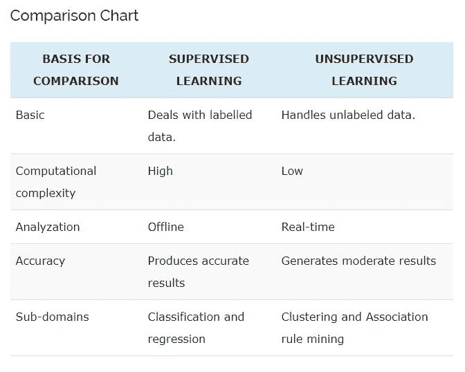
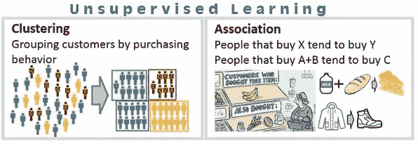

# 监督与非监督机器学习

> 原文：<https://medium.datadriveninvestor.com/supervised-vs-unsupervised-machine-learning-732d49413986?source=collection_archive---------3----------------------->

有监督和无监督学习是两个主要的关键机器学习概念，它们通过从经验和/或数据之间的关系中学习来解决或执行特定的任务。但是这两种技术都用于不同的场景和不同的数据集。监督学习和非监督学习之间的主要区别在于，监督学习涉及训练预先标记的输入来预测预定的输出。这意味着监督学习的目标是学习一个函数，给定一个结构化数据的样本，模型被训练以产生期望的结果。监督学习最接近在数据中观察到的输入和输出之间的关系。相反，无监督学习处理未标记的数据、输入和输出，相反，它的目标是发现数据之间的模式和关系。

Basic Chart Comparison between Supervised/Unsupervised

## **监督学习**

有监督的机器学习需要监督来训练模型，因此得名。我遇到的一个很好的类比是，学生在老师在场(或监督)的情况下学习新材料。使用监督学习，目标是根据训练好的预标记数据预测新数据的输出。监督学习可以用于两种类型的问题，分类(将数据分类到预定的组)和回归(从数值数据预测值)。

Classification usually used to predict labeling | | Regression usually used to predict numerical values

**分类**

当输出变量是分类变量时，使用分类算法，这意味着数据被分组为两个或多个类别，如是-否、真-假、儿童-成人-老年人、圆-正方形-三角形等。在现实世界中，监督学习可以用于欺诈检测、图像分类、风险评估、垃圾邮件过滤等。

 [## 成为数据科学家所需的 8 项技能|数据驱动型投资者

### 数字吓不倒你？没有什么比一张漂亮的 excel 表更令人满意的了？你会说几种语言…

www.datadriveninvestor.com](https://www.datadriveninvestor.com/2019/02/07/8-skills-you-need-to-become-a-data-scientist/) 

以下是一些流行的分类模型:

*   随机森林
*   决策树
*   逻辑回归
*   支持向量机
*   卷积神经网络(图像深度学习)

**回归**

如果输入变量和输出变量之间存在关系，则使用回归算法。它用于预测连续(数值)变量，如天气预报、市场趋势等。

以下是监督学习下的一些流行的回归算法:

*   (简单和多重)线性回归
*   回归决策树
*   岭或套索线性回归
*   贝叶斯线性回归
*   多项式回归

使用监督学习有一些缺点。数据需要被清理和标记，现实世界中的数据很少被标记。训练需要更多的计算能力/时间；与无监督学习相反。监督学习模型不适合处理过于复杂的任务。如果测试数据与训练集严重不同，监督学习可能很难预测输出。

## 无监督学习

无监督机器学习不需要任何监督(这个没有老师)；又因此得名。无监督机器学习的目标不是找到“最正确”的答案；因为模型不会被训练来知道什么被认为是正确的或不正确的。相反，它的目标是从未标记的输入数据中推断模式/关系。它自己从数据中发现模式，而不是从有标签的数据中。通过监督学习，该模型可以根据以前的经验预测输出。我想到了一个很好的类比，从学校回家有多条路线，一个孩子可以选择，在许多不同的尝试和错误之后，孩子发现最快的路线是抄近路和小巷。无监督学习可以用于我们只有输入数据而没有预先确定的相应输出数据的情况。无监督学习可用于两种类型的问题，聚类(根据相似性对数据进行分组)和关联(发现描述数据模式的确切规则)。

Clustering usually used to group similarities | | Association is generally used to find rules and patterns

**聚类**

聚类是一种将对象分组为簇的方法，使得具有最大相似性的对象保留在一个组中，而与另一个组的对象具有较少或没有相似性，并且显示在更远的地方。聚类分析发现数据对象之间的共性，并根据这些共性的存在与否对它们进行分类。

以下是无监督学习下的一些流行的聚类算法:

*   k 均值聚类
*   均值漂移聚类
*   分层聚类
*   使用高斯混合模型(GMM)或 EM GMM 的期望最大化(EM)聚类
*   深度神经网络

**协会**

关联规则是一种无监督的学习方法，用于在大型数据库中查找变量之间的关系。它确定在数据集中一起出现的项目集。关联规则使营销策略更加有效。比如购买 X 物品(假设一个面包)的人也倾向于购买 Y(黄油/果酱)物品。关联规则的一个典型例子是购物篮分析。

以下是无监督学习下的一些流行的关联算法:

*   学习分类系统
*   关联规则学习
*   Apriori 算法
*   奇异值分解

使用无监督学习有一些缺点。对于过于狭窄的任务或小数据集，它也不能很好地工作。与监督学习相比，无监督学习模型可能给出不太准确的结果，因为事先不知道准确的输出。由于没有明确的答案，结果很容易被解读。

我希望这篇博客能帮助你更好地理解有监督的和无监督的机器学习之间的区别。如果是的话，请随意给我一个或十个掌声。👏