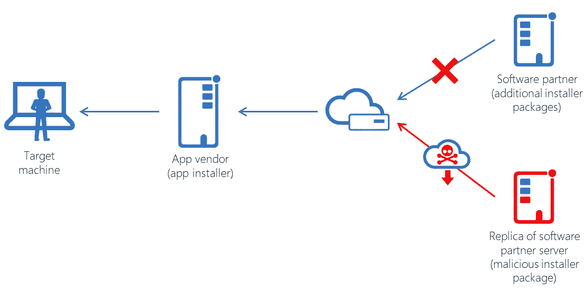
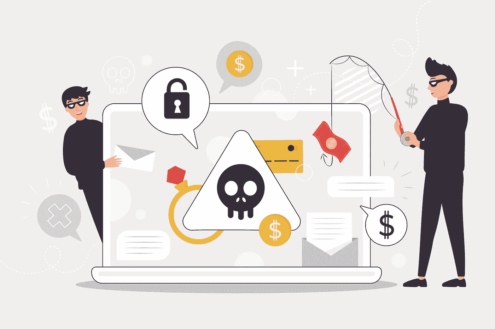

# 供应链攻击

> 原文：<https://medium.datadriveninvestor.com/supply-chain-attacks-df74371df44a?source=collection_archive---------4----------------------->

## 对软件供应链的攻击是阴险的，因为它们滥用了供应商和他们的客户之间的信任，并对双方造成损害。

供应链攻击，也称为第三方攻击，发生在有人通过第三方(如供应商、服务提供商或销售商)进入系统时。近年来，随着越来越多的供应商和服务提供商接触敏感数据，典型公司的攻击面发生了巨大变化。随着公众意识和监督的增强，今天与供应链攻击相关的风险比历史上任何时候都高。

Source: Microsoft

该报告警告称，当今一半的网络攻击使用“跳岛”作为一种方法，这意味着攻击者更有可能破坏公司的供应链，而不是其基础设施。根据这项研究，供应链攻击变得越来越频繁和危险，与此同时，攻击者可以获得关于他们目标的越来越敏感的信息，从而制造了一场完美风暴。

根据该报告，受“跳槽”影响最大的行业是食品和饮料、零售、能源、交通、金融服务和医疗保健。

顾名思义，对供应链的攻击会损害组织、部门和整个行业及其目标供应链。一个组织或行业的供应链越复杂，它就可能越复杂。当您可以绕过整体安全性时，为什么要攻击保护良好的目标呢？

 [## 提高网络安全的最低成本和最有效途径|数据驱动型投资者

### 在组织在 2020 年面临的诸多挑战中，网络安全(或缺乏网络安全)已成为新闻报道的焦点…

www.datadriveninvestor.com](https://www.datadriveninvestor.com/2020/09/04/the-lowest-cost-most-effective-path-to-better-cybersecurity/) 

供应链攻击通常与能够访问目标公司系统和数据的第三方网络的攻击有关。这种攻击通常是间接的，使用供应链、网络和/或受损目标的其他关键基础设施。

多年来，对供应链的攻击已经发展到包括使用装运前截获的计算机硬件。根据美国国土安全部关键基础设施安全办公室的报告，通过提供服务于预定目标的代码，威胁行为者可以破坏或获取服务于第三方组织客户的第三方软件应用程序，例如第三方软件应用程序的更新机制。

在上面提到的供应链攻击中，很明显，受损软件为威胁参与者提供了一个重要的目标区域。参与供应链攻击的攻击者使用许多方法来危害他们的最终目标，包括分发包含恶意代码的软件更新。供应链攻击也非常令人担忧，因为受损软件本质上是多个公司安装和更新可信软件的单一中断点。

供应链攻击可能非常有效和严重，因为它们允许威胁参与者间接破坏他们的目标，并同时到达多个系统。

在公司面临的竞争对手中，有一种对速度和合作的持续关注，这可能导致漏洞和网络安全漏洞，使链上更高级别的公司面临攻击。结论是应该遵循最佳实践，例如双因素身份认证，这是供应链安全的关键组成部分，通常可以从一开始就阻止攻击。这将在供应商和他们的客户之间以及公司和客户之间建立信任。

该研究发现，去年影响供应链中公司的近 300 起网络安全事件是公司最常见的攻击形式——瘫痪性勒索软件。我们看到了制造商遭受勒索软件攻击的受害者，这意味着网络被黑客渗透，他们阻止系统访问和加密数据，直到支付赎金以结束干扰。

对软件供应链的攻击是阴险的，因为它们滥用了供应商和他们的客户之间的信任，并对双方造成损害。CrowdStrike 和 Falcon Intelligence 观察到此类攻击的频率和复杂性有所增加，也报告了这一趋势。据信，对软件供应链的攻击有可能成为未来几年最大的网络威胁之一。

如果我们的预测是正确的，那么组织现在应该准备减轻所涉及的风险。随着越来越多的公司采用数字化管理系统，网络安全事件将是他们面临的一个严重问题。

## **引用来源**

*   [https://www . computer weekly . com/news/252460820/Cyber-attacks-incremently-exploining-supply-chain-vulnerability](https://www.computerweekly.com/news/252460820/Cyber-attacks-increasingly-exploiting-supply-chain-weaknesses)
*   [https://www . last line . com/blog/your-supply-chain-is-attack-how-you-stop-them/](https://www.lastline.com/blog/your-supply-chain-is-attacking-how-will-you-stop-them/)
*   [https://www . csoonline . com/article/3191947/what-a-supply-chain-attack-why-you-should-war-of-third-party-providers . html](https://www.csoonline.com/article/3191947/what-is-a-supply-chain-attack-why-you-should-be-wary-of-third-party-providers.html)
*   [https://www . zdnet . com/article/cyber security-new-hacking-group-targets-it-companies-in-supply-chain-attack-campaign/](https://www.zdnet.com/article/cybersecurity-new-hacking-group-targets-it-companies-in-supply-chain-attack-campaign/)
*   [https://www . techrepublic . com/article/near-300-网络安全-事件-受影响-供应链-实体-in-2019/](https://www.techrepublic.com/article/nearly-300-cybersecurity-incidents-impacted-supply-chain-entities-in-2019/)
*   [https://modern-networks . co . uk/news/supply-chain-attack-set-to-increase-in-2020](https://modern-networks.co.uk/news/supply-chain-attacks-set-to-increase-in-2020)
*   【https://www.armor.com/resources/supply-chain-attacks/ 
*   [https://www . enisa . Europa . eu/publications/info-notes/supply-chain-attacks](https://www.enisa.europa.eu/publications/info-notes/supply-chain-attacks)
*   [https://www . crowd strike . com/blog/should-you-worry-software-supply-chain-attacks/](https://www.crowdstrike.com/blog/should-you-worry-about-software-supply-chain-attacks/)

**访问专家视图—** [**订阅 DDI 英特尔**](https://datadriveninvestor.com/ddi-intel)