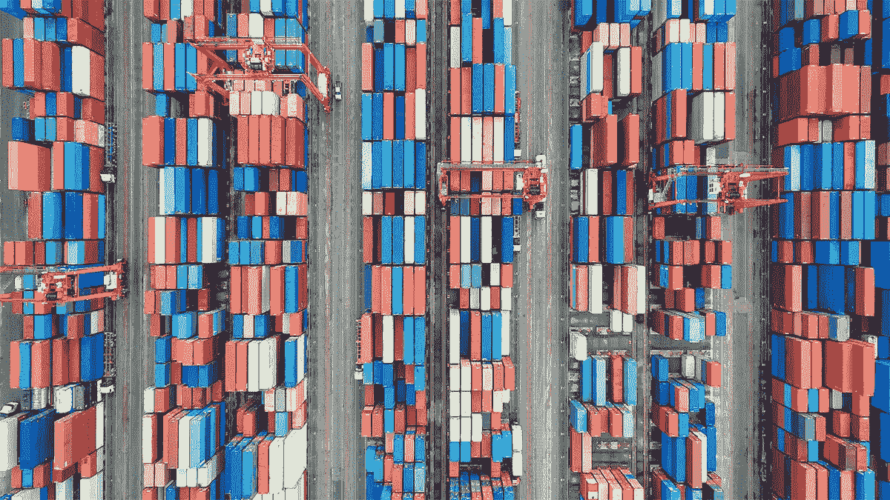

# 疫情超市和百货商店的供应链

> 原文：<https://medium.datadriveninvestor.com/supply-chain-in-pandemic-for-supermarkets-and-departmental-stores-5bb20d3da86?source=collection_archive---------13----------------------->

目前的疫情局势已经扰乱了所有企业的供应链流程，如超市和百货商店。

尽管超市和百货商店是供应链战略不同的不同类别的细分市场，但超市提供食品和其他家庭必需品，如乔氏百货和全食超市。与此同时，百货商店销售各种产品，包括服装、珠宝、配饰、化妆品、玩具、文具、家具和其他非必需品，如**梅西百货和 JC Penney。**

供应链的目标是创造客户满意度，同时为企业和供应链流程创造利润。疫情正在重新定义供应链的目标和战略。疫情超市的首要目标是迎合**对家居用品出乎意料的高需求**。百货商店的供应链目标是**利用疫情的全渠道维持并提供优质服务以留住顾客**，因为非必需品市场受到的冲击最大。

像 Trader Joe's 和 Wholefoods 这样的超市采用新的竞争策略，更多地了解疫情的顾客需求和购物模式。他们试图使**必需品以**适当的价格**和**提供**送货上门和路边取货的额外里程服务**。

为了度过漫长的疫情时期和需求的不确定性，超市应根据实时洞察和需求成形调整**需求驱动的规划和业务运营模式**。他们应该区分必需品和非必需品，并根据洞察力不同地处理需求计划。**在同一批货中订购额外的库存**将降低成本，提高供应链的响应能力。**增加来自其他大洲的供应商，如疫情，使供应基础多样化。如果从一个洲停止运输，同样的商品可以从其他供应商处获得。**保持间歇库存和安全库存**。如果替代供应商不可用，超市应该为他们的顾客保留额外的库存和安全库存，增加成本，从长远来看增加价值并产生收入。供应链驱动因素在实现战略契合方面发挥着至关重要的作用。为了让超市反应灵敏、高效，他们可以**增加设施和库存的数量；这**将有助于迎合疫情的高需求，并将**降低运输成本**和缺货的不确定性。实施数据驱动的需求规划**信息流**是一个关键驱动因素。对于超市来说，关于产品需求的信息很容易获得，并且可以有效地用于**计划**。**

随着对亲临现场的限制，疫情正在改写百货商店的规则。他们正在采用新的竞争策略，通过促进或更加关注**数字存在**和提供便捷的**退货**和**订单可见性**向消费者提供产品和额外服务**。百货商店正在举行网上假日销售，因为消费者会避免走进商店。为了用供应链战略来补充这些竞争战略，零售商正在优化库存和存货，并采用拉动战略，而不是在预期需求的情况下囤积大量库存来获取利润。他们应该**从最近的商店发货**以降低运输成本**并提高响应速度**。与超市相反，百货商店应该减少库存和设施数量，以适应拉动战略，并在信息收集和网络展示方面投入更多。转向更现代的供应链方式，并**消除供应链和商品规划**功能之间的孤岛。梅西百货公司报告说，通过增加这些策略，他们获得了 53%的业务收益。**

疫情确实改变了零售业，但供应链方法和战略具有支持不断变化的形势的灵活性。

参考

哈佛商学院(2020)。后疫情世界的全球供应链。2020 年 10 月，来自[https://HBR . org/2020/09/后疫情世界的全球供应链](https://hbr.org/2020/09/global-supply-chains-in-a-post-pandemic-world)

哈佛商学院(2020)。疫情正在改写零售检索规则。2020 年 10 月，来自[https://HBR . org/2020/07/](https://hbr.org/2020/07/the-pandemic-is-rewriting-the-rules-of-retail)

Globest.com(2020 年)。疫情可能会给百货公司带来挽回的机会。2020 年 10 月，来自[https://www . globest . com/2020/09/04/the-疫情-can-bring-a-opportunity-for-department stores/？slreturn=20200912231157](https://www.globest.com/2020/09/04/the-pandemic-could-bring-an-opportunity-for-department-stores/?slreturn=20200912231157)

SupplyChainbrain.com。(2020).2020 年六大供应链战略。2020 年 10 月检索自[https://www . globest . com/2020/09/04/the-疫情-can-bring-a-opportunity-for-department stores/？slreturn=20200912231157](https://www.globest.com/2020/09/04/the-pandemic-could-bring-an-opportunity-for-department-stores/?slreturn=20200912231157)