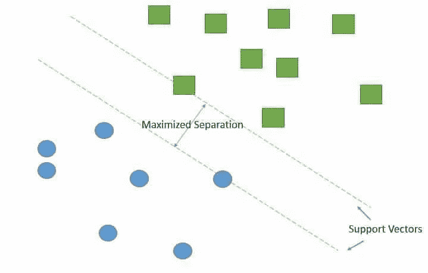
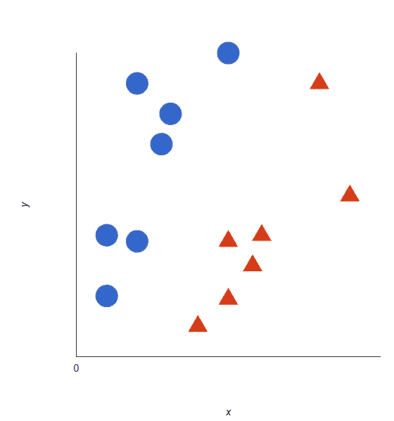
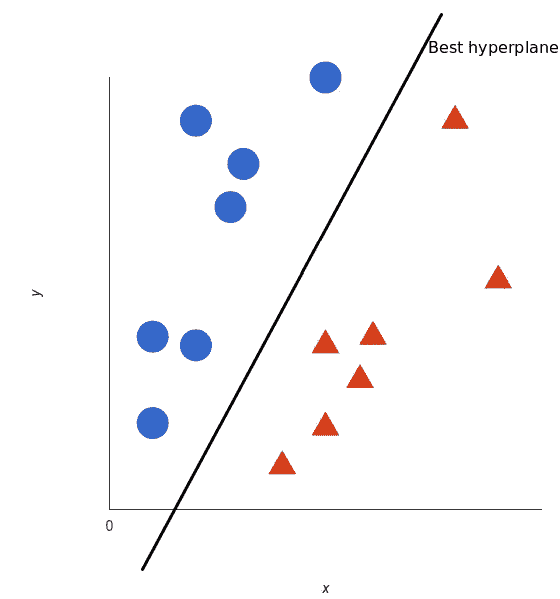

# 支持向量机

> 原文：<https://medium.datadriveninvestor.com/support-vector-machine-6c98ff69daea?source=collection_archive---------25----------------------->

支持向量机(SVM)是一种监督学习算法，可用于分类和回归问题。支持向量机用于分类称为支持向量分类(SVC)，用于回归称为支持向量回归(SVR)。

## SVM 是如何工作的？

SVM 致力于寻找一个超平面的想法，这个超平面能够最好地将特征分成不同的域。让我们用一个例子来充分理解 SVM 是如何工作的。假设我们有两个标签:红色和蓝色，我们的数据有两个特征:x 和 y。

SVM 获取这些数据点，并输出最好地分离数据点的超平面(它只是二维的一条线)。这条线被称为决策边界。落在线的蓝色一侧的任何东西被分类为蓝色，落在线的红色一侧的任何东西被分类为红色。

## 参数调谐

## 核心

在线性 SVM 中超平面的学习是通过使用一些线性代数转换问题来完成的。这就是内核发挥作用的地方。

对于线性核，使用输入(x)和每个支持向量(xi)之间的点积来预测新输入的等式计算如下:

f(x) = B(0) + sum(ai * (x，xi))

多项式和指数核在更高维度中计算分离。多项式核可以写成

*K(x，xi) = 1 +总和(x * xi)^d*

指数核可以写成

*K(x，Xi)= exp(-伽马* sum((x — xi ))*

## 正规化

正则化参数(C)告诉 SVM 优化您希望在多大程度上避免对每个训练样本进行错误分类。对于较大的 C 值，如果超平面在正确分类所有训练点方面做得更好，则优化将选择较小边界的超平面。相反，非常小的 C 值将导致优化器寻找更大间隔的分离超平面，即使该超平面错误分类了更多的点。

## 微克

gamma 参数定义单个训练示例的影响范围，低值表示“远”，高值表示“近”。换句话说，在低伽马的情况下，在分离线的计算中考虑远离似乎合理的分离线的点。而高伽马意味着在计算中考虑接近合理线的点。

## 边缘

边距是直线到最近类点的间距。一个好的边距是两个类的间距都较大。它允许点在各自的类中，而不与其他类交叉。

## SVM 的利与弊:

## 赞成的意见

1.  在更高维度上确实有效。
2.  当特征数多于训练样本数时有效。
3.  类可分时的最佳算法
4.  超平面仅受支持向量的影响，因此异常值的影响较小。
5.  SVM 适合极端情况下的二元分类。

## 骗局

1.  对于较大的数据集，需要大量的时间来处理。
2.  在重叠类的情况下性能不佳。
3.  适当选择 SVM 的超参数，以获得足够的泛化性能。
4.  选择合适的内核函数可能很棘手。